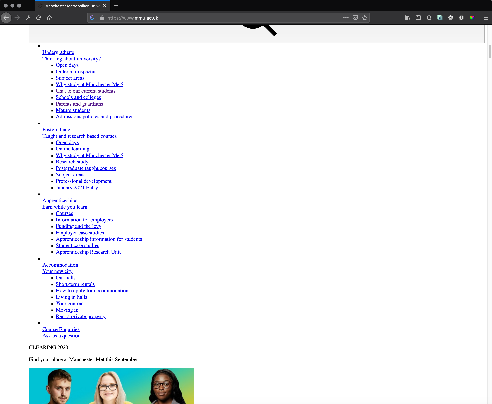
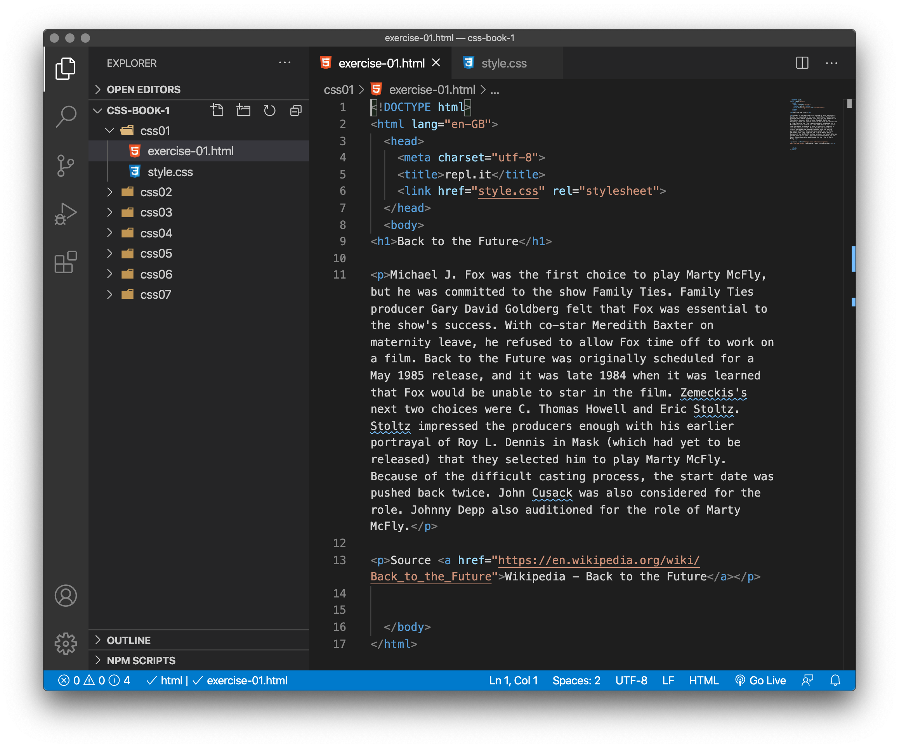
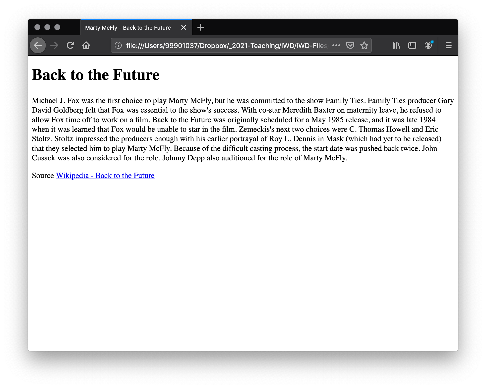
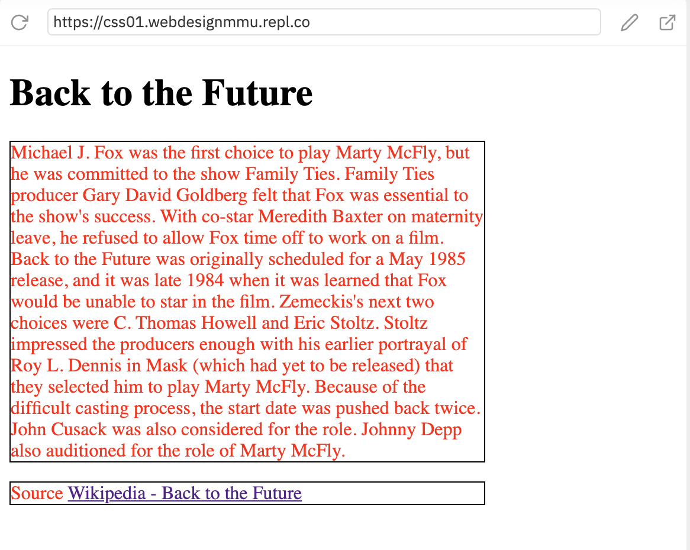
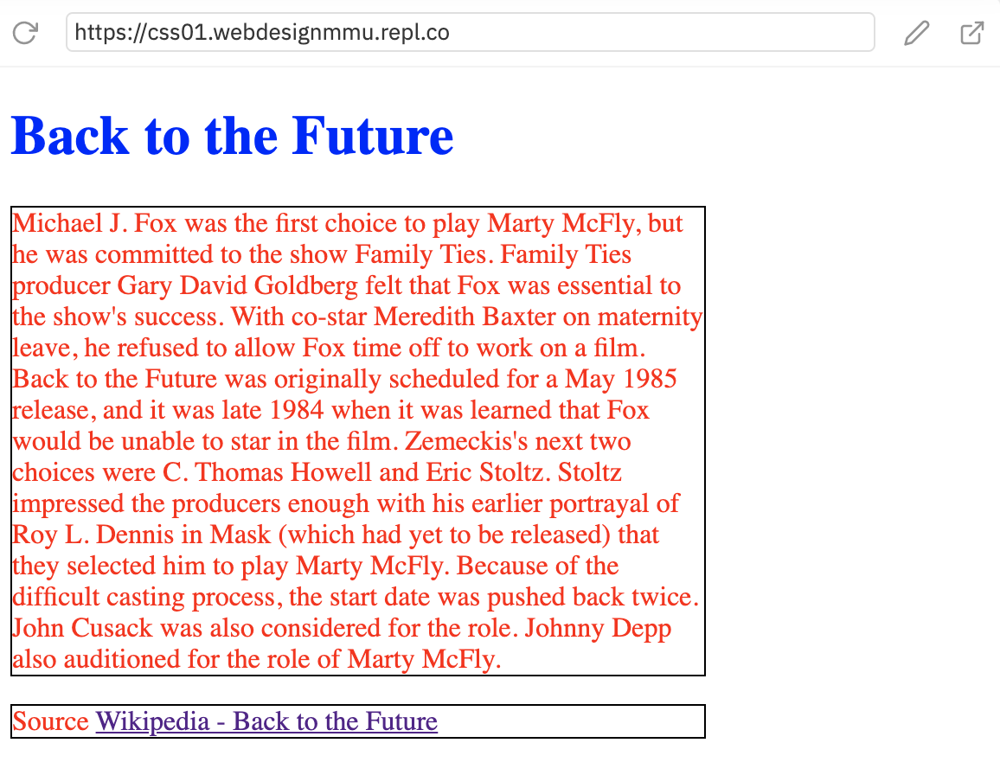

# Introduction to CSS

> Exercise Files - [CSS Book One](media/css-book-1.zip).

## What is CSS for?

> CSS - Cascading StyleSheets

CSS is a language for specifying how documents are presented to users — how they are styled, laid out, etc.

A document is usually a text file structured using a markup language — `HTML` is the most common markup language, but you may also come across other markup languages such as `SVG` or `XML`.

Presenting a document to a user means converting it into a form usable by your audience. Browsers like Firefox, Chrome or Edge are designed to present documents visually, for example, on your laptop, tablet or mobile.

> Note: A browser is sometimes called a `user agent`, which basically means a computer program that represents a person inside a computer system. Browsers are the main type of `user agent` we think of when talking about CSS, however, it is not the only one. There are other `user agent`s available — such as those which convert HTML and CSS documents into PDFs to be printed.

CSS can be used for document text styling — for example changing the color and size of headings and links. It can be used to create layout — for example turning a single column of text into a layout with a main content area and a sidebar for related information. It can even be used for effects such as animation.

CSS has been taken to new levels by people like [Diana Smith](https://diana-adrianne.com/) and [Louise Flanagan](https://lou-flan.com/) who both ‘paint’ in code. 

<iframe src="https://www.facebook.com/plugins/video.php?href=https%3A%2F%2Fwww.facebook.com%2Fvicenews%2Fvideos%2F370559090286411%2F&show_text=0&width=476" width="476" height="476" style="border:none;overflow:hidden" scrolling="no" frameborder="0" allowTransparency="true" allowFullScreen="true"></iframe>

## Browser default styles

In the HTML books we covered what HTML is, and how it is used to mark up documents. These documents will be readable in a web browser. Headings will look larger than regular text, paragraphs break onto a new line and have space between them. Links are colored and underlined to distinguish them from the rest of the text. What you are seeing is the browser's default styles — very basic styles that the browser applies to HTML to make sure it will be basically readable even if no explicit styling is specified by the author of the page.

However, the web would be a boring place if all websites looked like that. Using CSS you can control exactly how HTML elements look in the browser, presenting your markup using whatever design you like.

<figure>

<figcaption>
Like most large websites, if you remove the custom styles and revert to the browser default styles all you get is a vast list of links and a few images.
</figcaption>
</figure>

## Browser developer tools

The developer tools (Dev Tools) in your browser can really help understand and bug test your CSS. It also helps you understand the User Agent Styles that the browser is applying.

<!-- div class="exercise" -->
## To Do - Dev Tools

> How to use browser developer tools

If you are still unsure about browser developer tools watch the video linked below to get a good understanding of how the Dev Tools work, and how to see both browser styles and your own. 

- You can [view the sample file](media/example.html) in your browser and follow the task demonstrated.

- **LinkedIn Learning Video**: [Browser developer tools](https://www.linkedin.com/learning/css-essential-training-3/browser-developer-tools?u=36102708) - Every modern browser includes a set of browser developer tools, which can be used to inspect the HTML, CSS and JavaScript on any webpage.

<!-- end div -->

## Anatomy of a CSS ruleset

Let's dissect the CSS code for red paragraph text to understand how it works :


The whole structure is called a ruleset. (The term ruleset is often referred to as just rule, a CSS rule.) Note the names of the individual parts:

### Selector
This is the HTML element name at the start of the ruleset. It defines the element(s) to be styled (in this example, `<p>` elements). To style a different element, change the selector.

### Declaration
This is a single rule like color: red;. It specifies which of the element's properties you want to style.

### Properties
These are ways in which you can style an HTML element. (In this example, color is a property of the `<p>` elements.) In CSS, you choose which properties you want to affect in the rule.

### Property value
To the right of the property—after the colon—there is the property value. This chooses one out of many possible appearances for a given property. (For example, there are many color values in addition to red.)

Note the other important parts of the syntax:

- Apart from the selector, each ruleset must be wrapped in curly braces. (`{ }`)
- Within each declaration, you must use a colon (`:`) to separate the property from its value or values.
- Within each ruleset, you must use a semicolon (`;`) to separate each declaration from the next one.
- To modify multiple property values in one ruleset, write them separated by semicolons, like this:

```
p {
  color: red;
  width: 400px;
  border: 1px solid black;
}
```

<!-- div class="exercise" -->
## Exercise 1

> Apply a simple CSS ruleset.

### Task 1

- Open the `css01` folder.

- Open `exercise-01.html` in your editor.

<figure>

<figcaption>
The Visual Studio Code (VSC) editor window.
</figcaption>
</figure>

- Open `exercise-01.html` in your browser to see the heading and paragraphs.

<figure>

<figcaption>
All of the browser default (User Agent) styles that you've got used to seeing in the HTML exercises are in place including a larger font size for the &lt;h1&gt;, margins above and below the headings and paragraphs, and margins to the left and right.
</figcaption>
</figure>


### Task 2

> Apply our own styles.

- View the file `style.css` in the editor - it should be blank.

- Copy & paste our initial style into `style.css`.

```
p {
  color: red;
  width: 400px;
  border: 1px solid black;
}
```

- Save `style.css`.

- Refresh `exercise-01.html` in the browser.

- You should now have a page like this:

<figure>

<figcaption>
It doesn't look pretty, but you have applied three styles to all paragraphs on the page.
</figcaption>
</figure>

- Read through the CSS ruleset and identify the styles.

```
p {
  color: red;
  width: 400px;
  border: 1px solid black;
}
```

- In plain English the ruleset reads: Every paragraph on the page

    + font colour red (notice the USA spelling)
    + each paragraph is 400 pixel wide
    + each paragraph gets a 1 pixel wide, solid (not dotted or dashed) border, colour black.

### Task 3

- To finish off, try to add a further ruleset that  targets the `<h1>` heading, to make the text blue.

- The **selector** is the **element** - the `<h1>`, followed by the curly brackets. Add this under the current ruleset to `style.css`:

```
h1 {

}
```
- Next is the Declaration, which sits between the curly brackets. Remember it is **property** `colon` **value** `semi-colon`.

```
h1 {
property: value;
}
```
- Your property is the colour (spelt `color`) and the value is `blue`.

- Save `style.css`.

- Refresh `exercise-01.html` in the browser.

<figure>

<figcaption>
Is your heading blue?
</figcaption>
</figure>

> How have we applied these styles? We will talk about that next.

<!-- end div -->


<p class="submit-work">Exercise 1 completed</p>


<h2 class="deep">Deeper Learning</h2>

To get a better understanding of this topic use the following resources.

- Rachel Andrew's Smashing Magazine article [How To Learn CSS](https://www.smashingmagazine.com/2019/01/how-to-learn-css/) covers briefly many of the concepts we will be covering.

- LinkedIn Learning Video: [CSS Specifications and the W3C](https://www.linkedin.com/learning/css-essential-training-3/css-specifications-and-the-w3c?u=36102708)

- LinkedIn Learning Video: [CSS Syntax and terminology](https://www.linkedin.com/learning/css-essential-training-3/css-syntax-and-terminology?u=36102708)

- Mozilla Developer Video: [Where do browser styles come from](https://youtu.be/spK_S0HfzFw) (7m 01s) - More detail.

- LinkedIn Learning Video: [Jen Simmons -  Formatting html](https://www.linkedin.com/learning/html-essential-training-4/formatting-html?u=36102708) (4m 30s)

- Article - CSS Tricks: [CSS Basics: The Second “S” in CSS](https://css-tricks.com/css-basics-second-s-css/) 

- Video - CSS Tricks: [HTML & CSS – The VERY Basics](https://css-tricks.com/video-screencasts/58-html-css-the-very-basics/)

- Article - CSS Tricks: [CSS Basics: The Syntax That Matters & The Syntax That Doesn’t](https://css-tricks.com/css-basics-syntax-matters-syntax-doesnt/) 


<h2 class="books">CSS Resources</h2>

- THE resource for all things CSS - [CSS Tricks](https://css-tricks.com/)

- LinkedIn Learning Video - The full [CSS Essential Training](https://www.linkedin.com/learning/css-essential-training-3/)


<h2 class="deep">Advanced Learning</h2>

For students wanting more, we recommend the following topics and resources. 

## CSS Modules

As there are so many things that you could style using CSS, the language is broken down into modules. 

At this stage you don't need to worry too much about how CSS is structured, however it can make it easier to find information if, for example, you are aware that a certain property is likely to be found among other similar things and therefore probably in the same specification. 

For a specific example, let's go back to the Backgrounds and Borders module — you might think that it makes logical sense for the [background-color](https://developer.mozilla.org/en-US/docs/Web/CSS/background-color) and [border-color](https://developer.mozilla.org/en-US/docs/Web/CSS/border-color) properties to be defined in this module. And you'd be right.

### CSS Reference

MDN's [exhaustive CSS reference](https://developer.mozilla.org/en-US/docs/Web/CSS/Reference) for seasoned Web developers describes every property and concept of CSS.

## CSS Specifications

All web standards technologies (HTML, CSS, JavaScript, etc.) are defined in giant documents called specifications (or simply "specs"), which are published by standards organizations (such as the [W3C](https://developer.mozilla.org/en-US/docs/Glossary/W3C), [WHATWG](https://developer.mozilla.org/en-US/docs/Glossary/WHATWG) or [ECMA](https://developer.mozilla.org/en-US/docs/Glossary/ECMA)) and define precisely how those technologies are supposed to behave.

CSS is no different — it is developed by a group within the W3C called the [CSS Working Group](https://www.w3.org/Style/CSS/). This group is made of representatives of browser vendors and other companies who have an interest in CSS. There are also other people, known as invited experts, who act as independent voices; they are not linked to a member organization.

New CSS features are developed, or specified, by the CSS Working Group. Sometimes because a particular browser is interested in having some capability, other times because web designers and developers are asking for a feature, and sometimes because the Working Group itself has identified a requirement. CSS is constantly developing, with new features coming available. However, a key thing about CSS is that everyone works very hard to never change things in a way that would break old websites. A website built in 2000, using the limited CSS available then, should still be usable in a browser today!

As a newcomer to CSS, it is likely that you will find the CSS specs overwhelming — they are intended for engineers to use to implement support for the features in user agents, not for web developers to read to understand CSS. Many experienced developers would much rather refer to MDN documentation or other tutorials. It is however worth knowing that they exist, understanding the relationship between the CSS you are using, browser support (see below), and the specs.

## Browser support

Once CSS has been specified then it is only useful for us in developing web pages if one or more browsers have implemented it. This means that the code has been written to turn the instruction in our CSS file into something that can be output to the screen. 

It is unusual for all browsers to implement a feature at the same time, and so there is usually a gap where you can use some part of CSS in some browsers and not in others. For this reason, being able to check implementation status is useful. 

The website [Can I Use](https://caniuse.com/) is a great resource for checking what features are working in what browser.

Every entry in MDN's [CSS reference](https://developer.mozilla.org/en-US/docs/Web/CSS/Reference) also provides a table showing browser compatibility. For example go to [the entry for CSS Grid](https://developer.mozilla.org/en-US/docs/Web/CSS/grid), scroll to the bottom of the page to see the browser compatibility table. 

### &copy; Credit given

Materials used under the Creative Commons licence from [MDN Web Docs](https://developer.mozilla.org/en-US/docs/Web/HTML).