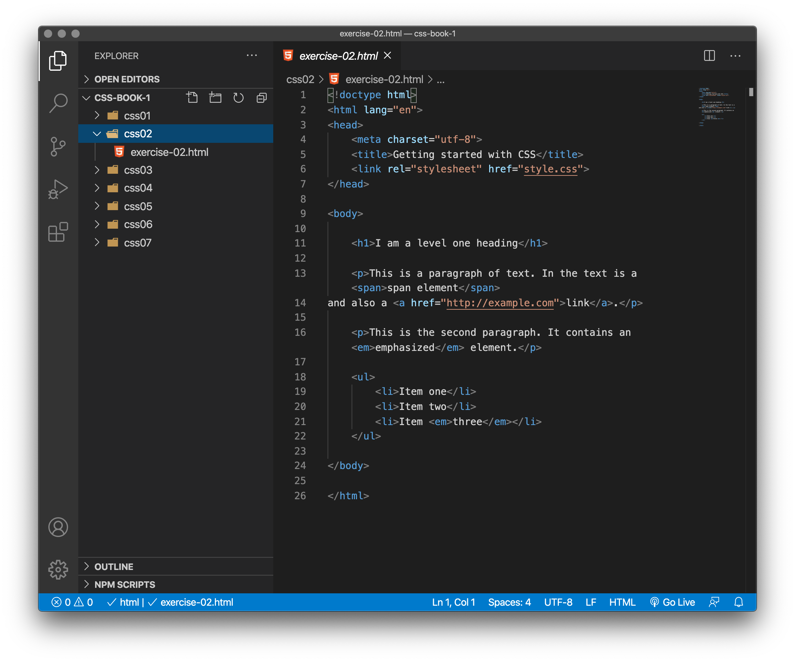
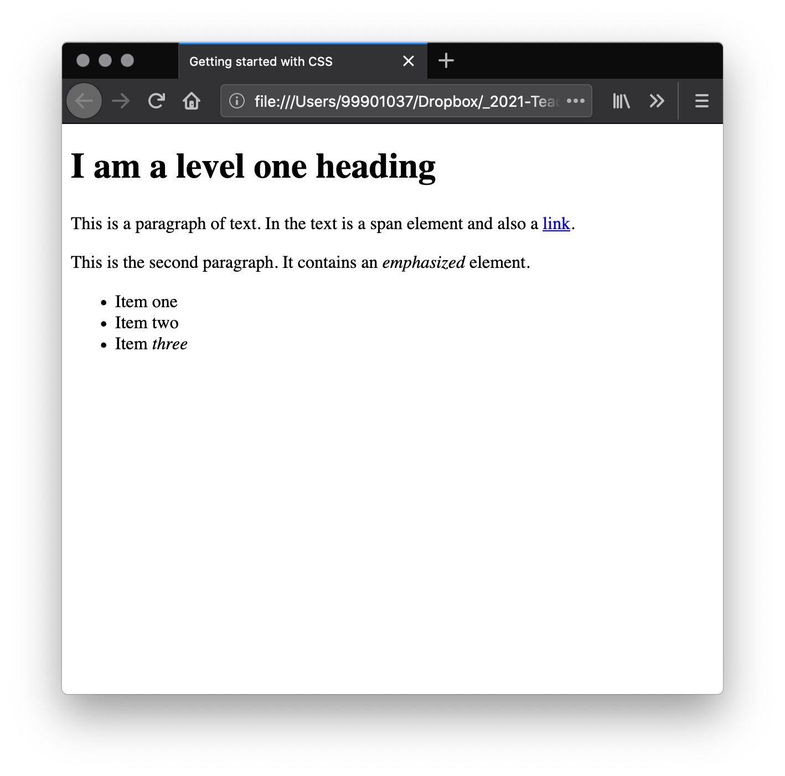
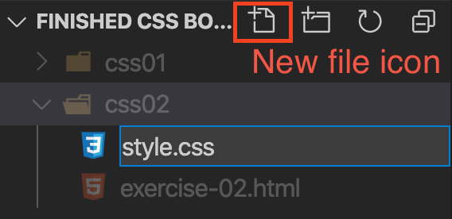
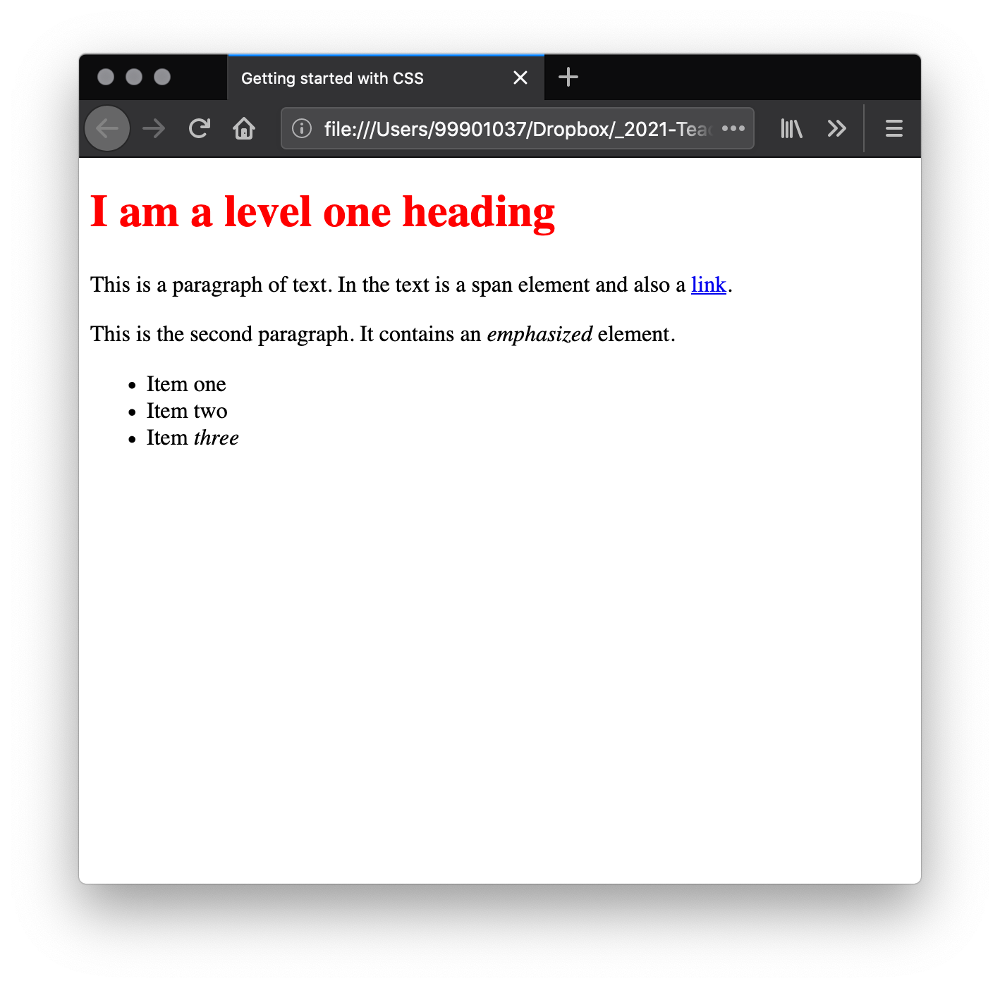
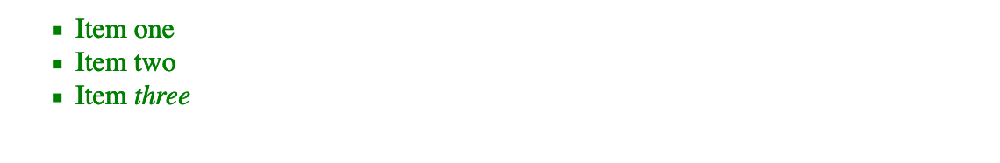
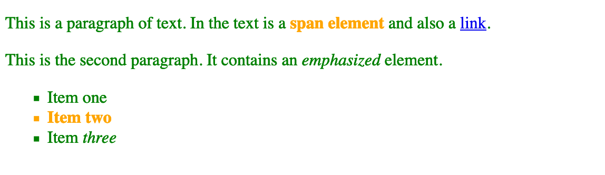
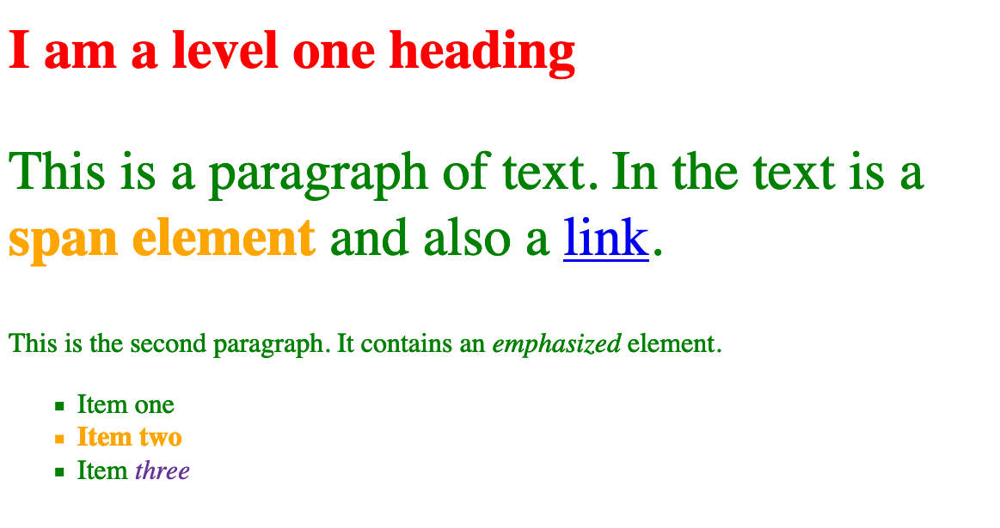
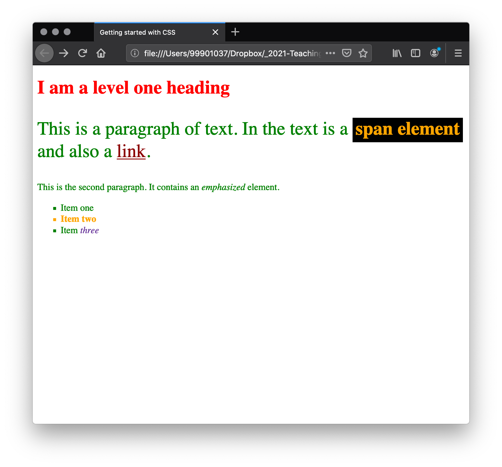

# Adding CSS to our document

## What is a selector?

You have met selectors already (`p` and `h1` in this case). A **CSS selector** is the first part of a CSS Rule. It is a pattern of elements and other terms that tell the browser which HTML elements should be selected to have the CSS property values inside the rule applied to them. The element or elements which are selected by the selector are referred to as the subject of the selector.


## Different types of selectors

There are many different types of selectors. The previous chapter used element selectors, which select all elements of a given type. But we can make more specific selections as well. Here are some of the more common types of selectors:

<table>
 <thead>
  <tr>
   <th scope="col">Selector name</th>
   <th scope="col">What does it select</th>
   <th scope="col">Example</th>
  </tr>
 </thead>
 <tbody>
  <tr>
   <td>Element selector (sometimes called a tag or type selector)</td>
   <td>All HTML elements of the specified type.</td>
   <td><code>p</code><br>
    selects <code>&lt;p&gt;</code></td>
  </tr>
  <tr>
   <td>ID selector</td>
   <td>The element on the page with the specified ID. On a given HTML page, each id value should be unique.</td>
   <td><code>#my-id</code><br>
    selects <code>&lt;p id="my-id"&gt;</code> or <code>&lt;a id="my-id"&gt;</code></td>
  </tr>
  <tr>
   <td>Class selector</td>
   <td>The element(s) on the page with the specified class. Multiple instances of the same class can appear on a page.</td>
   <td><code>.my-class</code><br>
    selects <code>&lt;p class="my-class"&gt;</code> and <code>&lt;a class="my-class"&gt;</code></td>
  </tr>
  <tr>
   <td>Attribute selector</td>
   <td>The element(s) on the page with the specified attribute.</td>
   <td><code>img[src]</code><br>
    selects <code>&lt;img src="myimage.png"&gt;</code> but not <code>&lt;img&gt;</code></td>
  </tr>
  <tr>
   <td>Combinators</td>
   <td>Combinators combine other selectors in order to target elements within our documents.</td>
   <td><code>article > p { }</code><br>
    selects paragraphs that are direct children of <code>&lt;article&gt;</code> elements using the child combinator <code>(>)</code>.</td>
  </tr>
    <tr>
   <td>Pseudo-class selector</td>
   <td>The specified element(s), but only when in the specified state. (For example, when a cursor hovers over a link.)</td>
   <td><code>a:hover</code><br>
    selects <code>&lt;a&gt;</code>, but only when the mouse pointer is hovering over the link.</td>
  </tr>
 </tbody>
</table>

There are many more selectors to discover. To learn more, see the [MDN Selectors guide](https://developer.mozilla.org/en-US/docs/Web/Guide/CSS/Getting_started/Selectors).

<h3 class="warning">ID and Attribute selectors</h3>

- `ID Selectors` - We will be using the `class` selector rather than `ID` selector. You are going to learn how a `class` selector works. `ID` works the same way but can only be used once on the page. 

- `Attribute Selectors` - these can be very useful but need a more advanced understanding of CSS. We won't be using them. 

<!-- div class="exercise" -->
## Exercise 2

> Our starting point is an HTML document. 

### Task 1

- Open the `css02` folder.

- Open `exercise-02.html` in your editor.

<figure>

<figcaption>
The Visual Studio Code (VSC) editor window.
</figcaption>
</figure>

- Open `exercise-02.html` in the browser to check it works.

<figure>

<figcaption>
A simple HTML page - heading, paragraphs, link and list.
</figcaption>
</figure>

### Task 2

- The very first thing we need to do is to tell the HTML document that we have some CSS rules we want it to use. There are three different ways to apply CSS to an HTML document that you'll commonly come across, however, for now, we will look at the most usual and useful way of doing so — linking CSS from the head of your document.

- Create a file in the same folder as your HTML document and save it as `style.css`. The `.css` extension shows that this is a CSS file.

<figure>

<figcaption>
VSC has a New File button (also a new folder button next to it) for speed. Just press and add the file name `.css`.
</figcaption>
</figure>

### Task 3

- To link `style.css` to `exercise-02.html` add the following line under the `<title> </title>`, but inside the `<head>` of the HTML document:

```
<link rel="stylesheet" href="style.css">
```

- This `<link>` element tells the browser that we have a stylesheet, using the rel attribute, and the location of that stylesheet as the value of the href attribute. 

- You can test that the CSS works by adding a rule to `style.css`. Using your code editor add the following to your CSS file:

```
h1 {
  color: red;
}
```

- Save both `exercise-02.html` and `style.css` and reload the web page in your browser. 

- The level one heading at the top of the document should now be red. 

- If that doesn't happen, carefully check that you've typed everything correctly and you have linked to `style.css` correctly.

<figure>

<figcaption>
First style, applied via an external stylesheet - more about this in the next chapter.
</figcaption>
</figure>

<!-- end div -->


## Styling HTML elements

By making our heading red we have already demonstrated that we can target and style an HTML element. We do this by targeting an **element selector** — this is a selector that directly matches an HTML element name. To target all paragraphs in the document you would use the selector `p`. To turn all paragraphs green you would use:

```
p {
  color: green;
}
```

You can target multiple selectors at once, by separating the selectors with a comma. If I want all paragraphs and all list items to be green my rule looks like this:

```
p, li {
    color: green;
}
```

<!-- div class="exercise" -->
## Exercise 2 continued

> Styling multiple selectors at once. 

### Task 1

- Return to `style.css` in your editor.

- Add to `style.css` the following:

```
p, li {
    color: green;
}
```

- Save `style.css`.

- Refresh `exercise-02.html` again in the browser to see the changes.

<figure>

<figcaption>
Green is applied to both paragraphs and the list.
</figcaption>
</figure>

<!-- end div -->

 
## Changing the default behavior of elements

When we look at a well-marked up HTML document, even something as simple as our example, we can see how the browser is making the HTML readable by adding some default styling as we've discussed. All modern browsers display HTML content by default in pretty much the same way.

However, you will often want something other than the choice the browser has made. This can be done by simply choosing the HTML element that you want to change, and using a CSS rule to change the way it looks.  A good example is our `<ul>`, an unordered list. It has list bullets, and if I decide I don't want those bullets I can remove them.

<!-- div class="exercise" -->
## Exercise 2 continued

> Changing the default behavior of a list. 

### Task 1

- Return to `style.css` in your editor.

- Add to `style.css` the following:

```
li {
  list-style-type: none;
}
```

- Save `style.css`.

- Refresh `exercise-02.html` again in the browser to see the changes. 

- Have the list bullets gone?


### Task 2

- The `list-style-type` property is a good property to look at on MDN to see which values are supported. Take a look at the page for [list-style-type](https://developer.mozilla.org/en-US/docs/Web/CSS/list-style-type) and you will find an interactive example at the top of the page to try some different values in, then all allowable values are detailed further down the page.

- Looking at that page you will discover that in addition to removing the list bullets you can change them. 

— Try changing them to square bullets by using a value of square.

- Tip: simply edit the style you've just added. Change the value of the `list-style-type` attribute from `none` to the value that creates square bullets.

- Save `style.css`.

- Refresh `exercise-02.html` again in the browser to see the changes. 

<figure>

<figcaption>
Have the list bullets returned as squares?
</figcaption>
</figure>

<!-- end div -->

## Adding a class

So far we have styled elements based on their HTML element names. This works as long as you want all of the elements of that type in your document to look the same. Most of the time that isn't the case and so you will need to find a way to select a subset of the elements without changing the others - *for example selecting a particular paragraph instead of every paragraph on the page*. The most common way to do this is to add a class to your HTML element and target that class.

### Class basics

- A class is simply a name.
- We can apply that name to any (or multiple) elements of a page.
- We can then use that class to apply styles to those elements.
- In our HTML the syntax is `class="my-class"` - for example `<p class="my-class">` or `<h2 class="my-class">`.
- In our CSS the class is indicated by a dot and the class name, for example `.my-class`.

<!-- div class="exercise" -->
## Exercise 2 continued

> Adding a class. 

### Task 1

- Return to `exercise-02.html` in your editor.

- In your HTML document, add a `class` attribute with the value (name) of `special` to the second list item. 

```
class="special"
```

- Your list will now look like this:

```
<ul>
  <li>Item one</li>
  <li class="special">Item two</li>
  <li>Item <em>three</em></li>
</ul>
```

- Save `exercise-02.html`.


### Task 2

- Return to `style.css` in your editor.

- In your CSS you can target the class of `special` by creating a **class selector** that starts with a full stop character. 

- Add to `style.css` the following:

```
.special {
  color: orange;
  font-weight: bold;
}
```

- Save `style.css`.

- Refresh `exercise-02.html` again in the browser to see the changes. 

- If correct, you will notice that our second list item, **Item Two** (with the class of special) is now <span style="color:orange; font-weight: bold;">bold and orange</span>.


### Task 3

You can apply the class of special to any element on your page that you want to have the same look as this list item. For example:

- Return to `exercise-02.html` in your editor.

- Add a `class` of `special` to the `<span>` in the first paragraph

- You should see your `span` text - <span style="color:orange; font-weight: bold;">span element</span> is now orange and bold as well. 

- You have now targeted two parts of the page using one `class`.

<figure>

<figcaption>
The ability to use a class multiple times across a page and website are part of the power of CSS.
</figcaption>
</figure>

<!-- end div -->

### Class applied to a specific element

Sometimes you will see rules with a selector that lists the HTML element selector along with the class:

```
li.special {
  color: orange;
  font-weight: bold;
}
```
This syntax means - *target any `li` element that has a class of special*. If you were to do this then you would **no longer** be able to apply the class to a `<span>` or another element by simply adding the class to it.

### Best practice

Avoid tying a class to a particular element. 

So do this:

```
.special {
  color: orange;
  font-weight: bold;
}
```
Rather than this:

```
li.special {
  color: orange;
  font-weight: bold;
}
```

## Styling things based on their location in a document

There are times when you will want something to look different based on where it is in the document. There are a number of selectors that can help you here, but for now we will look at just a couple. 

In our document are two `<em>` elements — one inside a paragraph and the other inside a list item. To select only an `<em>` that is nested inside an `<li>` element we can use a selector called the `descendant combinator`, which simply takes the form of a space between two other selectors.

<!-- div class="exercise" -->
## Exercise 2 continued

> Adding a `descendant combinator`. 

### Task 1

- Return to `style.css` in your editor.

- Add to `style.css` the following:

```
li em {
  color: rebeccapurple;
}
```

- This selector will select any `<em>` element that is *inside* (a descendant of) an `<li>`. 

- Save `style.css`.

- Refresh `exercise-02.html` again in the browser to see the changes. 

- You should find that the `<em>` in the third list item is now purple, but the one inside the paragraph is unchanged.


### Task 2

- Return to `style.css` in your editor.

- Something else you might like to try is styling a paragraph when it comes directly after a heading at the same hierarchy level in the HTML. To do so place a `+`  (an `adjacent sibling combinator`) between the selectors.

- Add to `style.css` the following:

```
h1 + p {
  font-size: 200%;
}
```

- Save `style.css`.

- Refresh `exercise-02.html` again in the browser to see the changes. 

- Has the first paragraph grown? If not, check your code.

- See below for what it should look like:

<figure>

<figcaption>
Our styles now include making the first paragraph (following the heading) has increased in size 200%, and the emphasised word, three is now purple.
</figcaption>
</figure>

<!-- end div -->


> Note: As you can see, CSS gives us several ways to target elements, and we've only scratched the surface so far! We will be taking a proper look at all of these selectors and more in later chapters.


## Styling things based on state

The final type of styling we shall take a look at in this tutorial is the ability to style things based on their state. A straightforward example of this is when styling links. When we style a link we need to target the `<a>` (anchor) element. 

The `anchor` element has different states depending on whether it is `unvisited`, `visited`, being `hovered` over, `focused` via the keyboard, or in the process of being clicked (`activated`). 

<!-- div class="exercise" -->
## Exercise 2 continued

> Styling the link states. 

You can use CSS to target these different states — the CSS below styles unvisited links <span style="color: darkslategray;">darkslategray</span> and visited links <span style="color:darkred;">darkred</span>.

You can also change the way the link looks when the user hovers over it, our example below removes the underline with the attribute `text-decoration` and value of `none`.

### Task 1

- Return to `style.css` in your editor.

- Add to `style.css` the following:

```
a:link {
    color: darkslategray;
}

a:visited {
    color: darkred;
}

a:hover {
    text-decoration: none;
}
```
- Save `style.css`.

- Refresh `exercise-02.html` again in the browser to see the changes. 

- Review the link, hover over it, click on it.

<!-- end div -->


## CSS - Accessibility 

We have **removed the underline** on our link on hover. You could remove the underline from all states of a link. It is worth remembering however that in a real site, you want to ensure that visitors know that a link is a link. Leaving the underline in place, can be an important clue for people to realize that some text inside a paragraph can be clicked on — this is the behavior they are used to. As with everything in CSS, there is the potential to make the document less accessible with your changes — we will aim to highlight potential pitfalls in appropriate places.

> Note: you will often see mention of accessibility in these lessons. When we talk about accessibility we are referring to the requirement for our webpages to be understandable and usable by everyone.

Your visitor may well be on a computer with a mouse or trackpad, or a phone with a touchscreen. Or they might be using a screenreader, which reads out the content of the document, or they may need to use much larger text, or be navigating the site using the keyboard only.

A plain HTML document is generally accessible to everyone — as you start to style that document it is important that you don't make it less accessible.

## Combining selectors and combinators

It is worth noting that you can combine multiple selectors and combinators together. For example:

```
/* selects any <span> that is inside a <p>, which is inside an <article>  */

article p span { ... }

/* selects any <p> that comes directly after a <ul>, which comes directly after an <h1>  */

h1 + ul + p { ... }
```

<!-- div class="exercise" -->
## Exercise 2 continued

> You can combine multiple types together, too. 

### Task 1

- Return to `style.css` in your editor.

- Add to `style.css` the following:


```
body h1 + p .special {
  background-color: black;
  padding: 5px;
}
```
- Save `style.css`.

- Refresh `exercise-02.html` again in the browser to see the changes. 

#### Breaking down this ruleset

- This will style any element with a class of special, 

- which is inside a `<p>`, 

- which comes just after an `<h1>`, 

- which is inside a `<body>`. Phew!

- The only element styled is `<span class="special">`.

- although we used the class `special`, by combining selectors we are able to target this specific class only.

- Don't worry if this seems complicated at the moment — you'll soon start to get the hang of it as you write more CSS.

<!-- end div -->

## CSS Validation

> As you can with HTML, you can validate your CSS.

<!-- div class="exercise" -->
## Exercise 2 continued

### Task 1

- Use the [CSS Validation Service](https://jigsaw.w3.org/css-validator/#validate_by_upload).

- It works in th same way as the HTML validator.

- Upload `style.css`.

- Fix any erros and re-validate.

<p style="color:white; background-color:green;padding: 5px;">Congratulations! No Error Found.</p>
<!-- end div -->

<p class="submit-work">Exercise 2 completed</p>

## Wrapping up

> In this tutorial, we have taken a look at a number of ways in which you can style a document using CSS selectors. We will be developing this knowledge as we move through the rest of the lessons. However you now already know enough to style text, apply CSS based on different ways of targeting elements in the document, and look up properties and values in the MDN documentation.

<figure>

<figcaption>
The final version of <code>exercise-02.html</code>, with styles as applied in Exercise 2.
</figcaption>
</figure>


<h2 class="deep">Deeper Learning</h2>

To get a better understanding of this topic use the following resources.


- LinkedIn Learning Video: [Type and universal selectors](https://www.linkedin.com/learning/css-essential-training-3/type-and-universal-selectors?u=36102708)

- LinkedIn Learning Video: [Class and ID selectors](https://www.linkedin.com/learning/css-essential-training-3/class-and-id-selectors?u=36102708)

- LinkedIn Learning Video: [Descendant selectors](https://www.linkedin.com/learning/css-essential-training-3/descendant-selectors?u=36102708)

- LinkedIn Learning Video: [Grouping selectors](https://www.linkedin.com/learning/css-essential-training-3/grouping-selectors?u=36102708)

- Article - CSS Tricks: [Beginner Concepts: How CSS Selectors Work](https://css-tricks.com/how-css-selectors-work/)

- Article - CSS Tricks: [The Difference Between ID and Class](https://css-tricks.com/the-difference-between-id-and-class/) 


### &copy; Credit given

Materials used under the Creative Commons licence from [MDN Web Docs](https://developer.mozilla.org/en-US/docs/Web/HTML).