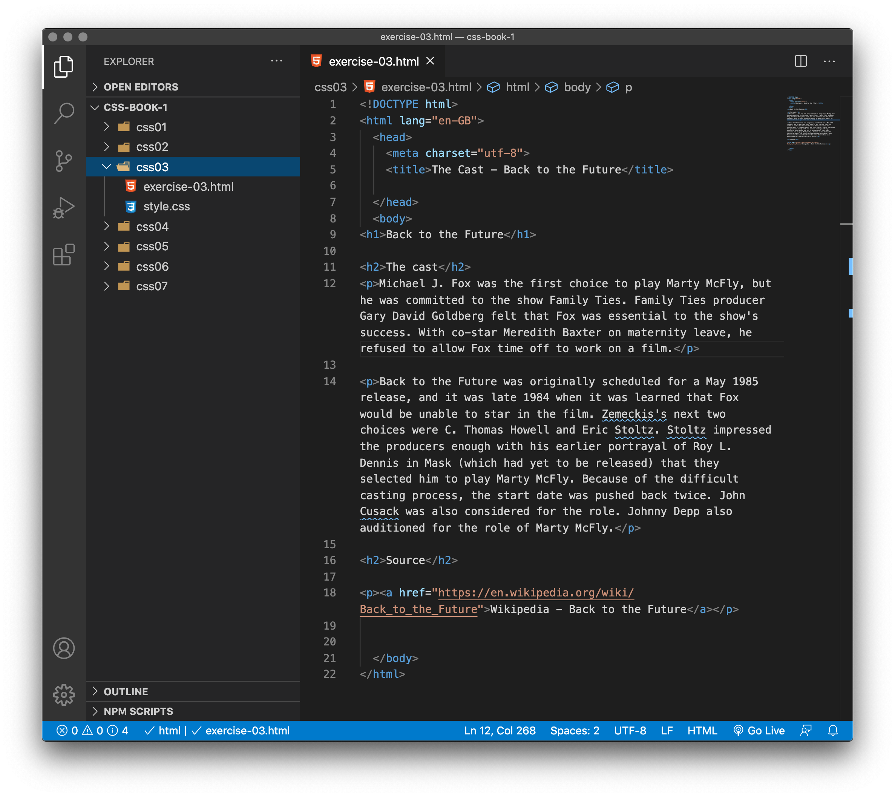
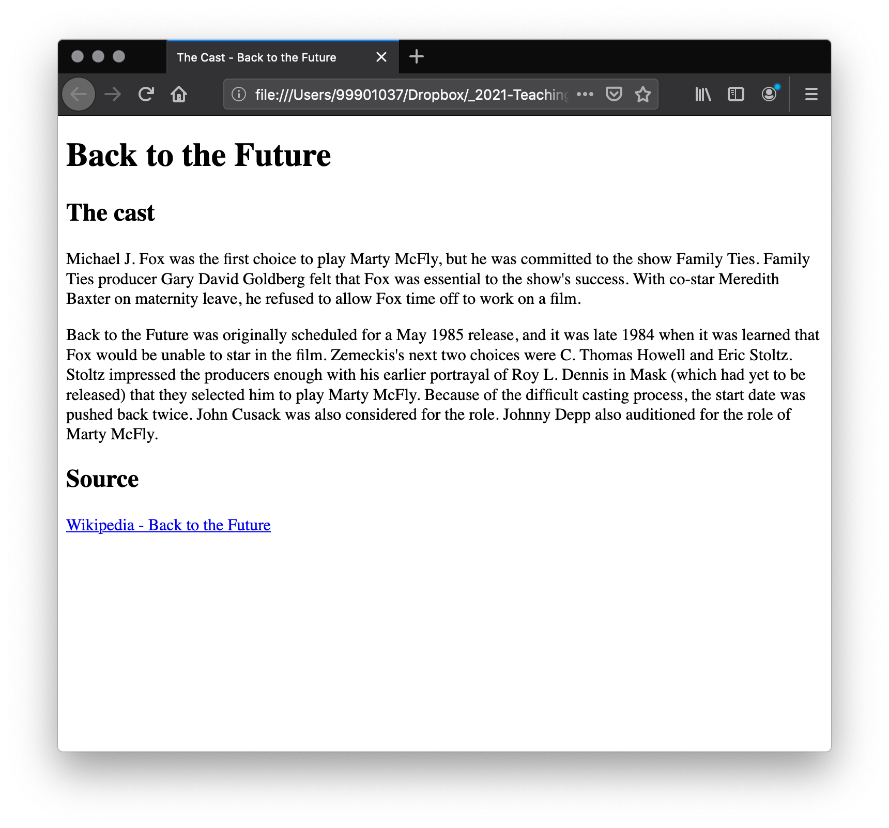
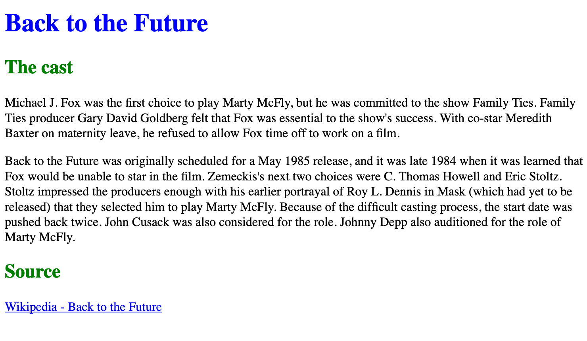
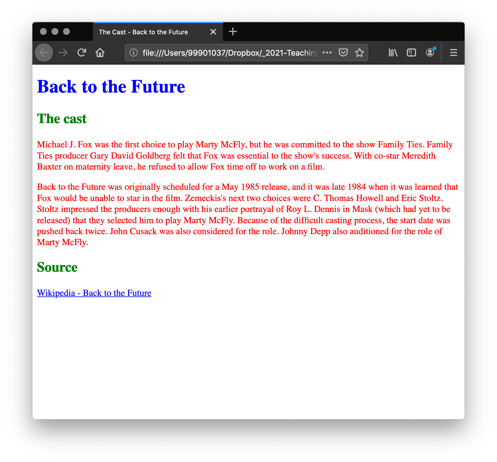

# Applying CSS to HTML

## Inline styles

Inline styles are CSS declarations that affect a single HTML element, contained within a style attribute. The implementation of an inline style in an HTML document might look like this:

```
<!DOCTYPE html>
<html lang="en-GB">
  <head>
    <meta charset="utf-8">
    <title>My CSS experiment</title>
  </head>
  <body>

    <h1 style="color: blue; background-color: yellow; border: 1px solid black;">Hello World!</h1>

    <p style="color:red;">This is my first CSS example</p>

  </body>
</html>
```
The style goes right inside the tag:

```
<p style="color:red;">
```

<h3 class="warning">Avoid inline styles</h3>

Avoid using CSS in this way when possible. It is the opposite of a best practice. First, it is the least efficient implementation of CSS for maintenance. One styling change might require multiple edits within in a single web page. Second, inline CSS also mixes (CSS) presentational code with HTML and content, making everything more difficult to read and understand. Separating code and content makes maintenance easier for all who work on the website.

There are a few circumstances where inline styles are more common. You might have to resort to using inline styles if your working environment is very restrictive. For example, perhaps your CMS only allows you to edit the HTML body. You may also see a lot of inline styles in HTML email to achieve compatibility with as many email clients as possible.


## Internal stylesheet

An internal stylesheet resides within an HTML document. To create an internal stylesheet, you place CSS inside a `<style>` element contained inside the HTML `<head>`.

The HTML for an internal stylesheet might look like this:

```
<!DOCTYPE html>
<html>
  <head>
    <meta charset="utf-8">
    <title>My CSS experiment</title>
    <style>
      h1 {
        color: blue;
        background-color: yellow;
        border: 1px solid black;
      }

      p {
        color: red;
      }
    </style>
  </head>
  <body>
    <h1>Hello World!</h1>
    <p>This is my first CSS example</p>
  </body>
</html>
```

This time all of your style rules sit within the `<style>` element, in the `head` of your page.

```
  <head>
    <meta charset="utf-8">
    <title> </title>
    <style>

    Your styles...

    </style>
  </head>
```

In some circumstances, internal stylesheets can be useful. For example, perhaps you're working with a content management system where you are blocked from modifying external CSS files.

<h3 class="warning">Also avoid internal styles</h3>

But for sites with more than one page, an internal stylesheet becomes a less efficient way of working. To apply uniform CSS styling to multiple pages using internal stylesheets, you must have an internal stylesheet in every web page that will use the styling. The efficiency penalty carries over to site maintenance too. With CSS in internal stylesheets, there is the risk that even one simple styling change may require edits to multiple web pages.


## External stylesheet

An external stylesheet contains CSS in a separate file with a .css extension. This is the most common and useful method of bringing CSS to a document. You can link a single CSS file to multiple web pages, styling all of them with the same CSS stylesheet. In the last chapter we linked an external stylesheet to our web page.

You reference an external CSS stylesheet from an HTML `<link>` element:

```
<!DOCTYPE html>
<html>
  <head>
    <meta charset="utf-8">
    <title>My CSS experiment</title>
    <link rel="stylesheet" href="styles.css">
  </head>
  <body>
    <h1>Hello World!</h1>
    <p>This is my first CSS example</p>
  </body>
</html>
```

In this example:

```
<link rel="stylesheet" href="styles.css">
```

- The `<link>` element is placed in the `head`, just under the `<title>` element.

- `rel="stylesheet"` simply indicates the relationship of this linked document is as a *stylesheet*.

- Then as usual, `href=""` links to the source document - the stylesheet. In this case it is a CSS file called `style.css`.

> Note: Like our `HTML` files, `CSS` files are just plain text files with the file extension `.css`.


The CSS stylesheet file might look like this:
```
h1 {
  color: blue;
  background-color: yellow;
  border: 1px solid black;
}

p {
  color: red;
}
```
> Note: the CSS file contains no html - hence we have `h1` not `<h1>` as the element selector.

### The correct path

The `href` attribute of the `<link>` element needs to reference a file on your file system. In the example above, the CSS file is in the same folder as the HTML document, but you could place it somewhere else and adjust the path. 

#### Here are two example paths:

- Inside a subdirectory called `styles` inside the current directory.

```
<link rel="stylesheet" href="styles/style.css">
```

- Go up one directory level, then inside a subdirectory called `styles`.

```
<link rel="stylesheet" href="../styles/style.css">
```

### The file name

- We are using `style.css`

- It can be anything, but keep it short as you may be typing it a lot. Less room for error.

- No spaces or strange characters.

- Make sure it has the `.css` file extension.

<!-- div class="exercise" -->
## Exercise 3

> Apply inline, internal and external CSS.

Using what you have learnt above add three styles to this document, using the inline, internal and external methods.

### Task 1

- Open the `css03` folder.

- Open `exercise-03.html` in your editor.

<figure>

<figcaption>
The Visual Studio Code (VSC) editor window.
</figcaption>
</figure>

- Open `exercise-03.html` in the browser to check it works.

<figure>

<figcaption>
A simple HTML page - headings, paragraphs and link. Browser default styles.
</figcaption>
</figure>

### Task 2 - Inline style


- Add an **inline style** that makes the `<h1>` heading **blue**.

- Remember - the `style=""` attribute goes right in the opening tag of the `<h1>` element.

- Save `exercise-03.html` and reload the web page in your browser. 

- Check you have a blue main heading.

### Task 3 - Internal style

- Add an **internal style** that makes both of the `<h2>` headings **green**.

- Remember - the `<style></style>` element goes in the head of the html document.

- Remember - the style rule sits inside those `style` tags.

- Save `exercise-03.html` and reload the web page in your browser. 

- Check you both sub-headings are green.

<figure>

<figcaption>
Inline and internal styles applied to the HTML file <code>exercise-03.html</code> 
</figcaption>
</figure>

### Task 4 - External style

- Add an **external style** that makes the paragraph text **red**.

- Remember - the style rule goes in the file `style.css`

- You need to link to `style.css` in the head of your `html` file using the `<link>` element.

- Save both `style.css` and `exercise-03.html` and refresh the page in the browser.

> Stuck with the syntax of any of these styles? Just scroll up the page to see our examples of inline, internal and external styles.

<figure>

<figcaption>
You should end up with a page like this. Validate the HTML to check for errors.
</figcaption>
</figure>

<!-- end div -->


## CSS Comments

As with any coding work, it is best practice to write comments along with CSS. This helps you to remember how the code works as you come back later for fixes or enhancement. It also helps others understand the code.

**CSS Comments** begin with `/*` and end with `*/`. 

In the example below, comments mark the start of distinct sections of code. This helps to navigate the codebase as it gets larger. With this kind of commenting in place, searching for comments in your code editor becomes a way to efficiently find a section of code.

```
/* Handle basic element styling */
/* ------------------------------------------------- */
body {
  font: 1em/150% Helvetica, Arial, sans-serif; 
  padding: 1em; 
  margin: 0 auto; 
  max-width: 33em;
}

@media (min-width: 70em) {
  /* Let's special case the global font size. On large screen or window,
     we increase the font size for better readability */
  body {
    font-size: 130%;
  }
}

h1 {font-size: 1.5em;}

/* Handle specific elements nested in the DOM  */
/* ------------------------------------------------- */
div p, #id:first-line {
  background-color: red; 
  border-radius: 3px;
}
```

"Commenting out" code is also useful for temporarily disabling sections of code for testing. In the example below, one of the rules for `.special` are disabled by "commenting out" the code.

```
.special { 
  color: red;
  /* border: 1px solid red; */
}

```

<!-- div class="exercise" -->
## Exercise 3 continued

> Add a comment to your external CSS.


### Task 1

- Return to the `css03` folder in VSC.

- Add a CSS comment to the top of `style.css`

- Add your *name* and the *company* you work for.

- Save `style.css`

- Refresh `exercise-03.html` in the browser to check the comment hasn't caused any issues.

### Task 2

- Return to `style.css`

- Add a `font-size` rule to your paragraph ruleset so it now looks like the following:

```
p {
    color: red;
    font-size: 1.2rem;
}
```

- Save `style.css` and refresh `exercise-03.html` in the browser to view the larger paragraph font size.

### Task 3

- Now wrap a CSS comment `/*  */` around that new rule.

- Save `style.css` and refresh `exercise-03.html` in the browser.

- The `font-size: 1.2rem;` style should no longer be applied - it has been *commented out*.

<!-- end div -->

<p class="submit-work">Exercise 3 completed</p>

## White space

White space means actual spaces, tabs and new lines. Just as browsers ignore white space in HTML, browsers ignore white space inside CSS. The value of white space is how it can improve readability.

In the example below, each declaration (and rule start/end) has its own line. This is arguably a good way to write CSS. It makes it easier to maintain and understand CSS.

```
h1 {
  font-size: 1.5em;
}

div p,
#id:first-line {
  background-color: red;
  border-radius: 3px;
}

div p {
  margin: 0;
  padding: 1em;
}

div p + p {
  padding-top: 0;
}
```

The next example shows the equivalent CSS  in a more compressed format. Although the two examples work the same, the one below is arguably more difficult to read.

```
h1 {font-size: 1.5em;}
div p, #id:first-line {background-color: red; border-radius: 3px;}
div p {margin: 0; padding: 1em;}
div p + p {padding-top: 0;}
```

For your own projects, you will format your code according to personal preference. For team projects, you may find that a team or project has its own style guide.

> **Important**: Though white space separates values in CSS declarations, property names never have white space.

- For example, these declarations are valid CSS:

```
margin: 0 auto;
padding-left: 10px;
```

But these declarations are invalid:

```
margin: 0auto;
padding- left: 10px;
```

Do you see the spacing errors? First, `0auto` is not recognized as a valid value for the margin property. The entry `0auto` is meant to be two separate values: `0` and `auto`. Second, the browser does not recognize `padding`- as a valid property. The correct property name (`padding-left`) is separated by an errant space.

You should always make sure to separate distinct values from one another by at least one space. Keep property names and property values together as single unbroken strings.


<h2 class="deep">Deeper Learning</h2>

To get a better understanding of this topic use the following resources.

- LinkedIn Learning Video: [Referencing CSS - inline, internal or external](https://www.linkedin.com/learning/css-essential-training-3/referencing-css?u=36102708)

- LinkedIn Learning Video: [Relative paths](https://www.linkedin.com/learning/css-essential-training-3/project-relative-paths?u=36102708)

- LinkedIn Learning Video: [Absolute paths](https://www.linkedin.com/learning/css-essential-training-3/absolute-paths?u=36102708)

### &copy; Credit given

Materials used under the Creative Commons licence from [MDN Web Docs](https://developer.mozilla.org/en-US/docs/Web/HTML).