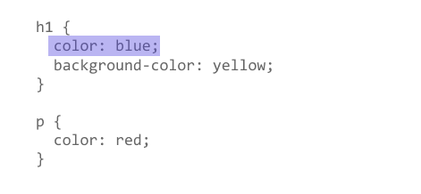
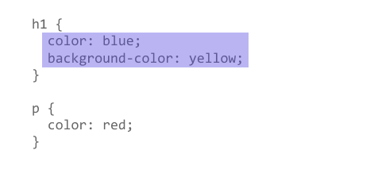
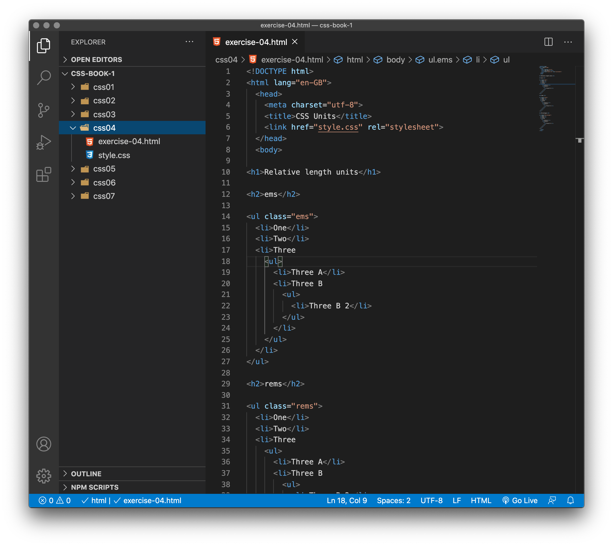
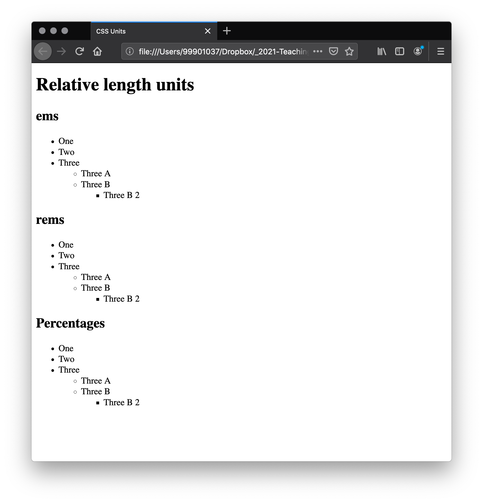
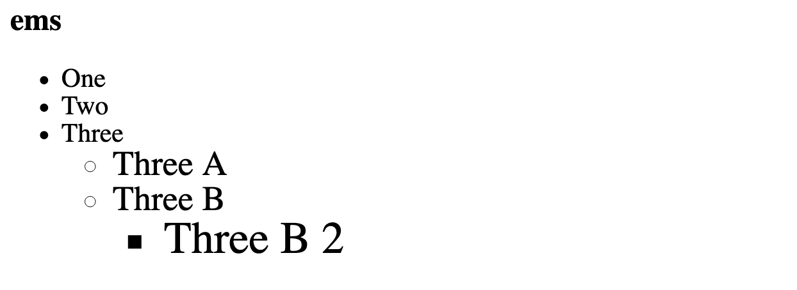
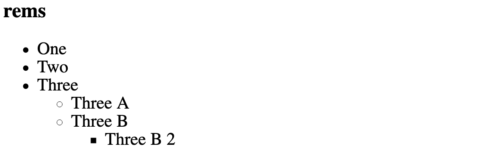
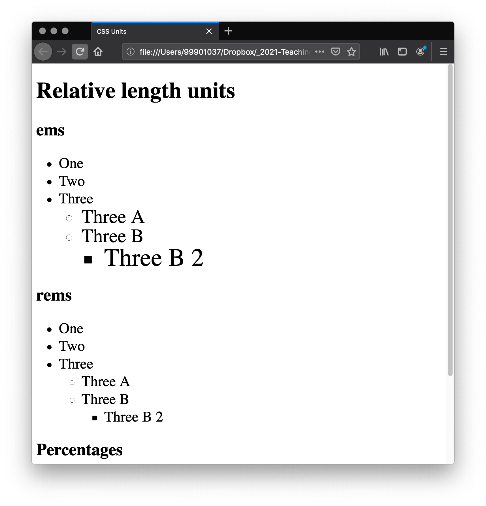
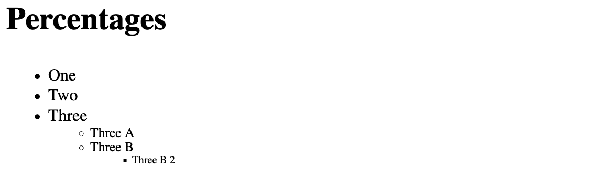

## Properties and values

At its most basic level, CSS consists of two components:

- **Properties**: These are human-readable identifiers that indicate which stylistic features you want to modify. For example, font-size, width, background-color.

- **Values**: Each property is assigned a value. This value indicates how to style the property.

The example below highlights a single `property` and `value`. The property name is `color` and the `value` is blue.




When a property is paired with a `value`, this pairing is called a **CSS declaration**. CSS declarations are found within CSS Declaration Blocks. In the example below, highlighting identifies the CSS declaration block..




Finally, CSS declaration blocks are paired with selectors to produce CSS rulesets (or CSS rules). The example below contains two rules: one for the h1 selector and one for the p selector. The colored highlighting identifies the h1 rule.


Setting CSS properties to specific values is the primary way of defining layout and styling for a document. The CSS engine calculates which declarations apply to every single element of a page.


<h3 class="warning">Important to note:</h3>

1. CSS properties and values are case-sensitive. 

1. The property and value in each pair is separated by a colon. `(:)`

1. If a property is unknown, or if a value is not valid for a given property, the declaration is processed as invalid. It is completely ignored by the browser's CSS engine.

1. In CSS (and other web standards), it has been agreed that US spelling is the standard where there is language variation or uncertainty. For example, color should be spelled color, as colour will not work.


## CSS values and units

Every property used in CSS has a value or set of values that are allowed for that property. So far you have used properties such as color which have had values like `red` and a font-weight with a value of `bold`. 

In the following example, we have set the color of our heading using a keyword, and the background using the rgb() function:

h1 { 
  color: black; 
  background-color: rgb(197,93,161); 
} 

Not all values are relevant to all properties. For example giving the `color` property a `value` of `1px` (one pixel - a [length value](https://developer.mozilla.org/en-US/docs/Web/CSS/length)) makes no sense. You will learn what uses what as you progress with CSS.

A value in CSS is a way to define a collection of allowable sub-values. MDN's [CSS reference](https://developer.mozilla.org/en-US/docs/Web/CSS/Reference) lists all of the CSS properties and values. CSS values tend to be denoted using angle brackets, to differentiate them from CSS properties (e.g. the [color](https://developer.mozilla.org/en-US/docs/Web/CSS/color) property, versus the [&lt;color&gt;](https://developer.mozilla.org/en-US/docs/Web/CSS/color_value) data type). 

Let's have a look at some of the types of values and units you may frequently encounter.

## Numbers, lengths, and percentages

There are various numeric data types that you might find yourself using in CSS. The following are all classed as numeric:

<table>
 <thead>
  <tr>
   <th scope="col">Data type</th>
   <th scope="col">Description</th>
  </tr>
 </thead>
 <tbody>
  <tr>
   <td><code><a href="/en-US/docs/Web/CSS/integer">&lt;integer&gt;</a></code></td>
   <td>An <code>&lt;integer&gt;</code> is a whole number such as <code>1024</code> or <code>-55</code>.</td>
  </tr>
  <tr>
   <td><code><a href="/en-US/docs/Web/CSS/number">&lt;number&gt;</a></code></td>
   <td>A <code>&lt;number&gt;</code> represents a decimal number — it may or may not have a decimal point with a fractional component. For example, <code>0.255</code>, <code>128</code>, or <code>-1.2</code>.</td>
  </tr>
  <tr>
   <td><code><a href="https://developer.mozilla.org/en-US/docs/Web/CSS/dimension">&lt;dimension&gt;</a></code></td>
   <td>A <code>&lt;dimension&gt;</code> is a <code>&lt;number&gt;</code> with a unit attached to it. For example, <code>45deg</code>, <code>5s</code>, or <code>10px</code>. <code>&lt;dimension&gt;</code> is an umbrella category that includes the <code><a href="/en-US/docs/Web/CSS/length">&lt;length&gt;</a></code>, <code><a href="/en-US/docs/Web/CSS/angle">&lt;angle&gt;</a></code>, <code><a href="/en-US/docs/Web/CSS/time">&lt;time&gt;</a></code>, and <code><a href="/en-US/docs/Web/CSS/resolution">&lt;resolution&gt;</a></code> types.</td>
  </tr>
  <tr>
   <td><code><a href="/en-US/docs/Web/CSS/percentage">&lt;percentage&gt;</a></code></td>
   <td>A <code>&lt;percentage&gt;</code> represents a fraction of some other value. For example, <code>50%</code>. Percentage values are always relative to another quantity. For example, an element's length is relative to its parent element's length.</td>
  </tr>
 </tbody>
</table>

### Lengths

The numeric type you will come across most frequently is `<length>`. For example `10px` (pixels) or `30em`. There are two types of lengths used in CSS — relative and absolute. It's important to know the difference in order to understand how big things will become.

### Absolute length units

`Centimeters`, `Millimeters`, `Inches`, `Picas`, `Points` and `Pixels` are all absolute length units — they are not relative to anything else, and are generally considered to always be the same size.

In CSS we can use most of these values but some are more useful when used for print, rather than screen output. For example, we don't typically use cm (centimeters) on screen. 

> The only value that you will commonly use is px (pixels).

### Relative length units

Relative length units are relative to something else, perhaps the size of the parent element's font, or the size of the viewport. So for example, if we define the font-size for the body of a page, then using relative units on paragraphs and headings, they will be sized relative to that base size.

The benefit of using relative units is that with some careful planning you can make it so the size of text or other element scales relative to everything else on the page. Some of the most useful units for web development are listed in the table below.

<table>
 <thead>
  <tr>
   <th scope="col">Unit</th>
   <th scope="col">Relative to</th>
  </tr>
 </thead>
 <tbody>
  <tr>
   <td><code>em</code></td>
   <td>Font size of the parent, in the case of typographical properties like <code><a href="/en-US/docs/Web/CSS/font-size">font-size</a></code>, and font size of the element itself, in the case of other properties like <code><a href="/en-US/docs/Web/CSS/width">width</a></code>.</td>
  </tr>
  <tr>
   <td><code>ex</code></td>
   <td>x-height of the element's font.</td>
  </tr>
  <tr>
   <td><code>ch</code></td>
   <td>The advance measure (width) of the glyph "0" of the element's font.</td>
  </tr>
  <tr>
   <td><code>rem</code></td>
   <td>Font size of the root element.</td>
  </tr>
  <tr>
   <td><code>lh</code></td>
   <td>Line height of the element.</td>
  </tr>
  <tr>
   <td><code>vw</code></td>
   <td>1% of the viewport's width.</td>
  </tr>
  <tr>
   <td><code>vh</code></td>
   <td>1% of the viewport's height.</td>
  </tr>
  <tr>
   <td><code>vmin</code></td>
   <td>1% of the viewport's smaller dimension.</td>
  </tr>
  <tr>
   <td><code>vmax</code></td>
   <td>1% of the viewport's larger dimension.</td>
  </tr>
 </tbody>
</table>

### ems and rems

`em` and `rem` are the two relative lengths you are likely to encounter most frequently when sizing anything from boxes to text. It's worth understanding how these work, and the differences between them, especially when you start getting on to more complex subjects like styling text or CSS layout. The below example provides a demonstration.


<!-- div class="exercise" -->
## Exercise 4

> Using ems and rems.

### Task 1

- Open the `css04` folder.

- Open `exercise-04.html` in your editor.

<figure>

<figcaption>
The Visual Studio Code (VSC) editor window.
</figcaption>
</figure>

### Task 2

- Open `exercise-04.html` in the browser to check it works.

- Review the HTML

- The HTML is a set of nested lists — we have three lists in total and both examples have the same HTML. 

- The only difference is that the first has a `class` of `ems` and the second a `class` of `rems`. Ignore the `Percentages` list for now.

<figure>

<figcaption>
Three lists.
</figcaption>
</figure>


### Task 3

- Return to the `css04` folder.

- Open `style.css` in your editor.

- To start with, we set 16px as the *font size* on the `<html>` element.

- Add to `style.css` the following ruleset:

```
html {
  font-size: 16px;
}
```
- This sets the base `font-size` as the the absolute length unit of 16 pixels.

- Save `style.css` and refresh `exercise-04.html` in the browser.

- Nothing will have changed because the browser default base font size is usually 16px.

### Task 4 - Ems

- Return to `style.css` in your editor and add the following ruleset:

```
.ems li {
  font-size: 1.3em;
}
```

- This sets the font size for the `<li>` elements in the list with the class of `ems`.

- Save `style.css` and refresh `exercise-04.html` in the browser.

- The `em` unit means "my parent element's font-size" in the case of typography. 

- The `<li>` elements inside the `<ul>` with a class of `ems` take their sizing from their parent. **So each successive level of nesting gets progressively larger, as each has its font size set to 1.3em — 1.3 times its parent's font size**.

<figure>

<figcaption>
Therefore, as we have a list inside a list, inside a list - the font size increases each time.
</figcaption>
</figure>


### Task 4 - Rems

- Return to `style.css` in your editor and add the following ruleset:

```
.rems li {
  font-size: 1.3rem;
}
```
- Save `style.css` and refresh `exercise-04.html` in the browser.

- The `rem` unit means "The root element's font-size". (`rem` stands for "root em".) 

- The `<li>` elements inside the `<ul>` with a class of `rems` take their sizing from the root element (`<html>`) - not the parent like `ems`. 

<figure>

<figcaption>
This means that each successive level of nesting does not keep getting larger.
</figcaption>
</figure>


### Task 3

Changing the `<html>` `font-size` in the CSS will mean that everything else changes relative to it — both `rem`- and `em`-sized text.

- Return to `style.css` in your editor and change the `16px` font size to `20px`.

```
html {
  font-size: 20px;
}
```

- Save `style.css` and refresh `exercise-04.html` in the browser.

<figure>

<figcaption>
Note how everything else changes relative to it.
</figcaption>
</figure>

- You can see that using `rem` is simpler. You don't have to worry about the nesting issues of `em`, although this can sometimes be handy.

<!-- end div -->

<h3 class="warning">Which length unit to use?</h3>

There are lots of articles, blog posts and tweets arguing the merit of `em`, `rem` and/or `px`. At this stage, `rem` and `px` are your wisest choice. More about fonts and sizing later.


### Percentages

In a lot of cases, a percentage is treated in the same way as a length. The thing with percentages is that they are always set relative to some other value. For example, if you set an element's font-size as a percentage it will be a percentage of the font-size of the element's parent. If you use a percentage for a width value, it will be a percentage of the width of the parent.

<!-- div class="exercise" -->
## Exercise 4 continued

> Using percentages.

### Task 1

- Return to the `css04` folder.

- Add the following ruleset to your CSS in `style.css`:

```
.percentages li {
    font-size: 80%;
}
```

- Save `style.css` and refresh `exercise-04.html` in the browser.

- View the **percentages** list at the bottom of the page.

- As the font sizes are set in percentages each `<li>` has a `font-size` of `80%`, therefore you will see that the nested list items become progressively smaller as they inherit their sizing from their parent.

<figure>

<figcaption>
The list items get smaller as they become 80% of their parent.
</figcaption>
</figure>

<!-- end div -->

> Note that, while many values accept a length or a percentage, there are some that only accept length. 

<p class="submit-work">Exercise 4 completed</p>

- These exercises show how these values are applied and some of the issues related to them. You will discover more as we define font sizes and start to size containers.


<h2 class="deep">Deeper Learning</h2>

To get a better understanding of this topic use the following resources.

- LinkedIn Learning Video: [CSS values and units](https://www.linkedin.com/learning/css-essential-training-3/css-values-and-units?u=36102708)

- MDN: The full [CSS and Values article](https://developer.mozilla.org/en-US/docs/Learn/CSS/Building_blocks/Values_and_units)

- MDN: [Length units](https://developer.mozilla.org/en-US/docs/Web/CSS/length)

- MDN: [Length percentage](https://developer.mozilla.org/en-US/docs/Web/CSS/length-percentage)


### &copy; Credit given

Materials used under the Creative Commons licence from [MDN Web Docs](https://developer.mozilla.org/en-US/docs/Web/HTML).
