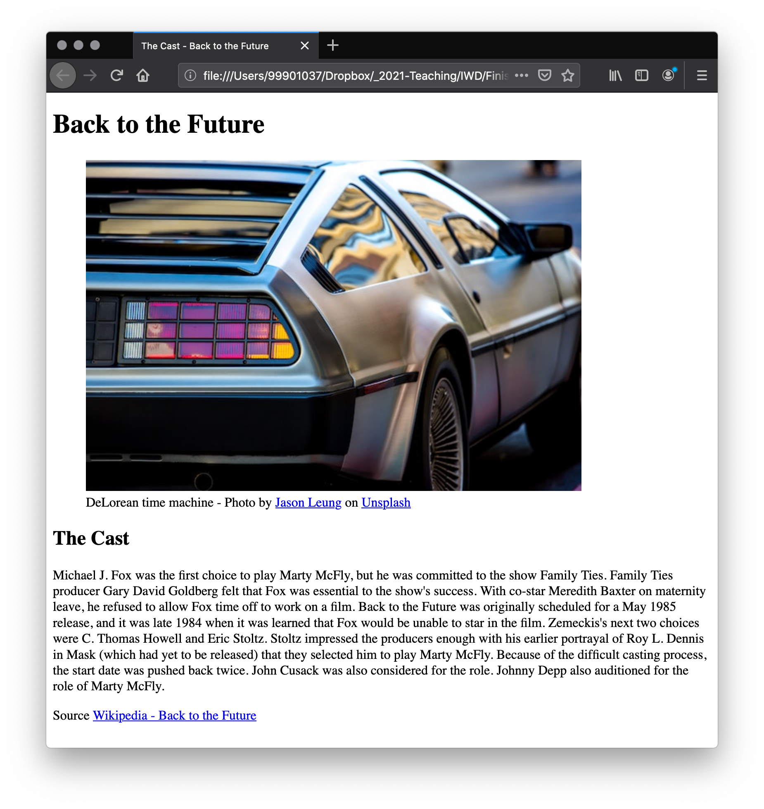
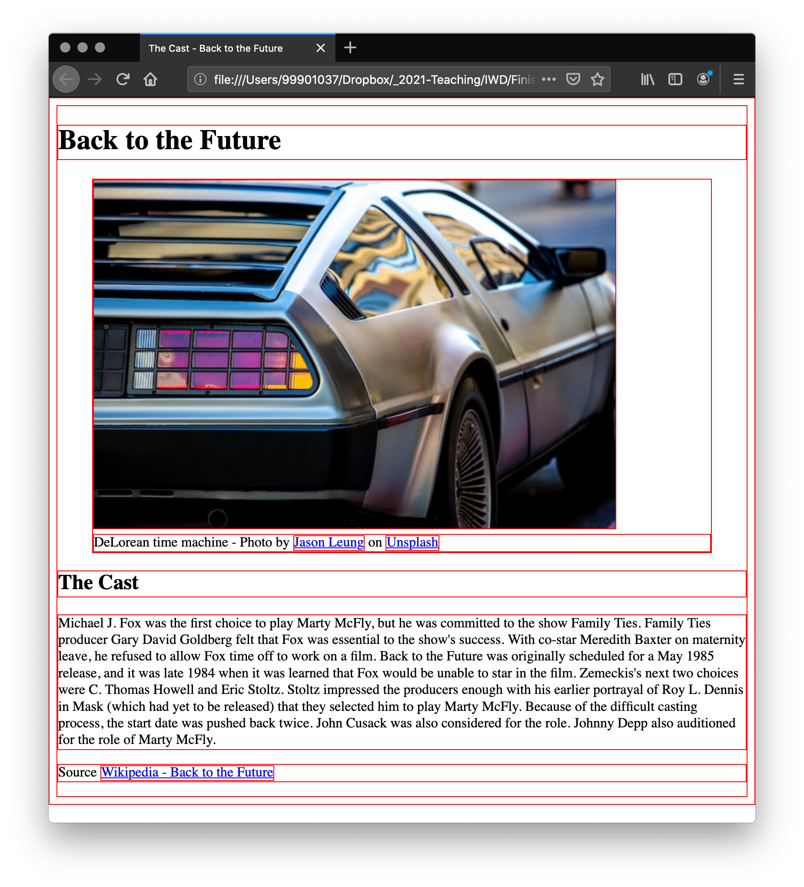
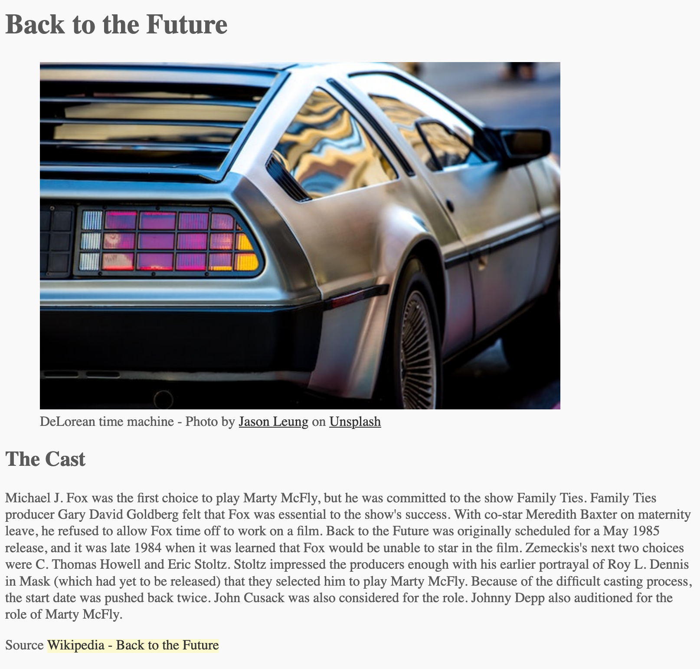
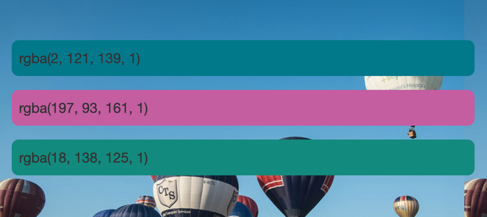
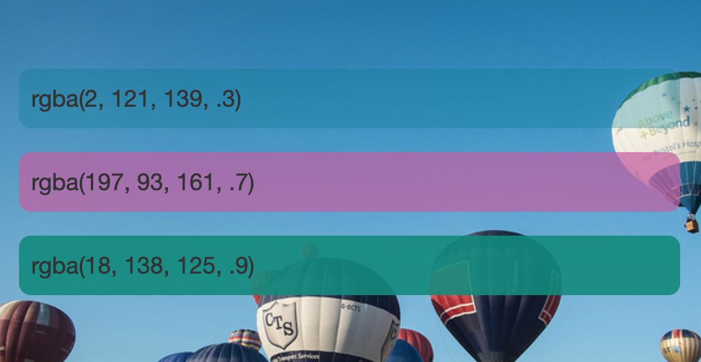

# Colour

There are many ways to specify colour in CSS, some of which are more recently implemented than others. The same colour values can be used everywhere in CSS, whether you are specifying text colour, background colour, or whatever else.

The standard colour system available in modern computers is 24 bit, which allows the display of about 16.7 million distinct colours via a combination of different red, green and blue channels with 256 different values per channel (256 x 256 x 256 = 16,777,216.) Let's have a look at some of the ways in which we can specify colours in CSS.

> Note: In this tutorial we will look at the common methods of specifying colour that have good browser support; there are others but they don't have as good support and are less common.

## Colour keywords

So far you will see the colour keywords used, as they are a simple and understandable way of specifying colour. There are a number of these keywords, some of which have fairly entertaining names! 

You can see a full list on the page for the [colour value](https://developer.mozilla.org/en-US/docs/Web/CSS/color_value).

Colour keywords are case-insensitive identifiers that represent a specific colours, such as `red`, `blue`, `black`, or `lightseagreen`. Although the names more or less describes their respective colours, they are essentially artificial, without a strict rationale behind the names used.

This site [neilorangepeel.com](https://colours.neilorangepeel.com/) is a great resource to see all of the colour names. It also provides their `hex` and `rgb` values (to follow).

## Hexadecimal RGB values

The next type of colour value you are likely to encounter is **hexadecimal codes**. Each `hex` value consists of a hash/pound symbol (`#`) followed by six hexadecimal numbers, each of which can take one of 16 values between `0` and `f` (which represents `15`) — so `0123456789abcdef`. Each pair of values represents one of the channels — red, green and blue — and allows us to specify any of the 256 available values for each (16 x 16 = 256.)

These values are a bit more complex and less easy to understand, but they are a lot more versatile than keywords — you can use hex values to represent any colour you want to use in your colour scheme.

<!-- div class="exercise" -->
## Exercise 5

> Using `hex` values.

### Task 1

- Open the `css05` folder.

- Open `exercise-05.html` in your editor.

<figure>

<figcaption>
The Visual Studio Code (VSC) editor window.
</figcaption>
</figure>

### Task 2

- Open `exercise-05.html` in the browser to check it works.

<figure>

<figcaption>
The basic Back to the Future page, with browser default styles.
</figcaption>
</figure>

### Task 3

- Return to `exercise-05.html` in your editor. 

- Attach the stylesheet - `style.css`

- Link to `style.css` in the head of `exercise-05.html` (just under the title) using the `<link rel="stylesheet" href="">` element.

- Save `exercise-05.html` and refresh in your browser.

<figure>

<figcaption>
You can confirm the attached style is working as the one style in <code>style.css</code> is working.
</figcaption>
</figure>

- `style.css` contained the following style, which applies a red border to every element box (more about boxes later) on the page.

```
* {
    border: 1px solid red;
}
```

- This is a handy bit of code to confirm things are working.

- It is also handy when you can't quite work out *what is what* in your CSS.

### Task 4

- Return to `style.css` in the editor.

- Remove the previous style - get rid of that ugly border.

- Add the following style:

```
body {
  color:#5a5a5a;
  background-color: #f9f9f9;
}
```
- Applying styles to the `body`, applies the styles to everything in the browser window that can inherit them.

- `color:#5a5a5a;` gives us grey text (headings and paragraphs).

- `background-color: #f9f9f9;` gives us an off-white background to the whole page.

- Save `style.css` and refresh `exercise-05.html` in the browser.

- Check that your page reflects these changes (the background is subtle).

### Task 5

- Return to `style.css` in the editor and add the following styles:

```
a:link {
    color: #333;
}

a:visited {
    color: #000;
}

a:hover {
    text-decoration: none;
    background-color: #fcf9d1;
}
```

- Save `style.css` and refresh `exercise-05.html` in the browser.

- Once again we are styling the various link states with these pseudo selectors.

- `background-color: #fcf9d1;` is added to our hover effect.

- Hover over links and click them to test the styles applied.

<figure>

<figcaption>
Showing the hover effect on the Wikipedia link.
</figcaption>
</figure>

<!-- end div -->

<p class="submit-work">Exercise 5 completed</p>

## RGB and RGBA values

The third scheme we'll talk about here is RGB. An RGB value is a function — `rgb()` — which is given three parameters that represent the red, green, and blue channel values of the colours, in much the same way as hex values. The difference with RGB is that each channel is represented not by two hex digits, but by a decimal number between 0 and 255 — somewhat easier to understand.

- `color: rgb(255,0,0)` - full red
- `color: rgb(0,255,0)` - full green
- `color: rgb(0,0,255)` - full blue

Here are the two hex colours we started with:

- `color:#545454;` 
- `background-color: #f9f9f9;`

<p style="color:#545454; background-color:#f9f9f9; padding: 5px;">Which gave use this effect, dark grey text on a pale background.</p>

Defined as RGB these colours would be:

- `color: rgb(84,84,84)`
- `background-color: rgb(249,249,249)`

<!-- div class="exercise" -->
## To Do - Hex to RGB

> Have a play - Hex to RGB.

- Go to this [Hex to RGB converter](https://www.webfx.com/web-design/hex-to-rgb/)
- Enter the hex code - `#FF0000`
- Enter the hex code - `#00FF00`
- Enter the hex code - `#0000FF`
- Try some others.

> There are many tools on the web that provide a similar service. Your graphics editor may provide colours as Hex and RGB.
<!-- end div -->

### RGBA colours

You can also use RGBA colours — these work in exactly the same way as RGB colours, and so you can use any RGB values. However, there is a fourth value that represents the alpha channel of the colour, which controls opacity. If you set this value to 0 it will make the colour fully transparent, whereas 1 will make it fully opaque. Values in between give you different levels of transparency.

<figure>

<figcaption>
The alpha channel value is set at 1, making the colour bocks fully opaque. 
</figcaption>
</figure>

<figure>

<figcaption>
The alpha channel values are adjusted for each colour, giving them varied levels of opacity - .3 for the blue, .7 for pink and .9 for the green.
</figcaption>
</figure>

> Note: Setting an alpha channel on a colour has one key difference to using the opacity property you will come across in CSS. When you use opacity you make the element and everything inside it opaque, whereas using RGBA colours only makes the colour you are specifying opaque.

## HSL and HSLA values

Slightly less well-supported than RGB is the HSL colour model (not supported on old versions of IE), which was implemented after much interest from designers. Instead of red, green, and blue values, the hsl() function accepts hue, saturation, and lightness values, which are used to distinguish between the 16.7 million colours, but in a different way:

- **Hue**: The base shade of the colour. This takes a value between 0 and 360, representing the angles around a colour wheel.
- **Saturation**: How saturated is the colour? This takes a value from 0–100%, where 0 is no colour (it will appear as a shade of grey), and 100% is full colour saturation
- **Lightness**: How light or bright is the colour? This takes a value from 0–100%, where 0 is no light (it will appear completely black) and 100% is full light (it will appear completely white)

### HSL values

- Solid - `background-color: hsl(188, 97%, 28%)`

<p style="background-color: hsl(188, 97%, 28%); padding:5%;">background-color: hsl(188, 97%, 28%)</p>

### HSLA values

Just as RGB has RGBA, HSL has an HSLA equivalent, which gives you the same ability to specify the alpha channel. I've demonstrated this below by changing my RGBA example to use HSLA colors.

- With opacity -`background-color: hsl(188, 97%, 28%, .3%);`

<p style="background-color: hsl(188, 97%, 28%, .3%); padding:5%;">background-color: hsl(188, 97%, 28% .3%)</p>

You can use any of these color values in your projects. It is likely that for most projects you will decide on a color palette and then use those colors — and your chosen method of specifying color — throughout the whole project. You can mix and match color models, however for consistency it is usually best if your entire project uses the same one!

> We find students get along with the hex values better in the early days of coding. You may find the need to move to RBGA when you want to start to control opacity. As you create more websites and grow in confidence these extra options will become more useful to you.

<h2 class="deep">Deeper Learning</h2>

To get a better understanding of this topic use the following resources.

- LinkedIn Learning Video: [Colour property](https://www.linkedin.com/learning/css-essential-training-3/the-color-and-property-values?u=36102708)

- There are many sites providing tables of colour names, hex and RGB values. [Color-hex](https://www.color-hex.com/) does a good job in providing plenty of detail for every shade.

### &copy; Credit given

Materials used under the Creative Commons licence from [MDN Web Docs](https://developer.mozilla.org/en-US/docs/Web/HTML).
