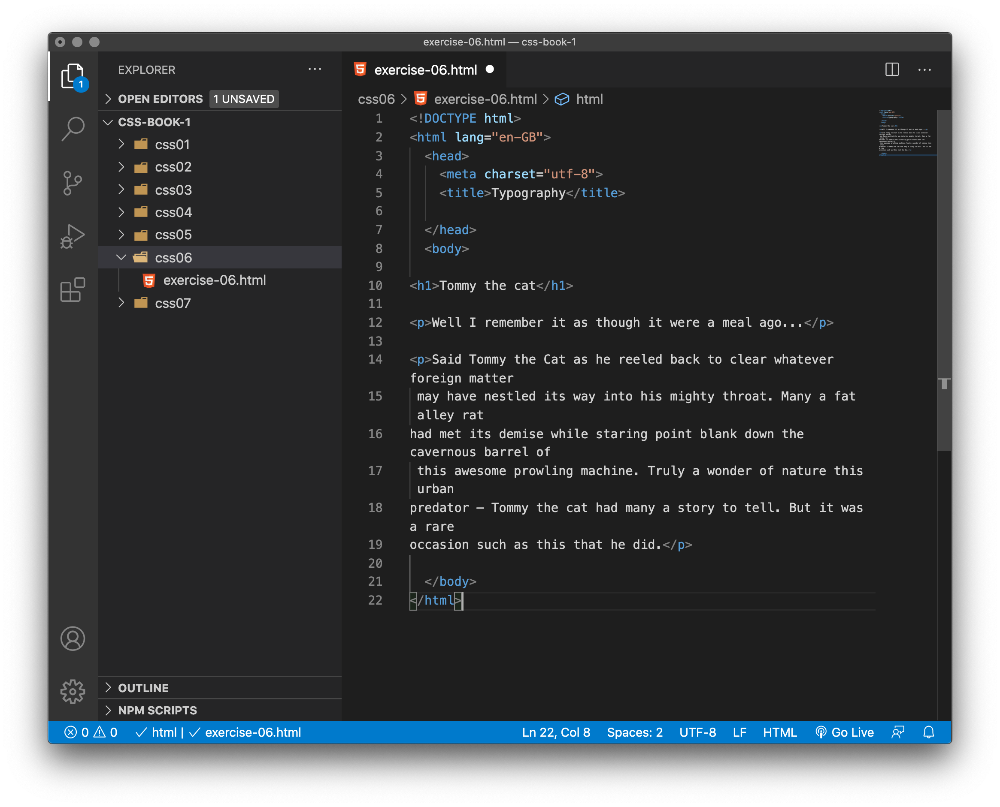
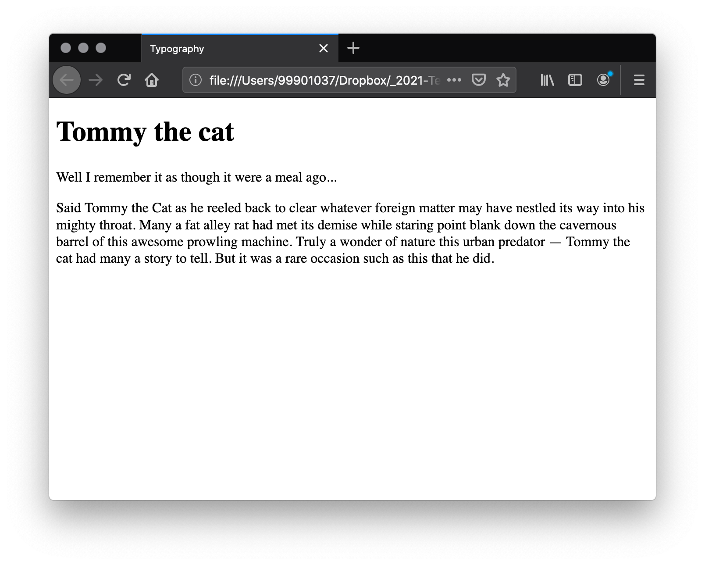
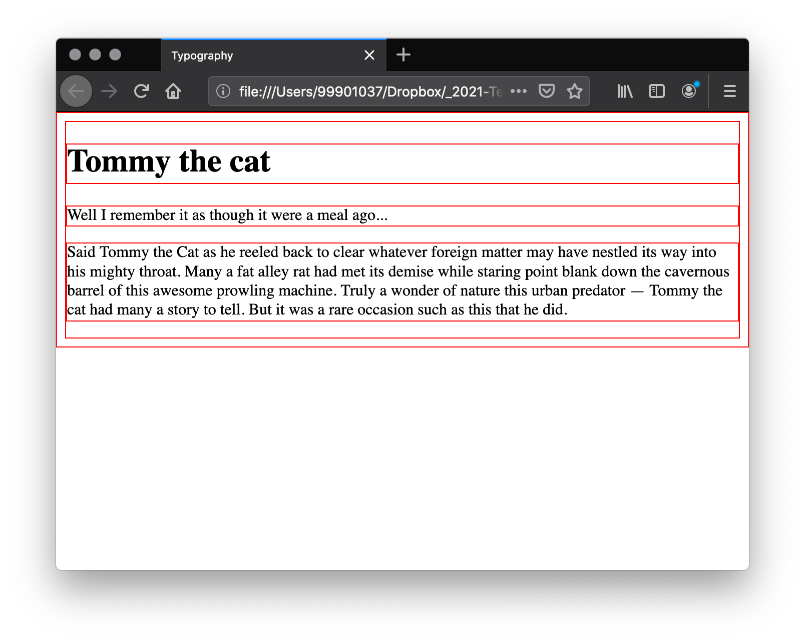
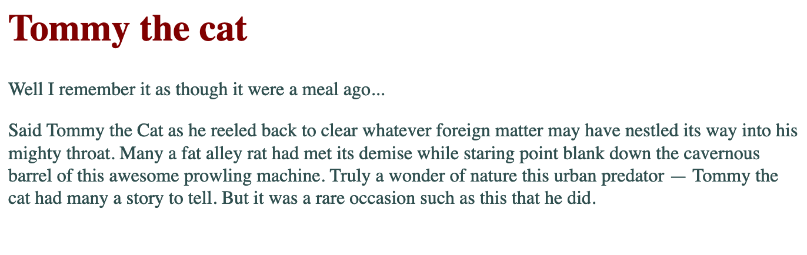
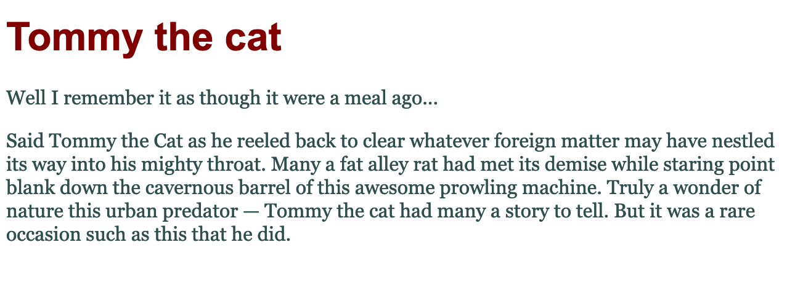
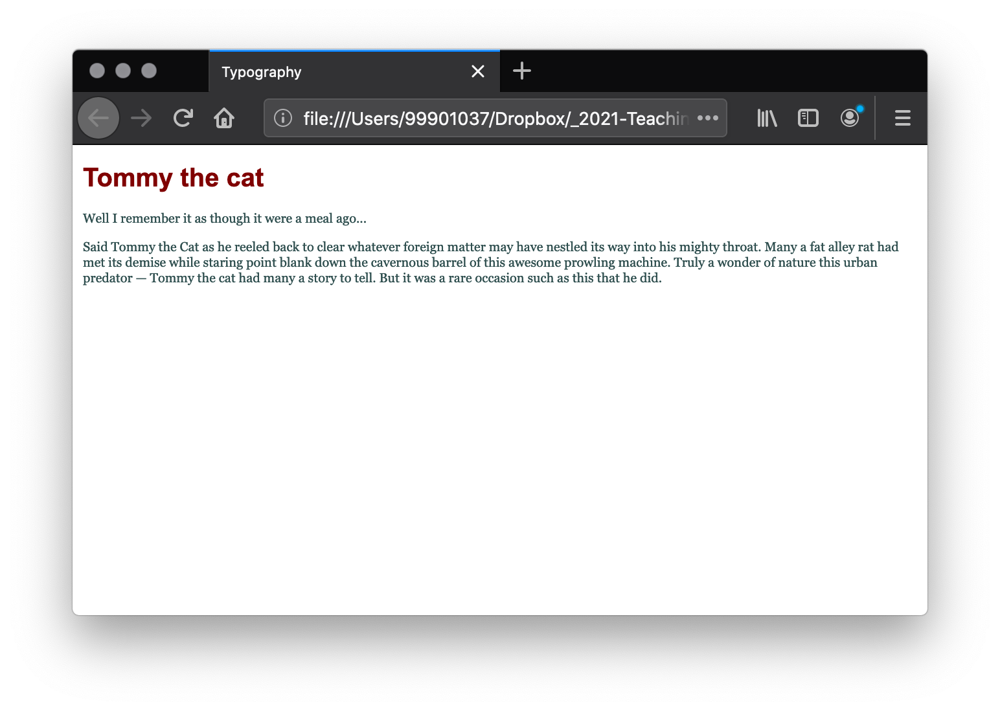
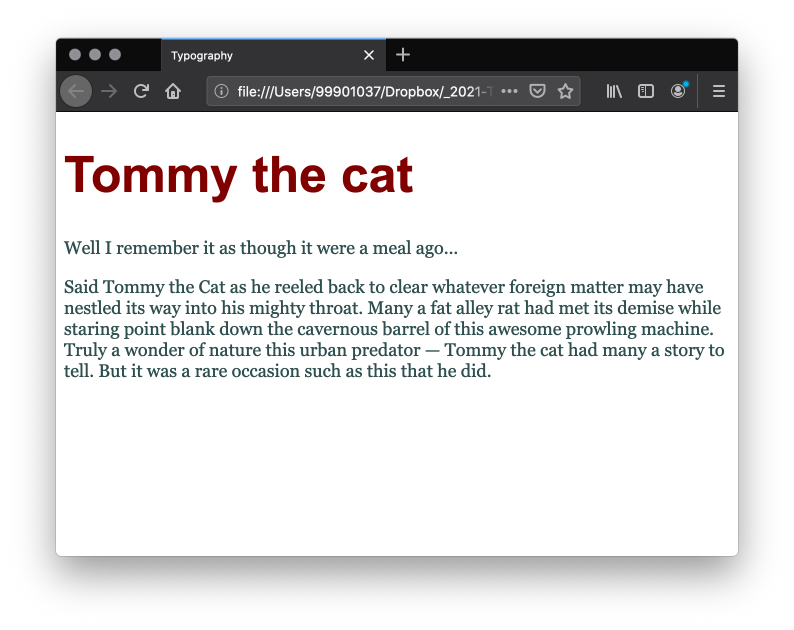
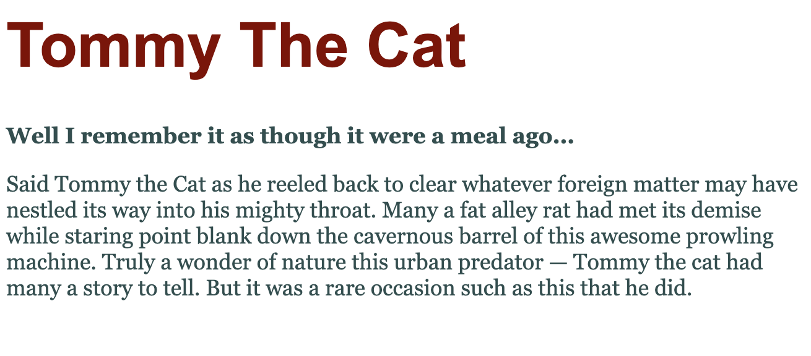
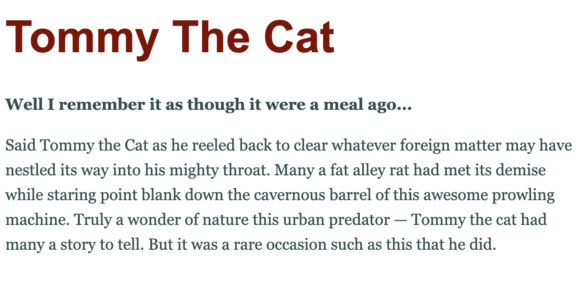
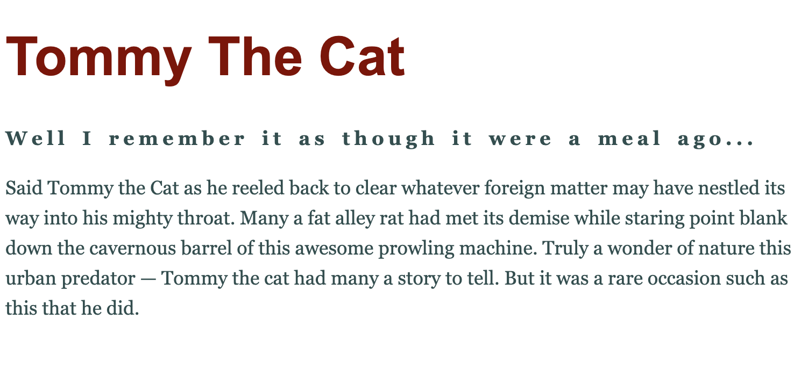

# Typography for the web

## Before you start 

> Please watch the following short video. These will help you better understand the rest of this chapter.

- LinkedIn Learning Video: [CSS essential training -  [Typography for the web](https://www.linkedin.com/learning/css-essential-training-3/typography-for-the-web?u=36102708) (2m 59s)

The CSS properties used to style text generally fall into two categories, which we'll look at separately in this article:

- **Font styles**: Properties that affect the font that is applied to the text, affecting what font is applied, how big it is, whether it is bold, italic, etc.

- **Text layout styles**: Properties that affect the spacing and other layout features of the text, allowing manipulation of, for example, the space between lines and letters, and how the text is aligned within the content box.

> Note: Bear in mind that the text inside an element is all affected as one single entity. You can't select and style subsections of text unless you wrap them in an appropriate element (such as a `<span>` or `<strong>`), or use a text-specific pseudo-element like `::first-letter` (selects the first letter of an element's text), `::first-line` (selects the first line of an element's text), or `::selection` (selects the text currently highlighted by the cursor.)

## Fonts

Let's move straight on to look at properties for styling fonts.

### Color

The `color` property sets the colour of the foreground content of the selected elements (which is usually the text, but can also include a couple of other things, such as an underline or overline placed on text using the `text-decoration` property).

As you know, `color` can accept any CSS colour unit, for example:

`p {
    color: red;
}`

Or

`p {
    color:#FF0000;
}`

Or 

`p {
    color: rgb(255,0,0);
}`

<p style="color:#FF0000; margin: 20px">All of which would produce red text.</p>


<!-- div class="exercise" -->
## Exercise 6

> Adding colour.

### Task 1

- Open the `css06` folder.

- Open `exercise-06.html` in your editor.

<figure>

<figcaption>
The Visual Studio Code (VSC) editor window.
</figcaption>
</figure>

### Task 2

- Open `exercise-06.html` in the browser to check it works.

<figure>

<figcaption>
The basic Tommy the cat page, with browser default styles.
</figcaption>
</figure>


### Task 3

- Return to the `css06` folder in your editor.

- Create a stylesheet, `style.css` on the root of the `css06` folder.

- Add the test style:

```
* {
    border: 1px solid red;
}
```
- Save `style.css`.

### Task 4

- Return to `exercise-06.html` and add a link to `style.css` to the `<head>` of `index.html` using the `<link>` element as before.

- Refresh `exercise-06.html` to check that the styles are applied.

- If they are not, check your link, check the location of your css file.

<figure>

<figcaption>
Thin red border applied to all elements of the page.
</figcaption>
</figure>

### Task 5

- Return to `style.css` in the editor.

- Remove the test (red border) styles.

- Add the following colours to the heading text and the paragraph text:

```
h1 {
    color: #800000;
}

p {
    color: #2F4F4F;
}
```

- Save `style.css` and refresh `exercise-06.html` in the browser.

<figure>

<figcaption>
You should have a maroon heading and dark slate grey text.
</figcaption>
</figure>


<!-- end div -->

<h3 class="warning">Colour Contrast</h3>

Colour contrast is an important accessibility issue. You should always be aware of the colour contrast between the foreground and background colours.

At the moment the foreground colour is our font colour (it could also be lines, shadows etc.). The background in our example is the default white background.

- Our current text colour of `#2F4F4F` has a colour contrast ration of 8.92:1 - This exceeds the WCAG Level AAA requires a contrast ratio of at least 7:1 for normal text.

- See the WebAIM [Colour Contrast Checker for #2F4F4F](https://webaim.org/resources/contrastchecker/?fcolor=2F4F4F&bcolor=FFFFFF)

- In the Colour Contrast Checker reduce the lightness of our font colour with the slider and you will see it soon falls below the contrast levels required.

- We will provide more information about accessibility and the [Web Content Accessibility Guidelines](https://webaim.org/standards/wcag/checklist) (WCAG).

- **The bottom line** - we expect your colour contrast to conform the AAA standard.


## Font families

To set a different font on your text, you use the `font-family` property — this allows you to specify a font (or list of fonts) for the browser to apply to the selected elements. The browser will only apply a font if it is available on the machine the website is being accessed on; if not, it will just use a browser `default` font. A simple example looks like so:

```
p {
  font-family: arial;
}
```

This would make all paragraphs on a page adopt the arial font, which is found on any computer.

### Web safe fonts

Speaking of font availability, there are only a certain number of fonts that are generally available across all systems and can therefore be used without much worry. These are the so-called **web safe fonts**.

Most of the time, as web developers we want to have more specific control over the fonts used to display our text content. The problem is to find a way to know which font is available on the computer used to see our web pages. There is no way to know this in every case, but the web safe fonts are known to be available on nearly all instances of the most used operating systems (Windows, macOS, the most common Linux distributions, Android, and iOS).

The list of actual web safe fonts will change as operating systems evolve, but it's reasonable to consider the following fonts web safe, at least for now (many of them have been popularized thanks to the Microsoft [Core fonts for the Web](https://en.wikipedia.org/wiki/Core_fonts_for_the_Web) initiative in the late 90s and early 2000s):

<table>
 <thead>
  <tr>
   <th scope="col">Name</th>
   <th scope="col">Generic type</th>
   <th scope="col">Notes</th>
  </tr>
 </thead>
 <tbody>
  <tr>
   <td>Arial</td>
   <td>sans-serif</td>
   <td>It's often considered best practice to also add <em>Helvetica</em> as a preferred alternative to <em>Arial</em> as, although their font faces are almost identical, <em>Helvetica</em> is considered to have a nicer shape, even if <em>Arial</em> is more broadly available.</td>
  </tr>
  <tr>
   <td>Courier New</td>
   <td>monospace</td>
   <td>Some OSes have an alternative (possibly older) version of the <em>Courier New</em> font called <em>Courier</em>. It's considered best practice to use both with <em>Courier New</em> as the preferred alternative.</td>
  </tr>
  <tr>
   <td>Georgia</td>
   <td>serif</td>
   <td></td>
  </tr>
  <tr>
   <td>Times New Roman</td>
   <td>serif</td>
   <td>Some OSes have an alternative (possibly older) version of the <em>Times New Roman</em> font called <em>Times</em>. It's considered best practice to use both with <em>Times New Roman</em> as the preferred alternative.</td>
  </tr>
  <tr>
   <td>Trebuchet MS</td>
   <td>sans-serif</td>
   <td>You should be careful with using this font — it isn't widely available on mobile OSes.</td>
  </tr>
  <tr>
   <td>Verdana</td>
   <td>sans-serif</td>
   <td></td>
  </tr>
 </tbody>
</table>


> **Note**: Among various resources, the [cssfontstack.com](https://www.cssfontstack.com/) website maintains a list of web safe fonts available on Windows and macOS operating systems, which can help you make your decision about what you consider safe for your usage.

> **Note**: There is a way to download a custom font along with a webpage, to allow you to customize your font usage in any way you want: web fonts. This is a little bit more complex, and we will be discussing this later.

### Default fonts

CSS defines five generic names for fonts:  `serif`, `sans-serif`, `monospace`, `cursive` and `fantasy`. Those are very generic and the exact font face used when using those generic names is up to each browser and can vary for each operating system they are running on. It represents a worst case scenario where the browser will try to do its best to provide at least a font that looks appropriate. `serif`, `sans-serif` and `monospace` are quite predictable and should provide something reasonable. On the other hand, `cursive` and `fantasy` are less predictable and we recommend using them very carefully, testing as you go.

The five names are defined as follows:


<table>
 <thead>
  <tr>
   <th scope="col">Term</th>
   <th scope="col">Definition</th>
   <th scope="col">Example</th>
  </tr>
 </thead>
 <tbody>
  <tr>
   <td><code>serif</code></td>
   <td>Fonts that have serifs (the flourishes and other small details you see at the ends of the strokes in some typefaces)</td>
   <td><span style="font-family: serif;">My big red elephant</span></td>
  </tr>
  <tr>
   <td><code>sans-serif</code></td>
   <td>Fonts that don't have serifs.</td>
   <td><span style="font-family: sans-serif;">My big red elephant</span></td>
  </tr>
  <tr>
   <td><code>monospace</code></td>
   <td>Fonts where every character has the same width, typically used in code listings.</td>
   <td><span style="font-family: monospace;">My big red elephant</span></td>
  </tr>
  <tr>
   <td><code>cursive</code></td>
   <td>Fonts that are intended to emulate handwriting, with flowing, connected strokes.</td>
   <td><span style="font-family: cursive;">My big red elephant</span></td>
  </tr>
  <tr>
   <td><code>fantasy</code></td>
   <td>Fonts that are intended to be decorative.</td>
   <td><span style="font-family: fantasy;">My big red elephant</span></td>
  </tr>
 </tbody>
</table>

### Font stacks

Since you can't guarantee the availability of the fonts you want to use on your webpages (even a web font could fail for some reason), you can supply a font stack so that the browser has multiple fonts it can choose from. This simply involves a `font-family` value consisting of multiple font names separated by commas, e.g.

```
p {
  font-family: "Trebuchet MS", Verdana, sans-serif;
}
```

In such a case, the browser starts at the beginning of the list and looks to see if that font is available on the machine. If it is, it applies that font to the selected elements. **If not, it moves on to the next font, and so on**.

It is a good idea to provide a suitable generic font name at the end of the stack so that if none of the listed fonts are available, the browser can at least provide something approximately suitable. To emphasise this point, paragraphs are given the browser's default serif font if no other option is available — which is usually Times New Roman — this is no good for a sans-serif font!

> Note: Font names that have more than one word — like Trebuchet MS — need to be surrounded by quotes, for example "Trebuchet MS".

<!-- div class="exercise" -->
## Exercise 6 continued

> Adding a `font-family`.

### Task 1

- Return to `style.css` on the root of the `css06` folder.

- **Add both of these font families styles** to your existing `h1` and `p` rulesets.

```
h1 {
    color: #800000;
    font-family: Arial, Helvetica, sans-serif;     
}

p {
    color: #2F4F4F;
    font-family:georgia, times, serif; 
}
```

- Refresh `exercise-06.html` in the browser to see the change in fonts.

<figure>

<figcaption>
If your computer or device doesn't have the first font listed it will apply the next available, dropping back to the defaults of `sans-serif` or `serif` if necessary.
</figcaption>
</figure>

- If you type out the above CSS rather than copy & pasting, you might note the editor tries to help you by providing set lists of web-safe font families. This will help you in the future. You don't need to memorise all this stuff!


<!-- end div -->


## Font size

In our previous chapter on CSS values and units we reviewed length and size units. Font size (set with the `font-size` property) can take values measured in most of these units (and others, such as percentages), however the most common units you'll use to size text are:

- px (pixels): The number of pixels high you want the text to be. This is an absolute unit — it results in the same final computed value for the font on the page in pretty much any situation.

- ems: 1 em is equal to the font size set on the parent element of the current element we are styling (more specifically, the width of a capital letter M contained inside the parent element.) This can become tricky to work out if you have a lot of nested elements with different font sizes set. Why bother? It is quite natural once you get used to it, and you can use em to size everything, not just text. You can have an entire website sized using em, which makes maintenance easy.

- rems: These work just like em, except that 1 rem is equal to the font size set on the root element of the document (i.e. `<html>`), not the parent element. This makes doing the maths to work out your font sizes much easier, although if you want to support really old browsers, you might struggle — `rem` is not supported in Internet Explorer 8 and below.

The font-size of an element is inherited from that element's parent element. This all starts with the root element of the entire document — `<html>` — the font-size of which is set to 16px as standard across browsers. Any paragraph (or another element that doesn't have a different size set by the browser) inside the root element will have a final size of 16 px. Other elements may have different default sizes, for example an `<h1>` element has a size of 2 em set by default, so it will have a final size of 32 px.

> The base font size for most browsers is 16px.

### A simple sizing example

When sizing your text, a simple trick used is to set the base font-size of the document to 10 px, so that then the maths is a lot easier to work out — required (r)em values are then the pixel font size divided by 10, not 16. After doing that, you can easily size the different types of text in your document to what you want. It is a good idea to list all your font-size rulesets in a designated area in your stylesheet, so they are easy to find.

<!-- div class="exercise" -->
## Exercise 6 continued

> Adding a `font-size`.

### Task 1

- Return to `style.css`.

- Set the base font size.

- It makes sense to insert this style at the top of your css file.

```
html {
  font-size: 10px;
}
```
- As explained above, with a base font the maths becomes easier. `1rem` is now 10px, so `2rem` is 20px. Same with `em`'s.

- Save `style.css` and refresh `exercise-06.html` in the browser.

<figure>

<figcaption>
Our base font size now makes everything (relatively) smaller. Time to apply our own sizes.
</figcaption>
</figure>

### Task 3

- Add both of these font-sizes to your `h1` and `p` styles in `style.css`.

```
h1 {
    font-size: 5rem;
    color: #800000;
    font-family: Arial, Helvetica, sans-serif;     
}

p {
    font-size:1.8rem;
    color: #2F4F4F;
    font-family:georgia, times, serif; 
}
```
- Save `style.css` and refresh `exercise-06.html` in the browser.

- Your page should look something like this. Much better than the browser defaults.

<figure>

<figcaption>
Our heading and paragraphs are now sized relatively to the base font size of 10px. 
</figcaption>
</figure>

> If this was written in pixels:

```
  h1 {
    font-size: 50px;
    color: #800000;
    font-family: Arial, Helvetica, sans-serif;     
}

p {
    font-size: 18px;
    color: #2F4F4F;
    font-family:georgia, times, serif; 
}
```

## So why not use pixels?

- You can! 

- Using relative values like `rem` means that you can be certain, if someone increases the font size in their browser everything stays relative.

- The arguments for and against both methods rattle on.

<!-- end div -->

## Font style, font weight, text transform, and text decoration

CSS provides four common properties to alter the visual weight/emphasis of text:

<ul>
 <li><a href="https://developer.mozilla.org/en-US/docs/Web/CSS/font-style" title="The font-style CSS property sets whether a font should be styled with a normal, italic, or oblique face from its font-family."><code>font-style</code></a>: Used to turn italic text on and off. Possible values are as follows (you'll rarely use this, unless you want to turn some italic styling off for some reason):
  <ul>
   <li><code>normal</code>: Sets the text to the normal font (turns existing italics off.)</li>
   <li><code>italic</code>: Sets the text to use the <em>italic version of the font</em> if available; if not available, it will simulate italics with oblique instead.</li>
   <li><code>oblique</code>: Sets the text to use a simulated version of an italic font, created by <span style="font-style: oblique;">slanting the normal version</span>.</li>
  </ul>
 </li>
 <li><a href="https://developer.mozilla.org/en-US/docs/Web/CSS/font-weight" title="The font-weight CSS property sets the weight (or boldness) of the font. The weights available depend on the font-family you are using."><code>font-weight</code></a>: Sets how bold the text is. This has many values available in case you have many font variants available (such as <em>-light</em>, <em>-normal</em>, <em>-bold</em>, <em>-extrabold</em>, <em>-black</em>, etc.), but realistically you'll rarely use any of them except for <code>normal</code> and <code>bold</code>:
  <ul>
   <li><code>normal</code>, <code>bold</code>: Normal and <strong style="font-weight: bold;">bold</strong> font weight</li>
   <li><code>lighter</code>, <code>bolder</code>: Sets the current element's boldness to be one step lighter or heavier than its parent element's boldness.</li>
   <li><code>100</code>–<code>900</code>: Numeric boldness values that provide finer grained control than the above keywords, if needed. </li>
  </ul>
 </li>
 <li><a href="https://developer.mozilla.org/en-US/docs/Web/CSS/text-transform" title="The text-transform CSS property specifies how to capitalize an element's text. It can be used to make text appear in all-uppercase or all-lowercase, or with each word capitalized. It also can help improve legibility for ruby."><code>text-transform</code></a>: Allows you to set your font to be transformed. Values include:
  <ul>
   <li><code>none</code>: Prevents any transformation.</li>
   <li><code>uppercase</code>: Transforms <span style="text-transform: uppercase;">all text to capitals</span>.</li>
   <li><code>lowercase</code>: Transforms all text to lower case.</li>
   <li><code>capitalize</code>: Transforms all words to <span style="text-transform: capitalize;">have the first letter capitalized</span>.</li>
   <li><code>full-width</code>: Transforms all glyphs to be <span style="text-transform: full-width;">written inside a fixed-width square</span>, similar to a monospace font, allowing aligning of e.g. Latin characters along with Asian language glyphs (like Chinese, Japanese, Korean).</li>
  </ul>
 </li>
 <li><a href="https://developer.mozilla.org/en-US/docs/Web/CSS/text-decoration" title="The text-decoration shorthand CSS property sets the appearance of decorative lines on text."><code>text-decoration</code></a>: Sets/unsets text decorations on fonts (you'll mainly use this to unset the default underline on links when styling them.) Available values are:
  <ul>
   <li><code>none</code>: Unsets any text decorations already present.</li>
   <li><code>underline</code>: <u>Underlines the text</u>.</li>
   <li><code>overline</code>: <span style="text-decoration: overline;">Gives the text an overline</span>.</li>
   <li><code>line-through</code>: Puts a <s style="text-decoration: line-through;">strikethrough over the text</s>.</li>
  </ul>
  You should note that <a href="/en-US/docs/Web/CSS/text-decoration" title="The text-decoration shorthand CSS property sets the appearance of decorative lines on text."><code>text-decoration</code></a> can accept multiple values at once, if you want to add multiple decorations simultaneously, for example <span style="text-decoration: underline overline;"><code>text-decoration: underline overline</code></span>. Also note that <a href="/en-US/docs/Web/CSS/text-decoration" title="The text-decoration shorthand CSS property sets the appearance of decorative lines on text."><code>text-decoration</code></a> is a shorthand property for <a href="/en-US/docs/Web/CSS/text-decoration-line" title="The text-decoration-line CSS property sets the kind of decoration that is used on text in an element, such as an underline or overline."><code>text-decoration-line</code></a>, <a href="/en-US/docs/Web/CSS/text-decoration-style" title="The text-decoration-style CSS property sets the style of the lines specified by text-decoration-line. The style applies to all lines that are set with text-decoration-line."><code>text-decoration-style</code></a>, and <a href="/en-US/docs/Web/CSS/text-decoration-color" title="The text-decoration-color CSS property sets the color of decorations added to text by text-decoration-line."><code>text-decoration-color</code></a>. You can use combinations of these property values to create interesting effects, for example <span style="text-decoration: line-through red wavy;"><code>text-decoration: line-through red wavy</code>.</span></li>
</ul>

<!-- div class="exercise" -->
## Exercise 6 continued

> Let's look at adding a couple of these properties to our page.

### Task 1

- Return to `style.css`.

- Add this `text-transform` rule to your `h1` style.

```
h1 {
    font-size: 5rem;
    color: #800000;
    font-family: Arial, Helvetica, sans-serif; 
    text-transform: capitalize;    
}
```

- Save `style.css` and refresh `exercise-06.html` in the browser.


 <p style="text-transform: capitalize; font-size: 20px; margin:20px">Transforms all words to have the first letter capitalized</p>

### Task 2

- Return to `style.css`.

- Insert the following ruleset to the bottom of your stylesheet.

```
h1 + p {
  font-weight: bold;
}
```
- This style applies a <strong style="font-weight: bold;">bold font weight</strong> to the whole paragraph that follows the heading, using an `adjacent sibling selector` (`+`).

- Save `style.css` and refresh `exercise-06.html` in the browser.

- Your page should reflect these added styles.



<!-- end div -->

## Text drop shadows

You can apply drop shadows to your text using the text-shadow property. This takes up to four values, as shown in the example below:

```
text-shadow: 4px 4px 5px red;
```

The four properties are as follows:

- The horizontal offset of the shadow from the original text — this can take most available CSS length and size units, but you'll most commonly use px; positive values move the shadow right, and negative values left. This value has to be included.

- The vertical offset of the shadow from the original text; behaves basically just like the horizontal offset, except that it moves the shadow up/down, not left/right. This value has to be included.

- The blur radius — a higher value means the shadow is dispersed more widely. If this value is not included, it defaults to 0, which means no blur. This can take most available CSS length and size units.

- The base color of the shadow, which can take any CSS color unit. If not included, it defaults to black.

<p style="text-shadow: 4px 4px 5px red; font-size:24px;">That ruleset gives you something like this - with a larger font to help you see how bad it is.</p>

> This is something to use with care. Leave it up to a designer. If you think the above is cool - never use drop-shadow!


## Text alignment

The `text-align` property is used to control how text is aligned within its containing content box. The available values are as follows, and work in pretty much the same way as they do in a regular word processor application:

- `left`: Left-justifies the text.

- `right`: Right-justifies the text.

- `center`: Centers the text.

- `justify`: Makes the text spread out, varying the gaps in between the words so that all lines of text are the same width. You need to use this carefully — it can look terrible, especially when applied to a paragraph with lots of long words in it. If you are going to use this, you should also think about using something else along with it, such as [hyphens](https://developer.mozilla.org/en-US/docs/Web/CSS/hyphens), to break some of the longer words across lines.

We could add `text-align: center;` to the ruleset for our `<h1>` heading, **but we won't as it looks ugly**. For left aligned text, try to use left aligned headings.

<h3 class="warning">Centred text</h3>

Centred text is the student's nemesis. Students like to centre text. **DON'T**.

Centre headings, perhaps small captions but that's about it. 

**DO NOT CENTRE BLOCKS OF TEXT** - it makes it hard to read. Think of any report, book, magazine (except the odd trendy, arty magazine) and the text is aligned to the left (or justified - easier in print).

#### Centred text

<blockquote cite="https://uxmovement.com/content/why-you-should-never-center-align-paragraph-text/" style="text-align:center;">
"Left aligned text is easier to read than centered text for paragraphs. This is because when you center your text, the starting place of each line changes. This forces your users to work harder to find where each line begins to continue reading. Without a straight left edge, there is no consistent place where users can move their eyes to when they complete each line."
</blockquote>

#### Left aligned text

<blockquote cite="https://uxmovement.com/content/why-you-should-never-center-align-paragraph-text/" style="text-align:left;">
"However, when your paragraph text is left aligned, a straight left edge appears. Users can read each line by simply moving their eyes to the left edge each time. This makes your paragraphs faster and easier to read because the user’s eyes don’t have to work as hard to find where the line starts each time."
</blockquote>

Full article - [Why You Should Never Center Align Paragraph Text](https://uxmovement.com/content/why-you-should-never-center-align-paragraph-text/)


## Line height

The `line-height` property sets the height of each line of text — this can take most length and size units, but can also take a unitless value, which acts as a multiplier and is generally considered the best option — the `font-size` is multiplied to get the `line-height`. Body text generally looks nicer and is easier to read when the lines are spaced apart; the recommended line height is around 1.5 – 2 (double spaced.) 

<!-- div class="exercise" -->
## Exercise 6 continued

> Line height - simple but very effective.

### Task 1

- Return to `style.css`.

- Adjust the line height of our text to 1.6 times the height of the font by adding the `line-height` rule to your `p` style.

```
p {
    font-size:1.8rem;
    color: #2F4F4F;
    font-family:georgia, times, serif;
    line-height: 1.6; 
}
```

- Note there is no unit added to the value - no `1.6px` or `1.6rem`.

- Save `style.css` and refresh `exercise-06.html` in the browser.

<figure>

<figcaption>
Your page should reflect these added styles. You can see that the increased line height adds light to the page. Everything is less cramped and easier to read. 
</figcaption>
</figure>


<!-- end div -->

## Letter and word spacing

The `letter-spacing` and `word-spacing` properties allow you to set the spacing between letters and words in your text. You won't use these very often, but might find a use for them to get a certain look, or to improve the legibility of a particularly dense font. They can take most length and size units.

<!-- div class="exercise" -->
## Exercise 6 continued

> Letter and word spacing.

### Task 1

- Return to `style.css`.

- Add the following rule to your first paragraph:

```
h1 + p {
  font-weight: bold;
  letter-spacing:4px; 
  word-spacing:4px;
}
```

- Save `style.css` and refresh `exercise-06.html` in the browser. Your page should reflect these added styles. 

<figure>

<figcaption>
The first paragraph now has word and letter spacing. 
</figcaption>
</figure>

<!-- end div -->

<p class="submit-work">Exercise 6 completed</p>

<h3 class="warning">Danger!</h3>

<p style="letter-spacing:8px; word-spacing:8px; font-size:1.4rem;">Leave letter and word spacing to designers. It can be dangerous in the wrong hands.</p>


<h2 class="deep">Deeper Learning</h2>

To get a better understanding of this topic use the following resources.

- LinkedIn Learning Video: [Changing the font-family](https://www.linkedin.com/learning/css-essential-training-3/changing-the-font-family?u=36102708) (2m 28s)

- LinkedIn Learning Video: [font-weight and font-style](https://www.linkedin.com/learning/css-essential-training-3/font-weight-and-font-style?u=36102708) (3m 6s)

- LinkedIn Learning Video: [font-size property](https://www.linkedin.com/learning/css-essential-training-3/the-font-size-property?u=36102708) (4m 24s)

- LinkedIn Learning Video: [text-decoration, text-align and line-height](https://www.linkedin.com/learning/css-essential-training-3/text-decoration-text-align-and-line-height?u=36102708) (5m 57s)

- LinedIn Learning Video - [Colour Contrast](https://www.linkedin.com/learning/accessibility-for-web-design/color-contrast?u=36102708) (2m 45s)


<h2 class="deep">Advanced Learning</h2>

For students wanting more, we recommend the following topics and resources. 

- LinkedIn Learning Video: [font shorthand](https://www.linkedin.com/learning/css-essential-training-3/font-shorthand?u=36102708) (1m 50s)


### &copy; Credit given

Materials used under the Creative Commons licence from [MDN Web Docs](https://developer.mozilla.org/en-US/docs/Web/HTML).