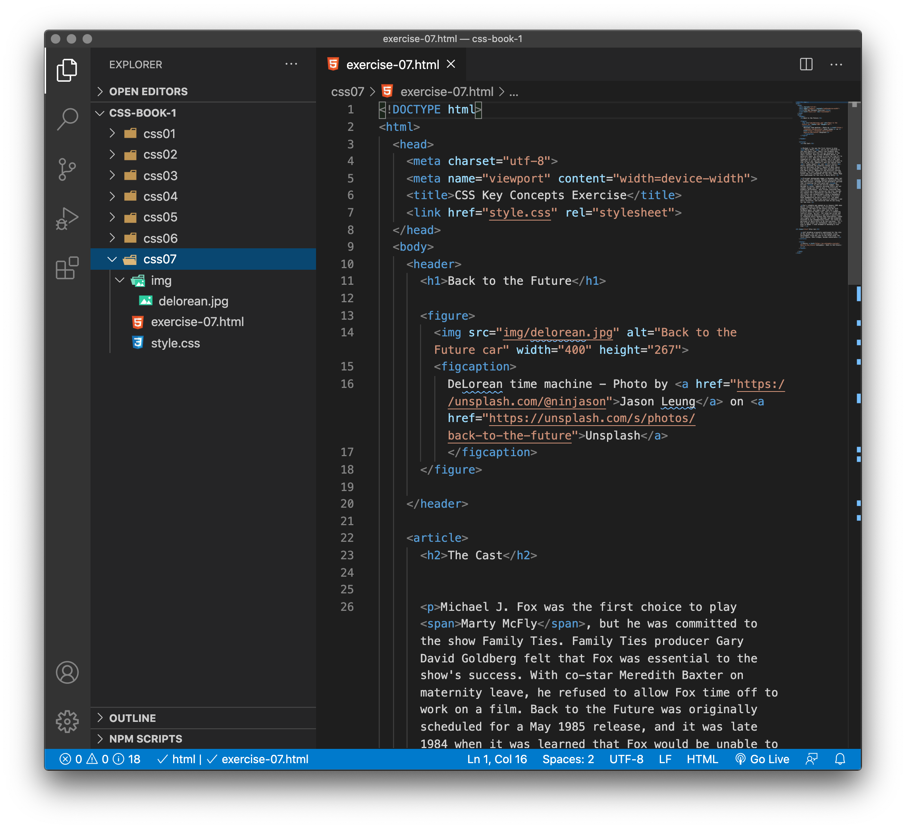
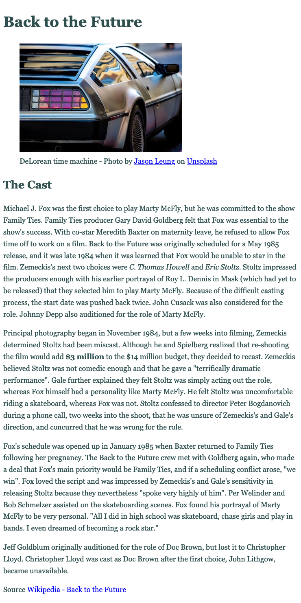
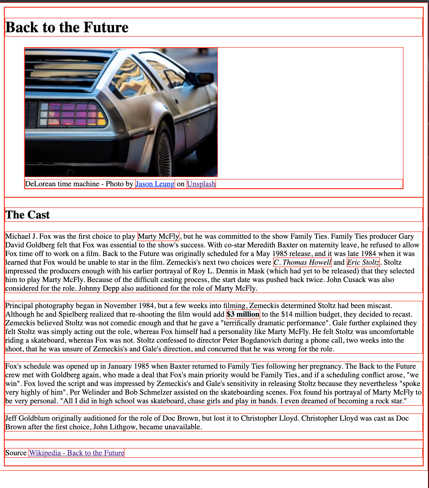
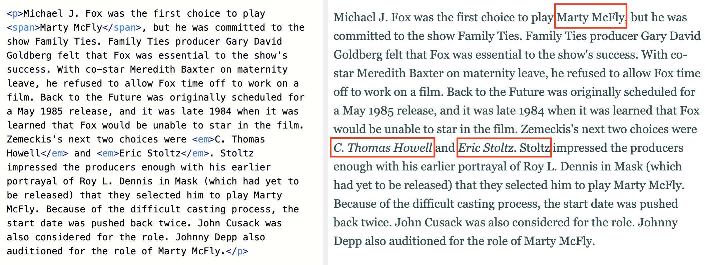
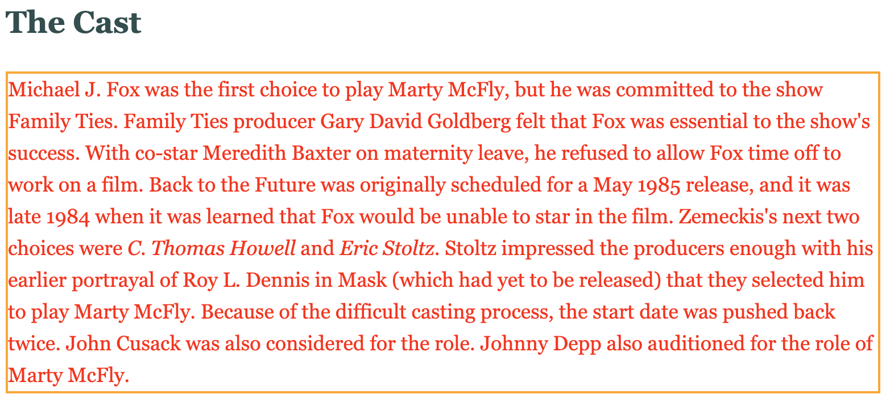
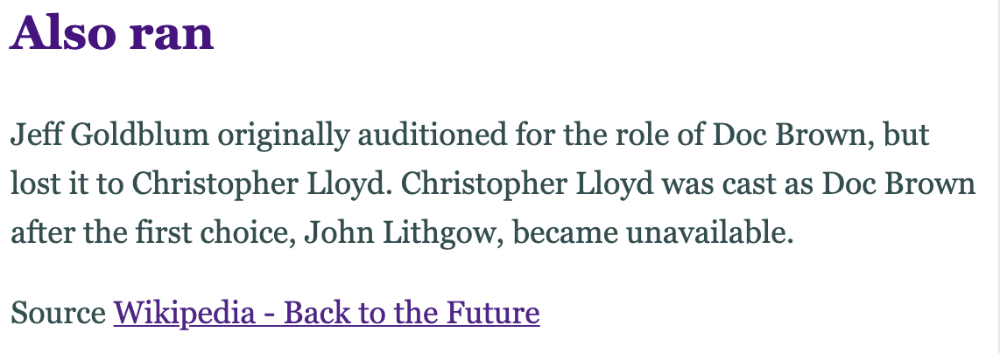
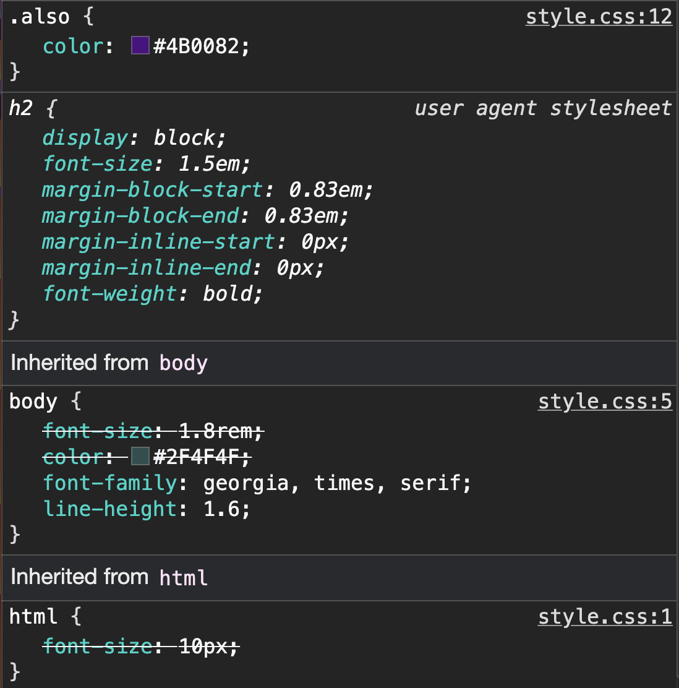
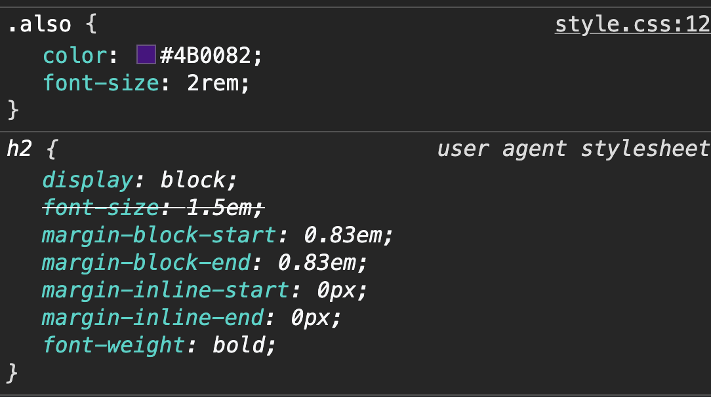

# The Big Concepts

In her book [Learning Web Design](https://www.learningwebdesign.com/), Jennifer Niederst Robbins refers to these as the big concepts in relation to how CSS behaves. These include:

- Inheritance
- Document structure
- The cascade
- Specificity
- Rule order
- The box model

## Box model

*The box model will be dealt with in more detail in Book 2, but at this stage you do need to understand essence of the box model*.

The easiest way to understand the box model is to envision that every element (block and inline) on the page is contained by its own rectangle box. That's every heading, paragraph, span, header, footer etc. 

This is why we can apply properties to each of those blocks as we have been doing. We can add backgrounds, borders, margins and padding. We can even position them - more to come.

<!-- div class="exercise" -->
## Exercise 7

> Viewing the box model.

### Task 1

- Open the `css07` folder.

- Open `exercise-07.html` in your editor.

<figure>

<figcaption>
The Visual Studio Code (VSC) editor window.
</figcaption>
</figure>

### Task 2

- Open `exercise-07.html` in the browser to check it works.

<figure>

<figcaption>
The basic Back to the Future page, with some basic styles.
</figcaption>
</figure>


### Task 3

- Open `style.css` in the editor.

- Using the `*` selector add the *test style* to `style.css`.

```
* {
  border: 1px solid red; 
}
```
- Save `style.css` and refresh `exercise-07.html` in the browser.

- As you have already seen, the `*` selector selects everything on the page - it applies our style to everything on the page. This is not a selector you would use very often, if at all.

- The thin red border is applied to all elements including:

- `body`
- `header`
- `h1`
- `img`
- `p`
- `span`
- `em`
- `strong`
- `a`
- `footer` etc.


<figure>

<figcaption>
The red border helps us see <em>every</em> box.
</figcaption>
</figure>

#### Things to note

- Each box stretches across the page if it can.

- Note - for example the headings - the text finishes but the box continues.

- Inline elements also have their own box.

- The box model is beautiful, but can be confusing - more later.

### Task 4

- To see individual boxes try adjusting our *test* style.

- Change `* {border: 1px solid red;}` in your stylesheet to:

```
header {
  border: 1px solid red;
}
```

- Save `style.css` and refresh `exercise-07.html` in the browser to see the box that the `<header>` element creates.

- Then change the same style to:

```
article {
  border: 1px solid red;
}
```
- Save `style.css` and refresh `exercise-07.html` in the browser to see the box that the `<article>` element creates.

- Repeat this with a few more elements that you can see in `exercise-07.html` to get a clearer idea of the boxes created by each element.

### Task 5

- Remove *red border test style* from your stylesheet.

- Save `style.css` and refresh `exercise-07.html` in the browser.

- Check that the red borders have gone.

<!-- end div -->

> Using `* {border: 1px solid red;}` in your CSS is a really handy way to identify what is happening on the page when you are struggling with the *box model* - which you will!

## Inheritance

Inheritance is the method where CCS properties are passed down (or not) from a HTML element, to the elements they contain.

> You have already seen inheritance in action.

<!-- div class="exercise" -->
## To Do - Inheritance

> Inheritance in action. We are just going to look at the code we already have in place.

### Task 1

- Return to `style.css` in the editor and look at the styles we have provided:

```
html {
  font-size: 10px;
}

body {
    font-size:1.8rem;
    color: #2F4F4F;
    font-family:georgia, times, serif; 
    line-height: 1.6;
}
```
- View `exercise-07.html` in the browser.

Things to note:

- The page inherits all the **User Agent** (browser) default styles - unless we over-ride them with our own styles.

- For example the `<h1>` and `<h2>` headings are larger font sizes even though we haven't specified any such style.

- As we've specified `font-size`, `color`, `font-family` and `line-height` - this is the **cascade** in action - more shortly.

### Task 2

- View `exercise-07.html` in the editor.

- Look at the first paragraph.

<figure>

<figcaption>
Note that the styles inherited from our `body` styling are inherited by both the paragraph and the span and em elements inside - the <code>font-size</code>, <code>color</code>, <code>font-family</code> and <code>line-height</code>.
</figcaption>
</figure>

- The inheritance works here because we wouldn't want the flow of these styles to stop just because parts of the paragraph are inside other (inline) elements.

<!-- end div -->

> Applying styles to the `body` element makes the most of inheritance, as many of the pages elements inherit these basic styles. We can then target individual elements, that `span` for example or the `h1` to apply more specific styles.

A simple example of when a style is not inherited by everything would be the `border` property. 

If for example we put a border around our first paragraph using this - *you don't need to do this*:

```
h2 + p{
  color:red;
  border: 2px solid orange;
}
```
You will note the following:

- That **all** the text inherits the colour, including the text in the `span` and `em` elements.

- **BUT** - the `span` and `em` elements don't inherit the border.

<figure>

<figcaption>
You can see that it is for good reason that not all elements inherit all styles. If the <code>border</code> <strong>was</strong> inherited by the <code>span</code> and <code>em</code>, then things would get very messy.
</figcaption>
</figure>


## Cascade - Conflicting rules

CSS stands for **Cascading Style Sheets**, and that first word *cascading* is incredibly important to understand — the way that the cascade behaves is key to understanding CSS.

At some point, you will be working on a project and you will find that the CSS you thought should be applied to an element is not working. Usually the problem is that you have created two rules which could potentially apply to the same element. The **cascade**, and the closely-related concept of **specificity**, are mechanisms that control which rule applies when there is such a conflict. Which rule is styling your element may not be the one you expect, so you need to understand how these mechanisms work.

Also significant here is the concept of **inheritance**, which as we know means some CSS properties by default inherit values set on the current element's parent element, and some don't. This can also cause some behavior that you might not expect.

As you already know, CSS allows us to apply styles from a number of sources - the *User Agent* styles and the *author styles* (you - the developer) which may be external, internal and/or inline. The cascade relates to how the browser works this out and any conflicts.

**For example** - the default (user agent) style for a `color` cascades down until it is overridden in the cascade by a `color` you may have defined in your stylesheet.

The stylesheet hierarchy determines which style wins.

- Any User agent (browser) styles are applied first
- External styles are next
- Embedded styles follow
- Inline styles have the final say and override all others

> There is one final style rule that trumps everything - `!important`. Any rule with important indicator takes precedence, ignoring the cascade. An example could be `p {color: blue !important;}` - Use of `!important` should be avoided for obvious reasons - it's usually a *sledge hammer used to crack a nut*.


## Specificity


<blockquote cite="https://www.learningwebdesign.com/">

<p>Once the applicable style sheet has been chosen, there may still be conflicts: therefore, the cascade continues at the rule level. When two rules in a single style sheet conflict, the type of selector is used to determine the winner. The more specific the selector, the more weight it is given to override conflicting declarations.</p> 

<p>Jen Niederst Robbins.</p>
</blockquote>

Specificity is how the browser decides which rule applies if multiple rules have different selectors, but could still apply to the same element. It is basically a measure of how specific a selector's selection will be:

- **An element selector is less specific** — it will select all elements of that type that appear on a page — so will get a lower score.

- **A class selector is more specific** — it will select only the elements on a page that have a specific class attribute value — so will get a higher score.

- **An ID selector is even more specific** — it will select only the one element on a page that has a specific ID attribute value — so will be very specific and get a higher score. This is why developers avoid IDs for CSS if possible.

<!-- div class="exercise" -->
## Exercise 7 continued

> Cascade and specificity in action.

### Task 1

- Return to `exercise-07.html` in your editor.

- Add a second `<h2>` above the paragraph that starts with *Jeff Goldblum originally auditioned*...

- Give it a class of `also`.

```
<h2 class="also">Also ran</h2>
```

- Save `exercise-07.html`

### Task 2

- Return to `style.css` in your editor.

- Apply a simple style to that class by adding to your stylesheet the following:

```
.also {
    color: #4B0082;
}
```

- Save `style.css` and refresh `exercise-07.html` in the browser. 

<figure>

<figcaption>
You now have a nifty, indigo coloured sub-heading.
</figcaption>
</figure>

### Task 3

Let's work out what is at play here:

#### Cascade:

- The User Agent defaults styles are applied.
- The styles from `style.css` are applied.

#### Specificity:

- The default `font-size` style for the `h2` is more specific than the font size we set for the `body` in our stylesheet.

- The colour set in our class `also` is also more specific than the colour we set for the `body` in our stylesheet.

<figure>

<figcaption>
Dev Tools in the browser lets us see what CSS is being used and what CSS is being superseded either in the cascade or by specificity.
</figcaption>
</figure>

### Task 4

- Return to `style.css` in your editor.

- Add a `font-size` to the class we created.

```
.also {
    color: #4B0082;
    font-size: 2rem;
}
```
- Save `style.css` and refresh `exercise-07.html` in the browser. 

- If you can, right click to **Inspect** with the Dev Tools.


<figure>

<figcaption>
Following that extra style, you should see that our new <code>font-size</code> (because it's more specific), over-writes the original User Agent (browser) default <code>h2</code> style.
</figcaption>
</figure>

<!-- end div -->

<p class="submit-work">Exercise 7 completed</p>

## Cascade, specificity and inheritance

>This can seem like a set of tricky concepts to understand. As you get more practice writing CSS, however, the way it works will become more obvious to you.

One last thing you should know is Rule Order:

This deals with styles of equal weight. What if a stylesheet has one `h1` styled as `red`, and another as `blue` (yes it happens - stylesheets can get big and hard to manage).

Simply, the last rule will win. Therefore the `h1` rule further down the stylesheet will win. It's the same for styles in the same rule, for example:

```
h1 {
    color: red;
    color: blue;
    color: green;
}
```
Green wins because the last CSS declaration overrides the other two. Whilst this is obvious and easy to spot in this example, you will have plenty of time when your CSS is being styled in a different way to what you expected. The trick is working out why!

<h2 class="deep">Deeper Learning</h2>

To get a better understanding of this topic use the following resources.

- LinkedIn Learning Video: [Inheritance and specificity](https://www.linkedin.com/learning/css-essential-training-3/inheritance-and-specificity?u=36102708) (4m 33s)

- LinkedIn Learning Video: [The cascade and importance](https://www.linkedin.com/learning/css-essential-training-3/the-cascade-and-importance?resume=false&u=36102708) (1m 43s)

- LinkedIn Learning Video: [Introduction to the box model](https://www.linkedin.com/learning/css-essential-training-3/introduction-to-the-box-model?u=36102708) (1m 7s)

- Mozilla Developer Video: [Inspecting the CSS Cascade using Firefox DevTools](https://youtu.be/Sp9ZfSvpf7A) (8m 02s)

- Article - CSS Tricks: [The “C” in CSS: The Cascade](https://css-tricks.com/the-c-in-css-the-cascade/) 

- Article - CSS Tricks: [Specifics on CSS Specificity](https://css-tricks.com/specifics-on-css-specificity/) 


<h2 class="deep">Advanced Learning</h2>

For students wanting more, we recommend the following topics and resources. 

- Andy Clarke's popular article - [CSS Specificity Wars](https://stuffandnonsense.co.uk/archives/css_specificity_wars.html).


### &copy; Credit given

Materials used under the Creative Commons licence from [MDN Web Docs](https://developer.mozilla.org/en-US/docs/Web/HTML).


