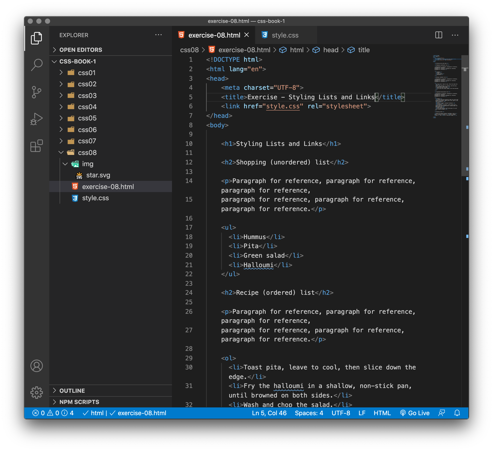
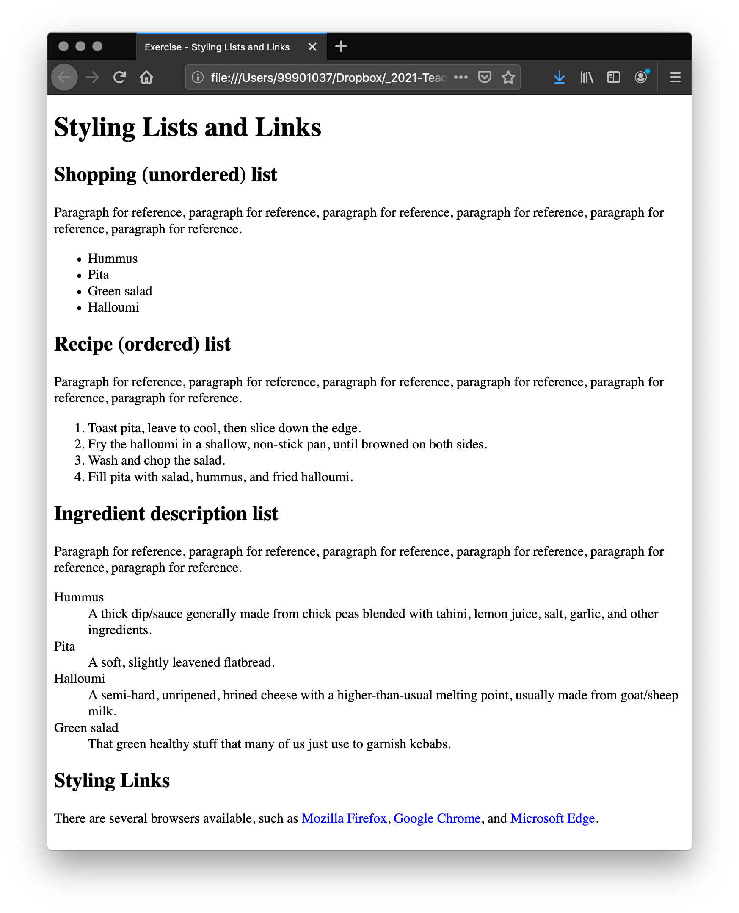
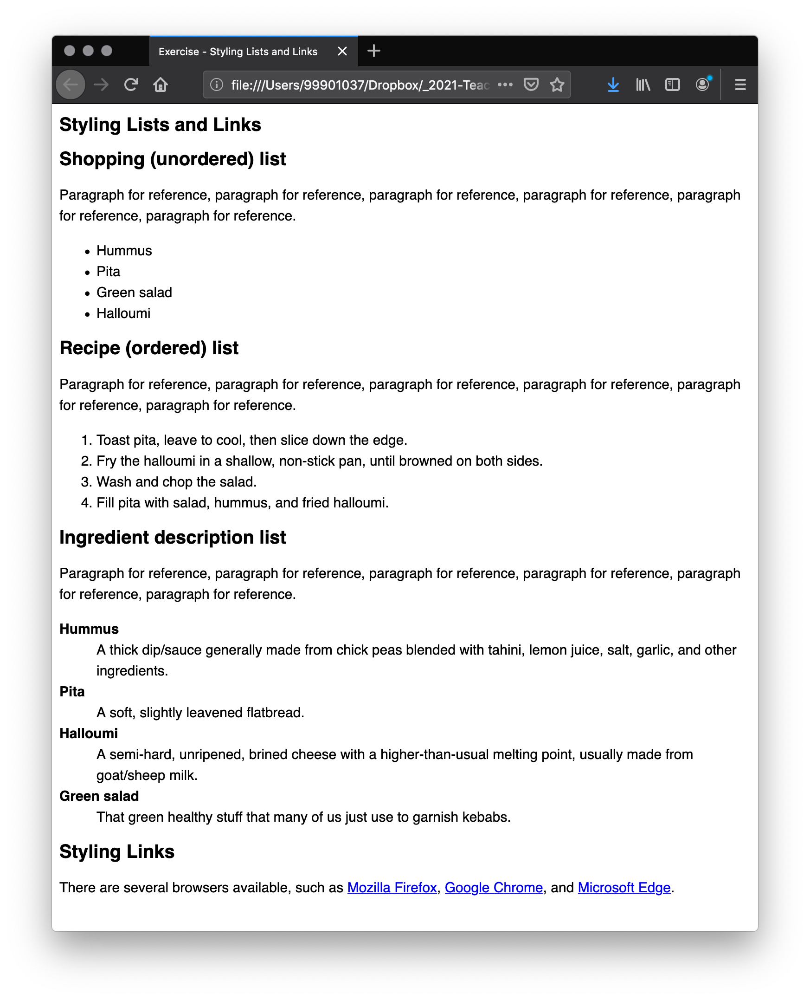
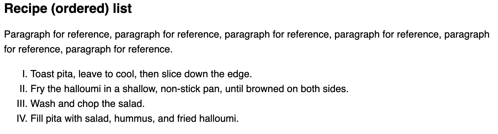
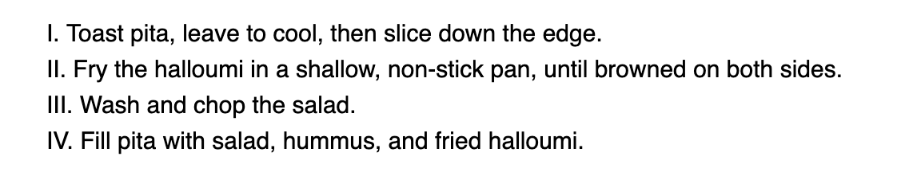
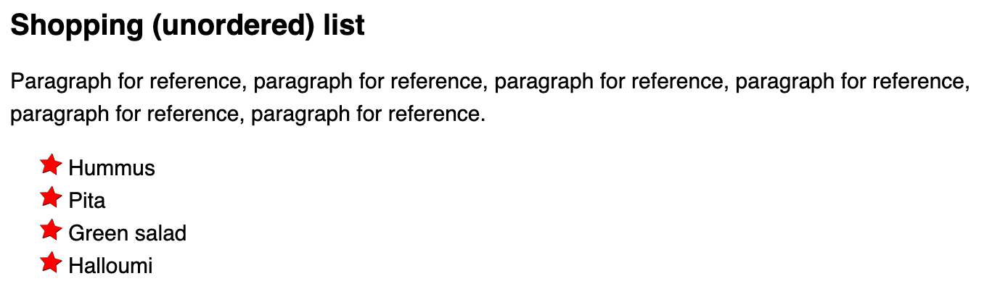
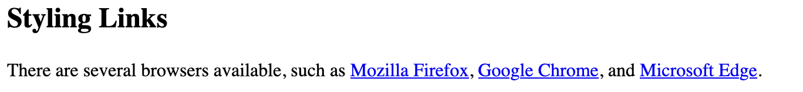
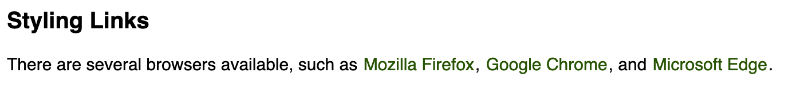

# Styling Lists and Links

## Styling lists

Lists behave like any other text for the most part, but there are some CSS properties specific to lists that you need to know about, and some best practices to consider.

To begin with, let's look at a simple list example. Throughout this chapter, we'll look at unordered, ordered, and description lists — all have styling features that are similar, and some that are particular to their type of list. 

<!-- div class="exercise" -->
## Exercise 8

> A simple list example

### Task 1

- Open the `css08` folder.

- Open `exercise-08.html` in your editor.

<figure>

<figcaption>
The Visual Studio Code (VSC) editor window.
</figcaption>
</figure>

### Task 2

- Open `exercise-08.html` in the browser to check it works.

<figure>

<figcaption>
The page with the browser default styles.
</figcaption>
</figure>

- Each list has default User Agent (Browser) styles applied including margins and padding to create space and indents.

- If you can, investigate the list elements User Agent (browser) default styles using browser developer tools.


### Task 3

- Open `style.css` in the editor.

- Copy and paste these styles and comments into the empty `style.css`: 

```
/* General styles */

html {
  font-family: Helvetica, Arial, sans-serif;
  font-size: 10px;
}

h2 {
  font-size: 2rem;
}

ul,ol,dl,p {
  font-size: 1.5rem;
}

li, p {
  line-height: 1.5;
}

/* Description list styles */


dd, dt {
  line-height: 1.5;
}

dt {
  font-weight: bold;
}
```

- Save `style.css` and refresh `exercise-08.html` in the browser.

<figure>

<figcaption>
The page now looks a little sharper with styles applied.
</figcaption>
</figure>

### Task 4

#### Let's review each of the styles applied:

- The first rule sets a sitewide font and a baseline font size of 10px. These are inherited by everything on the page.

- Rules 2 and 3 set relative font sizes for the headings, different list types (the children of the list elements inherit these), and paragraphs. This means that each paragraph and list will have the same font size and top and bottom spacing, helping to keep the vertical rhythm consistent.

- Rule 4 sets the same line-height on the paragraphs and list items — so the paragraphs and each individual list item will have the same spacing between lines. This will also help to keep the vertical rhythm consistent.

- Rules 5 and 6 apply to the description list — we set the same line-height on the description list terms and descriptions as we did with the paragraphs and list items. Again, consistency is good! We also make the description terms have bold font, so they visually stand out easier.

<!-- end div -->

## List-specific styles

Now we've looked at general spacing techniques for lists, let's explore some list-specific properties. There are three properties you should know about to start with, which can be set on `<ul>` or `<ol>` elements:

- [list-style-type](https://developer.mozilla.org/en-US/docs/Web/CSS/list-style-type): Sets the type of bullets to use for the list, for example, square or circle bullets for an unordered list, or numbers, letters or roman numerals for an ordered list.

- [list-style-position](https://developer.mozilla.org/en-US/docs/Web/CSS/list-style-position): Sets whether the bullets appear inside the list items, or outside them before the start of each item.

- [list-style-image](https://developer.mozilla.org/en-US/docs/Web/CSS/list-style-image): Allows you to use a custom image for the bullet, rather than a simple square or circle.

<!-- div class="exercise" -->
## Exercise 8 continued

### Task 1 - Bullet styles

- As mentioned above, the list-style-type property allows you to set what type of bullet to use for the bullet points. 

- Return to `style.css` in the editor.

- Set the ordered list to use uppercase roman numerals by adding the following style and comment at the bottom of `style.css`:

```
/* Additional styles */

ol {
list-style-type: upper-roman;
}
```
- Save `style.css` and refresh `exercise-08.html` in the browser.

<figure>

<figcaption>
If successful, your list style has changed to uppercase roman numerals.
</figcaption>
</figure>


### Task 2 - Bullet position

- The list-style-position property sets whether the bullets appear inside the list items, or outside them before the start of each item. The default value is outside, which causes the bullets to sit outside the list items.

- Return to `style.css` in the editor.

- If you set the value to inside, the bullets will sit inside the lines.

- Add the rule `list-style-position: inside;` to the `ol` ruleset that we just added to `style.css`:

```
ol {
  list-style-type: upper-roman;
  list-style-position: inside;
}
```
- Save `style.css` and refresh `exercise-08.html` in the browser.

<figure>

<figcaption>
If successful, your list style has changed and the bullets now appear inside the list items.
</figcaption>
</figure>

### Task 3 - Using a custom bullet image

- The list-style-image property allows you to use a custom image for your bullet. 

  + This allows more creativity in your designs. 

  + You should however avoid using standard images such as `.gif` and `.jpg` files as they will just add to the weight of the page download. 

  + Our example uses an SVG image - an SVG is created with code, therefore add minimal weight to the page.

- The syntax is pretty simple:

```
ul {
  list-style-image: url(star.svg);
}
```

- However, this property is a bit limited in terms of controlling the position, size, etc. of the bullets. You are better off using the background family of properties.

- Return to `style.css` in the editor.

- If you set the value to inside, the bullets will sit inside the lines.

- Add the following two rulesets to the bottom of `style.css`:

```
 ul {
    padding-left: 2rem;
    list-style-type: none;
  }
  
  ul li {
    padding-left: 2rem;
    background-image: url(img/star.svg);
    background-position: 0 0;
    background-size: 1.6rem 1.6rem;
    background-repeat: no-repeat;
  }
```
- Save `style.css` and refresh `exercise-08.html` in the browser.

- Here we've done the following:

- Set the padding-left of the `<ul>` down from the default 40px to 20px, then set the same amount on the list items. This is so that overall the list items are still lined up with the order list items and the description list descriptions, but the list items have some padding for the background images to sit inside. If we didn't do this, the background images would overlap with the list item text, which would look messy.

- Set the `list-style-type` to none, so that no bullet appears by default. We're going to use background properties to handle the bullets instead.

- Inserted a bullet onto each unordered list item. The relevant properties are as follows:

  + [background-image](https://developer.mozilla.org/en-US/docs/Web/CSS/background-image): This references the path to the image file you want to use as the bullet.

  + [background-position](https://developer.mozilla.org/en-US/docs/Web/CSS/background-position): This defines where in the background of the selected element the image will appear — in this case we are saying 0 0, which means the bullet will appear in the very top left of each list item.

  + [background-size](https://developer.mozilla.org/en-US/docs/Web/CSS/background-size): This sets the size of the background image. We ideally want the bullets to be the same size as the list items (or very slightly smaller or larger). We are using a size of 1.6rem (16px), which fits very nicely with the 20px padding we've allowed for the bullet to sit inside — 16px plus 4px of space between the bullet and the list item text works well.

  + [background-repeat](https://developer.mozilla.org/en-US/docs/Web/CSS/background-repeat): By default, background images repeat until they fill up the available background space. We only want one copy of the image inserted in each case, so we set this to a value of no-repeat.

<figure>

<figcaption>
If successful, your un-ordered list style now has a red star (<code>star.svg</code>) as the bullet.
</figcaption>
</figure>

> More on backgrounds to follow.

<!-- end div -->

## Link states

We have already applied styles to links based on their state. Let's look at this in a little more detail.

The first thing to understand is the concept of link states — different states that links can exist in, which can be styled using different **pseudo-classes**:

- **Link (unvisited)**: The default state that a link resides in, when it isn't in any other state. This can be specifically styled using the :link pseudo class.

- **Visited:** A link when it has already been visited (exists in the browser's history), styled using the :visited pseudo class.

- **Hover**: A link when it is being hovered over by a user's mouse pointer, styled using the :hover pseudo class.

- **Focus**: A link when it has been focused (for example moved to by a keyboard user using the Tab key or similar, or programmatically focused using HTMLElement.focus()) — this is styled using the :focus pseudo class.

- **Active**: A link when it is being activated (e.g. clicked on), styled using the :active pseudo class.

### Default styles

- We've all seen the default styles for a link:

<figure>

<figcaption>
Three links with the browser default styles.
</figcaption>
</figure>

- View these links at the bottom of `exercise-08.html` in the browser.

- You'll notice a few things as you explore the default styles:

  + Links are underlined.
  + Unvisited links are blue.
  + Visited links are purple.
  + Hovering a link makes the mouse pointer change to a little hand icon.
  + Focused links have an outline around them — you should be able to focus on the links on this page with the keyboard by pressing the tab key (On Mac, you'll need to use option + tab, or enable the Full Keyboard Access: All controls option by pressing Ctrl + F7.)
  + Active links are red (Try holding down the mouse button on the link as you click it.)


Interestingly enough, these default styles are nearly the same as they were back in the early days of browsers in the mid-1990s. This is because users know and have come to expect this behaviour — if links were styled differently, it would confuse a lot of people. This doesn't mean that you shouldn't style links at all, just that you should not stray too far from the expected behaviour. You should at least:

- Use underlining for links, but not for other things. If you don't want to underline links, at least highlight them in some other way.

- Make them react in some way when hovered/focused, and in a slightly different way when activated.

The default styles can be turned off/changed using the following CSS properties:

- [color](https://developer.mozilla.org/en-US/docs/Web/CSS/color) for the text color.

- [cursor](https://developer.mozilla.org/en-US/docs/Web/CSS/cursor) for the mouse pointer style — you shouldn't turn this off unless you've got a very good reason.

- [outline](https://developer.mozilla.org/en-US/docs/Web/CSS/outline) for the text outline (an outline is similar to a border, the only difference being that border takes up space in the box and an outline doesn't; it just sits over the top of the background). The outline is a useful accessibility aid, so think carefully before turning it off; you should at least double up the styles given to the link hover state on the focus state too.

<!-- div class="exercise" -->
## Exercise 8 continued

- Applying some basic styles to the various link states.

### Task 1

- Return to `style.css` in the editor.

- Add the following styles to the bottom of `style.css`:

```
a {
  outline: none;
  text-decoration: none;
  padding: 2px 1px 0;
}

a:link {
  color: #265301;
}

a:visited {
  color: #437A16;
}

a:focus {
  border-bottom: 1px solid;
  background: #BAE498;
}

a:hover {
  border-bottom: 1px solid;     
  background: #CDFEAA;
}

a:active {
  background: #265301;
  color: #CDFEAA;
}
```
- Save `style.css` and refresh `exercise-08.html` in the browser. 

- Scroll down to the links section at the bottom of the page.

<figure>

<figcaption>
If successful, your link styles have changed from the defaults.
</figcaption>
</figure>

- So what did we do here? This certainly looks different to the default styling, but it still provides a familiar enough experience for users to know what's going on:

- The first of these rules uses the `a` selector to get rid of the default text underline and focus outline (which varies across browsers anyway), and adds a tiny amount of padding to each link — all of this will become clear later on.

- Next, we use the `a:link` and `a:visited` selectors to set a couple of color variations on unvisited and visited links, so they are distinct.

- The next two rules use `a:focus` and `a:hover` to set focused and hovered links to have different background colors, plus an underline to make the link stand out even more. Two points to note here are:

  + The underline has been created using `border-bottom`, not `text-decoration` — some people prefer this because the former has better styling options than the latter, and is drawn a bit lower, so doesn't cut across the descenders of the word being underlined (e.g. the tails on g and y).

  + The `border-bottom` value has been set as 1px solid, with no color specified. Doing this makes the border adopt the same color as the element's text, which is useful in cases like this where the text is a different colour in each case.

- Finally, `a:active` is used to give the links an inverted color scheme while they are being activated, to make it clear something important is happening!


<!-- end div -->

<p class="submit-work">Exercise 8 completed</p>

<h3 class="warning">Link style order</h3>

The order of our CSS for the various link states is important because the link styles build on one another, for example the styles in the first rule will apply to all the subsequent ones, and when a link is being activated, it is also being hovered over.

Therefore we use this order:

```
a {

}


a:link {

}

a:visited {

}

a:focus {

}

a:hover {

}

a:active {

}
```

If you put these in the wrong order, things won't work properly. To remember the order, you could try using a mnemonic like **L**o**V**e **F**ears **HA**te.

> Note: you do not need to use all 7 states every time. Pick and choose what you need, but retain the order.


<h2 class="deep">Deeper Learning</h2>

To get a better understanding of this topic use the following resources.

- Article - CSS Tricks: [List-style](https://css-tricks.com/almanac/properties/l/list-style/) 

- Video - CSS Tricks: [Inside & Aligned Lists](https://css-tricks.com/video-screencasts/184-inside-aligned-lists/) 

- LinkedIn Learning Video: [Pseudo class selectors](https://www.linkedin.com/learning/css-essential-training-3/pseudo-class-selectors-and-links?u=36102708)

- Video - Style Lists with New CSS — Bullets, Numbers, Markers

When you create lists in HTML, browsers add bullet-points (for unordered lists) and numbers (for ordered lists). Now CSS gives us the tools to style those list "markers", and even create our own!

<iframe width="560" height="315" src="https://www.youtube.com/embed/2awepiNoaZI" frameborder="0" allow="accelerometer; autoplay; clipboard-write; encrypted-media; gyroscope; picture-in-picture" allowfullscreen></iframe>


- Video - New CSS for Styling Underlines on the Web.

Finally in 2019, we have new CSS that allows us a lot of powerful ways to style underlines. Jen Simmons walks you through the options. 

These three new properties on MDN:

  + [text-underline-offset](https://developer.mozilla.org/en-US/docs/Web/CSS/text-underline-offset)

  + [text-decoration-thickness](https://developer.mozilla.org/en-US/docs/Web/CSS/text-decoration-thickness)

  + [text-decoration-skip-ink](https://developer.mozilla.org/en-US/docs/Web/CSS/text-decoration-skip-ink)

  <iframe width="560" height="315" src="https://www.youtube.com/embed/sZS-7RX_c7g" frameborder="0" allow="accelerometer; autoplay; clipboard-write; encrypted-media; gyroscope; picture-in-picture" allowfullscreen></iframe>

### &copy; Credit given

Materials used under the Creative Commons licence from [MDN Web Docs](https://developer.mozilla.org/en-US/docs/Web/HTML).


