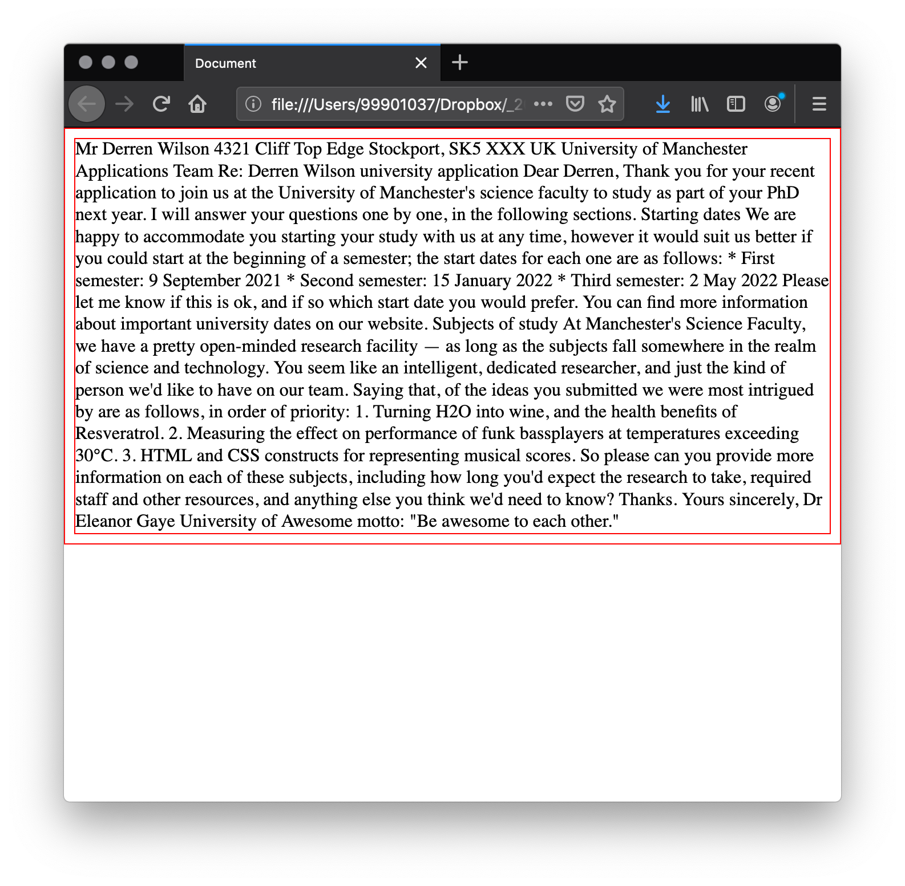
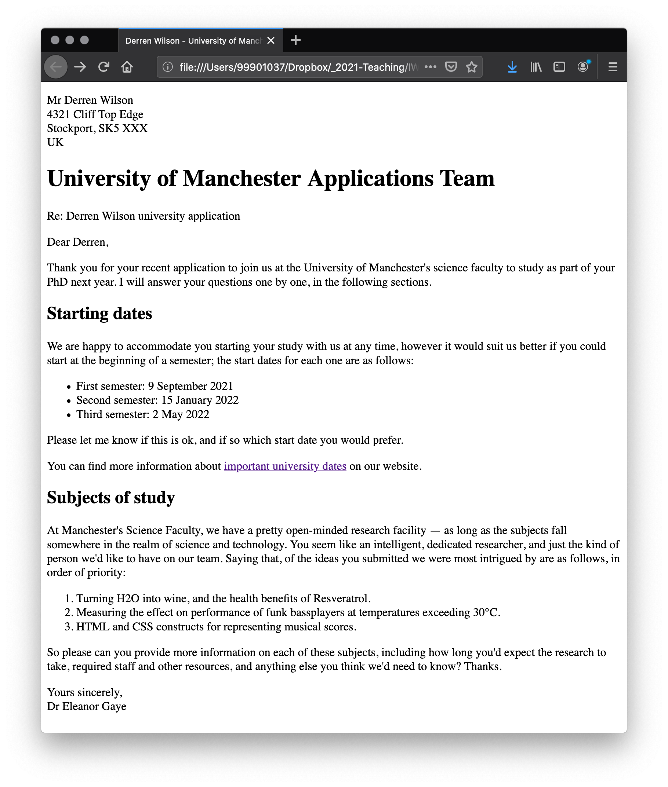
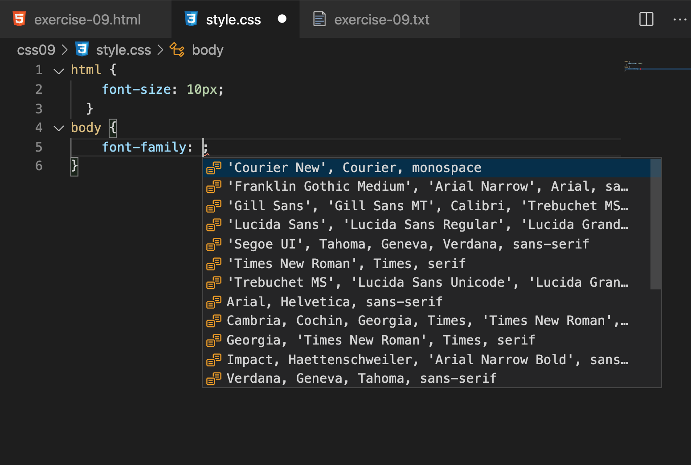
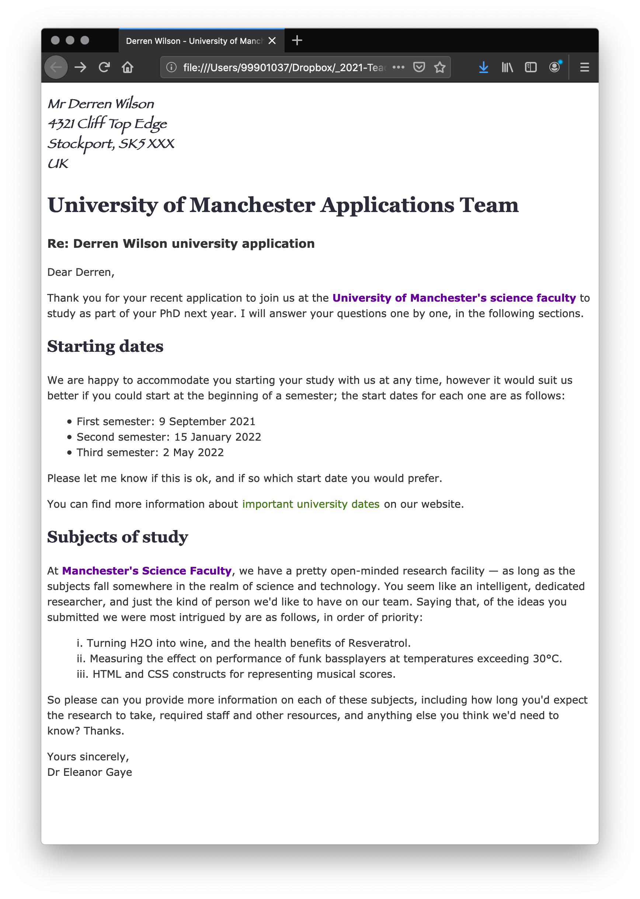

# The Letter

To wrap up CSS Book One we have a small exercise that asks you to style up a letter, based on the CSS you have learnt up to this point.


## HTML First

We are creating new files for our HTML and CSS, linking them, adding text to the HTML file and coding it up, ready to then apply some CSS.

<!-- div class="exercise" -->
## Exercise 9

> Styling up a simple letter.

### Task 1

- Open the `css09` folder.

- This folder is empty except for a text file.

- Open `exercise-09.txt` in your editor.

- Read through the text (it's not real).

- Create a new HTML file in the root of the `css09` folder, save it as `exercise-09.html`.

- Open `exercise-09.html` in your editor.

- Implement a basic HTML document using the Emmet command:

**Shift + Tab + !**

- This should give you a template like this:

```
<!DOCTYPE html>
<html lang="en">
<head>
    <meta charset="UTF-8">
    <meta name="viewport" content="width=device-width, initial-scale=1.0">
    <title>Document</title>
</head>
<body>
    
</body>
</html>
```
- If it doesn't, just copy the above code into your editor.

- Save `exercise-09.html`.

- Copy & Paste the text in `exercise-09.txt` into the body of `exercise-09.html`.

- Open `exercise-09.html` in the browser to check it works. yes it will look a mess as we've not applied any HTML or CSS.

### Task 2

- Create a stylesheet file, `style.css` on the root of the site and link to it from `exercise-09.html`.

- Add the test CSS to `style.css`.

```
* {
    border: 1px solid red;
}
```
- Save `style.css` and refresh `exercise-09.html` to view in the browser.

<figure>

<figcaption>
The page with the browser default styles and a red border applied - External CSS working.
</figcaption>
</figure>

- Remove the style once you have confirmed it worked.

- Save `style.css`. 

### Task 3

> Code up the HTML as follows:

- Change the page title to **Derren Wilson - University of Manchester Application**

- Wrap the Name and address in a paragraph, using the line break `<br>` for  each line.

- Save `exercise-09.html` and refresh in the browser.

- Wrap a Level 1 heading around **University of Manchester Applications Team**.

- Wrap a paragraph around **Re: Derren Wilson university application**.

- Wrap paragraphs around **Dear Derren** and the following paragraph of text.

- Make **Starting dates** a Level 2 heading. Do the same with **Subjects of study**.

- After **Starting dates** tag up the next paragraph.

- Save `exercise-09.html` and refresh in the browser.

- Next is the **Semester** un-ordered list. Remove the existing stars and tag this up as an unordered list, with three list items.

- Save `exercise-09.html` and refresh in the browser. Check the list.

- Tag up the next two short paragraphs.

- Make the text *important university dates* a clickable link to `https://www.manchester.ac.uk/discover/key-dates/`.

- Save `exercise-09.html` and refresh in the browser. Check the link.

- Tag up the next large paragraph.

- Now create an ordered list of the three ideas. Remove the existing numbers.

- Save `exercise-09.html` and refresh in the browser. Check the ordered list.

- Tag up the last paragraph and the **Yours sincerely, Dr Eleanor Gaye**. Use a `br` after **Yours sincerely**.

- Save `exercise-09.html` and refresh in the browser. 

<figure>

<figcaption>
Your page should look like this once the HTML is applied as instructed above.
</figcaption>
</figure>

<!-- end div -->

## CSS Next

We have a solid page, coded up with some basic HTML. We will now apply some of the styles learnt in this book. You can look back at the previous exercises for reference.

<h3 class="warning">Extra styles</h3>

For **Exercise 9** only apply the styles we ask you to apply. There will be space to get creative later.

Colours - we are keeping the page background so use strong colours for the text, headings and links to ensure a good contrast. More of this later.

<!-- div class="exercise" -->
## Exercise 9 continued

### Task 1

- Return to `style.css` in the editor.

- To make the maths easier add this as your first style to set the base font size.

```
html {
    font-size: 10px;
  }
```
- Save `style.css` and refresh `exercise-09.html` to view in the browser.

> Note - Most these instructions will *be in English* rather than giving you the code. That would be too easy!

- Return to `style.css` in the editor and apply the following styles.

- Create a `body` style, applying a *font family* and a *font colour* (`color`) and a *line height* of `1.5`. Also add a *font size* of `1.4rem`.

<figure>

<figcaption>
VSC will help you by prompting you with <code>font-family</code> options to select.
</figcaption>
</figure>

- Save `style.css` and refresh `exercise-09.html` to view in the browser.

### Task 2

- Return to `style.css` in the editor.

- Apply a complimentary font family (different to the one chosen for the body) to both `h1` and `h2` elements. 

- Apply a `font-size` to each of the headings using `rems`.

- This is a good example where rather than repeating values, you apply the shared styles, then the individual styles. For example:

```
h1, h2 {
    font-family: Georgia, 'Times New Roman', Times, serif;
    color: #2A2C3A;
}

h1 {
    font-size: 2.8rem;
}

h2 {
    font-size: 2.2rem;
}
```

- Save `style.css` and refresh `exercise-09.html` to view in the browser.

- Next we are going to style the link states. In true web developer style, we will copy and paste the link styles we had for Exercise 8.

- Go to your completed `style.ss` in the ccs08 folder and copy the style for the `a` element and the five link states -  `a:link`,  `a:visited`,  `a:focus`, `a:hover` and `a:active`. 

- I would suggest darkening the initial link colour:

```
  a:link {
    color: #214601;
  }
```
- Feel free to change any of the colours but ensure the contrast against the white background remains good.

- Save `style.css` and refresh `exercise-09.html` to view in the browser.

- How is it looking?

<figure>

<figcaption>
Your page should be looking something like this so far.
</figcaption>
</figure>

### Task 3

- Return to `style.css` in the editor.

- Create a style to apply the `list-style-position: inside;` rule to your Ordered List.

- Also change the `list-style-type` to `lower-roman` or `upper-roman`. There are plenty of other styles (see [MDN reference on list-style-type](https://developer.mozilla.org/en-US/docs/Web/CSS/list-style-type)), but remember to keep the list as a numbered.

- Save `style.css` and refresh `exercise-09.html` to view in the browser.

### Task 4

- Return to `style.css` in the editor.

- Use an [adjacent sibling combinator](https://developer.mozilla.org/en-US/docs/Web/CSS/Adjacent_sibling_combinator) (`+`) to target the first paragraph after the main (Level 1) heading.

- Apply a font weight of bold and a font size of `1.6rem`.

- Remember you are *targeting* the element adjacent to the `h1`.

- Save `style.css` and refresh `exercise-09.html` to view in the browser.

### Task 5

- Identify the following paragraph in `exercise-09.html` in the editor.

> Thank you for your recent application to join us at the University of Manchester's science faculty to study as part of your PhD next year. I will answer your questions one by one, in the following sections.

- Wrap a span around the words *University of Manchester's science faculty*.

- Because we may end up with more than one span, give the span a class of `uni`.

- Do this again in the paragraph before the ordered list. Find *Manchester's Science Faculty*, apply the span and the same class.

- Save `exercise-09.html`.

- Return to `style.css` in the editor.

- Create the class `.uni { }` in your stylesheet.

- Apply a font weight of `800`, and the colour of `#660099`.

- Save `style.css` and refresh `exercise-09.html` to view in the browser.

### Task 6

- Return to `exercise-09.html` in the editor.

- Add a class of `address` to the first paragraph that contains the address.

- Save `exercise-09.html`.

- Return to `style.css` in the editor.

- Create the class `.address { }` in your stylesheet.

- Add a font style of `italic`, font family of `fantasy`, font size of `1.8rem`, colour of `#2A2C3A` and a font weight of `900`.

- Save `style.css` and refresh `exercise-09.html` to view in the browser.

<figure>

<figcaption>
The finished page. HTML and CSS applied. Your choice of fonts and colours may vary.
</figcaption>
</figure>

<h3 class="warning">Most common error?</h3>

- Typing `colour` instead of `color` in your coding?


<!-- end div -->

<p class="submit-work">Exercise 9 completed</p>


**Final thing to note** - at the moment our page will expand across the width of our browser, however wide we make the window. This can make it hard to read. We will address the width of our pages in the next Book. *This is the line length and is an important part of the usability of any page we create*.

<blockquote cite="https://practicaltypography.com/line-length.html">
<p>Line length is the distance between the left and right edges of a text block. Overly long lines are a common problem, but they’re easy to correct. Shorter lines will make a big difference in the legibility and professionalism of your layout.</p>
<p>From <a href="https://practicaltypography.com/line-length.html">practicaltypography.com</a></p>
</blockquote>


### &copy; Credit given

Materials used under the Creative Commons licence from [MDN Web Docs](https://developer.mozilla.org/en-US/docs/Web/HTML).
