# The box model

> Exercise Files - [CSS Book Two](media/css-book-2.zip).

As you know, everything in CSS has a box around it, and understanding these boxes is key to being able to create layouts with CSS, or to align items with other items. In this chapter, we will take a proper look at the CSS Box Model so that you can build more complex layout tasks with an understanding of how it works and the terminology that relates to it.

## Block and inline boxes

In CSS we broadly have two types of boxes — **block boxes** and **inline boxes**. These characteristics refer to how the box behaves in terms of page flow, and in relation to other boxes on the page:

If a box is defined as a block, it will behave in the following ways:

- The box will break onto a new line.

- The box will extend in the inline direction to fill the space available in its container. In most cases this means that the box will become as wide as its container, filling up 100% of the space available.

- The `width` and `height` properties are respected.

- Padding, margin and border will cause other elements to be pushed away from the box

Unless we decide to change the display type to inline, elements such as headings (e.g. `<h1>`) and `<p>` all use `block` as their outer display type by default.

If a box has an outer display type of `inline`, then:

- The box will not break onto a new line.

- The `width` and `height` properties will not apply.

- Vertical padding, margins, and borders will apply but will not cause other inline boxes to move away from the box.

- Horizontal padding, margins, and borders will apply and will cause other inline boxes to move away from the box.

The `<a>` element, used for links, `<span>`, `<em>` and `<strong>` are all examples of elements that will display inline by default.

The type of box applied to an element is defined by [display](https://developer.mozilla.org/en-US/docs/Web/CSS/display) property values such as `block` and `inline`, and relates to the **outer** value of display.


## Aside: Inner and outer display types

At this point, we'd better also explain **inner** and **outer** display types. As mentioned above, boxes in CSS have an outer display type, which details whether the box is block or inline.

Boxes also have an *inner* display type, however, which dictates how elements inside that box are laid out. By default, the elements inside a box are laid out in [normal flow](https://developer.mozilla.org/en-US/docs/Learn/CSS/CSS_layout/Normal_Flow), which means that they behave just like any other block and inline elements (as explained above).

We can, however, change the inner display type by using `display` values like `flex`. If we set `display: flex`; on an element, the outer display type is `block`, but the inner display type is changed to `flex`. Any direct children of this box will become flex items and will be laid out according to the rules set out in the Flexbox spec, which you'll learn about later on.

> Note: To read more about the values of display, and how boxes work in block and inline layout, take a look at the MDN guide to [Block and Inline Layout](https://developer.mozilla.org/en-US/docs/Web/CSS/CSS_Flow_Layout/Block_and_Inline_Layout_in_Normal_Flow).

When you move on to learn about CSS Layout in more detail, you will encounter `flex`, and various other inner values that your boxes can have, for example `grid`.

Block and inline layout, however, is the default way that things on the web behave — as we said above, it is sometimes referred to as *normal flow*, because without any other instruction, our boxes lay out as block or inline boxes.


## Examples of different display types

Let's move on and have a look at some examples. Below we have three different HTML elements, all of which have an outer display type of `block`. 

- The first is a paragraph, which has a border added in CSS. The browser renders this as a block box, so the paragraph begins on a new line, and expands to the full width available to it.

- The second is a list, which is laid out using `display: flex`. This establishes flex layout for the items inside the container, however, the list itself is a block box and — like the paragraph — expands to the full container width and breaks onto a new line.

- Below this, we have a block-level paragraph, inside which are two `<span>` elements. These elements would normally be `inline`, however, one of the elements has a class of block, and we have set it to `display: block`.

<figure>
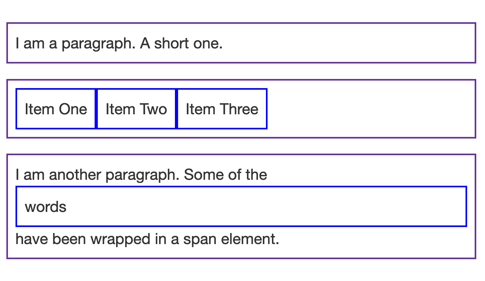
<figcaption>
You can view this file, the HTML and CSS in the file <code>example-a.html</code> in the <code>css10</code> folder.
</figcaption>
</figure>

We can see how inline elements behave in this next example. 

- The `<span>` elements in the first paragraph are inline by default and so do not force line breaks.

- We also have a `<ul>` element which is set to display: inline-flex, creating an inline box around some flex items.

- Finally, we have two paragraphs both set to display: inline. The inline flex container and paragraphs all run together on one line rather than breaking onto new lines as they would do if they were displaying as block-level elements.

<figure>
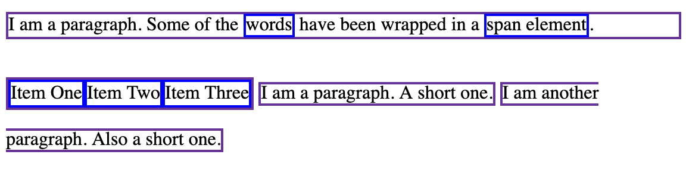
<figcaption>
You can view this file, the HTML and CSS in the file <code>example-b.html</code> in the <code>css10</code> folder. Open it in a browser.
</figcaption>
</figure>


<!-- div class="exercise" -->
## To Do

> In the example, you can change display: inline to display: block or display: inline-flex to display: flex to toggle between these display modes.

### Task 1

- Open the `css10` folder.

- Open `example-b.html` in your editor.

- Open `example-b.html` in the browser to check it works.

- Return to `example-b.html` in your editor.

- Try out these changes: 

    + Change `display: inline` to `display: block`.

    + Save `example-b.html` and refresh it in the browser to see change.

    + Change `display: inline-flex` to `display: flex`.

    + Save `example-b.html` and refresh it in the browser to see change.

- These `example` files are not part of the assessment. 

- You can leave them in the folder.

<!-- end div -->

You will encounter things like flex layout later; the key thing to remember for now is that changing the value of the `display` property can change whether the outer display type of a box is block or inline, which changes the way it displays alongside other elements in the layout. 

In the rest of the lesson, we will concentrate on the outer display type.


## What is the CSS box model?

The full CSS box model applies to block boxes, inline boxes only use some of the behavior defined in the box model. The model defines how the different parts of a box — margin, border, padding, and content — work together to create a box that you can see on the page. To add some additional complexity, there is a standard and an alternate box model.

## Parts of a box

Making up a block box in CSS we have the:

- **Content box**: The area where your content is displayed, which can be sized using properties like [width](https://developer.mozilla.org/en-US/docs/Web/CSS/width) and [height](https://developer.mozilla.org/en-US/docs/Web/CSS/height).

- **Padding box**: The padding sits around the content as white space; its size can be controlled using [padding](https://developer.mozilla.org/en-US/docs/Web/CSS/padding) and related properties.

- **Border box**: The border box wraps the content and any padding. Its size and style can be controlled using [border](https://developer.mozilla.org/en-US/docs/Web/CSS/border) and related properties.

- **Margin box**: The margin is the outermost layer, wrapping the content, padding and border as whitespace between this box and other elements. Its size can be controlled using [margin](https://developer.mozilla.org/en-US/docs/Web/CSS/margin) and related properties.

<figure>

<figcaption>
This diagram shows these layers - Content, Padding, Border and Margin.
</figcaption>
</figure>

## The standard CSS box model

In the standard box model, if you give a box a `width` and a `height` attribute, this defines the width and height of the *content box*. **Any padding and border is then added to that width and height to get the total size taken up by the box**. This is shown in the image below.

If we assume that the box has the following CSS defining `width`, `height`, `margin`, `border`, and `padding`:

```
.box {
  width: 350px;
  height: 150px;
  margin: 10px;
  padding: 25px;
  border: 5px solid black;
}
```

The space taken up by our box using the standard box model will actually be 410px (350 + 25 + 25 + 5 + 5), and the height 210px (150 + 25 + 25 + 5 + 5), as the padding and border are added to the width used for the content box.

<figure>

<figcaption>
This diagram shows our box with a defined width of 350px. When we add the left and right padding and borders, the actual box width is much larger (410px). Same happens with the height. <em>The developer is often left wondering why the box is bigger than expected</em>.
</figcaption>
</figure>

> **Note**: The margin is not counted towards the actual size of the box — sure, it affects the total space that the box will take up on the page, but only the space outside the box. The box's area stops at the border — it does not extend into the margin.

## The alternative CSS box model

You might think it is rather inconvenient to have to add up the border and padding to get the real size of the box, and you would be right! 

For this reason, CSS had an alternative box model introduced some time after the standard box model. **Using this model, any width is the width of the visible box on the page, therefore the content area width is that width minus the width for the padding and border**. The same CSS as used above would give the below result (width = 350px, height = 150px).

<figure>

<figcaption>
This diagram shows our box with a defined width of 350px but using the alternative box model means that this time the left and right borders and padding are included in the 350px. <em>We get exactly what we expected this time</em>.
</figcaption>
</figure>

By default, browsers use the standard box model. If you want to turn on the alternative model for an element you do so by setting `box-sizing: border-box` on it. By doing this you are telling the browser to take the border box as the area defined by any size you set.

```
.box { 
  box-sizing: border-box; 
} 
```

If you want all of your elements to use the alternative box model, and this is a common choice among developers, set the `box-sizing` property on the `<html>` element, then set all other elements to inherit that value, as seen in the snippet below. If you want to understand the thinking behind this, see the [CSS Tricks article on box-sizing](https://css-tricks.com/inheriting-box-sizing-probably-slightly-better-best-practice/).

```
html {
  box-sizing: border-box;
}
*, *::before, *::after {
  box-sizing: inherit;
}
```

> **Note**: An interesting bit of history — Internet Explorer used to default to the alternative box model, with no mechanism available to switch.


### Playing with box models

In the below example, you can see two boxes. Both have a class of `.box`, which gives them the same width, height, margin, border, and padding. The only difference is that the second box has been set to use the alternative box model.

<figure>
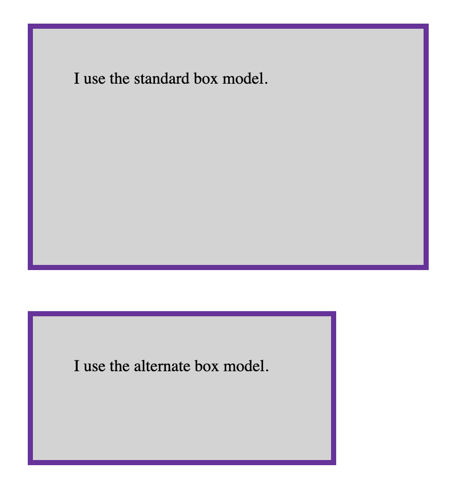
<figcaption>
This screenshot shows two boxes styled with the same dimensions using the <code>.box</code> class, but the second box uses the <code>box-sizing: border-box</code> rule to apply the alternative box model. Therefore the 2nd box includes the border and padding in its height and width.
</figcaption>
</figure>

### The CSS

```
    /* Styles for both boxes */

    .box {
    border: 5px solid rebeccapurple;
    background-color: lightgray;
    padding: 40px;
    margin: 40px;
    width: 300px;
    height: 150px;
    }

    /* Styles for the second box only */

    .alternate {
    box-sizing: border-box;

    }
```

We tend to prefer this alternative method, called `box-sizing` by most, as it makes life simpler. Using `box-sizing` means we get the box at the size we expect it to be and not larger because we forgot to take into account borders and padding.

<!-- div class="exercise" -->
## Exercise 10a

### Task 1

- Open the `css10` folder in VSC.

- Open `exercise-10a.html` in your editor.

- Open `exercise-10a.html` in the browser to check it works.

- Return to `exercise-10a.html` in your editor.

- Can you change the size of the second box (by adding CSS to the `.alternate` class) to make it match the first box in width and height?

- Struggling? Some tips: 

    + You need to add the `height` and `width` properties.

    + Add these to the `.alternate` class.

    + Work out the revised `height` and `width` by adding the padding and borders.

- Save `exercise-10a.html` and refresh it in the browser to see change.

- It should look like this if correct:

<figure>
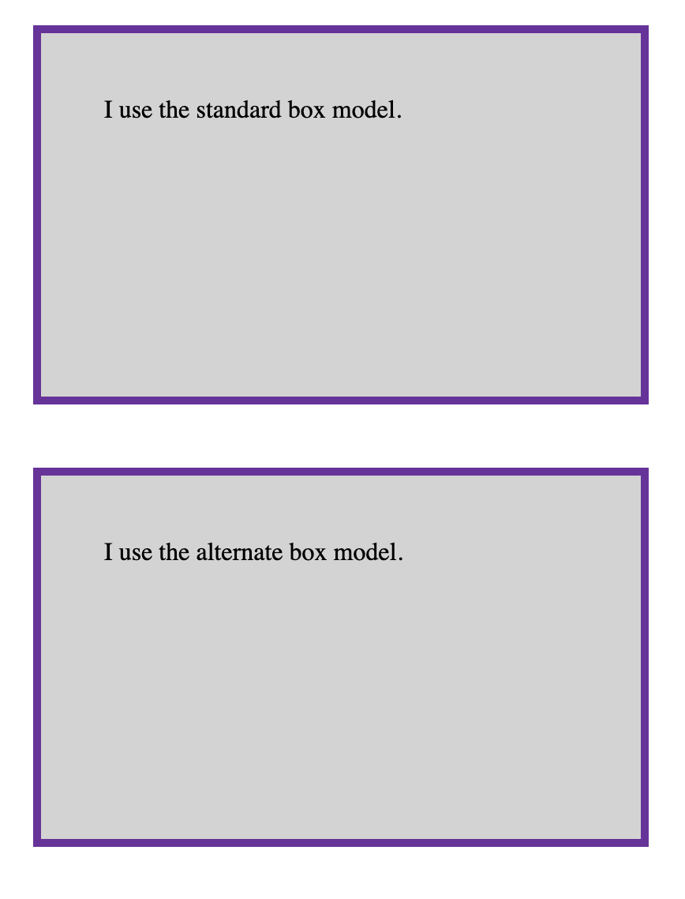
<figcaption>
Our screenshot shows boxes looking the same size. The second box using the <code>box-sizing: border-box</code> rule needs larger height and width values to allow for the inclusion of the border and padding.
</figcaption>
</figure>

<!-- end div -->

<p class="submit-work">Exercise 10a completed</p>

## Use browser DevTools to view the box model

Your [browser developer tools](https://developer.mozilla.org/en-US/docs/Learn/Common_questions/What_are_browser_developer_tools) can make understanding the box model far easier. If you inspect an element in Firefox's DevTools, you can see the size of the element plus its margin, padding, and border. Inspecting an element in this way is a great way to find out if your box is really the size you think it is!


<figure>
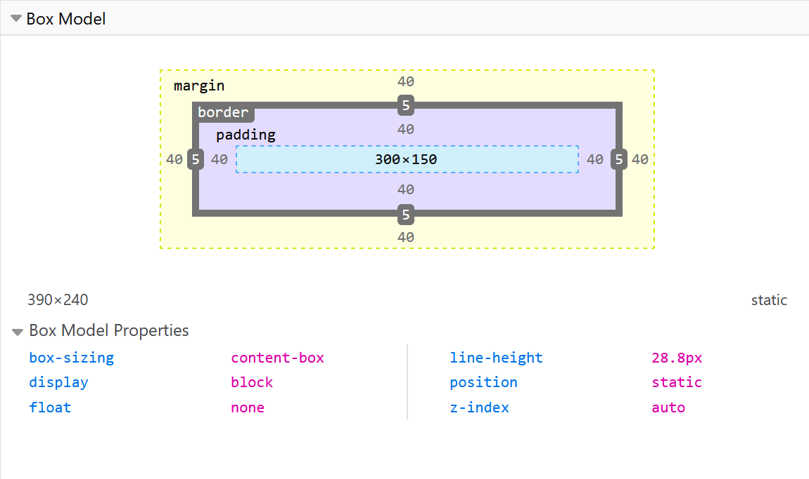
<figcaption>
Screenshot of the Box Model inspector in the Firefox developer tools. You can inspect any element on the page to view its box properties. 
</figcaption>
</figure>

- Give it a try in your browser on the file <code>exercise-10a.html</code>.

- View the page in your browser, and use Dev Tools to look at the box model of each box.

- This LinkedIn Learning Video looks at [Debugging the box model](https://www.linkedin.com/learning/css-essential-training-3/debugging-the-box-model?u=36102708) (3m 28s)

- The file you need for this video is available here - [box-model.html](media/box-model.html).

## Margins, padding, and borders

You've already seen the [margin](https://developer.mozilla.org/en-US/docs/Web/CSS/margin), [padding](https://developer.mozilla.org/en-US/docs/Web/CSS/padding), and [border](https://developer.mozilla.org/en-US/docs/Web/CSS/border) properties at work in the example above. 

Before we start it is important to understand how margins, padding, and borders are applied to each box. The properties used in that example are **shorthands** and allow us to set all four sides of the box at once. These shorthands also have equivalent longhand properties, which allow control over the different sides of the box individually.

<figure>
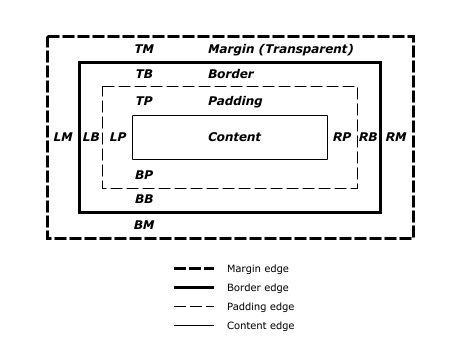
<figcaption>
 This W3C diagram illustrates how each side of the box has padding, border and margin. Source - <a href="https://www.w3.org/TR/CSS2/box.html">www.w3.org/TR/CSS2/box.html</a>
</figcaption>
</figure>

- The above illustrates:

    + TM - Top Margin
    + TB - Top Border
    + TP - Top Padding
    + RM - Right Margin
    + RB - Right Border
    + RP - Right Padding
    + BM - Bottom Margin
    + BB - Bottom Border
    + BP - Bottom Padding
    + LM - Left Margin
    + LB - Left Border
    + LP - Left Padding

- Everything goes clockwise.

- Top, Right, Bottom, Left.

We will look at margins, padding, and borders individually.

## Margin

The margin is an invisible space around your box. It pushes other elements away from the box. Margins can have positive or negative values. Setting a negative margin on one side of your box can cause it to overlap other things on the page. Whether you are using the standard or alternative box model, the margin is always added after the size of the visible box has been calculated.

We can control all margins of an element at once using the `margin` property, or each side individually using the equivalent longhand properties:

- [margin-top](https://developer.mozilla.org/en-US/docs/Web/CSS/margin-top)
- [margin-right](https://developer.mozilla.org/en-US/docs/Web/CSS/margin-right)
- [margin-bottom](https://developer.mozilla.org/en-US/docs/Web/CSS/margin-bottom)
- [margin-left](https://developer.mozilla.org/en-US/docs/Web/CSS/margin-left)

### Applying margins

We will look more closely at how margins are applied to one, some or all of the margins. The good news is, that this works pretty much the same for padding and borders as well.

<!-- div class="exercise" -->
## Exercise 10b

### Task 1

- Return to the `css10` folder in VSC.

- Open `exercise-10b.html` in your editor.

- Open `exercise-10b.html` in the browser to check it works.

<figure>
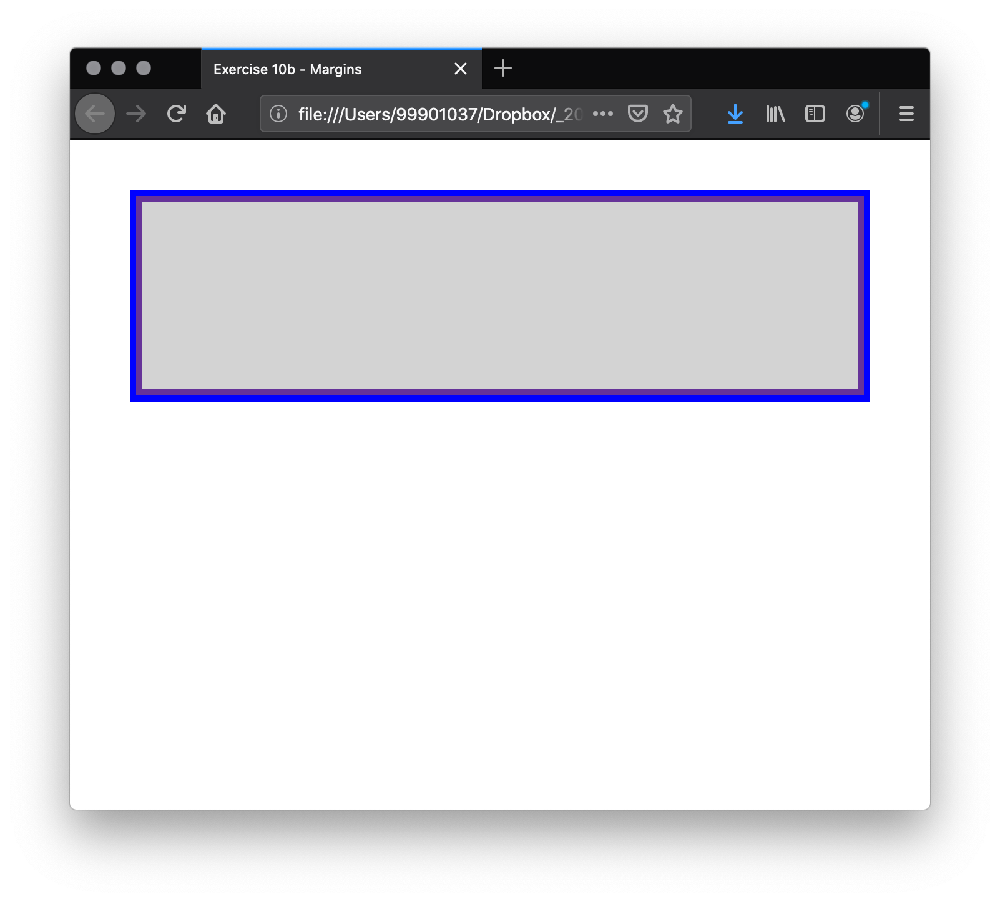
<figcaption>
The screenshot shows two boxes, one inside another.  
</figcaption>
</figure>

### Task 2

- Let's review the HTML:

    + You have two boxes created with `<div>` elements. One inside the other.

- And the CSS:

    + The outer box (container) has a blue border.

    + The outer box has a margin value of 40px - this applies a 40px margin to top, right, bottom and left. More on this short hand code shortly.

    + The inner box has a purple border and grey background.

    + The inner box has a height (usually avoided - but good for this demo).

    + The inner box has all 4 margins, top, right, bottom and left defined but set at `0px`.

- By using a box within a box it will be easier for you to see your styles applied.

### Task 3

- Return to `exercise-10b.html` in your editor.

- Identify the margin rulesets:

```
        margin-top: 0px;
        margin-right: 0px;
        margin-bottom: 0px;
        margin-left: 0px;
```
- Edit each rule, one by one - amending the value to `20px`.

- For example:

```
        margin-top: 20px;
        margin-right: 0px;
        margin-bottom: 0px;
        margin-left: 0px;
```

- Save `exercise-10b.html`, refresh the page in the browser and view the change.

- Do the same to each margin, saving and viewing the change.

<figure>
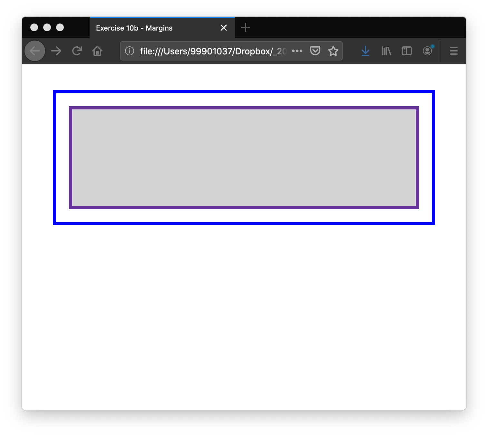
<figcaption>
Your inner box should end up with a 20px margin all around.
</figcaption>
</figure>

- change the top and bottom margins:

```
        margin-top: 40px;
        margin-right: 20px;
        margin-bottom: 40px;
        margin-left: 20px;
```

- Save `exercise-10b.html`, refresh the page in the browser and view the change.

<figure>
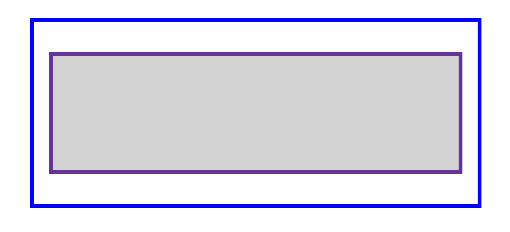
<figcaption>
Your inner box should end have larger top and bottom margins as illustrated.
</figcaption>
</figure>

### Task 4

#### Shorthand

- The `margin` CSS property sets the margin area on all four sides of an element. It is a shorthand for `margin-top`, `margin-right`, `margin-bottom`, and `margin-left`.

- Delete the four margin rules and replace them with the following single (shorthand) ruleset:

```
margin: 50px;
```

- Save `exercise-10b.html`, refresh the page in the browser and view the change.

- The **single value** applies a (`50px`) margin all around.

- Change the margin rule to:

```
margin: 50px 5px;
```

- The **two values** apply to *top* and *bottom* margin (`50px`) and *right* and *left* margin (`5px`).

- Save `exercise-10b.html`, refresh the page in the browser and view the change.

- Change the margin rule to:

```
margin: 40px 10px 90px;
```

- The **three values** apply to *top* margin (`40px`), *right* and *left* margins (`10px`) and *bottom* margin (`90px`).

- Save `exercise-10b.html`, refresh the page in the browser and view the change.

<figure>
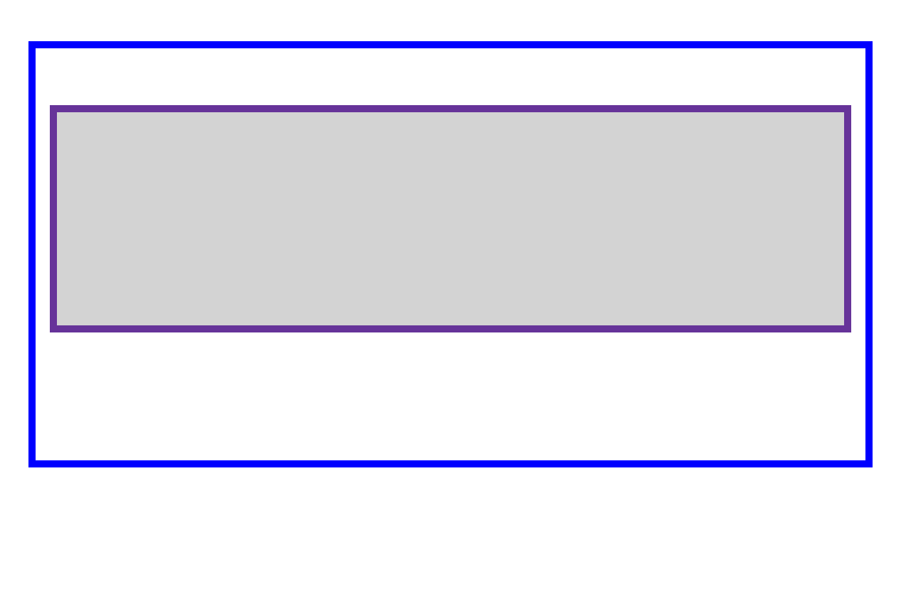
<figcaption>
Your inner box should have larger top and bottom margins as illustrated.
</figcaption>
</figure>

- Finally change the margin rule to:

```
margin: 40px 20px 80px 50px;
```

- The four values apply top (`40px`), right (`20px`), bottom (`80px`) and left (`50px`) margins - always clockwise.


- Save `exercise-10b.html`, refresh the page in the browser and view the change.

<figure>
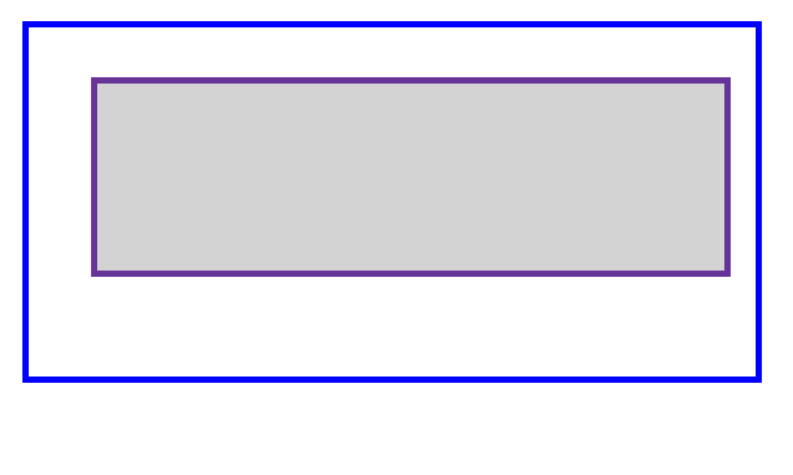
<figcaption>
Your inner box should reflect the margins as illustrated. The shorthand has allowed us to quickly apply values to all four margins in this final example.
</figcaption>
</figure>

- The shorthand properties can speed up your coding, and of course mean less code. As you will see in the next chapter, both borders and padding follow the same method, always going clockwise.

- It will still be useful in some circumstances to target a single element, such as `margin-bottom` from time to time in your coding.

<!-- end div -->

<p class="submit-work">Exercise 10b completed</p>


<!-- div class="exercise" -->
## To Do

> In the example below, try changing the margin values to see how the box is pushed around due to the margin creating or removing space (if it is a negative margin) between this element and the containing element.

<figure>
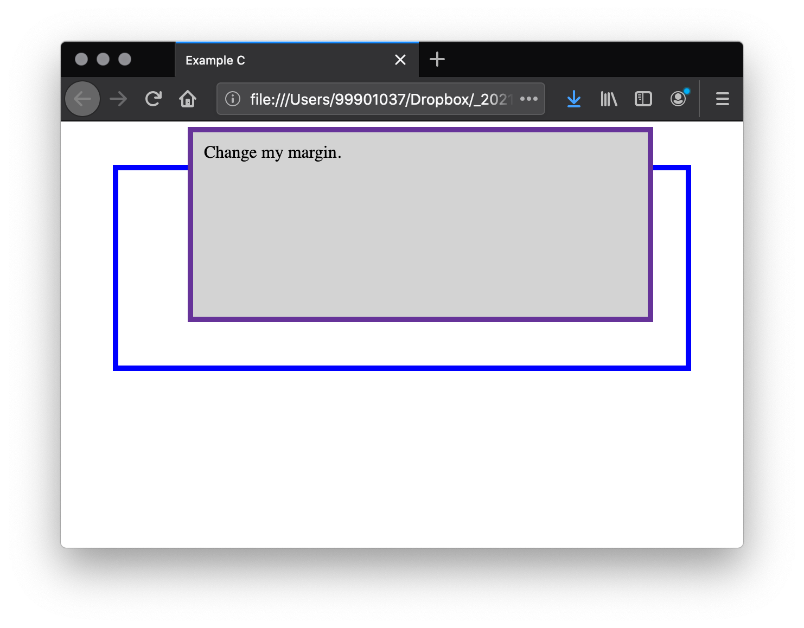
<figcaption>
The screenshot shows two boxes, one inside another. Because the top margin of the internal box is negative, the box appears outside of the containing box.  
</figcaption>
</figure>

### Task 1

- Open the `css10` folder.

- Open `example-c.html` in your editor.

- Open `example-c.html` in the browser to check it works.

- Return to `example-c.html` in your editor.

- Find this style ruleset in the `head` of the document.

```
        .changes {
            margin-top: -40px;
            margin-right: 30px;
            margin-bottom: 40px;
            margin-left: 4em;
            }
```

- Adjust the margin values to see how the box is pushed around due to the margin creating or removing space.

- For example, remove the negative value:

```
margin-top: 40px;
```

- or increase it.

```
margin-top: -80px;
```

- Adjust margin-right, margin-bottom and margin-left values to see the effect.

- Each time save `example-c.html` and refresh it in the browser to view the changes.

- The `example` files are not part of the assessment. 

- You can leave them in the folder.

<!-- end div -->


## Margin collapsing

A key thing to understand about margins is the concept of margin collapsing. If you have two elements whose margins touch, and both margins are positive, those margins will combine to become one margin, which is the size of the largest individual margin. If one or both margins are negative, the amount of negative value will subtract from the total.

<!-- div class="exercise" -->
## To Do

> In the example below, we have two paragraphs. The top paragraph has a `margin-bottom` of 50 pixels. The second paragraph has a `margin-top` of 30 pixels. 

<figure>

<figcaption>
The margins have collapsed together so the actual margin between the boxes is 50 pixels and not the total of the two margins. 
</figcaption>
</figure>

### Task 1

- Open the `css10` folder.

- Open `example-d.html` in your editor.

- Open `example-d.html` in the browser to check it looks as shown above. Two paragraphs sat in a container (`<div>`).

- Return to `example-d.html` in your editor.

- Find this style ruleset in the `head` of the document.

```
    /* Styles for Margin collapsing */

    .one {
    margin-bottom: 50px;
    }

    .two {
    margin-top: 30px;
    }
```

- To reiterate, we have margin collapsing in action here:

    + With a bottom margin of 50px (on the top paragraph), and a top margin of 30px (on the bottom paragraph) we would expect a gap of 80px.

    + What we get with the margin collapse happening is just the largest margin (50px bottom margin) only. The top margin of 30px has gone.

### Task 2

- You can test this by setting the margin-top of paragraph two to 0.

```
    /* Styles for Margin collapsing */

    .one {
    margin-bottom: 50px;
    }

    .two {
    margin-top: 0px;
    }
```

- Make this edit, save `example-d.html` and refresh it in your browser.

- The page should look no different, but you have proved that the top margin is collapsed. The visible margin between the two paragraphs will not change — it retains the 50 pixels set in the bottom-margin of paragraph one.

### Task 3

- Return to `example-d.html` in your editor.

- If you set `margin-top` to `-10px`, you'll see that the overall margin becomes 40px — it subtracts from the 50px.

```
    /* Styles for Margin collapsing */

    .one {
    margin-bottom: 50px;
    }

    .two {
    margin-top: -10px;
    }
```

- Make this edit, save `example-d.html` and refresh it in your browser.

- The margin will *jump* a little as the margin between the two paragraphs decreases to 40px.

- A reminder - The `example` files are not part of the assessment, but you can leave them in the folder.

<!-- end div -->

There are a number of rules that dictate when margins do and do not collapse. For further information see MDN's detailed page on [mastering margin collapsing](https://developer.mozilla.org/en-US/docs/Web/CSS/CSS_Box_Model/Mastering_margin_collapsing). 

**The main thing to remember for now is that margin collapsing is a thing that happens.** If you are creating space with margins and don't get the space you expect, this is probably what is happening.


<h2 class="deep">Deeper Learning</h2>

To get a better understanding of this topic use the following resources.

- LinkedIn Learning Video: [Introduction to the box model](https://www.linkedin.com/learning/css-essential-training-3/introduction-to-the-box-model?u=36102708) (1m 7s)

- LinkedIn Learning Video: [Inline, block and display](https://www.linkedin.com/learning/css-essential-training-3/inline-block-and-display?u=36102708) (3m 6s)

- LinkedIn Learning Video: [The box model properties](https://www.linkedin.com/learning/css-essential-training-3/the-box-model-properties?u=36102708) (2m 6s)

- LinkedIn Learning Video: [The box properties syntax and usage](https://www.linkedin.com/learning/css-essential-training-3/the-box-properties-syntax-and-usage?u=36102708) (3m 17s)


- Article - CSS Tricks: [The CSS Box Model](https://css-tricks.com/the-css-box-model/) 


<h2 class="deep">Advanced Learning</h2>

For students wanting more, we recommend the following topics and resources. 

### Things are changing

CSS traditionally has sized things according to the physical dimensions of the screen. Therefore we describe boxes as having a `width` and `height`, position items from the top and left, float things left, assign borders, margin, and padding to the top, right, bottom, left, etc. The W3C [Logical Properties and Values specification](https://drafts.csswg.org/css-logical/) defines mappings for these physical values to their logical, or flow relative, counterparts — e.g. start and end as opposed to left and right/top and bottom.

This is beyond the scope of this unit but more experienced developer may want to take a look at MDN's [Basic concepts of Logical Properties and Values](https://developer.mozilla.org/en-US/docs/Web/CSS/CSS_Logical_Properties/Basic_concepts).


### &copy; Credit given

Materials used under the Creative Commons licence from [MDN Web Docs](https://developer.mozilla.org/en-US/docs/Web/HTML).
