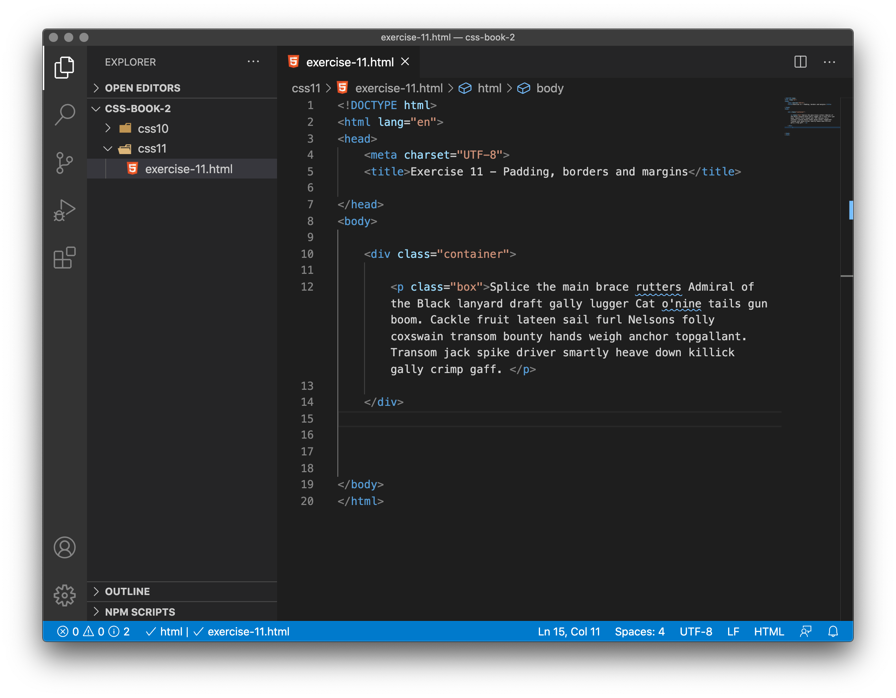
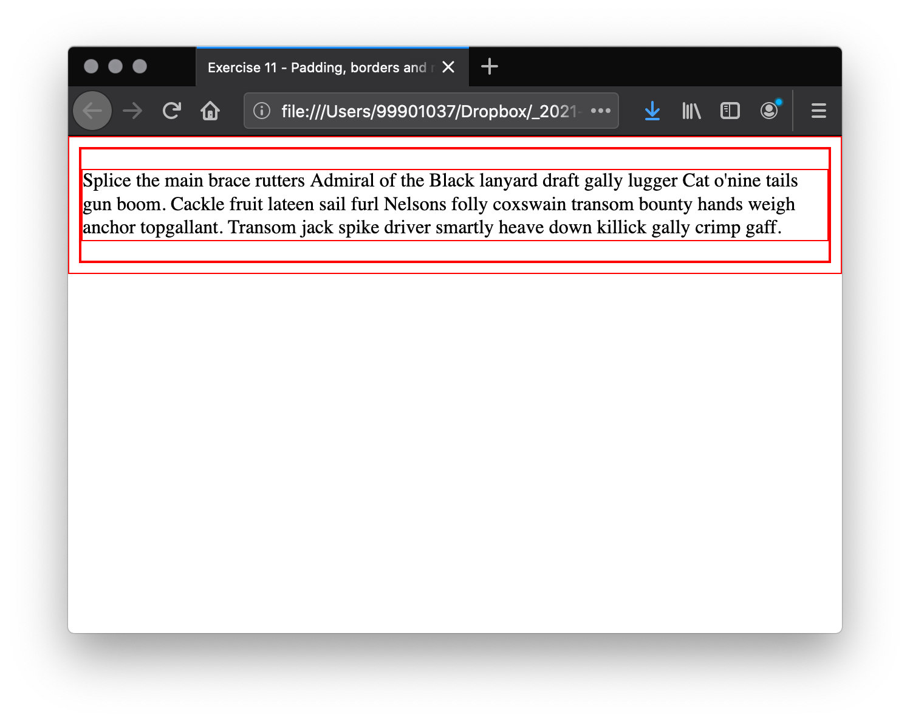
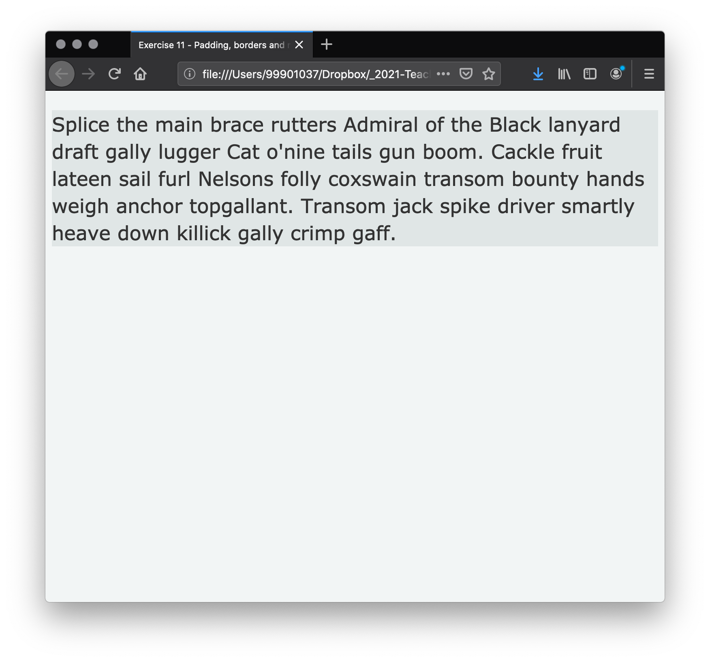
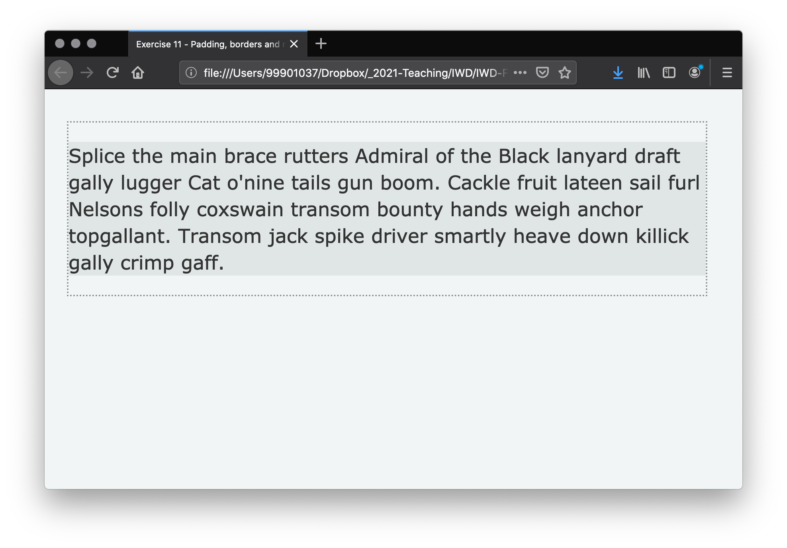
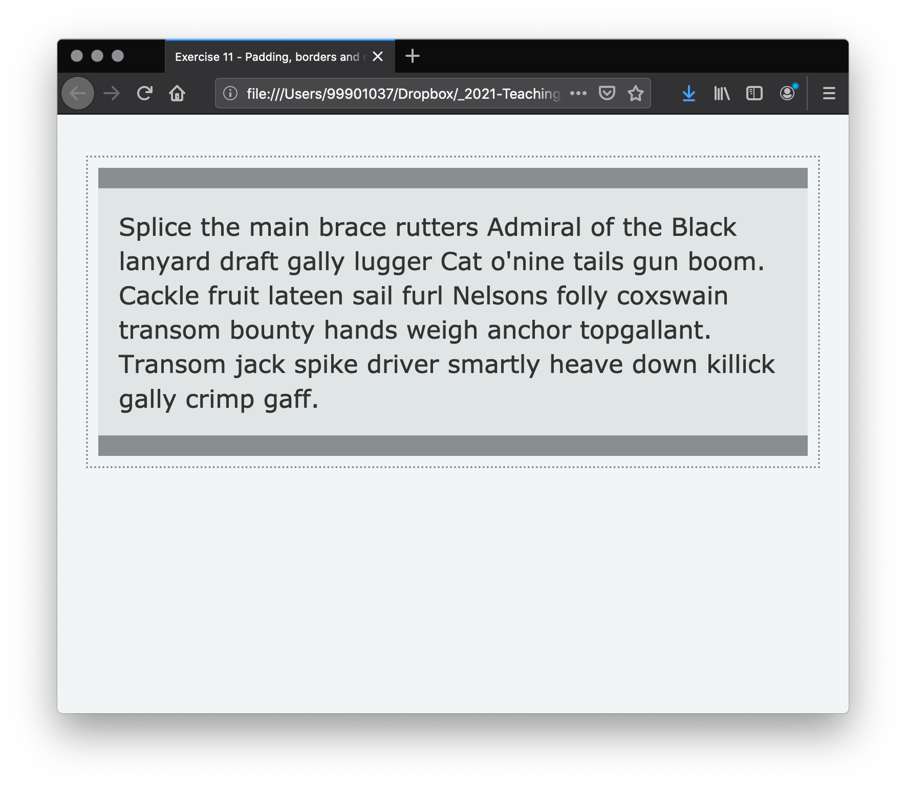
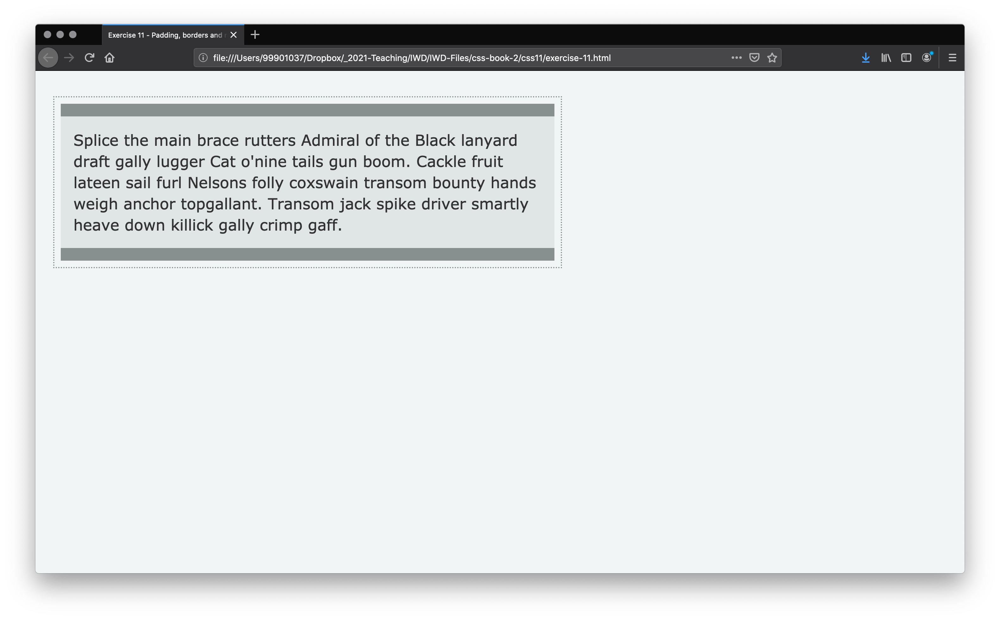
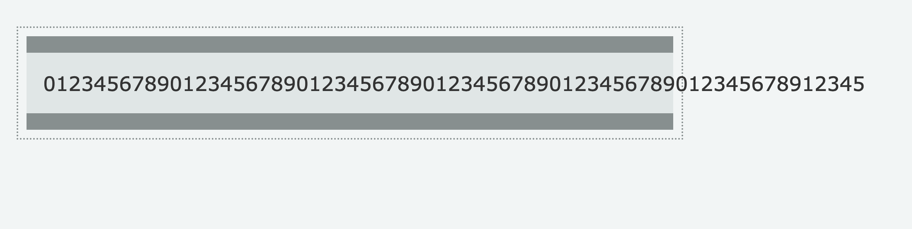
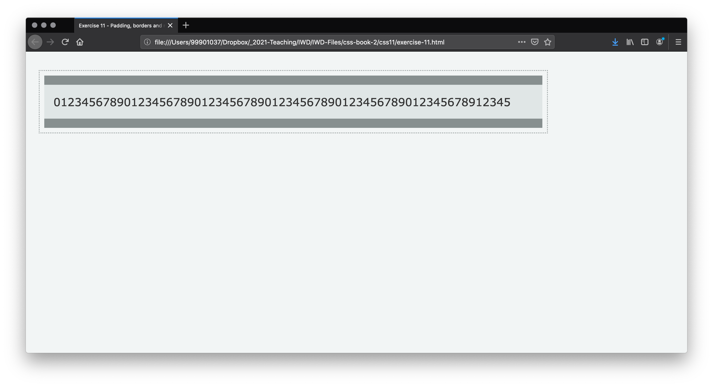
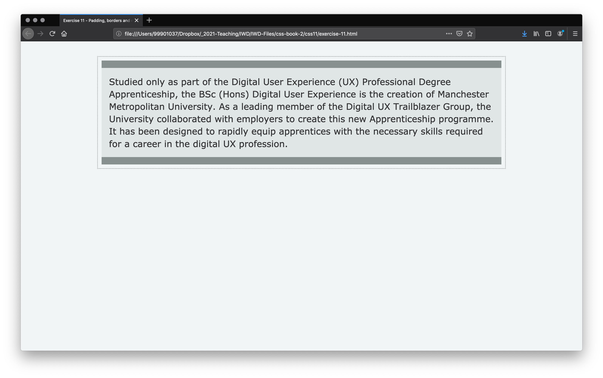

# Borders and padding

## Borders

The border is drawn between the margin and the padding of a box. If you are using the standard box model, the size of the border is added to the `width` and `height` of the box. If you are using the alternative box model then the size of the border makes the content box smaller as it takes up some of that available `width` and `height`.

For styling borders, there are a large number of properties — there are four borders, and each border has a style, width and color that we might want to manipulate.

You can set the width, style, or color of all four borders at once using the [border property](https://developer.mozilla.org/en-US/docs/Web/CSS/border).

To set the properties of each side individually, you can use:

- [border-top](https://developer.mozilla.org/en-US/docs/Web/CSS/border-top)
- [border-right](https://developer.mozilla.org/en-US/docs/Web/CSS/border-right)
- [border-bottom](https://developer.mozilla.org/en-US/docs/Web/CSS/border-bottom)
- [border-left](https://developer.mozilla.org/en-US/docs/Web/CSS/border-left)


To set the width, style, or colour of all sides, use the elements described below:

The `border-width` shorthand CSS property sets the width of an element's border. Border width can be applied with keywords and length values:

```
/* Keyword values */
border-width: thin;
border-width: medium;
border-width: thick;

/* <length> values */
border-width: 4px;
border-width: 1.2rem;
```

- MDN's [border-width](https://developer.mozilla.org/en-US/docs/Web/CSS/border-width) reference.

The `border-style` shorthand CSS property sets the line style for all four sides of an element's border. Border style is applied with keywords. These can look pretty awful so apply/use with care.

```
/* Keyword values */
border-style: none;
border-style: hidden;
border-style: dotted;
border-style: dashed;
border-style: solid;
border-style: double;
border-style: groove;
border-style: ridge;
border-style: inset;
border-style: outset;
```

- MDN's [border-style](https://developer.mozilla.org/en-US/docs/Web/CSS/border-style) reference.

The `border-color` shorthand CSS property sets the color of an element's border. Colour can be applied in the usual ways including colour name, hex, rgb, rgba etc.

```
border-color: red;

border-color: #32a1ce;

border-color: rgba(170, 50, 220, .6);

```

- MDN's [border-color](https://developer.mozilla.org/en-US/docs/Web/CSS/border-color) reference.

To set the width, style, or color of a single side, you can use one of the most granular longhand properties:

<ul>
 <li><a href="/en-US/docs/Web/CSS/border-top-width"><code>border-top-width</code></a> - sets the width of the top border of an element.</li>
 <li><a href="/en-US/docs/Web/CSS/border-top-style"><code>border-top-style</code></a> - sets the line style of an element's top border.</li>
 <li><a href="/en-US/docs/Web/CSS/border-top-color"><code>border-top-color</code></a> - sets the color of an element's top border.</li>
 <li><a href="/en-US/docs/Web/CSS/border-right-width"><code>border-right-width</code></a> - sets the width of the right border of an element.</li>
 <li><a href="/en-US/docs/Web/CSS/border-right-style"><code>border-right-style</code></a> - sets the line style of an element's right border.</li>
 <li><a href="/en-US/docs/Web/CSS/border-right-color"><code>border-right-color</code></a> - sets the color of an element's right border. It can also be set with the shorthand CSS properties border-color or border-right.</li>
 <li><a href="/en-US/docs/Web/CSS/border-bottom-width"><code>border-bottom-width</code></a> - sets the width of the bottom border of an element.</li>
 <li><a href="/en-US/docs/Web/CSS/border-bottom-style"><code>border-bottom-style</code></a> - sets the line style of an element's bottom border.</li>
 <li><a href="/en-US/docs/Web/CSS/border-bottom-color"><code>border-bottom-color</code></a> - sets the color of an element's bottom border.</li>
 <li><a href="/en-US/docs/Web/CSS/border-left-width"><code>border-left-width</code></a> - sets the width of the left border of an element.</li>
 <li><a href="/en-US/docs/Web/CSS/border-left-style"><code>border-left-style</code></a> - sets the line style of an element's left border.</li>
 <li><a href="/en-US/docs/Web/CSS/border-left-color"><code>border-left-color</code></a> - sets the color of an element's left border.</li>
</ul>

### Shorthand

As with margins, you can use shorthand (clockwise) to apply border styles.

-   When one value is specified, it applies the same width to all four sides.
```
/* <length> values */
border-width: 1.2rem;
border-style: dotted;
border-color: red;
```
- When two values are specified, the first width applies to the top and bottom, the second to the left and right.

```
/* vertical | horizontal */
border-width: 2px 1.5em;
border-style: dotted solid;
border-color: red #f015ca;
```
- When three values are specified, the first width applies to the top, the second to the left and right, the third to the bottom.
```
/* top | horizontal | bottom */
border-width: 1px 2em 1.5cm;
border-style: hidden double dashed;
border-color: red rgb(240,30,50,.7) green;
```
- When four values are specified, the widths apply to the top, right, bottom, and left in that order (clockwise).
```
/* top | right | bottom | left */
border-width: 1px 2em 0 4rem;
border-style: none solid dotted dashed;
border-color: red yellow green blue; 
```

With borders, the width, color, and style can be simplified into one declaration. For example, the following CSS ...

```
border-width: 1px;
border-style: solid;
border-color: #000;
```

... can be simplified as:

```
border: 1px solid #000;
```


## Padding

The padding sits between the border and the content area. Unlike margins you cannot have negative amounts of padding, so the value must be 0 or a positive value. Any background applied to your element will display behind the padding, and it is typically used to push the content away from the border.

You will note that Derren prefers to use (when possible) `padding` rather than `margin` to create space between elements. 

We can control the padding on each side of an element individually using the padding property, or each side individually using the equivalent longhand properties:

    padding-top
    padding-right
    padding-bottom
    padding-left


<!-- div class="exercise" -->
## Exercise 11

> Borders and padding.

### Task 1

- Open the `css11` folder.

- Open `exercise-11.html` in your editor.

<figure>

<figcaption>
The code shows a simple page including a containing <code>div</code> around a single paragraph.
</figcaption>
</figure>

### Task 2

- Open `exercise-11.html` in the browser to check it works.

- Create a stylesheet - `style.css`

- Link to the stylesheet from `exercise-11.html`

- Check it works by using:

```
* {
    border: 1px solid red;
}
```

- Save both `style.css` and `exercise-11.html`.

- Refresh `exercise-11.html` in your browser.

<figure>

<figcaption>
The red border lets us know the stylesheet is working. It also shows our boxes.
</figcaption>
</figure>

> See you've been using border and shorthand already!

- Remove that style once you know the stylesheet is attached and working.

### Task 3

- Return to `style.css` in the editor.

- Apply some base styles.

```
html{
    font-size: 10px; /* 1 rem is now 10px for easy maths */
}
body {
    font-family: Verdana, Geneva, Tahoma, sans-serif;
    line-height: 1.4 ;
    color: #333; 
    background-color: #f2f5f5; 
}
p {
    font-size: 2.4rem;
}
```

- Save `style.css` and refresh `exercise-11.html` in the browser to see the changes applied.


### Task 4

In this task we’ll apply margins, padding and borders to our design.

- Return to `style.css` in the editor.

- Create two classes (to match the classes in `exercise-11.html`).

```
.container {
    max-width: 800px;
}

.box {
    background-color: #E0E6E6;
}
```

- The `max-width` just ensures our box doesn't get too big. Much more of this when we start getting *responsive* with our CSS.

- Save `style.css` and refresh `exercise-11.html` in the browser to see the changes applied.

<figure>

<figcaption>
Basic styles applied and classes created.
</figcaption>
</figure>

### Task 5

- Apply the following styles to add margins, padding and borders.


- Add to `.container` a margin top and bottom of `4rem` and a margin right and left of `2rem`, using the CSS shorthand.

    + The margin pushes our container away from the browser edges.

- Save `style.css` and refresh `exercise-11.html` in the browser to see the changes.

- Add to `.container` a `2px` `dotted` border with the colour value `#878f8f`.

- Save and test in the browser.

<figure>

<figcaption>
Margins and border in place.
</figcaption>
</figure>

- Add to `.box` padding of `2rem`.

    + Note how this pushes the content away from the edges.

- Save and test in the browser.

-  Add to `.box` a margin of `1rem`.

    + Note how this creates space around the box.

- Finally, add to `.box` solid bottom and top borders of `20px` with the colour value `#878f8f`.

- Save `style.css` and refresh `exercise-11.html` in the browser to see the changes.

<figure>

<figcaption>
The resulting page should look like this.
</figcaption>
</figure>

## Background colors

- You may have noticed that we introduced the [background-color property](https://developer.mozilla.org/en-US/docs/Web/CSS/background-color) in the last exercise, both for the body and the `.box` class.

- The `background-color` property defines the background colour on any element in CSS. The property accepts any valid `<color>`. A background-color extends underneath the content and padding box of the element.

<!-- end div -->

## Width and height

In our previous exercises we created boxes by adding `height` and `width` attributes. We did this because the boxes had none or little content.
In this exercise our box did have content, but we used `max-width` to stop the container becoming too wide for our demonstration. 

Height and width can be applied with `rems` (as we have used), `ems`, `px` and percentages. For example we could have made our box `max-width: 75%` which would mean our box would always be `75%` of the width of the container - in our example, the browser window. 


<!-- div class="exercise" -->
## Exercise 11 continued

> Percentage.

### Task 1

- Return to `style.css` in the editor.

- Change your `max-width` value to `width: 50%`.

```
.container {
    width: 50%;
    margin: 4rem 2rem;
    border:  2px dotted #878f8f;
}
```
- Save `style.css` and refresh `exercise-11.html` in the browser to see the changes.

- Notice that our container now takes up 50% of the width of the browser window.

- Adjust your browser's width to see the box change to maintain that 50%.

### Task 2

- Change your `width` value to `75%`.

- Save `style.css` and refresh `exercise-11.html` in the browser to see the changes.

- Resize your browser window to see the effect.

### task 3

- Return your `.container` style back to the `max-width`.

```
.container {
    max-width: 800px;
    margin: 4rem 2rem;
    border:  2px dotted #878f8f;
}
```

- Save `style.css` and refresh `exercise-11.html` in the browser to see the changes.

<!-- end div -->

## Our block of content

- In our example page `exercise-11.html` we have a block of content.

- We have a `max-width` - this stops the text flowing across the page when the browser window is wide.

<figure>

<figcaption>
The container has a restricted width of 800px.
</figcaption>
</figure>

- Restricting the width ensures our text has a good reading length.

- The usual quoted number for optimal line length is 65 characters. This is based on 45 to 75 characters (including spaces and punctuation) per line for print.

- Of course this will vary and depend on the font size. Either way, you need a comfortable line length for your text.

<!-- div class="exercise" -->
## Exercise 11 continued

> Line length.

### Task 1

- Return to `exercise-11.html` in the editor.

- Replace your paragraph text with this line of numbers:

```
    <div class="container">

        <p class="box">01234567890123456789012345678901234567890123456789012345678912345</p>

    </div>
```
- Save `exercise-11.html` and refresh the browser to see the changes.

<figure>

<figcaption>
Our paragraph is a line of 65 characters. Our box can be resized to better fit this reading length.
</figcaption>
</figure>

### Task 2

- Return to `style.css` in the editor.

- Adjust the `.container` max-width value to better fit this line length.

- Save `style.css` and refresh `exercise-11.html` in the browser to see the changes.

<figure>

<figcaption>
Your paragraph should now fit in the container.
</figcaption>
</figure>

### Task 3

- Now you have a good line length.

- Return to `exercise-11.html` in the editor.

- Replace the numbers with some text.

```
    <div class="container">

        <p class="box">Studied only as part of the Digital User Experience (UX) Professional Degree Apprenticeship, the BSc (Hons) Digital User Experience is the creation of Manchester Metropolitan University. As a leading member of the Digital UX Trailblazer Group, the University collaborated with employers to create this new Apprenticeship programme. It has been designed to rapidly equip apprentices with the necessary skills required for a career in the digital UX profession.</p>

    </div>
```
- Save `exercise-11.html` and refresh the browser to see the changes.

<figure>

<figcaption>
Your paragraph should now fit in the container and provide a comfortable reading length.
</figcaption>
</figure>
<!-- end div -->

## Centring our content

Our block of text sits well in the browser and provides a good reading experience. The only remaining issue is that our block of content sits to the left of our browser window.

<!-- div class="exercise" -->
## Exercise 11 continued

> Centring our page.

### Task 1

- Return to `style.css` in the editor.

- Adjust the `.container`, giving the left and right margins the value of `auto`.

```
    margin: 4rem auto;
```

- This let's both left and right margins, share equally, the remaining space.

- This centres our block of content - the container.

- Save `style.css` and refresh `exercise-11.html` in the browser to see the changes.

<figure>

<figcaption>
The container now sits, centred in our page. For many years this has been a handy tool for centring web pages. There are however more modern ways of centring items with Flexbox.
</figcaption>
</figure>

<!-- end div -->

<p class="submit-work">Exercise 11 completed</p>


<h2 class="deep">Deeper Learning</h2>

To get a better understanding of this topic use the following resources.

- LinkedIn Learning Video: [Padding, margin and border](https://www.linkedin.com/learning/css-essential-training-3/padding-margin-and-border?u=36102708) (5m 34s)

- LinkedIn Learning Video: [Margins and layouts](https://www.linkedin.com/learning/css-essential-training-3/margin-and-layouts?u=36102708) (3m 3s)

- MD's [Shorthand properties](https://developer.mozilla.org/en-US/docs/Web/CSS/Shorthand_properties) reference page looks at various ways of applying shorthand to margins, borders, padding, and fonts.

- Smashing magazine article: Laura Franz - [Size Matters: Balancing Line Length And Font Size In Responsive Web Design](https://www.smashingmagazine.com/2014/09/balancing-line-length-font-size-responsive-web-design/)


### &copy; Credit given

Materials used under the Creative Commons licence from [MDN Web Docs](https://developer.mozilla.org/en-US/docs/Web/HTML).


