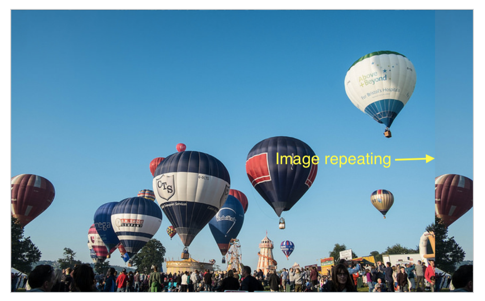

# Background images

The [background-image](https://developer.mozilla.org/en-US/docs/Web/CSS/background-image) property enables the display of an image in the background of an element. 

If an image is purely decoration and doesn't convey information, adding it as a background rather than via the `` element makes sense. Just be aware that you lose the ability to provide `alt` text.

In the example below, we have two boxes — one has a background image which is larger than the box, the other has a small image of a star.

- This example demonstrates two things about background images. 


<figure>

<figcaption>
By default, the large image is not scaled down to fit the box, so we only see half of it, whereas the small image is tiled to fill the box. In this case, the actual image is just a single star.
</figcaption>
</figure>

## Controlling background-repeat

The [background-repeat](https://developer.mozilla.org/en-US/docs/Web/CSS/background-repeat) property is used to control the tiling behavior of images.

The available values are:

- `no-repeat` — stop the background from repeating altogether.
- `repeat-x` — repeat horizontally.
- `repeat-y` — repeat vertically.
- `repeat` — the default; repeat in both directions.

As usual, if you do not add one of the values the browser uses the default - hence our star image repeats in both directions.


<!-- div class="exercise" -->
## Exercise 12

> Background-repeat.

### Task 1

- Open the `css12` folder.

- Open `exercise-12.html` in your editor.

<figure>

<figcaption>
For ease, the styles for exercise 12 are in the head.
</figcaption>
</figure>

- View `exercise-12.html` in your browser.

<figure>

<figcaption>
The balloon image fills the background of the first div, but is larger than the area available. The star image is much smaller than the available area, and by default is repeated to fit the space.
</figcaption>
</figure>

### Task 2

- Return to `exercise-12.html` in your editor.

- Amend the style for `.star` to apply a `background-repeat` of `no-repeat`.

```
      .star {
        background-image: url(img/star.png);
        background-repeat: no-repeat;
      }
```

- Save `exercise-12.html` and refresh it in your browser.

- You should see a single star image.

### Task 3

- Return to `exercise-12.html` in your editor.

- Amend the style for `.star` to apply a `background-repeat` of `repeat-x`.

- Save `exercise-12.html` and refresh it in your browser.

- **You should see the star repeated in a horizontal line across the box**.

### Task 4

- Return to `exercise-12.html` in your editor.

- Amend the style for `.star` to apply a `background-repeat` of `repeat-y`.

- Save `exercise-12.html` and refresh it in your browser.

- **You should see the star repeated in a vertical line down the box**.

<!-- end div -->


## Sizing the background image

In the example above, we have a large image that has ended up being cropped as it is larger than the element it is a background of. In this case we could use the [background-size property](https://developer.mozilla.org/en-US/docs/Web/CSS/background-size), which can take `length` or `percentage` values, to size the image to fit inside the background.

You can also use keywords:

- `cover` — the browser will make the image just large enough so that it completely covers the box area while still retaining its aspect ratio. In this case, part of the image is likely to end up outside the box.

- `contain` — the browser will make the image the right size to fit inside the box. In this case, you may end up with gaps on either side or on the top and bottom of the image, if the aspect ratio of the image is different from that of the box.

<!-- div class="exercise" -->
## Exercise 12 continued

> Cover and contain.

### Task 1

- Return to `exercise-12.html` in your editor.

- Edit `.balloon` to include the `background-size` attribute with the value `contain`.

```
    .balloon {
        background-image: url(img/balloons.jpg);
        background-size: contain;
    }
```
- Save `exercise-12.html` and refresh it in your browser.

<figure>

<figcaption>
The image now fits the box much better but notice on the right that the image is being repeated.
</figcaption>
</figure>

### Task 2

- Return to `exercise-12.html` in your editor.

- Edit `.balloon` to include the `background-repeat: no-repeat`.

```
    .balloon {
        background-image: url(img/balloons.jpg);
        background-size: contain;
        background-repeat: no-repeat;
    }
```

- Save `exercise-12.html` and refresh it in your browser.

- The image doesn't repeat but it doesn't quite fit the box.

- It does maintain the aspect ration of the image, which is often very important - (avoiding distortion).

### Task 3

- Return to `exercise-12.html` in your editor.

- Edit `.balloon` to include the `background-size` attribute with the value `cover`.

- Save `exercise-12.html` and refresh it in your browser.

<figure>

<figcaption>
This scales the image, while preserving its intrinsic aspect ratio (if any), to the smallest size such that both its width and its height can completely cover the background positioning area. We lose a bit of the picture but it fits the box.
</figcaption>
</figure>

<!-- end div -->

## Positioning the background image

The [background-position](https://developer.mozilla.org/en-US/docs/Web/CSS/background-position) property allows you to choose the position in which the background image appears on the box it is applied to. This uses a coordinate system in which the top-left-hand corner of the box is `(0,0)`, and the box is positioned along the horizontal (`x`) and vertical (`y`) axes.

> Note: The default background-position value is `(0,0)`.

The most common background-position values take two individual values — a horizontal value followed by a vertical value.

<!-- div class="exercise" -->
## Exercise 12 continued

> Positioning.

### Task 1

- Return to `exercise-12.html` in your editor.

- Edit `.star` to include the `no-repeat` and a background position of 20px (vertical) and 10% (horizontal).

```
    .star { 
    background-image: url(img/star.png); 
    background-repeat: no-repeat; 
    background-position: 20px 10%; 
    } 
```

- Save `exercise-12.html` and refresh it in your browser.

<figure>

<figcaption>
The single star is located 20px on the vertical axis and 10% on the horizontal axis. 
</figcaption>
</figure>

> If this confuses you - take a look at the MDN reference for [background-position](https://developer.mozilla.org/en-US/docs/Web/CSS/background-position). You can play with the two value demonstration to see the effect.

### Task 2

- Return to `exercise-12.html` in your editor.

- Edit `.star` using the keywords `top` and `center` (USA spelling).

```
    background-position: top center; 
```

- Save `exercise-12.html` and refresh it in your browser.

- Your star should be sat near the top of the box, in the centre!


### Task 3

- Return to `exercise-12.html` in your editor.

- Use a 4-value syntax in order to indicate a distance from certain edges of the box — the length unit, in this case, is an offset from the value that precedes it. So in the CSS below we are positioning the background 150px from the top and 250px from the right:

```
    background-position: top 150px right 250px; 
```

- Save `exercise-12.html` and refresh it in your browser.

- The single star is centred in the box. Don't worry, there are easier methods.


### Task 4

- We can also use `background-position` to manipulate our balloon image to better fit the box. We can apply a variety of keyword values:

```
/* Keyword values */
background-position: top;
background-position: bottom;
background-position: left;
background-position: right;
background-position: center;
```
- This can be used to add a bit of what we call *art direction*. Getting the picture to how we want our user to see it within that box.

- Return to `exercise-12.html` in your editor.

- Add the following line to the `.balloon` class:

```
    background-position: center; 
```

- Save `exercise-12.html` and refresh it in your browser.

<figure>

<figcaption>
The single star is centred in its box and the balloon image sits nicely in its box.
</figcaption>
</figure>

<!-- end div -->


## Rounded corners

Rounding corners on a box is achieved by using the [border-radius](https://developer.mozilla.org/en-US/docs/Web/CSS/border-radius) property and associated longhands which relate to each corner of the box. Two lengths or percentages may be used as a value, the first value defining the horizontal radius, and the second the vertical radius. In a lot of cases, you will only pass in one value, which will be used for both.

For example, to make all four corners of a box have a 10px radius:

```
.box { 
  border-radius: 10px; 
} 
```

Or to make the top right corner have a horizontal radius of 1em, and a vertical radius of 10%:

```
.box { 
  border-top-right-radius: 1em 10%; 
} 
```
<!-- div class="exercise" -->
## Exercise 12 continued

> Border radius.

### Task 1

> To complete this exercise we are going set all four corners and then change the values for the top right corner to make it different. 

- Return to `exercise-12.html` in your editor.

- Add these three rules to the `.star` class.

        border: 10px solid rebeccapurple;
        border-radius: 1em;
        border-top-right-radius: 10% 30%; 

- Save `exercise-12.html` and refresh it in your browser.

    + The first rule is applied over the previous border styles (specificity)

    + The second rule applies `border-radius` to every corner (as it contains a single value).

    + The third rule (Cascade) applies a specific radius to the top right corner.

### Task 2

- Why not apply this wonderful border to both boxes?

- Simple, cut & paste the styles from `.star` and add them to the `.box` class.

```
    .box {
        width: 500px;
        height: 300px;
        padding: .5em;
        margin: 30px auto;
        border: 10px solid rebeccapurple;
        border-radius: 1em;
        border-top-right-radius: 10% 30%; 
    }
```

- Two things to check:

    + You have removed these 3 styles from `.star` as it's would be pointless to repeat them. Cut & Paste, not Copy & Paste.

    + Remove the original border style from `.box` before adding these new border styles.

- Save `exercise-12.html` and refresh it in your browser.

<figure>

<figcaption>
A thing of beauty - Both boxes with a border radius added. <strong>Use with care!</strong>
</figcaption>
</figure>


<!-- end div -->

<p class="submit-work">Exercise 12 completed</p>


<h2 class="deep">Deeper Learning</h2>

To get a better understanding of this topic use the following resources.

- CSS Trick article: [Background images](https://css-tricks.com/almanac/properties/b/background-image/)


### &copy; Credit given

Materials used under the Creative Commons licence from [MDN Web Docs](https://developer.mozilla.org/en-US/docs/Web/HTML).
