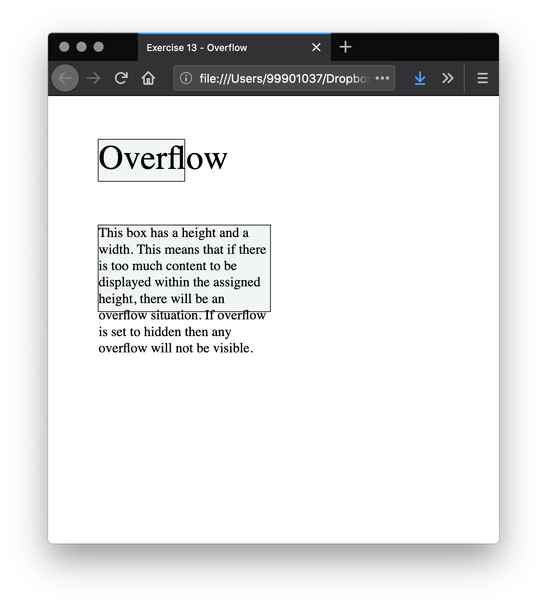
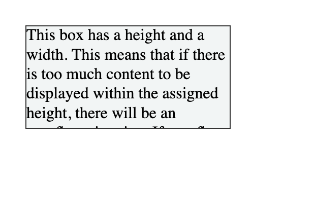
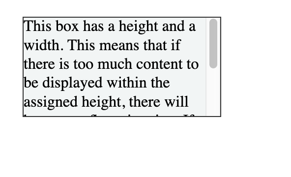
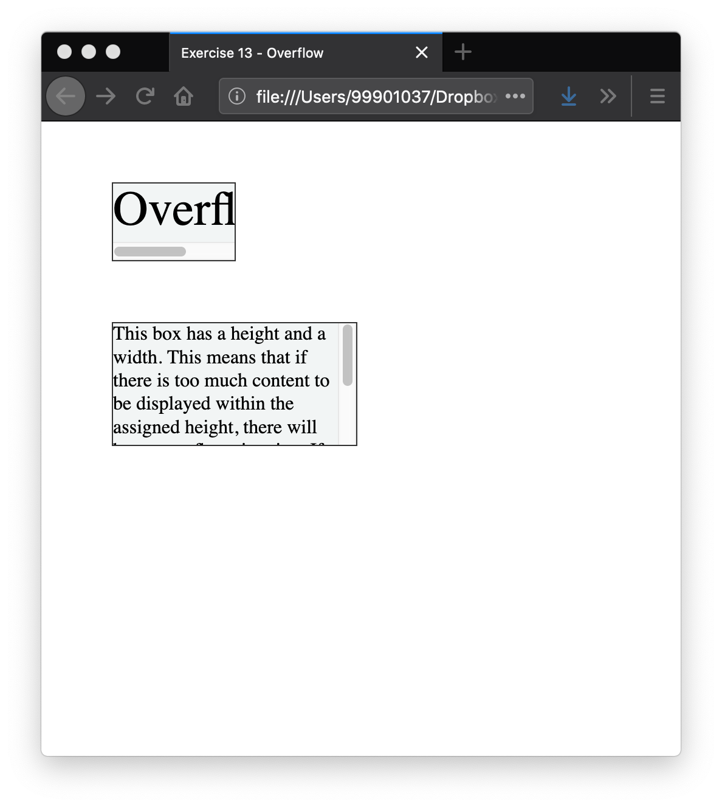

# Overflow

## Unwanted overflow in web design

Modern layout methods such as Grid and Flexbox manage overflow. They largely work without assumptions or dependencies for how much content there will be on a web page.

This has not always been the norm. In the past, some sites were built with fixed-height containers to align bottoms of boxes. These boxes may otherwise have no relationship to each other. This was fragile. In a legacy application, you may encounter a box where content is overlaying other content on the page. Now you can recognize that this happens with overflow. Ideally, you will refactor the layout to not rely on fixed-height containers.

When developing a site, always keep overflow in mind. Test designs with large and small amounts of content. Increase the font sizes of text. Generally ensure that your CSS works in a robust way. Changing the value of overflow as in the following exercise to hide content, or to add scrollbars, is likely to be reserved for a few select use cases (for example, where you intend to have a scrolling box).

## What is overflow?

Everything in CSS is a box. You can constrain the size of these boxes by assigning values of `width` and `height`. **Overflow happens when there is too much content to fit in a box**.

### Our examples - `exercise-13.html`

- On this page the first example is a word in a box. The box has been made too small for the word and so it breaks out of the box.

- The second example is a box that has been restricted by setting a height. Then we add content that exceeds the allocated space. The content overflows the box and falls into the space below.

<figure>

<figcaption>
Our examples of overflow happening as the content doesn't fit the boxes.
</figcaption>
</figure>


You might wonder why CSS works in such a messy way, displaying content outside of its intended container. Why not hide overflowing content? Why not scale the size of the container to fit all the content?

Wherever possible, CSS does not hide content. This would cause data loss. The problem with data loss is that you might not notice. Website visitors may not notice. If the submit button on a form disappears and no one can complete the form, this could be a big problem! Instead, CSS overflows in visible ways. You are more likely to see there is a problem. At worst, a site visitor will let you know that content is overlapping.

If you restrict a box with a width or a height, CSS trusts you to know what you are doing. CSS assumes that you are managing the potential for overflow. In general, restricting the block dimension is problematic when the box contains text. There may be more text than you expected when designing the site, or the text may be larger (for example, if the user has increased their font size).


## The overflow property

The  [overflow property](https://developer.mozilla.org/en-US/docs/Web/CSS/overflow) is how you take control of an element's overflow. It is the way you instruct the browser how it should behave. The default value of overflow is `visible`. With this default, we can see content when it overflows.

To crop content when it overflows, you can set `overflow: hidden`. This does exactly what it says: it hides overflow. Beware that this can make some content invisible. You should only do this if hiding content won't cause problems.

<!-- div class="exercise" -->
## Exercise 13

> Overflow.

### Task 1

- Open the `css13` folder.

- Open `exercise-13.html` in your editor.

- Edit the class `.box` by adding the following rule:

```
  overflow: hidden;
```

- Save `exercise-13.html` and view it in your browser.

<figure>

<figcaption>
The overflow text is now restrained to the box, with any overflow hidden. Not ideal in most cases.
</figcaption>
</figure>

### Task 2

- You can improve the situation by using `overflow: scroll;` but this adds bottom and side scrolling bars - messy.

- Return to `exercise-13.html` in your editor.

- Replace `overflow: hidden;` with `overflow-y: scroll;` to the `.box` class for a vertical scroll bar.

```
    .box {
        border: 1px solid #333333;
        width: 200px;
        height: 100px;
        margin: 50px;
        background-color: #f2f5f5; 
        overflow-y: scroll;
      }
```

- Save `exercise-13.html` and view it in your browser.

- You may have to hover over the text to see the scroll bar.

<figure>

<figcaption>
The overflow text is still restrained to the box, but has a vertical scroll bar. Again not ideal.
</figcaption>
</figure>

### Task 3

- You can also scroll on the x axis using `overflow-x`, although this is not a recommended way to accommodate long words! 

- Return to `exercise-13.html` in your editor.

Add `overflow-x: scroll;` to the class `.word`.

```
    overflow-x: scroll;
```

- Save `exercise-13.html` and view it in your browser.

- You may have to hover over the text to see the scroll bar.

<figure>

<figcaption>
You should now have a terrible side scroll on the top box.
</figcaption>
</figure>

## The moral of the story

- We have shown you CSS Overflow in action because you will come across it at some point.

- You avoid it by using more modern, flexible tools such as Grid and Flexbox in your layouts.

- Make bigger containers!

- Avoid creating containers smaller than the content you need to go in them. Sometimes easier said than done - you might build the container but someone else may provide the content.

<!-- end div -->

<p class="submit-work">Exercise 13 completed</p>


<h2 class="deep">Deeper Learning</h2>

To get a better understanding of this topic use the following resources.


- CSS Trick article: [The CSS Overflow Property](https://css-tricks.com/the-css-overflow-property/)


### &copy; Credit given

Materials used under the Creative Commons licence from [MDN Web Docs](https://developer.mozilla.org/en-US/docs/Web/HTML).