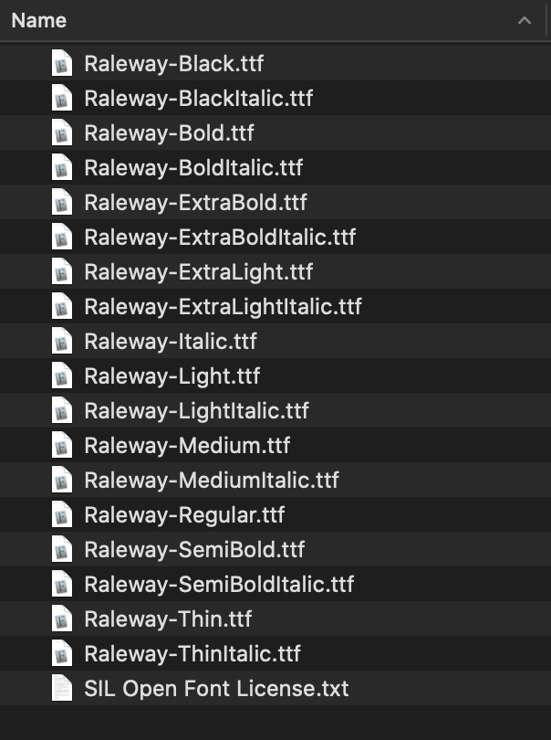

# web fonts

## Font families recap

As we looked at in Typography for the web, the fonts applied to your HTML can be controlled using the `font-family` property. This takes one or more font family names, and the browser travels down the list until it finds a font it has available on the system it is running on:

```
p {
  font-family: Helvetica, "Trebuchet MS", Verdana, sans-serif;
}
```

This system works well, but traditionally web developers' font choices were limited. There are only a handful of fonts that you can guarantee to be available across all common systems — the so-called Web-safe fonts. You can use the font stack to specify preferable fonts, followed by web-safe alternatives, followed by the default system font, but this adds overhead in terms of testing to make sure that your designs look ok with each font, etc.


## Web fonts

But there is an alternative, which works very well, right back to IE version 6. Web fonts are a CSS feature that allows you to specify font files to be downloaded along with your website as it is accessed, meaning that any browser that supports web fonts can have exactly the fonts you specify available to it. Amazing! The syntax required looks something like this:

First of all, you have a [@font-face](https://developer.mozilla.org/en-US/docs/Web/CSS/@font-face) block at the start of the CSS, which specifies the font file(s) to download:

```
@font-face {
  font-family: "myFont";
  src: url("myFont.woff");
}
```

Below this you can then use the font family name specified inside @font-face to apply your custom font to anything you like, as normal:

```
html {
  font-family: "myFont", "Bitstream Vera Serif", serif;
}
```

The syntax does get a bit more complex than this; we'll go into more detail below.

There are three important things to bear in mind about web fonts:

- Browsers support different font formats, so you'll need multiple font formats for decent cross-browser support. For example, most modern browsers support WOFF/WOFF2 (Web Open Font Format versions 1 and 2), the most efficient format around, but older versions of IE only support EOT (Embedded Open Type) fonts, and you might need to include an SVG version of the font to support older versions of iPhone and Android browsers. We'll show you below how to generate the required code.

- Fonts generally aren't free to use. You have to pay for them, and/or follow other license conditions such as crediting the font creator in the code (or on your site). You shouldn't steal fonts and use them without giving proper credit.

- **Weight!** Asking your user to download one or more fonts adds to the overall *weight* of the page download and the amount of bandwidth used. *Page weight* is something we will discuss further as you learn to optimise images for the web.


> Note: Web fonts as a technology have been supported in Internet Explorer since version 4!

You can use the Firefox Font Editor to investigate and manipulate the fonts in use on your page, whether they are web fonts or not. This video provides a nice walkthrough:

<iframe width="560" height="315" src="https://www.youtube.com/embed/UazfLa1O94M" frameborder="0" allow="accelerometer; autoplay; clipboard-write; encrypted-media; gyroscope; picture-in-picture" allowfullscreen></iframe>

## A web font example

With this in mind, let's build up a basic web font example from first principles. We would like you to follow the steps detailed in the below sections, to get an idea of the process.

## Finding fonts

For this example, we'll use two web fonts, one for the headings, and one for the body text. To start with, we need to find the font files that contain the fonts. Fonts are created by font foundries and are stored in different file formats. There are generally three types of sites where you can obtain fonts:

- A free font distributor: This is a site that makes free fonts available for download (there may still be some license conditions, such as crediting the font creator). Examples include [Font Squirrel](https://www.fontsquirrel.com/), [dafont](http://www.dafont.com/), and [Everything Fonts](https://everythingfonts.com/).

- A paid font distributor: This is a site that makes fonts available for a charge, such as [fonts.com](http://www.fonts.com/). You can also buy fonts directly from font foundries, for example [Linotype](https://www.linotype.com/), [Monotype](http://www.monotype.com/), or [Exljbris](http://www.exljbris.com/).

- An online font service: This is a site that stores and serves the fonts for you, making the whole process easier. We will be using an online font service in the second exercise.

<!-- div class="exercise" -->
## Exercise 14a

> Web Fonts - Font Squirrel.

### Task 1 - Selecting your fonts

- Open the `css13` folder in Visual Studio Code.

- Open `exercise-14a.html` and `web-font-a.css` in your editor.

- Take a look at the HTML and CSS in the editor, and the webpage in your browser.

### Task 2 - Selecting your fonts

- Let's find a font! 

- Actually we've found one for you - Go to [Font Squirrel - raleway](https://www.fontsquirrel.com/fonts/raleway).

- **Raleway** is a sans serif font that we can use with different weights for our headings and paragraph text.

- Select the download button, and save the `zip` file to your computer.

- Unzip the font package (Web fonts are usually distributed in ZIP files containing the font file(s) and licensing information).

    + You will find multiple font files in the package — some fonts are distributed as a family with different variants available, for example thin, medium, bold, italic, thin italic, etc. 
    
    + For this example, we just want you to concern yourself with two font files. One for headings, one for paragraphs. In a real project you would also need the fonts for bold, italics etc.

<figure>

<figcaption>
Inside the folder you will see the licence plus the font variations.
</figcaption>
</figure>


### Task 3 - Generating the required code

- We are going to use `Raleway-Black.ttf` for headings.

- And `Raleway-Regular.ttf` for the paragraphs.

- Now you'll need to generate the required code (and font formats). For each font, follow these steps:

1. Go to the [Fontsquirrel Webfont Generator](https://www.fontsquirrel.com/tools/webfont-generator).

1. Upload the both font files, one after the other `raleway-Black.ttf` and `Raleway-Regular.ttf` from this folder using the **Upload Fonts** button.

1. Use the default *Optimal* option.

1. Check the checkbox labeled "Yes, the fonts I'm uploading are legally eligible for web embedding."

1. Click Download your kit.

After the generator has finished processing, you should get a ZIP file to download — save it to your computer.

- Extract the folder and move it to your `css14` folder.

- Inside this folder you'll see three useful items:

    + Multiple versions of each font: (for example `.woff` and `.woff2`; the exact fonts provided will be updated over time as browser support requirements change). As mentioned above, multiple fonts are needed for cross browser support — this is Fontsquirrel's way of making sure you've got everything you need.
    
    + A demo HTML file for each font — `raleway-black-demo.html` and `raleway-regular-demo.html`. Load these in your browser to see what the font will look like in different usage contexts.
    
    + A `stylesheet.css` file, which contains the generated `@font-face` code you'll need.

### Task 4 - Implementing the code in your demo

To implement these fonts in your demo, follow these steps:

- Rename the unzipped directory (webfontkit) to `fonts`.

- Open the `stylesheet.css` file in your editor and copy both the `@font-face` blocks contained inside into your `web-font-a.css` file in your editor 

- You need to put them at the very top of `web-font-a.css` (there is a comment to guide you), before any of your CSS, as the fonts need to be imported before you can use them on your site.

- Each of the url() functions points to a font file that we want to import into our CSS — we need to make sure the paths to the files are correct, so add `fonts/` to the start of each path (adjust as necessary).

- For example:

```
src: url('fonts/raleway-black-webfont.woff2') format('woff2'),
```

- Edit `web-font-a.css` to apply *Raleway Black* to your heading styles:

```
  h1,h2 {
    letter-spacing: 0.2rem;
    font-family: 'ralewayblack', sans-serif;
  }
```
- Also apply *Raleway Regular* to the paragraph. Also amend the font size and line height to better suite this font:

```
  p {
    font-size: 1.6rem;
    line-height: 1.5;
    word-spacing: 0.6rem;
    font-family: 'ralewayregular', sans-serif;
  }
```


You should end up with a demo page with some nice fonts implemented on them. Because different fonts are created at different sizes, you may have to adjust the size, spacing, etc., to sort out the look and feel.


