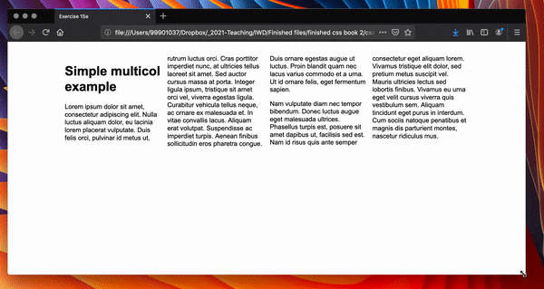

# Introduction to CSS layout

CSS page layout techniques allow us to take elements contained in a web page and control where they are positioned relative to their default position in normal layout flow, the other elements around them, their parent container, or the main viewport/window.  This chapter gives a brief overview of each page layout technique:

- Normal flow
- The [display](https://developer.mozilla.org/en-US/docs/Web/CSS/display) property
- Flexbox
- Grid
- Floats
- Positioning
- Table layout
- Multiple-column layout

Each technique has its uses, advantages, and disadvantages, and no technique is designed to be used in isolation. By understanding what each method is designed for you will be in a good place to understand which is the best layout tool for each task.

Modern web development makes full use of Flexbox and it is worth learning this in more detail.

> Advanced students may want to undertake the full [MDN CSS layout tutorial](https://developer.mozilla.org/en-US/docs/Learn/CSS/CSS_layout) written by Rachel Andrew, to gain a deeper understanding. **It is not necessary to successfully complete this work**.

## Normal flow

Normal flow is how the browser lays out HTML pages by default when you do nothing to control page layout. Let's look at a quick HTML example:

```
<p>I love my cat.</p>
    
<ul>
  <li>Buy cat food</li>
  <li>Exercise</li>
  <li>Cheer up friend</li>
</ul>
    
<p>The end!</p>
```

By default, the browser will display this code as follows:

<div style="padding: 20px; background-color: white; color: black; margin: 10px;">
<p>I love my cat.</p>
    
<ul>
  <li>Buy cat food</li>
  <li>Exercise</li>
  <li>Cheer up friend</li>
</ul>
    
<p>The end!</p>

</div>

Note here how the HTML is displayed in the exact order in which it appears in the source code, with elements stacked up on top of one another — the first paragraph, followed by the unordered list, followed by the second paragraph.

The elements that appear one below the other are described as block elements, in contrast to inline elements, which appear one beside the other, like the individual words in a paragraph.

> Note: The direction in which block element contents are laid out is described as the Block Direction. The Block Direction runs vertically in a language such as English, which has a horizontal writing mode. It would run horizontally in any language with a Vertical Writing Mode, such as Japanese. The corresponding Inline Direction is the direction in which inline contents (such as a sentence) would run.

For many of the elements on your page the normal flow will create exactly the layout you need, however for more complex layouts you will need to alter this default behavior using some of the tools available to you in CSS. Starting with a well-structured HTML document is very important, as you can then work with the way things are laid out by default rather than fighting against it.

The methods that can change how elements are laid out in CSS are as follows:

- **The display property** — Standard values such as `block`, `inline` or `inline-block` can change how elements behave in normal flow, for example making a block-level element behave like an inline element. We also have entire layout methods that are switched on via specific display values, for example `CSS Grid` and `Flexbox`, which alter how elements inside the element they are set on are laid out.

- **Floats** — Applying a float value such as left can cause block level elements to wrap alongside one side of an element, like the way images sometimes have text floating around them in magazine layouts.

- **The position property** — Allows you to precisely control the placement of boxes inside other boxes. Static positioning is the default in normal flow, but you can cause elements to be laid out differently using other values, for example always fixed to the top of the browser viewport.

- **Table layout** — features designed for styling the parts of an HTML table can be used on non-table elements using `display: table` and associated properties.

- **Multi-column layout** — The Multi-column layout properties can cause the content of a block to layout in columns, as you might see in a newspaper.

<!-- div class="exercise" -->
## ToDo 

> Basic document flow.

### Task 1 

- Open the `css15` folder in Visual Studio Code.

- Open `example-a.html` in your editor and look over the code.

    + A heading.

    + 4 paragraphs.

    + 4 inline elements - 3 x `<span>` and 1 x ``.

- Open `example-a.html` in your browser.

<figure>

<figcaption>
Read through the text as it explains clearly the normal flow of each element.
</figcaption>
</figure>

- The example files are not part of the assessment.

- You can leave them in the folder.

<!-- end div -->

## The display property

The main methods of achieving page layout in CSS are all values of the display property. This property allows us to change the default way something displays. Everything in normal flow has a value of display, used as the default way that elements they are set on behave. For example, the fact that paragraphs in English display one below the other is due to the fact that they are styled with display: block. If you create a link around some text inside a paragraph, that link remains inline with the rest of the text, and doesn’t break onto a new line. This is because the `<a>` element is display: inline by default.

You can change this default display behavior. For example, the `<li>` element is display: block by default, meaning that list items display one below the other in our English document. If we change the display value to inline they now display next to each other, as words would do in a sentence. The fact that you can change the value of display for any element means that you can pick HTML elements for their semantic meaning, without being concerned about how they will look. The way they look is something that you can change.

In addition to being able to change the default presentation by turning an item from block to inline and vice versa, there are some bigger layout methods that start out as a value of display. However, when using these, you will generally need to invoke additional properties. The two values most important for our purposes when discussing layout are `display: flex` and `display: grid`.


## Flexbox

Flexbox is the short name for the [Flexible Box Layout Module](https://developer.mozilla.org/en-US/docs/Web/CSS/CSS_Flexible_Box_Layout), designed to make it easy for us to lay things out in one dimension — either as a row or as a column. To use flexbox, you apply `display: flex` to the parent element of the elements you want to lay out; all its direct children then become flex items. We can see this in a simple example.

<!-- div class="exercise" -->
## Exercise 15a 

> Flexbox.

### Task 1

- Return to the `css15` folder in Visual Studio Code.

- Open `exercise-15a.html` in your editor and look over the code.

- Open `exercise-15a.html` in your browser.

<figure>

<figcaption>
The HTML markup gives us a containing element (<code>&lt;div&gt;</code>), with a class of <code>wrapper</code>, inside which are three <code>&lt;div&gt;</code> elements. By default these would display as block elements, below one another, in our English language document.
</figcaption>
</figure>

- By adding `display: flex` to the parent, the three items now arrange themselves into columns. This is due to them becoming flex items and being affected by some initial values that flexbox sets on the flex container. They are displayed in a row, because the initial value of [flex-direction](https://developer.mozilla.org/en-US/docs/Web/CSS/flex-direction) set on their parent is `row`. They all appear to stretch to the height of the tallest item, because the initial value of the [align-items](https://developer.mozilla.org/en-US/docs/Web/CSS/align-items) property set on their parent is `stretch`. This means that the items stretch to the height of the flex container, which in this case is defined by the tallest item. The items all line up at the start of the container, leaving any extra space at the end of the row.

### Task 2

- Return to `exercise-15a.html` in the editor.

- Remove the style rule `display: flex;`.

```
    .wrapper {

    }
```

- Save `exercise-15a.html` and refresh it in your browser.

<figure>

<figcaption>
The <code>&lt;div&gt;</code>s now sit in their normal flow, one on top of the other.
</figcaption>
</figure>

### Task 3

- Return to `exercise-15a.html` in the editor.

- Reapply the style rule `display: flex;` to the class `.wrapper`.

```
    .wrapper {
        display: flex;
    }
```

- Save `exercise-15a.html` and refresh it in your browser and check that Flexbox has been re-applied.

### Task 4

- In addition to the above properties that can be applied to the flex container, there are properties that can be applied to the flex items. These properties, among other things, can change the way that the items flex, enabling them to expand and contract to fit into the available space.

- As a simple example of this, we can add the [flex property](https://developer.mozilla.org/en-US/docs/Web/CSS/flex) to all of our child items, with a value of `1`. This will cause all of the items to grow and fill the container, rather than leaving space at the end. If there is more space then the items will become wider; if there is less space they will become narrower. In addition, if you add another element to the markup the items will all become smaller to make space for it — they will adjust size to take up the same amount of space, whatever that is.

- Let's try this out.

- Return to `exercise-15a.html` in the editor.

- To see this work a little easier we want you to reduce the sizes of the paragraphs.

```
        <div class="box1">    
            <p>Cray food truck.</p>
        </div>

        <div class="box2">    
            <p>Cray food truck.</p>
        </div>
        
        <div class="box3">    
            <p>Cray food truck.</p>
        </div>
```
- Save `exercise-15a.html` and refresh it in your browser. 

<figure>

<figcaption>
We still have three flexboxes, but they are now much smaller. This will make the next demonstration clearer.
</figcaption>
</figure>

- Return to `exercise-15a.html` in the editor.

- Apply the following style to the bottom of your existing styles:

```
    .wrapper > div {
    flex: 1;
    }
```

> Note - yes you can also just add this to the existing `.wrapper > div` styles. Eitherway, don't loose the existing styles for the `.wrapper > div`.

- Save `exercise-15a.html` and refresh it in your browser. 

<figure>

<figcaption>
Our three flexboxes, all with the flex value of 1, take up equal space across the page.
</figcaption>
</figure>

- Return to `exercise-15a.html` in the editor.

- Add another box, `box4` inside your `wrapper` div.

```
        <div class="box4">    
            <p>Cray food truck.</p>
        </div>
```
- Save `exercise-15a.html` and refresh it in your browser. 

<figure>

<figcaption>
Our four flexboxes, all with the flex value of 1, take up equal space across the page. The extra box is accomodated with ease.
</figcaption>
</figure>

- To someone new to web development this all seems fairly obvious that you can lay out 4 boxes across the page, evenly.

- To anyone dealing with CSS for a number of years, this seems like a modern miracle - a fix for something that had previously been painful to achieve.

<!-- end div -->

<p class="submit-work">Exercise 15a completed</p>

> Note: This has been a very short introduction to what is possible in Flexbox. If you continue your web studies we will be doing more in future assignments. Those keen to find out more now, see the [MDN Flexbox article](https://developer.mozilla.org/en-US/docs/Learn/CSS/CSS_layout/Flexbox).


## Grid Layout

While flexbox is designed for one-dimensional layout, Grid Layout is designed for two dimensions — lining things up in rows and columns. This makes it ideal for page layout, providing a flexibility never seen in web development before.

See Jen Simmons's [Experimental Layout Lab](https://labs.jensimmons.com/) to see examples of creative layout with CSS Grid.

Once again, you can switch on Grid Layout with a specific value of display — `display: grid`. 


<!-- div class="exercise" -->
## ToDo 

> Basic document flow.

### Task 1 

- Return to the `css15` folder in Visual Studio Code.

- Open `example-b.html` in your editor and look over the code.

    + The grid styles are applied via the `.wrapper` class.

    + 6 boxes are created on the page with `div`s.

    + These are wrapped in a `div` with the `.wrapper` class.

- The CSS:

```
    .wrapper {
        display: grid;
        grid-template-columns: 1fr 1fr 1fr;
        grid-template-rows: 100px 100px;
        grid-gap: 10px;
    }
```

- In addition to using `display: grid`, we are also defining some row and column tracks on the parent using the `grid-template-rows` and `grid-template-columns` properties respectively. 

- We've defined three columns each of `1fr` and two rows of `100px`. We don’t need to put any rules on the child elements; they are automatically placed into the cells our grid has created.

> **Fr** is a fractional unit and `1fr` is for `1` part of the available space.

- Open `example-b.html` in your browser.

<figure>

<figcaption>
We've defined three columns and two rows. The <code>1fr 1fr 1fr</code> ensures that each there are three columns, each taking up 1 fraction of the space. The  <code>100px 100px</code> defines two rows with a height of <code>100px</code> each.
</figcaption>
</figure>

- Return to `example-b.html` in your editor and change one of the grid values to see the effect.

- Change the first fraction to `2fr`.

```
    grid-template-columns: 2fr 1fr 1fr;
```

- Save `example-b.html` and refresh it in your browser. 


<figure>

<figcaption>
The first column now gets 2 fractions of the width of the page. The other two columns remain at 1 fraction.  
</figcaption>
</figure>

- Return to `example-b.html` in your editor and change one of the row values to se the effect.

- Change the second row to `200px`.

```
    grid-template-rows: 100px 200px;
```

- Save `example-b.html` and refresh it in your browser. 

<figure>

<figcaption>
The second row now has an increased height of <code>200px</code>.
</figcaption>
</figure>

<!-- end div -->


Once you have a grid, you can explicitly place your items on it, rather than relying on the auto-placement behaviour seen above. In the second example below we have defined the same grid, but this time with three child items. We've set the start and end line of each item using the [grid-column](https://developer.mozilla.org/en-US/docs/Web/CSS/grid-column) and [grid-row](https://developer.mozilla.org/en-US/docs/Web/CSS/grid-row) properties. This causes the items to span multiple tracks.

<!-- div class="exercise" -->
## Exercise 15b 

> Flexbox.

### Task 1

- Return to the `css15` folder in Visual Studio Code.

- Open `exercise-15b.html` in your editor and look over the code.

- Open `exercise-15b.html` in your browser to test it works - you see three boxes, sat on top of each other.

### Task 2

- Return `exercise-15b.html` in your editor.

- Apply our basic grid to the styles. 

```
/* Insert Grid stylings */

    .wrapper {
        display: grid;
        grid-template-columns: 1fr 1fr 1fr;
        grid-template-rows: 100% 100%;
        grid-gap: 10px;
    }
```
- Save `exercise-15b.html` and refresh it in your browser. 

- This provides us with our grid as before but note:

    1. We have two rows but only one is displayed because our grid only has three boxes.

    2. The rows are 100% - they will fit the hight of the content.

### Task 3

- Return `exercise-15b.html` in your editor.

- Add the grid styles for box 1. 

```
.box1 {
    grid-column: 2 / 4;
    grid-row: 1;
}
```
- Save `exercise-15b.html` and refresh it in your browser. 

<figure>

<figcaption>
<code>grid-column: 2 / 4;</code> means that box one takes up column space from the start of column 2 until the start of column 4 (or the end of 3 as in this case). It spans columns 2 and 3. <code>grid-row: 1;</code> means that box one sits only in row 1.
</figcaption>
</figure>

- This is clearer to see if we use the Grid Inspector in Firefox's Dev Tools.

<figure>

<figcaption>
Using the Grid Inspector we can also see the line numbers. You can now clearly see that box 1 is starting at column line 2 and finishing at column line 4 (<code>grid-column: 2 / 4;</code>).
</figcaption>
</figure>

> See MDN's guide to the [Firefox CSS Grid Inspector](https://developer.mozilla.org/en-US/docs/Tools/Page_Inspector/How_to/Examine_grid_layouts).


### Task 4

- Return `exercise-15b.html` in your editor.

- Add the grid styles for box 2. 

```
.box2 {
    grid-column: 1;
    grid-row: 1 / 3;
}
```
- Save `exercise-15b.html` and refresh it in your browser. 

<figure>

<figcaption>
<code>grid-column: 1;</code> puts box 2 in column 1. <code>grid-row: 1 / 3;</code> means that box 2 starts at row line 1 and finishes at row line 3. It spans both rows.
</figcaption>
</figure>

### Task 5

- Return `exercise-15b.html` in your editor.

- Add the grid styles for box 3. 

```
.box3 {
    grid-column: 3;
    grid-row: 2;
}
```
- Save `exercise-15b.html` and refresh it in your browser. 

<figure>

<figcaption>
<code>grid-column: 3;</code> puts box 3 in column 3 (starts at column line 3). <code>grid-row: 2;</code> means that box 3 sits in the second row (starts at row line 2).
</figcaption>
</figure>

### Task 6


- Return `exercise-15b.html` in your editor.

- Edit the box 3 style so that it sits in column 2, row 2.

- Save `exercise-15b.html` and refresh it in your browser. 

<figure>

<figcaption>
Your finished grid should now look like this.
</figcaption>
</figure>

<!-- end div -->

<p class="submit-work">Exercise 15b completed</p>

> Note: These two examples are just a small part of the power of Grid layout; to find out more see the [MDN Grid Layout article](https://developer.mozilla.org/en-US/docs/Learn/CSS/CSS_layout/Grids). We don't have time in this unit for any more grid work unfortunately!

The rest of this guide covers other layout methods, which are less important for the main layout structures of a web page but can still help you achieve specific tasks. By understanding the nature of each layout task, you will soon find that when you look at a particular component of your design the type of layout best suited to it will often be clear.


## Floats

Floating an element changes the behavior of that element and the block level elements that follow it in normal flow. The element is moved to the left or right and removed from normal flow, and the surrounding content floats around the floated item.

The [float property](https://developer.mozilla.org/en-US/docs/Web/CSS/float) has four possible values:

- `left` — Floats the element to the left.
- `right` — Floats the element to the right.
- `none` — Specifies no floating at all. This is the default value.
- `inherit` — Specifies that the value of the `float` property should be inherited from the element's parent element.

In the example below we float a `<div>` left. This gives us the effect of text wrapped around that box, and is most of what you need to know about floats as used in modern web design.

<!-- div class="exercise" -->
## Exercise 15c 

> CSS Floats.

### Task 1 

- Return to the `css15` folder in Visual Studio Code.

- Open `exercise-15c.html` in your editor and look over the code.

- Open `exercise-15c.html` in your browser.

<figure>

<figcaption>
The page currently runs in the <code>normal flow</code>. Heading followed by <code>div</code> containing an image, and a paragraph of text - all block level elements.
</figcaption>
</figure>

### Task 2

- Return to `exercise-15c.html` in your editor.

- Add the `float: left;` style rule to the internal styles. 

```
.box {
    float: left;
}
```
- Save `exercise-15c.html` and refresh it in your browser. 

<figure>

<figcaption>
The box now floats to the left, allowing the text to wrap around it rather than just sit below. By default the <code>&lt;figure&gt;</code> has a margin which keeps the text away from the edge of the image. Sometimes you will need to add or adjust borders to ensure the text doesn't run up against the box.
</figcaption>
</figure>

- Return to `exercise-15c.html` in your editor.

- Add a border to our box. 

```
.box {
    float: left;
    border: 1px solid #333;
}
```
- Save `exercise-15c.html` and refresh it in your browser. 

- Our border now touches the text, quickly add a `margin` of `20px` to the box.

- Save `exercise-15c.html` and refresh it in your browser. 

- Finally, for the sake of it, change the style to `float: right`.

- Save `exercise-15c.html` and refresh it in your browser. 

<figure>

<figcaption>
The box now floats to the right with a border. The box has a margin to ensure there is space between the border and the text.
</figcaption>
</figure>

<!-- end div -->

<p class="submit-work">Exercise 15c completed</p>

> Note: Floats are fully explained in MDN's lesson on the [float and clear](https://developer.mozilla.org/en-US/docs/Learn/CSS/CSS_layout/Floats) properties. Prior to techniques such as Flexbox and Grid Layout floats were used as a method of creating column layouts. You may still come across these methods on the web; MDN covers these in their lesson on [legacy layout methods](https://developer.mozilla.org/en-US/docs/Learn/CSS/CSS_layout/Legacy_Layout_Methods). None of these are essential to this unit but may be of interest to advanced students.


## Positioning techniques

Positioning allows you to move an element from where it would be placed when in normal flow to another location. Positioning isn’t a method for creating your main page layouts, it is more about managing and fine-tuning the position of specific items on the page.

There are however useful techniques for certain layout patterns that rely on the [position property](https://developer.mozilla.org/en-US/docs/Web/CSS/position). Understanding positioning also helps in understanding normal flow, and what it is to move an item out of normal flow.

There are five types of positioning you should know about:

- **Static positioning** is the default that every element gets — it just means "put the element into its normal position in the document layout flow — nothing special to see here".

- **Relative positioning** allows you to modify an element's position on the page, moving it relative to its position in normal flow — including making it overlap other elements on the page.

- **Absolute positioning** moves an element completely out of the page's normal layout flow, like it is sitting on its own separate layer. From there, you can fix it in a position relative to the edges of the page's `<html>` element (or its nearest positioned ancestor element). This is useful for creating complex layout effects such as tabbed boxes where different content panels sit on top of one another and are shown and hidden as desired, or information panels that sit off screen by default, but can be made to slide on screen using a control button.

- **Fixed positioning** is very similar to absolute positioning, except that it fixes an element relative to the browser viewport, not another element. This is useful for creating effects such as a persistent navigation menu that always stays in the same place on the screen as the rest of the content scrolls.

- **Sticky positioning** is a newer positioning method which makes an element act like `position: static` until it hits a defined offset from the viewport, at which point it acts like `position: fixed`.


### Simple positioning example

To provide familiarity with these page layout techniques, we'll show you a couple of quick examples. Our examples will all feature the same HTML.

<!-- div class="exercise" -->
## Exercise 15d 

> CSS Floats.

### Task 1 

- Return to the `css15` folder in Visual Studio Code.

- Open `exercise-15d.html` in your editor and look over the code.

- Open `exercise-15d.html` in your browser.

<figure>

<figcaption>
The page currently runs in the <code>normal flow</code>. Heading followed by three paragraphs - all block level elements. The middle paragraph has a class of <code>positioned</code> but no styles are applied at the moment.
</figcaption>
</figure>

### Task 2 - Relative positioning

- KEY POINT - **Relative positioning allows you to offset an item from the position in normal flow it would have by default.** This means you could achieve a task such as moving an icon down a bit so it lines up with a text label. 

- Return to `exercise-15d.html` in your editor.

- To do this, add the following rule to add relative positioning:

```
    .positioned {
    position: relative;
    top: 30px;
    left: 30px;
    }
```
- Here we give our middle paragraph a position value of relative — this doesn't do anything on its own, so we also add top and left properties. 

- These serve to move the affected element down and to the right — this might seem like the opposite of what you were expecting, but you need to think of it as the element being pushed on its left and top sides, which result in it moving right and down.

- Also add a background colour and border to this style to make it stand out:

```
    .positioned {
    position: relative;
    top: 30px;
    left: 30px;
    background: rgba(255,84,104,.3);
    border: 2px solid rgb(255,84,104);
    }
```

- Now save `exercise-15d.html` and refresh it in your browser. 

<figure>

<figcaption>
The second paragraph now sits <code>30px</code> down and <code>30px</code> from the left of where it would be in the <code>normal flow</code>.
</figcaption>
</figure>

### Task 3 - Absolute positioning

- Absolute positioning is used to completely remove an element from normal flow, and place it using offsets from the edges of a containing block.

- Return to `exercise-15d.html` in your editor.

- To implement absolute positioning simply change from `position: relative;` to `position: absolute;` in the class `.positioned`.

```
    .positioned {
        position: absolute;
        top: 30px;
        left: 30px;
        background: rgba(255,84,104,.3);
        border: 2px solid rgb(255,84,104);
    }
```

- Now save `exercise-15d.html` and refresh it in your browser. 

<figure>

<figcaption>
The second paragraph now sits <code>30px</code> down and <code>30px</code> from the top left of the browser window. It ignores the <code>normal flow</code>.
</figcaption>
</figure>

- **This is very different!** The positioned element has now been completely separated from the rest of the page layout and sits over the top of it. 

- The other two paragraphs now sit together as if their positioned sibling doesn't exist. The top and left properties have a different effect on absolutely positioned elements than they do on relatively positioned elements. In this case the offsets have been calculated from the top and left of the page. 

### Task 4 - Fixed positioning

- Fixed positioning removes our element from document flow in the same way as absolute positioning. However, instead of the offsets being applied from the container, they are applied from the viewport. As the item remains fixed in relation to the viewport we can create effects such as a menu which remains fixed as the page scrolls beneath it.

- Return to `exercise-15d.html` in your editor.

- To implement absolute positioning simply change from `position: absolute;` to `position: fixed;` in the class `.positioned`.

```
    .positioned {
        position: fixed;
        top: 30px;
        left: 30px;
        background: rgba(255,84,104,.3);
        border: 2px solid rgb(255,84,104);
    }
```

- As we need to page to scroll to see the effect add this fourth paragraph under the original three.

```
    <p>Cray food truck brunch, XOXO +1 keffiyeh pickled chambray waistcoat ennui. Organic small batch paleo 8-bit. Intelligentsia umami wayfarers pickled, asymmetrical kombucha letterpress kitsch leggings cold-pressed squid chartreuse put a bird on it. Listicle pickled man bun cornhole heirloom art party. Cray food truck brunch, XOXO +1 keffiyeh pickled chambray waistcoat ennui. Organic small batch paleo 8-bit. Intelligentsia umami wayfarers pickled, asymmetrical kombucha letterpress kitsch leggings cold-pressed squid chartreuse put a bird on it. Listicle pickled man bun cornhole heirloom art party. Cray food truck brunch, XOXO +1 keffiyeh pickled chambray waistcoat ennui. Organic small batch paleo 8-bit. Intelligentsia umami wayfarers pickled, asymmetrical kombucha letterpress kitsch leggings cold-pressed squid chartreuse put a bird on it. Listicle pickled man bun cornhole heirloom art party. Cray food truck brunch, XOXO +1 keffiyeh pickled chambray waistcoat ennui. Organic small batch paleo 8-bit. Intelligentsia umami wayfarers pickled, asymmetrical kombucha letterpress kitsch leggings cold-pressed squid chartreuse put a bird on it. Listicle pickled man bun cornhole heirloom art party.  
    </p>
```
- Now save `exercise-15d.html` and refresh it in your browser. 

<figure>

<figcaption>
The second paragraph sits <code>30px</code> down and <code>30px</code> from the top left of the browser window as it did with <code>position: absolute</code>, however it is now removed from the document <code>flow</code>.
</figcaption>
</figure>

### Task 5 - Sticky positioning

- Sticky positioning is the final positioning method that we have at our disposal. It mixes the default static positioning with fixed positioning. When an item has `position: sticky` it will scroll in normal flow until it hits offsets from the viewport that we have defined. At that point it becomes "stuck" as if it had `position: fixed` applied.


- Return to `exercise-15d.html` in your editor.

- To implement sticky positioning simply change from `position: fixed;` to `position: sticky;` in the class `.positioned`.

```
    .positioned {
        position: sticky;
        top: 30px;
        left: 30px;
        background: rgba(255,84,104,.3);
        border: 2px solid rgb(255,84,104);
    }
```

- Now save `exercise-15d.html` and refresh it in your browser. 

<figure>

<figcaption>
The second paragraph now sits in the normal flow. When we scroll, it stays there until it reaches <code>30px</code> down and <code>30px</code> from the top left of the browser window. It then becomes <code>sticky</code>. Often used for menu bars.
</figcaption>
</figure>


<!-- end div -->

<p class="submit-work">Exercise 15d completed</p>

> Note: to find more out about positioning, see [MDN's Positioning article](https://developer.mozilla.org/en-US/docs/Learn/CSS/CSS_layout/Positioning).


## Table layout

The table-layout property defines what algorithm the browser should use to lay out table rows, cells, and columns. This is beyond the scope of this unit.

If interested a starting point is [CSS Tricks table-layout](https://css-tricks.com/almanac/properties/t/table-layout/). It's a strange one!

## Multi-column layout

The Multi-column layout module gives us a way to lay out content in columns, similar to how text flows in a newspaper. While reading up and down columns is less useful in a web context as you don’t want to force users to scroll up and down, arranging content into columns can be a useful technique.

To turn a block into a multicol container we use either the [column-count](https://developer.mozilla.org/en-US/docs/Web/CSS/column-count) property, which tells the browser how many columns we would like to have, or the [column-width](https://developer.mozilla.org/en-US/docs/Web/CSS/column-width) property, which tells the browser to fill the container with as many columns of at least that width.

<!-- div class="exercise" -->
## Exercise 15e 

> Multiple-column layout.

### Task 1 

- Return to the `css15` folder in Visual Studio Code.

- Open `exercise-15e.html` in your editor and look over the code.

- Our starting point contains some very simple HTML; a wrapper with a class of `container` inside which is a heading and some paragraphs.

- Open `exercise-15e.html` in your browser.

<figure>

<figcaption>
The page currently runs in the <code>normal flow</code>. Heading followed by two paragraphs - all block level elements.
</figcaption>
</figure>

### Task 2

- Return to `exercise-15e.html` in your editor.

- Add the following ruleset to the internal styles.

```
    /* Column Styles */

    .container {
    column-count: 3;
    }
```

- The `<div>` with a class of `container` has become our multicol container. We switch on multicol by using one of two properties `column-count` or `column-width`. The `column-count` property will create as many columns as the value you give it, so by adding a value of `3` we get three columns.

- Save `exercise-15e.html` and refresh it in your browser. 

<figure>

<figcaption>
The columns that you create have flexible widths — the browser works out how much space to assign each column.
</figcaption>
</figure>

### Task 3

- Return to `exercise-15e.html` in your editor.

- Change your CSS to use `column-width` rather than `column-count` in the `.container` class.

```
    .container {
    column-width: 200px;
    }
```

- Save `exercise-15e.html` and refresh it in your browser. 

<figure>

<figcaption>
The browser will now give you as many columns as it can of the size that you specify; any remaining space is then shared between the existing columns. This means that you will not get exactly the width that you specify, unless your container is exactly divisible by that width.
</figcaption>
</figure>

### Task 4 - Styling the columns

- The columns created by multicol cannot be styled individually. There is no way to make one column bigger than other columns, or to change the background or text color of a single column. You have two opportunities to change the way that columns display:

    + Changing the size of the gap between columns using the [column-gap](https://developer.mozilla.org/en-US/docs/Web/CSS/column-gap).

    + Adding a rule between columns with [column-rule](https://developer.mozilla.org/en-US/docs/Web/CSS/column-rule).

- Return to `exercise-15e.html` in your editor.

- Change your CSS to use `column-gap` to the `.container` class.

```
    .container {
    column-width: 200px;
    column-gap: 20px;
    }
```
- Save `exercise-15e.html` and refresh it in your browser. 

- You will see the `gap` between each column is adjusted.

- You can play around with different values — the property accepts any length unit. 

- Return to `exercise-15e.html` in your editor.

- Now add a rule between the columns, with `column-rule`. In a similar way to the `border` property that you encountered in previous lessons, column-rule is a shorthand for [column-rule-color](https://developer.mozilla.org/en-US/docs/Web/CSS/column-rule-color), [column-rule-style](https://developer.mozilla.org/en-US/docs/Web/CSS/column-rule-style), and [column-rule-width](https://developer.mozilla.org/en-US/docs/Web/CSS/column-rule-width), and accepts the same values as `border`.

- Change the `.container` style to the following, return to `column-count` plus additional stylings:

```
    .container {
    column-count: 3;
    column-gap: 20px;
    column-rule: 4px dotted rgb(79, 185, 227);
    }
```
- Save `exercise-15e.html` and refresh it in your browser. 

- Try adding rules of different styles and colors.

<figure>

<figcaption>
Something to take note of is that the rule does not take up any width of its own. It lies across the gap you created with column-gap. To make more space either side of the rule you will need to increase the column-gap size.
</figcaption>
</figure>

<!-- end div -->

<p class="submit-work">Exercise 15e completed</p>

> Note: for deeper learning the [MDN Multiple-column layout](https://developer.mozilla.org/en-US/docs/Learn/CSS/CSS_layout/Multiple-column_Layout) article goes into more detail. 


<h2 class="deep">Deeper Learning</h2>

To get a better understanding of this topic use the following resources.

- LinkedIn Learning Video: [Firefox Grid Inspector](https://www.linkedin.com/learning/css-layouts-from-float-to-flexbox-and-grid/firefox-grid-inspector?u=36102708) (55m 17s)

- LinkedIn Learning Video: [Introduction to Grid and Flexbox](https://www.linkedin.com/learning/css-essential-training-3/introduction-to-grid-and-flexbox?u=36102708) (1m 36s)

- LinkedIn Learning Video: [Introduction to Flexbox](https://www.linkedin.com/learning/css-essential-training-3/introduction-to-flexbox?u=36102708) (2m 33s)

- LinkedIn Learning Video: [Introduction to Grid](https://www.linkedin.com/learning/css-essential-training-3/introduction-to-css-grid?u=36102708) (2m 21s)


### &copy; Credit given

Materials used under the Creative Commons licence from [MDN Web Docs](https://developer.mozilla.org/en-US/docs/Web/HTML).
