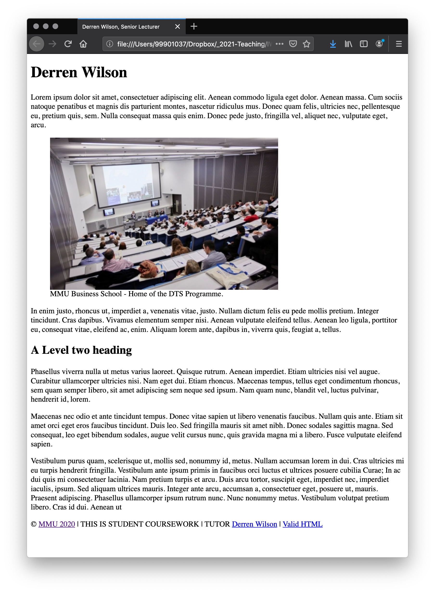

# Single column layout

The single column provides the basic structure for many web pages. In the second assessment we will develop this further to provide a responsive solution. At this stage we will use it to apply the basic styles learnt during these two books.

> Note: We are creating the following page for a desktop browser. The standard is now to create a responsive design for all device sizes.

<!-- div class="exercise" -->
## Exercise 16 

> Single column layout - HTML.

### Task 1 

- Open the `css16` folder in Visual Studio Code.

- Create a new HTML file called `exercise-16.html`.

- Use the Emmet short cut to create a basic HTML document.

    + `!` + Tab

This should give you:

```
<!DOCTYPE html>
<html lang="en">
<head>
    <meta charset="UTF-8">
    <meta name="viewport" content="width=device-width, initial-scale=1.0">
    <title>Document</title>
</head>
<body>
    
</body>
</html>
```

- Change the page title to:

```
<title>CSS Single Column Layout</title> 
```

- Save `exercise-16.html`.

### Task 2

- Add the following to the body of `exercise-16.html`.

```
<div class="wrapper">

    <header class="page-header">
    <!-- This is where the header information is situated. -->
    </header>

    <main class="page-content">
    <!-- This is where the main content of the page is situated. -->
    </main>

    <footer class="page-footer">
    <!-- This is where the footer information is situated. -->
    </footer>

</div>
```

- This provides a simple, semantic structure to our page.

- Each element contains a class to enable styling. Why use a class, not the element? More on this later.

- Save `exercise-16.html`.

- Of course, if you now view `exercise-16.html` in a browser there will be
nothing to see, as the page contains no content. We will fix that next.

### Task 3

- Creating content.

- Add a Level 1 heading to the `header`. Use your name and job title.

```
<header class="page-header">
          <h1>Firstname Lastname, Job Title</h1>
</header>
```
- Save `exercise-16.html`.

### Task 4

- Add five paragraphs of dummy text the the `main` section, each wrapped in the `<p>` element.

- Use the site [www.blindtextgenerator.com](https://www.blindtextgenerator.com/lorem-ipsum) to create the lorem ipsum.

- Options - select the following:

    + Lorem Ipsum
    + 300 words
    + 5 paragraphs
    + Display `<p>` tags

- Copy & paste the resulting text into the `main` section.

- Save `exercise-16.html`.

### Task 5

- Add a Level 2 heading between paragraphs 2 and 3. Use the following code:

```
<h2>A Level two heading</h2>
```

- Save `exercise-16.html`.

### Task 6

- Add the following paragraph to the `footer`.

```
<p>&copy; <a href="http://www.mmu.ac.uk/" title="MMU homepage">MMU 2020</a> | THIS IS STUDENT COURSEWORK | TUTOR <a href="mailto:d.j.wilson@mmu.ac.uk">Derren Wilson</a> | <a href="http://validator.w3.org/check?uri=referer" title="W3C HTML Validation Service" >Valid HTML</a> </p>
```

- Save `exercise-16.html` and view it in your browser.

### Task 7

- Insert the image `lecture-theatre.jpg` located in the `img` folder, between the first and second paragraph.

- Add the `alt="MMU lecture theatre"`.

- Add the height and width attributes - Tip VSC will show you the dimensions.

- Place the image inside the `<figure>` element.

- Add the `figcaption` of:

```
    <figcaption>
        MMU Business School - Home of the DTS Programme.
    </figcaption>
```

- Remember that both `` and `<figcaption>` sit *inside* the `<figure>` element.

- Save `exercise-16.html` and view it in your browser to check the image loads.

<figure>

<figcaption>
You should now have a basic page of 2 headings, 3 paragraphs and an image.
</figcaption>
</figure>

### Task 8

- Validate `exercise-16.html` via the [File Upload](https://validator.w3.org/#validate_by_upload).

- Fix any errors before moving on.

<!-- end div -->

## Semantic page structure

HTML5 introduced a number of new 'semantic' elements that act as containers for key parts of the standard web page. They include `header`, `main` and `footer` as used in our page.

Prior to HTML5 our page structure would have looked something like this:

```
    <div class="wrapper">

        <div class="header"> </div>

        <div class="content"> </div>

        <div class="footer"> </div>

    </div>
```

- Each section of our page would be created with a separate `<div>` with a relevant name applied with a class. 

- The structure would have the same effect (it would look the same) but the sections would have no semantic meaning.

It’s worth knowing this as you’ll see a lot of legacy code like this for many years to come in the workplace.

HTML5 has taken the most commonly used class names to create the semantic page elements such as class="footer" becoming `<footer>`. Giving these elements a semantic meaning enables the browser and assistive technologies to understand the structure of the page.

As an example, a blind iPhone (iOS) user has the ability to skip around the structure of a page using the Rotor facility. When selecting Landmarks with the Rotor the user can navigate the page via the `header`, `main` and `footer` elements, much as a sighted person might skim around the page visually.

Learn more about the [Voice Over rotor on iPhone and iPad](https://support.apple.com/en-gb/HT204783) from Apple.

## Why add a class to these semantic elements? 

**Good question!**

Even though we have an element that describes the function of that section of the page we have still applied a class. For example:

```
<header class="page-header">
```

Why not just apply styles to the `<header>` element?

Current thinking in coding says that applying styles directly to a generic element such as `<header>` is wrong (it exhibits poor selector intent – says [Harry Roberts - @CSSwizardry](https://csswizardry.com/)).

### The reasoning?

A page or site may end up containing more than one `<header>`; using a class ensures we are targeting that specific `<header>`.

Actually, applying styles direct to these elements on a small site like the one we are creating would usually be fine! However, we have chosen to adhere to best practices for consistency and flexibility.

### Who is Harry?

Harry Roberts, a friend of the ours is a Consultant Front-end Architect, writer, and speaker. He helps companies all over the world write better quality, more manageable, more scalable user interfaces. He tweets as [@CSSwizardry](https://twitter.com/csswizardry) and writes about CSS at [csswizardry.com](https://csswizardry.com/). harry also has an excellent site called  [CSS Guidelines](https://cssguidelin.es/) which details best practices in writing efficient CSS.


## Applying CSS

<!-- div class="exercise" -->
## Exercise 16 continued

> Single column layout - CSS.

### Task 1 

- Return to the `css16` folder in Visual Studio Code.

- Create a new CSS file called `style.css` on the root of the site.

### Task 2

- Link to `style.css` from `exercise-16.html`.

- Use the red border style to test the link is working, and to get an overview of all the boxes.

```
* {
    border: 1px solid red;
}
```

- Save `style.css` and `exercise-16.html`.

- Refresh `exercise-16.html` to view.

### Task 3

- Something to try at this stage, especially if new to CSS.

- Use the red border trick to see the various boxes one at a time. 

- Headings and paragraphs you are probably OK with so start with the `.wrapper` class then try the semantic elements including `header`, `main`, `figure` and `footer`.

- Start with:

```
.wrapper {
    border: 1px solid red;
}
```
- Save `style.css` and refresh `exercise-16.html` in the browser.

- Then try:

```
header {
    border: 1px solid red;
}
```

- Note that there is no dot (`.`) as this is an element selector, not a class - although we could equally target the class `page-header`.

- And so on, to get a good idea of the box that each element creates.

> Remember that the red border is a great way to work things out when you are confused which box is which.

### Task 4

- Remove the red border style completely, unless you think it might help.

- Apply the font-size hack that means all rems will = `10px`. If you don't think you need it, then don't.

- Do add `margin:0` as this get rid of the annoying defaults.

```
html{
    font-size: 10px;
    margin: 0;
}
```
- Save `style.css` and refresh `exercise-16.html` in the browser.

### Task 5

- Apply base style to the `body`. These should include:

    + font-family
    + colour
    + font-size
    + line height
    + background colour
    + max-width
    + margins

#### Note

- Implement a [Google Font](https://fonts.google.com/) for the font family. Remember to add the code they provide to both the HTML and CSS files.

- Select an off-white colour for the background (`background-color`).

- Select a dark grey colour for the foreground colour (`color`).

- Check that the colour contrast is sufficient between the two colours you select using the [WebAIM Contrast Checker](https://webaim.org/resources/contrastchecker/). Enter the code for your chosen colours. They must <span style="background-color: #080; border-radius: 1em; color: #FFF; padding: 2px 8px">Pass</span> for normal and large text, and Graphical Objects and User Interface Components.

- Good colour contrast is an important part of creating accessible content.

- Set the `font-size` in `rems`. Focus on the size you want for the paragraph text, text in lists etc.

- Let the line height that works with your font choice and font size. Usually start at `1.4` and adjust as needed.

- Margins - use the ` margin: 0 auto;` trick to centre your content.

- Set the `max-width` to get a good line length. `900px`? Use the 65 character paragraph to help you set it.

```
<p class="box">01234567890123456789012345678901234567890123456789012345678912345</p>
```

- Save `style.css` and refresh `exercise-16.html` in the browser.

### Task 6

- Style your headings, both `h1` and `h2`. This might include `font-family`, colour, size, and margins.

- **Tip** - Your headings (and text) can often go much larger than you think.

- Remember to group common styles. For example:

```
h1,h2 {
    common styles
}

h1{
    individual styles
}
```
- Save `style.css` and refresh `exercise-16.html` in the browser.

### Task 7

- Apply a dark `background-color` to the footer using the class `page-footer`. 

- Apply a light colour to the footer text.

- Do the same to the `a:link`, `a:visited` and `a:hover` pseudo link states.

- Again ensure that the colour contrast passes the test for each colour used. Use the WebAIM [Link Colour Contrast Checker](https://webaim.org/resources/linkcontrastchecker/?fcolor=0000FF&bcolor=FFFFFF).

### Task 8

- Apply a class to the `<figcaption>` element and style the caption text.

- Adjust the margins and padding of both the `<figure>` and `<figcaption>` elements to best suit your design.

- Maybe apply `float: left` to the `<figure>` element? 

> Note: the `float` may cause layout issues. If does, fix it or remove it. We don't mind.

### Task 9

- Add Navigation

- Insert the `<nav>` element between the `header` and `main` elements on the page.

- Give it a class of `page-nav`.

- Insert an un-ordered list containing two list items (try Emmet shortcut - `ul>li*2`):

```
    <li>Home</li>
    <li>About</li>
```
- Give the `<ul>` a class of `menu`.

-  Adjust `<ul>` to best fit your design.

```
ul.menu {
}
```

- Style the list items to: 

```
.menu li {
    list-style: none;
    display: inline;
    margin-right: 20px;
}
```

- Adjust to best fit your design.


### Task 10

- Work out how to apply CSS Columns to the final three paragraphs to make them flow in three columns across the page. 

<!-- end div -->

<p class="submit-work">Exercise 16 completed</p>

## Checklist

Checklist - [Download the checklist](media/checklist.pdf) for this exercise to enable you to check that you have fulfilled exercise the brief.

End
