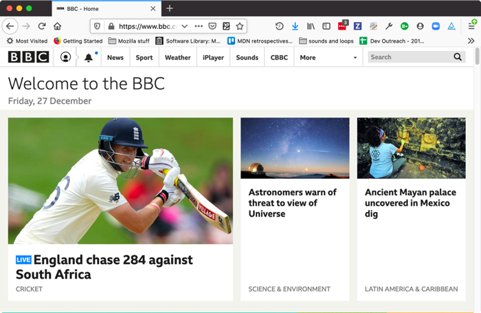

# Links

## What is a hyperlink?

Hyperlinks are one of the most exciting innovations the Web has to offer. Well, they've been a feature of the Web since the very beginning, but they are what makes the Web a Web — they allow us to link our documents to any other document (or other resource) we want to, we can also link to specific parts of documents, and we can make apps available at a simple web address (contrast this to native apps, which have to be installed and all that business.) Just about any web content can be converted to a link, so that when clicked (or otherwise activated) it will make the web browser go to another web address (URL).

> Note: A URL can point to HTML files, text files, images, text documents, video and audio files, and anything else that can live on the Web. If the web browser doesn't know how to display or handle the file, it will ask you if you want to open the file (in which case the duty of opening or handling the file is passed to a suitable native app on the device) or download the file (in which case you can try to deal with it later on.) For eample, everyone using the web has at some point clicked on a link to `pdf` file and the computer has wanted to open it in *Adobe Acrobat Reader* (the native app).

The BBC homepage, for example, contains a large number of links that point not only to multiple news stories, but also different areas of the site (navigation functionality), login/registration pages (user tools) and more.




## Anatomy of a link

A basic link is created by wrapping the text (or other content, see Block level links) you want to turn into a link inside an `<a>` element, and giving it an href attribute (also known as a Hypertext Reference , or target) that will contain the web address you want the link to point to.

```
<p>I'm creating a link to
<a href="https://www.mozilla.org/en-US/">the Mozilla homepage</a>.
</p>
```

> This gives us the following result:

<p>I'm creating a link to
<a href="https://www.mozilla.org/en-US/">the Mozilla homepage</a>.
</p>

### Adding supporting information with the title attribute

Another attribute you may want to add to your links is title; this is intended to contain supplementary useful information about the link, such as what kind of information the page contains, or things to be aware of. For example:

```
<p>I'm creating a link to
<a href="https://www.mozilla.org/en-US/"
   title="The best place to find more information about Mozilla's mission and how to contribute">the Mozilla homepage</a>.
</p>
```

> This gives us the following result (the title will come up as a tooltip when the link is hovered over):

<p>I'm creating a link to
<a href="https://www.mozilla.org/en-US/"
   title="The best place to find more information about Mozilla's
          mission and how to contribute">the Mozilla homepage</a>.
</p>

> Note: A link title is only revealed on mouse hover, which means that people relying on keyboard controls or touchscreens to navigate web pages will have difficulty accessing title information. If a title's information is truly important to the usability of page, then you should present it in a manner that will be accessible to all users, for example by putting it in the regular text.


## Block level links

As mentioned before, you can turn just about any content into a link, even block level elements. If you had an image you wanted to turn into a link, you could just put the image between `<a></a>` tags.

```
<a href="https://www.mozilla.org/en-US/">
  
</a>
```

> Note: You'll find out a lot more about using images on the Web in a future article.

## Task One - Basic links


<h2 class="deep">Deeper Learning</h2>

To get a better understanding of this topic use the following resources.

- LinkedIn Learning Video: [Jen Simmons - Links](https://www.linkedin.com/learning/html-essential-training-4/links?u=36102708) (4m 49s)

- MDN: `<a>` - [The Anchor element](https://developer.mozilla.org/en-US/docs/Web/HTML/Element/a)


### &copy; Credit given

Materials used under the Creative Commons licence from [MDN Web Docs](https://developer.mozilla.org/en-US/docs/Web/HTML).