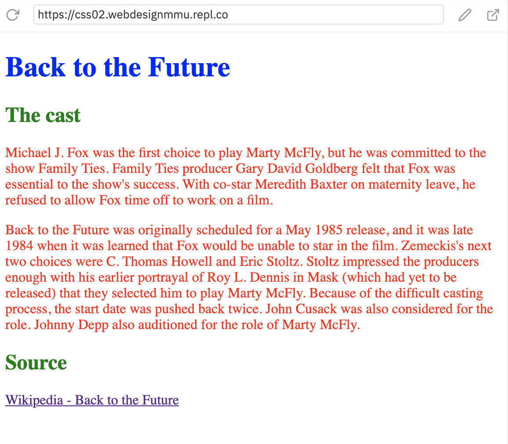

# Applying CSS to HTML

## Inline styles

Inline styles are CSS declarations that affect a single HTML element, contained within a style attribute. The implementation of an inline style in an HTML document might look like this:

```
<!DOCTYPE html>
<html lang="en-GB">
  <head>
    <meta charset="utf-8">
    <title>My CSS experiment</title>
  </head>
  <body>

    <h1 style="color: blue; background-color: yellow; border: 1px solid black;">Hello World!</h1>

    <p style="color:red;">This is my first CSS example</p>

  </body>
</html>
```
The style goes right inside the tag:

```
<p style="color:red;">
```

<h3 class="warning">Avoid inline styles</h3>

Avoid using CSS in this way when possible. It is the opposite of a best practice. First, it is the least efficient implementation of CSS for maintenance. One styling change might require multiple edits within in a single web page. Second, inline CSS also mixes (CSS) presentational code with HTML and content, making everything more difficult to read and understand. Separating code and content makes maintenance easier for all who work on the the website.

There are a few circumstances where inline styles are more common. You might have to resort to using inline styles if your working environment is very restrictive. For example, perhaps your CMS only allows you to edit the HTML body. You may also see a lot of inline styles in HTML email to achieve compatibility with as many email clients as possible.


## Internal stylesheet

An internal stylesheet resides within an HTML document. To create an internal stylesheet, you place CSS inside a `<style>` element contained inside the HTML `<head>`.

The HTML for an internal stylesheet might look like this:

```
<!DOCTYPE html>
<html>
  <head>
    <meta charset="utf-8">
    <title>My CSS experiment</title>
    <style>
      h1 {
        color: blue;
        background-color: yellow;
        border: 1px solid black;
      }

      p {
        color: red;
      }
    </style>
  </head>
  <body>
    <h1>Hello World!</h1>
    <p>This is my first CSS example</p>
  </body>
</html>
```

This time all of your style rules sit within the `<style>` element, in the `head` of your page.

```
  <head>
    <meta charset="utf-8">
    <title> </title>
    <style>

    Your styles...

    </style>
  </head>
```

In some circumstances, internal stylesheets can be useful. For example, perhaps you're working with a content management system where you are blocked from modifying external CSS files.

<h3 class="warning">Also avoid internal styles</h3>

But for sites with more than one page, an internal stylesheet becomes a less efficient way of working. To apply uniform CSS styling to multiple pages using internal stylesheets, you must have an internal stylesheet in every web page that will use the styling. The efficiency penalty carries over to site maintenance too. With CSS in internal stylesheets, there is the risk that even one simple styling change may require edits to multiple web pages.


## External stylesheet

An external stylesheet contains CSS in a separate file with a .css extension. This is the most common and useful method of bringing CSS to a document. You can link a single CSS file to multiple web pages, styling all of them with the same CSS stylesheet. In the last chapter we linked an external stylesheet to our web page.

You reference an external CSS stylesheet from an HTML `<link>` element:

```
<!DOCTYPE html>
<html>
  <head>
    <meta charset="utf-8">
    <title>My CSS experiment</title>
    <link rel="stylesheet" href="styles.css">
  </head>
  <body>
    <h1>Hello World!</h1>
    <p>This is my first CSS example</p>
  </body>
</html>
```

In this example:

```
<link rel="stylesheet" href="styles.css">
```

- The `<link>` element is placed in the `head`, just under the `<title>` element.

- `rel="stylesheet"` simply indicates the relatonship of this linked document is as a *stylesheet*.

- Then as usual, `href=""` links to the source document - the stylesheet. In this case it is a CSS file called `style.css`.

> Note: Like our `HTML` files, `CSS` files are just plain text files with the file extension `.css`.


The CSS stylesheet file might look like this:
```
h1 {
  color: blue;
  background-color: yellow;
  border: 1px solid black;
}

p {
  color: red;
}
```
> Note: the CSS file contains no html - hence we have `h1` not `<h1>` as the element selector.

### The correct path

The `href` attribute of the `<link>` element needs to reference a file on your file system. In the example above, the CSS file is in the same folder as the HTML document, but you could place it somewhere else and adjust the path. Here are two examples:

- Inside a subdirectory called styles inside the current directory (as per Repl.it)
```
<link rel="stylesheet" href="styles/style.css">
```

- Go up one directory level, then inside a subdirectory called styles
```
<link rel="stylesheet" href="../styles/style.css">
```
### The file name

- We are using `style.css`

- It can be anything, but keep it short as you may be typing it a lot. Less room for error.

- No spaces or strange characters.

- Make sure it has the `.css` file extension.

<!-- div class="exercise" -->
## Exercise One

> Apply inline, internal and external CSS.

### Task 1

- Open the exercise files in another browser window - [Repl.it - Applying CSS](https://repl.it/@webdesignmmu/css03) 

> using what you have learnt above add three styles to this document, using the inline, internal and external methods.

### Task 2

- Add an inline style that makes the `<h1>` heading **blue**.

- Remember - the `style=""` attribute goes right in the opening tag of the `<h1>` element.

### Task 3

- Add an internal style that makes the `<h2>` headings **green**.

- Remember - the `<style></style>` element goes in the head of the html document.

- Remember - the style rule sits inside those `style` tags.

### Task 4

- Add an external style that makes the paragraph text **red**.

- Remember - the style rule goes in the file `style.css`

- Remember - you need to link to `style.css` in the head of your `html` file using the `<link>` element.

> Stuck with the syntax of any of these styles? Just scroll up the page to see our examples of inline, internal and external styles.

<figure>

<figcaption>
You should end up with a page like this. Validate the HTML to look for errors.
</figcaption>
</figure>

<!-- end div -->


<h2 class="deep">Deeper Learning</h2>

To get a better understanding of this topic use the following resources.


### &copy; Credit given

Materials used under the Creative Commons licence from [MDN Web Docs](https://developer.mozilla.org/en-US/docs/Web/HTML).