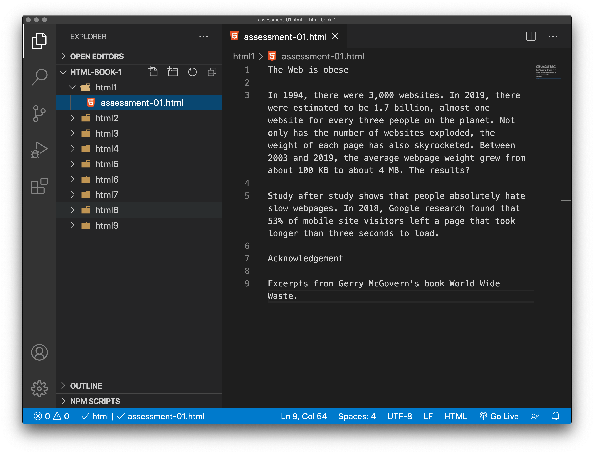
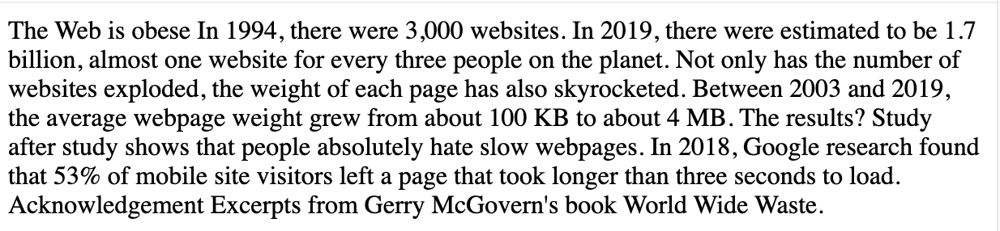
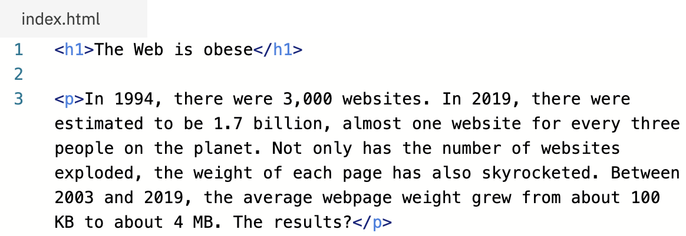

# HTML Introduction

> Exercise Files - [HTML Book One](media/html-book-1.zip).

## How to use the Exercise Files

Download the zip file and unzip the content onto the computer you are using to complete them. Work through the exercises as described below. **These exercises form part of your assessment**, so keep the complete files safe: you might want to [upload them to your Manchester Met oneDrive](https://www.mmu.ac.uk/isds/support/account/files/) as a back-up once they are completed.

<!-- div class="video" -->

## Before you start 

> You are welcome to watch the following short videos. These will help you better understand the rest of this chapter.

- LinkedIn Learning Video: Jen Simmons, [What is HTML?](https://www.linkedin.com/learning/html-essential-training-4/what-is-html?u=36102708) 1m 34s

- LinkedIn Learning Video: Jen Simmons, [The role of HTML](https://www.linkedin.com/learning/html-essential-training-4/the-role-of-html?u=36102708) 4m 29s

<!-- end div -->

## Structure

Whether you are reading a book, a web page or creating your own documents in MSWord, the document is going to have structure. The structure and the space it creates enhances the readability, helps us navigate a document and helps us to identify various elements or sections of a document. 

This may include headings and sub-headings which help break up the document, helping us to identify themes and relevant sections. It can also be simple paragraph breaks that breathe space into the document, helping us to read the text.

We may create sections, lists and tables to divide and illustrate the content. Without noticing it, the care and attention paid in creating a good structure makes any document much easier for us to deal with as the reader.

Someone with a visual impairment may use a computer to read out a document aloud. Again, having the correct structure will help the user navigate to the relevant parts of the page, document or book. Like we might do visually, a screen reader can navigate from heading to sub-heading to jump around a page.

Anyone with a cognitive impairment will be aided by a clear and obvious structure for what might otherwise look like a complex document. Simplicity and clarity of course helps us all.

### This is not about design


At this stage we are not talking about design, the use of space, typography and colour. We are simply talking about describing documents. This is a heading, this is a paragraph, this is the sub-heading, this is the main body of the documents and this is the footer of the document or page.

This is what HTML does. It is a mark-up language that gives us a method to describe to the browser (the computer) the structure of the page. And if the browser doesn’t understand that markup, it ignores it. This has been essential to the development of the World Wide Web.

<!-- div class="exercise" -->

## To do - Looking at page structure

> Take a quick look through one of Trent Walton's articles, [Device Agnostic](https://trentwalton.com/2014/03/10/device-agnostic/). 

- What you are seeing is a well structured document (headings, paragraphs, lists, blockquotes), with some high quality design applied on top. This is the top level to aspire to!
- Take away that styling and you are left with a well formed, semantic HTML document. You are about to learn how to build such documents.


<!-- end div -->

In this next task we ask to you actually read the text as well as look at the structure.

<!-- div class="exercise" -->

## To do - Reslient web design

> Read the first Chapter of Jeremy Keith’s book, [Reslient web design. Chapter One: Foundations](https://resilientwebdesign.com/chapter1/). 

As you read this chapter (*it's very relevant to what we are doing*), look at the structure of the page. It has a main (Level 1) heading - *Chapter 1: Foundations* followed by five sub (Level 2) headings including *Let’s share what we know*; *Net value; Hyperspace*; *Mark me up, mark me down*; *References*. 
The text itself is set in paragraphs of various sizes, interspersed with a number of illustrations with captions.

### The structure of this chapter


This illustration, created via the HTML Validation Service plots both the page structural outline and heading level outline. We cover headings in the next section.

<!-- ### Quiz - Did you read the chapter?

<iframe width="640px" height= "480px" src= "https://forms.office.com/Pages/ResponsePage.aspx?id=UPs_KAujjEiQ9M2uT3rm0Z9V7jLeDDFMmZMGd1T81SNUNUtGNUdUVENBN0laNVpaNU0xN0VWVTFDMy4u&embed=true" frameborder= "0" marginwidth= "0" marginheight= "0" style= "border: none; max-width:100%; max-height:100vh" allowfullscreen webkitallowfullscreen mozallowfullscreen msallowfullscreen> </iframe> -->

<!-- end div -->

## What is Markup

<blockquote cite="https://en.wikipedia.org/wiki/Markup_language">
<p>In computer text processing, a markup language is a system for annotating a document in a way that is syntactically distinguishable from the text, meaning when the document is processed for display, the markup language is not shown, and is only used to format the text. The idea and terminology evolved from the "marking up" of paper manuscripts (i.e., the revision instructions by editors), which is traditionally written with a red or blue pencil on authors' manuscripts. Such "markup" typically includes both content corrections (such as spelling, punctuation, or movement of content), and also typographic instructions, such as to make a heading larger or boldface.</p>

<p>In digital media, this "blue pencil instruction text" was replaced by tags which ideally indicate what the parts of the document are, rather than details of how they might be shown on some display. This lets authors avoid formatting every instance of the same kind of thing redundantly (and possibly inconsistently). It also avoids the specification of fonts and dimensions which may not apply to many users (such as those with different-size displays, impaired vision and screen-reading software).</p>

<p>Wikipedia</p>
</blockquote>

## What is HTML?

> *Let’s add some structure to our first document for the web* - but before we start coding we need to understand the syntax of HTML.

HTML (Hypertext Markup Language) is not a programming language. It is a markup language that tells web browsers how to structure the web pages you visit. It can be as complicated or as simple as the web developer wants it to be. HTML consists of a series of elements, which you use to enclose, wrap, or mark up different parts of content to make it appear or act in a certain way. The enclosing tags can make content into a hyperlink to connect to another page, italicize words, and so on.  For example, consider the following line of text:

```
My cat is very grumpy.
```

If we wanted the text to stand by itself, we could specify that it is a paragraph by enclosing it in a paragraph  (`<p>`) element:

```

<p>My cat is very grumpy.</p>

``` 

> **Note:** Tags in HTML are case-insensitive. This means they can be written in uppercase or lowercase. For example, a `<title>` tag could be written as `<title>`, `<TITLE>`, `<Title>`, `<TiTlE>`, etc., and it will work. However, it is best practice to write all tags in lowercase for consistency, readability, and other reasons.


## Anatomy of an HTML element

Let's further explore our paragraph element from the previous section:


### The anatomy of our element is as follows:

- **The opening tag**: This consists of the name of the element (in this example, p for paragraph), wrapped in opening and closing angle brackets. This opening tag marks where the element begins or starts to take effect. In this example, it precedes the start of the paragraph text.

- **The content**: This is the content of the element. In this example, it is the paragraph text.

- **The closing tag**: This is the same as the opening tag, except that it includes a forward slash before the element name. This marks where the element ends. Failing to include a closing tag is a common beginner error that can produce peculiar results.

- The **element** is the opening tag, followed by content, followed by the closing tag.

<!-- div class="video" -->

## To do - Syntax of HTML elements

> Watch the following short video for a deeper understanding of the syntax.

- LinkedIn Learning Video: [Jen Simmons - The syntax of the HTML elements](https://www.linkedin.com/learning/html-essential-training-4/the-syntax-of-html-elements?u=36102708) -  4m 56s

<!-- end div -->


<!-- div class="exercise" -->

## Exercise 1

To mark-up a simple document with HTML heading and paragraph elements to create some structure to the page in the browser.


### Task 1

> Open the `html1` folder.

- Open `exercise-01.html` in your editor.


<figure>

<figcaption>
The Visual Studio Code (VSC)editor window.
</figcaption>
</figure>

Our file (`exercise-01.html`) contains excerpts from [Gerry McGovern’s book World Wide Waste](https://gerrymcgovern.com/worldwidewaste/). It consists of a main heading, two paragraphs, a sub-heading and another paragraph.

```
The Web is obese

In 1994, there were 3,000 websites. In 2019, there were estimated to be 1.7 billion, almost one website for every three people on the planet. Not only has the number of websites exploded, the weight of each page has also skyrocketed. Between 2003 and 2019, the average webpage weight grew from about 100 KB to about 4 MB. The results?

Study after study shows that people absolutely hate slow webpages. In 2018, Google research found that 53% of mobile site visitors left a page that took longer than three seconds to load. 

Acknowledgement

Excerpts from Gerry McGovern's book World Wide Waste.
```

### Task 2

- Open a web browser - preferably Chrome or Firefox

> Safari on Mac will be fine, Edge on PC is also OK... Internet Explorer is best avoided for any web development.

- Drag `exercise-01.html` from the `html01` folder on to the browser window.

- The page displays but there is no structure to the page.



As you can see, the browser ignores the space between the headings and paragraphs that we see in the editor. There is simply a single space between each word.

This is because there are no elements to give the content structure, so the browser does not know what is a heading and what is a paragraph. 

<!-- end div -->

## Why do we need structure?

- Users looking at a web page tend to scan quickly to find relevant content, often just reading the headings to begin with (we usually spend a very short time on a web page). If they can't see anything useful within a few seconds, they'll likely get frustrated and go somewhere else.

- Search engines indexing your page consider the contents of headings as important keywords for influencing the page's search rankings. Without headings, your page will perform poorly in terms of SEO (Search Engine Optimization).

- Severely visually impaired people often don't read web pages; they listen to them instead. This is done with software called a screen reader. This software provides ways to get fast access to given text content. Among the various techniques used, they provide an outline of the document by reading out the headings, allowing their users to find the information they need quickly. If headings are not available, they will be forced to listen to the whole document read out loud.

- To style content with CSS, or make it do interesting things with JavaScript, you need to have elements wrapping the relevant content, so CSS/JavaScript can effectively target it.

We therefore need to give our content structural markup.

> **File format:** We are used to file formats such a `.ppt` and `.pdf` as two examples. Our file `index.html` is a plain text file with the file extension `.html`. It can be opened in any text editor such as Notepad on a PC or TextEdit on a Mac. It can be viewed in any web browser, on any internet enabled device. This means that the first HTML pages created by *Sir Tim* back in 1991 can still be viewed in any modern browser on any modern device, with any screen size. Take a look at the page [What is HyperText?](http://info.cern.ch/hypertext/WWW/WhatIs.html) archived on the CERN servers. The design is plain but the information is still accessible and useable to everyone.

<!-- div class="exercise" -->

## Exercise 1 continued

Creating a Level 1 heading

### Task 1

- Return to `exercise-01.html`

- In the editor window add the `<h1>` tag to the main heading. Putting the closing tag at the end.

```
<h1>The Web is obese</h1>

```

- Save `exercise-01.html`

- Refresh the page in your browser window.

- You should now have a distinct heading. 


- If not, check and amend your code, save and reload the page in the browser.

<!-- end div -->

## Edit, save and refresh

> You will get very familiar with the process of creating, edit files, and then viewing the results in the browser.

### Common student errors

1. Editing a HTML file, forgetting to save.
1. Editing a HTML file, saving but not refreshing in the browser.
1. Editing one version of the file, but viewing another copy in the browser - wondering why the changes haven't appeared!


<!-- div class="exercise" -->

## Exercise 1 continued

Adding paragraphs and a Level Two heading

### Task 1

- Continue with `exercise-01.html`

- In the editor, surround the next two paragraphs with the opening and closing `<p>` tag.

### Task 2

- Wrap a `<h2>` tag around the sub-heading *Acknowledgement*.

- And code up the final paragraph with the `<p>` element.

### Task 3

- Select run to refresh the browser. Your page should now look like this.


> Double check your code - does it look like this? Is each starting and closing tag in place?

```
<h1>The Web is obese</h1>

<p>In 1994, there were 3,000 websites. In 2019, there were estimated to be 1.7 billion, almost one website for every three people on the planet. Not only has the number of websites exploded, the weight of each page has also skyrocketed. Between 2003 and 2019, the average webpage weight grew from about 100 KB to about 4 MB. The results?</p>

<p>Study after study shows that people absolutely hate slow webpages. In 2018, Google research found that 53% of mobile site visitors left a page that took longer than three seconds to load.</p> 

<h2>Acknowledgement</h2>

<p>Excerpts from Gerry McGovern's book World Wide Waste.</p>
```

**If it does, carry on**. If not check that the correct tag is in the correct place. 

<!-- end div -->


<p class="submit-work">Exercise 1 completed</p>


## Syntax highlighting

A good IDE like Visual Studio Code includes *syntax highlighting* which you can see adds colour to the HTML elements, allowing you to spot them , and errors easier.



As things get more complex you will see that further `highlighting` is added and will help you navigate your code.

<!-- div class="exercise" -->

## Exercise - Plain text files

> We are going to take a quick look at the file format used for HTML files - plain text.

### Task 1

- Copy and paste the text (with the coding) from `exercise-01.html` into a blank MSWord document. Save it as a `.docx` file. 

### Task 2

- Take a look - how big is the file size? How many `kilobytes` (kb)?

### Task 3

- Open Notepad (PC) or TextEdit (Mac), paste the same text into a new document and save it as a `.txt` file. 

### Task 4

- Look at the file size.

### The result

Yes, the `plain text` file is much smaller. It doesn't carry all the extra information that an MSWord document contains. It doesn't hold information about fonts or styling like bold. The text is *plain*. This ensures the file size is always small.

Plain text files can also be opened, viewed and edited in a variety applications, on a variety of operating systems. 

Your HTML file is simply a plain text file (usually a `.txt` file), with a `.html` file extension.

*Small and portable - plain text files are the perfect format for the WWW* and a big part of its success.

## File names

> A few things to remember when naming **HTML** files.

1. No spaces - so no `contact page.html`

1. Use hyphens rather than underscore: `contact-page.html` rather than `contact_page.html`

1. Avoid special characters, for example `contact@page.html`

1. No CAPS - `Contact-Page.html` or `ContactPage.html`

1. Decide on a style and be consistent - `contactpage.html` or `contact-page.html`

1. Filenames help Google identify the content, same goes for images - `IMG4455.jpg` is not much use to Google, where 'hereford-bull.jpg' is (if that's what the image contains).


<!-- end div -->

<h2 class="deep">Deeper Learning</h2>

To get a better understanding of this topic use the following resources.

- LinkedIn Learning Video: [Jen Simmons -  Paragraphs](https://www.linkedin.com/learning/html-essential-training-4/paragraphs?u=36102708) (1m 39s)

- MDN: `<p>` - [The Paragraph element](https://developer.mozilla.org/en-US/docs/Web/HTML/Element/p)

- LinkedIn Learning Video: [Jen Simmons -  Formatting html](https://www.linkedin.com/learning/html-essential-training-4/formatting-html?u=36102708) (4m 30s)


<h2 class="books">Books</h2>

- [Learning Web Design](https://www.learningwebdesign.com/) by Jennifer Niederst Robbins is currently our core text. This book covers all we cover with greater depth. 

- [Learn to Code HTML & CSS](https://learn.shayhowe.com/) by Shay Howe is available online and in print. Covers all of the basic HTML and CSS elements and attributes. 

- [HTML & CSS by John Duckett](http://www.htmlandcssbook.com/) is a beautifully illustrated and easy to understand book but it is sadly dated. That said, the illustrations of many of the core elements and attributes are valid and easy to understand.


### &copy; Credit given

Materials used under the Creative Commons licence from [MDN Web Docs](https://developer.mozilla.org/en-US/docs/Web/HTML).