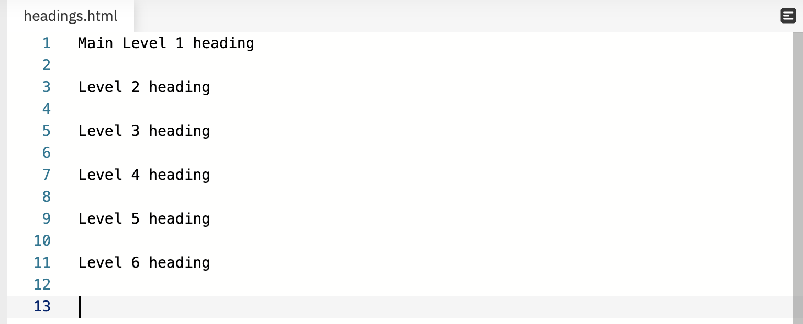
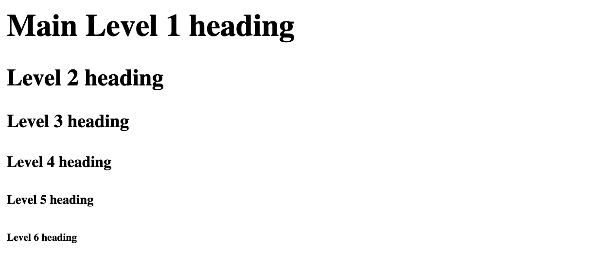

# Headings

There are six heading elements — `<h1>`, `<h2>`, `<h3>`, `<h4>`, `<h5>`, and `<h6>`. Each element represents a different level of content in the document; `<h1>` represents the main heading, `<h2>` represents subheadings, `<h3>` represents sub-subheadings, and so on.

In Jeremy's book, *Resilient Web Design* we looked at Chapter 1: Foundations. On this page the `<h1>` element represented the Chapter title and the `<h2>` elements represented the chapter sub-headings.

All of the sub-headings on that page were `<h2>` because they were of equal importance. You don't just go from `<h1>` to `<h2>` to `<h3>`to `<h4>` to `<h5>`, and `<h6>`.

**This is important**. You select your headings based on level of importance. You are describing the structure of your document to your user and the browser.

It's really up to you what exactly the elements involved represent, as long as the hierarchy makes sense. You just need to bear in mind a few **best practices** as you create such structures:

- Preferably you should just use a single `<h1>` per page — this is the top level heading, and all others sit below this in the hierarchy.
- Make sure you use the headings in the correct order in the hierarchy. Don't use `<h3>` elements to represent subheadings, followed by `<h2>` elements to represent sub-subheadings — that doesn't make sense and will lead to weird results.
- Of the six heading levels available, you should aim to use no more than three per page, unless you feel it is necessary. Documents with many levels (i.e., a deep heading hierarchy) become unwieldy and difficult to navigate. On such occasions, it is advisable to spread the content over multiple pages if possible.

<!-- div class="exercise" -->
## Exercise 2

Apply the six heading elements — `<h1>`, `<h2>`, `<h3>`, `<h4>`, `<h5>`, and `<h6>` to the six headings on the page.

### Task 1

> Open the `html2` folder.

- Open `exercise-02.html` in your editor.

### Task 2

- Wrap each opening and closing tag around each of the six headings listed, going from `<h1>` to `<h6>`. 

- Save the file.

- Drag and drop `exercise-02.html` on to a browser window. 

- Your page should now display like this. The default styles of the browser apply a different font size to each level of heading.

- If your headings look different, look at the example on [The HTML Section Heading elements](https://developer.mozilla.org/en-US/docs/Web/HTML/Element/Heading_Elements#Examples) on MDN and attempt to fix the problem(s). 

<!-- end div -->

Exercise 2 completed

## Visuals

At this stage the web browser is applying all the styles that you see (illustrated above). This includes:

- The font(s) being used.
- The size of each of the headings.
- The margins and line space.

When working with the headings  `<h1>`, `<h2>`, `<h3>`, `<h4>`, `<h5>`, and `<h6>` don't get wrapped up in the sizes. **Never choose to use a heading to because of its default size**, for example wrapping some text in a `<h6>` to produce <small>small text</small>. 

When you start to learn CSS to style your pages, you will find that you can change the styles (font, size, colour etc) of any of these headings. 

<h2 class="deep">Deeper Learning</h2>

To get a better understanding of this topic use the following resources.

- LinkedIn Learning Video: [Jen Simmons - Headlines](https://www.linkedin.com/learning/html-essential-training-4/headlines?u=36102708) (4m 18s)

- MDN: `<h1>` to `<h6>` - [The HTML Section Heading elements](https://developer.mozilla.org/en-US/docs/Web/HTML/Element/Heading_Elements)

### &copy; Credit given

Materials used under the Creative Commons licence from [MDN Web Docs](https://developer.mozilla.org/en-US/docs/Web/HTML).