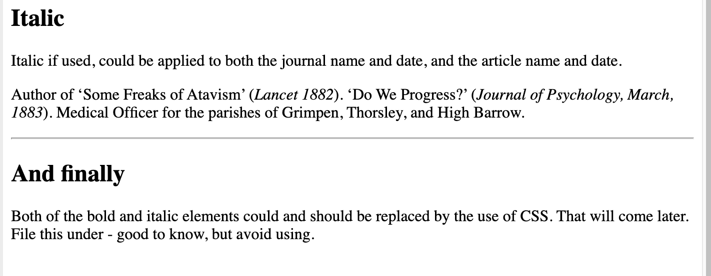

# Nesting, Block and Inline elements

## Nesting elements

Elements can be placed within other elements. This is called nesting. If we wanted to state that our cat is very grumpy, we could wrap the word very in a `<strong>` element, which means that the word is to have strong(er) text formatting:

```
<p>My cat is <strong>very</strong> grumpy.</p>
```

There is a right and wrong way to do nesting. In the example above, we opened the p element first, then opened the strong element. For proper nesting, we should close the strong element first, before closing the p.

The following is an example of the wrong way to do nesting:

```
<p>My cat is <strong>very grumpy.</p></strong>
```

The tags have to open and close in a way that they are inside or outside one another. With the kind of overlap in the example above, the browser has to guess at your intent. This kind of guessing can result in unexpected results.

> The nesting rule is **first in, last out**.

## Block versus inline elements

There are two important categories of elements to know in HTML: block-level elements and inline elements.

- **Block-level elements** form a visible block on a page. A block-level element appears on a new line following the content that precedes it. Any content that follows a block-level element also appears on a new line. Block-level elements are usually structural elements on the page. For example, a block-level element might represent headings, paragraphs, lists, navigation menus, or footers. A block-level element wouldn't be nested inside an inline element, but it might be nested inside another block-level element.

- **Inline elements** are contained within block-level elements, and surround only small parts of the document’s content (not entire paragraphs or groupings of content). An inline element will not cause a new line to appear in the document. It is typically used with text. For example, as an `<a>` element (hyperlink) or emphasis elements such as `<em>` or `<strong>`.

Consider the following example:

```
<em>first</em><em>second</em><em>third</em>

<p>fourth</p><p>fifth</p><p>sixth</p>
```

- This example will look like this:

<em>first</em><em>second</em><em>third</em>

<p>fourth</p><p>fifth</p><p>sixth</p>

`<em>` is an inline element. As you see above, the first three elements sit on the same line, with no space in between. On the other hand, `<p>` is a block-level element. Each p element appears on a new line, with space above and below. (The spacing is due to default CSS styling that the browser applies to paragraphs.)

> Note: Find useful [MDN reference pages](https://developer.mozilla.org/en-US/docs/Web/HTML/Reference) that include lists of block and inline elements. See [Block-level elements](https://developer.mozilla.org/en-US/docs/Web/HTML/Block-level_elements) and [Inline elements](https://developer.mozilla.org/en-US/docs/Web/HTML/Inline_elements). Don't worry, you don't need to memorise them all.

## Empty elements

Not all elements follow the pattern of an opening tag, content, and a closing tag. Some elements consist of a single tag, which is typically used to insert/embed something in the document. For example, the `<hr>` element draws a line onto a page:

<hr> 

Some of the more seasoned coders (like Derren) will remember the self closing version of this element from XHTML.

`<hr />` - we don't need to do this anymore in HTML5.

We will shortly be introducing the image element, `` which is also self closing and one element you will be using frequently.

<!-- div class="exercise" -->
## Exercise 4

Adding emphasis and importance to your HTML document.

### Task 1

> Open the `html4` folder.

- Open `exercise-04.html`in your editor.

- View `exercise-04.html`in a browser.


### Task 2

> We have introduced some common coding errors into our file including:

- incorrect nesting of elements
- missing tags
- incorrect tags

Some of these errors have caused the document to not display as we intended. Some of the errors atcually don't upset the look of the page (the nesting in this case) but still need be fixed for a valid HTML document.

- Work through the code in `exercise-04.html` line by line to identify the errors.
- Fix each error, save and refreshing in the browser to preview the page each time.
- There are just 5 errors to find and correct.

### Solution

- We've highlighted the location of the 5 errors. Once fixed, the page should display as we originally expected.


1. Nesting - the opening`<p>` needs to be before the opening `<strong>`
1. Nesting - the opening`<p>` needs to be before the opening `<b>`
1. Same
1. The closing `</i>` is missing - hence the rest of the text becomes italic
1. The closing `</h2>` is actually another opening `<h2>` - the slash `/` has been missed, hence the rest of the text becoming `<h2>` sized.

A missing or incorrect closing element is a very common error in student code. **Easy to spot, easy to correct**.

### Task 3

> The horizontal rule `<hr>`

- Return to `exercise-04.html`

- Just for completeness we would like you to add a horizontal rule to the page, just about that final `<h2>` on the page.

- It should look like this once your refresh the file in the browser:



When you add a bit of extra code like this always give it some space. For example:

```
for the parishes of Grimpen, Thorsley, and High Barrow.</p>

<hr>

<h2>And finally</h2>

<p>Both 

```


The *spacing* makes it easier for you find `elements` and spot errors.

<!-- end div -->


<p class="submit-work">Exercise 4 completed</p>


<h3 class="warning">Caution - &lt;hr&gt;</h3>

**Note**: the horizontal line is pretty ugly. It can by styled, but is still something to use **very** sparingly. 


<h2 class="deep">Deeper Learning</h2>

To get a better understanding of this topic use the following resources.

- MDN: `<hr>` - [The Thematic Break (Horizontal Rule) element](https://developer.mozilla.org/en-US/docs/Web/HTML/Element/hr)


### &copy; Credit given

Materials used under the Creative Commons licence from [MDN Web Docs](https://developer.mozilla.org/en-US/docs/Web/HTML).