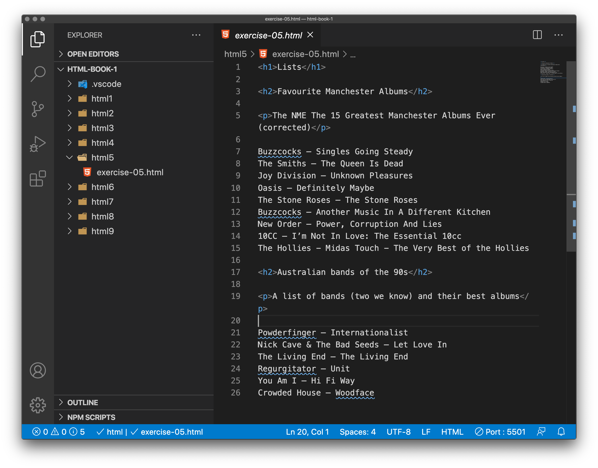

# Lists

Now let's turn our attention to lists. Lists are everywhere in life — from your shopping list to the list of directions you subconsciously follow to get to your house every day, to the lists of instructions you are following in these tutorials! Lists are everywhere on the Web too, and we've got three different types to worry about.

## Unordered

Unordered lists are used to mark up lists of items for which the order of the items doesn't matter — let's take a shopping list as an example.

```
milk
eggs
bread
hummus
```

Every unordered list starts off with a `<ul>` element — this wraps around all the list items:

```
<ul>
milk
eggs
bread
hummus
</ul>
```

The last step is to wrap each list item in a `<li>` (list item) element:

```
<ul>
  <li>milk</li>
  <li>eggs</li>
  <li>bread</li>
  <li>hummus</li>
</ul>
```

## Ordered

Ordered lists are lists in which the order of the items does matter — let's take a set of directions as an example:

```
Drive to the end of the road
Turn right
Go straight across the first two roundabouts
Turn left at the third roundabout
The school is on your right, 300 meters up the road
```

The markup structure is the same as for unordered lists, except that you have to wrap the list items in an `<ol>` element, rather than `<ul>`:

```
<ol>
  <li>Drive to the end of the road</li>
  <li>Turn right</li>
  <li>Go straight across the first two roundabouts</li>
  <li>Turn left at the third roundabout</li>
  <li>The school is on your right, 300 meters up the road</li>
</ol>
```

## Description lists

The third type of list you'll occasionally come across — description lists. The purpose of these lists is to mark up a set of items and their associated descriptions, such as terms and definitions, or questions and answers. Let's look at an example of a set of terms and definitions:

```
Soliloquy

In drama, where a character speaks to themselves, representing their inner thoughts or feelings and in the process relaying them to the audience (but not to other characters.)

Monologue

In drama, where a character speaks their thoughts out loud to share them with the audience and any other characters present.

Aside

In drama, where a character shares a comment only with the audience for humorous or dramatic effect. This is usually a feeling, thought or piece of additional background information
```

Description lists use a different wrapper than the other list types — `<dl>`; in addition each term is wrapped in a `<dt>` (description term) element, and each description is wrapped in a `<dd> `(description definition) element. 

> The finished mark-up of our example:

```
<dl>
  <dt>Soliloquy</dt>

    <dd>In drama, where a character speaks to themselves, representing their inner thoughts or feelings and in the process relaying them to the audience (but not to other characters.)</dd>
  
  <dt>Monologue</dt>

    <dd>In drama, where a character speaks their thoughts out loud to share them with the audience and any other characters present.</dd>

  <dt>Aside</dt>

    <dd>In drama, where a character shares a comment only with the audience for humorous or dramatic effect. This is usually a feeling, thought, or piece of additional background information.</dd>
</dl>
```

The browser default styles will display description lists with the descriptions indented somewhat from the terms. 

> It will look like this:

<dl>
  <dt>Soliloquy</dt>

  <dd>In drama, where a character speaks to themselves, representing their inner thoughts or feelings and in the process relaying them to the audience (but not to other characters.)</dd>

  <dt>Monologue</dt>

  <dd>In drama, where a character speaks their thoughts out loud to share them with the audience and any other characters present.</dd>

  <dt>Aside</dt>

  <dd>In drama, where a character shares a comment only with the audience for humorous or dramatic effect. This is usually a feeling, thought, or piece of additional background information.</dd>

</dl>

> Note that it is permitted to have a single term with multiple descriptions, for example:

```
<dl>
  <dt>Aside</dt>

    <dd>In drama, where a character shares a comment only with the audience for humorous or dramatic effect. This is usually a feeling, thought, or piece of additional background information.</dd>

    <dd>In writing, a section of content that is related to the current topic, but doesn't fit directly into the main flow of content so is presented nearby (often in a box off to the side.)</dd>
</dl>
```

> Which will display in the browser like this:

<dl>
  <dt>Aside</dt>
  <dd style="color: #264b87">In drama, where a character shares a comment only with the audience for humorous or dramatic effect. This is usually a feeling, thought, or piece of additional background information.</dd>
  <dd  style="color: #165416">In writing, a section of content that is related to the current topic, but doesn't fit directly into the main flow of content so is presented nearby (often in a box off to the side.)</dd>
</dl>

We've just added the colour so you can better see the two different definitions. Added styling could make this much more engaging.

<!-- div class="exercise" -->
## Exercise 5

Creating an ordered and unordered list - there is no getting around it. To get used to the syntax for lists, you've got to do them. We will leave out the Description Term element as this is less common.

> Open the `html5` folder.

- Open `exercise-05.html` in your editor.


<figure>

<figcaption>
The Visual Studio Code (VSC) editor window.
</figcaption>
</figure>

### Task 2

- You have two lists to code. First an ordered list (Top 9).

- Use `<ol>` to define the list, then `<li>` for each list item. Check above if you need a reference.

```
Buzzcocks – Singles Going Steady
The Smiths – The Queen Is Dead
Joy Division – Unknown Pleasures
Oasis – Definitely Maybe
The Stone Roses – The Stone Roses
Buzzcocks – Another Music In A Different Kitchen
New Order – Power, Corruption And Lies
10CC – I’m Not In Love: The Essential 10cc
The Hollies - Midas Touch - The Very Best of the Hollies
```
- Save `exercise-05.html` and view the list in a browser.

### Task 3

- Return to `exercise-05.html` in your editor.

- You have a second list of Australian bands and their albums (in no particular order).

- Use `<ul>` to define the list, then `<li>` for each list item. Again, check above if you need a reference.

```
Powderfinger – Internationalist
Nick Cave & The Bad Seeds – Let Love In
The Living End – The Living End
Regurgitator – Unit
You Am I – Hi Fi Way
Crowded House – Woodface
```

- Save `exercise-05.html`, refresh the page in the browser.
 

### Solution

If you've got it right you should see in the browser:

- The first list, numbered
- The second list bulleted

But make sure that:

- There are both opening and closing tags for either `<ol>` and `<ul>`
- There are both opening and closing tags for every `<li>` element.


<!-- end div -->


### Nesting lists 

> It is perfectly ok to nest one list inside another one. You might want to have some sub-bullets sitting below a top-level bullet. 

For example this:

```
<ol>
  <li>Oranges</li>
  <li>Apples
    <ul>
      <li>Granny Smiths</li>
      <li>Pink Ladies</li>
    </ul>
  </li>
    <li>Pears</li>
</ol>
``` 
Note that there is a whole new (sub) list inside the list item Apples. A list within a list.

The code above produces this:

<ol>
  <li>Oranges</li>
  <li>Apples
    <ul>
      <li>Granny Smiths</li>
      <li>Pink Ladies</li>
    </ul>
  </li>
    <li>Pears</li>
</ol>

> Note: numbers and bullets can all be styled by CSS. For example changing the style of bullets to squares or circles, numbers to lower-roman or upper-roman. 


<!-- div class="exercise" -->
## Exercise 5 continued

### Task 1

- Return to `exercise-05.html`

- Using our list of Manchester Band Albums - Nest a list of two more Smiths albums like such: 

<ol>
  <li>Buzzcocks – Singles Going Steady</li>
  <li>The Smiths – The Queen Is Dead
    <ul>
      <li>Meat is Murder</li>
      <li>Strangeways, Here We Come</li>
    </ul>
  </li>
    <li>Joy Division – Unknown Pleasures</li>
</ol>
etc...

- Clue - you list needs to sit within this list element so make space before you start coding the sub-list.

```
  <li>The Smiths – The Queen Is Dead


  </li>
```

- Save and view your completed page.

### Task 2

- Practice makes perfect. Add two more lists to the page. 

- Add a list of 5 of your favourite films (ordered)

### Task 3

- Add a list of 3 places you have visited (unordered)

## Tips

> **Copy & Paste** is your friend in web development

To create these lists it is a lot quicker to copy & paste one of your previous lists.

- copy & paste your list
- Edit the new list
- Swap out the previous list item text for your films or places
- Check your code
- View it in the browser 

> Your completed lists page should include 4 `lists`:

1. `Ordered` list of Manchester Band Albums
  + With indented sub-list of Smiths albums
2. `Unordered` list of Australian bands
3. `Ordered` list of 5 of your favourite films
4. `Unordered` list of 3 of places you've visited
<!-- end div -->


<p class="submit-work">Exercise 5 completed</p>


<h2 class="deep">Deeper Learning</h2>

To get a better understanding of this topic use the following resources.

- LinkedIn Learning Video: [Jen Simmons - Lists](https://www.linkedin.com/learning/html-essential-training-4/lists?autoplay=true&resume=false&u=36102708) (5m 6s)

- MDN: `<ul>` - [The Unordered List element](https://developer.mozilla.org/en-US/docs/Web/HTML/Element/ul)

- MDN: `<li>` - [The List Item element](https://developer.mozilla.org/en-US/docs/Web/HTML/Element/li)

- MDN: `<ol>` - [The Ordered List element](https://developer.mozilla.org/en-US/docs/Web/HTML/Element/ol)

- MDN: `<dl>` - [The Bring To Attention element](https://developer.mozilla.org/en-US/docs/Web/HTML/Element/dl)

- MDN: `<dt>` - [The Description Term element](https://developer.mozilla.org/en-US/docs/Web/HTML/Element/dt)


### &copy; Credit given

Materials used under the Creative Commons licence from [MDN Web Docs](https://developer.mozilla.org/en-US/docs/Web/HTML).


