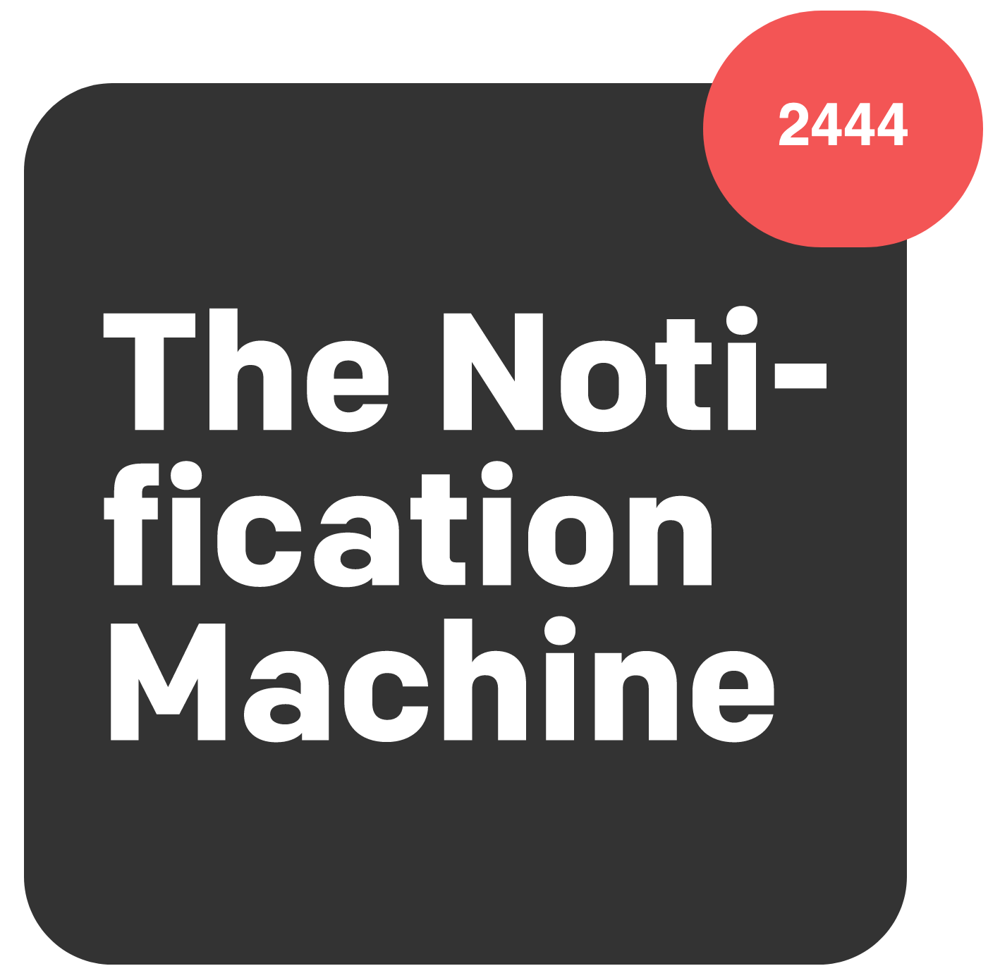

# Semantics

Before starting watch the following short video introduction:

- LinkedIn Learning Video: Jen Kramer [Craft meaningful html](https://www.linkedin.com/learning/crafting-meaningful-html/craft-meaningful-html?u=36102708) (1m 49s)

Our teaching philosophy is pretty much the same as Jen's as you will hear us talking about semantic mark-up a lot. As she says, '*the hypertext markup language is about identifying the types of content on a webpage*'.

In HTML, for example, the `<h1>` element is a semantic element, which gives the text it wraps around the role (or meaning) of "a top level heading on your page."

```
<h1>This is a top level heading</h1>
```

By default, the user agent stylesheet on most browsers will style an `<h1>` with a large font size to make it look like a heading (although you could style it to look like anything you wanted - as we said previously under *Visuals*).


<figure>

<figcaption>
This for example is a &lt;h1&gt; heading, styled. Taken from Trent Walton <a href="https://trentwalton.com/articles/2017/04/10/the-notification-machine.html">The Notification Machine</a>.
</figcaption>
</figure>

On the other hand, you could make any element (such as `<p>`) look like a top level heading. The following styles (CCS - to follow) adjusts a paragraph so it would display the same as the default (larger) heading styles.

```
<p style="font-size: 32px; margin: 21px 0;">Is this a top level heading?</p>
```

> Which would produce: 

<p style="font-size: 32px; margin: 21px 0;">Is this a top level heading?</p>

This looks like a top level heading, but it has no semantic value, so it will not get any of the extra benefits described below. It is therefore a good idea to use the right HTML element for the right job.

> This is actually semantic HTML in a nutshell - *use the right HTML element for the right job*.

HTML should be coded to represent the data that will be populated and not based on its default presentation styling. Presentation (how it should look), is the sole responsibility of CSS.

Some of the benefits from writing semantic markup include:

- Search engines will consider its contents as important keywords to influence the page's search rankings
- Screen readers can use it as a signpost to help visually impaired users navigate a page


When approaching which markup to use, ask yourself, "What element(s) best describe/represent the data that I'm going to populate?" For example, is it a list of data?; ordered, unordered?; does it list out definitions?; is it a figure or image that needs a caption?; etc.

<!-- div class="exercise" -->
## To do - Semantic code

> A quick 4 minute read.

- Paul Boag's article - [Semantic code: What? Why? How?](https://boagworld.com/dev/semantic-code-what-why-how/) - dated 29 November 2005, this is ancient in terms of web development. It is however even more relevant in 2020 with the variety of platforms and devices now available.

<!-- end div -->

<h2 class="deep">Deeper Learning</h2>

To get a better understanding of this topic use the following resources.

- LinkedIn Learning Video: [What are web semantics?](https://www.linkedin.com/learning/html5-structure-syntax-and-semantics/what-are-web-semantics?u=36102708) (2m 10s)

- LinkedIn Learning Video: [Semantic HTML5](https://www.linkedin.com/learning/html5-structure-syntax-and-semantics/semantic-html5?u=36102708) (3m 57s)

- MDN: [Semantics](https://developer.mozilla.org/en-US/docs/Glossary/Semantics)

<h2 class="deep">Advanced Learning</h2>

For students wanting more, we recommend the following topics and resources. 

Students who already have a knowledge of HTML may want to complete the full course on crafting meaningful html. In our experience the area of semantics is something that many self taught coders, and even current professionals ignore.

- LinkedIn Learning Video: Jen Kramer - [Craft meaningful html](https://www.linkedin.com/learning/crafting-meaningful-html/craft-meaningful-html?u=36102708) (1hr 22m)

- You may also find this course on [HTML: Structured Semantic Data interesting](https://www.linkedin.com/learning-login/share?forceAccount=false&redirect=https%3A%2F%2Fwww.linkedin.com%2Flearning%2Fhtml-structured-semantic-data%3Ftrk%3Dshare_ent_url&account=36102708). It's way beyond this unit but for experienced coders it may be a useful additional resource.


### &copy; Credit given

Materials used under the Creative Commons licence from [MDN Web Docs](https://developer.mozilla.org/en-US/docs/Web/HTML).