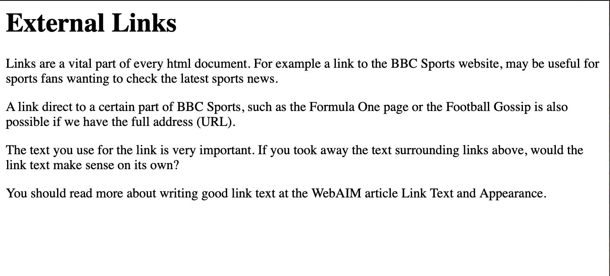
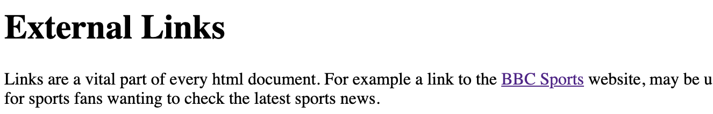
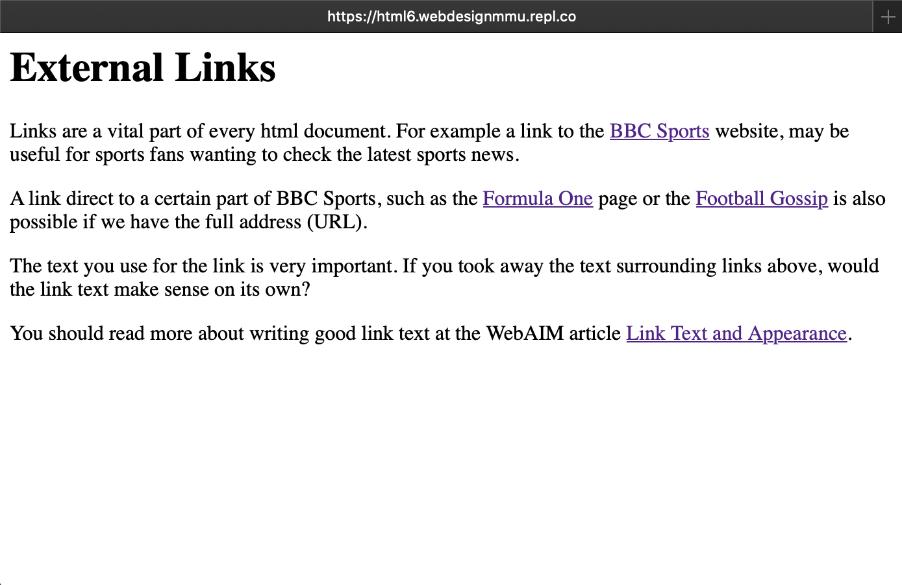

# Links

## What is a hyperlink?

Hyperlinks are one of the most exciting innovations the Web has to offer. Well, they've been a feature of the Web since the very beginning, but they are what makes the Web a Web — they allow us to link our documents to any other document (or other resource) we want to.

We can also link to specific parts of documents, and we can make apps available at a simple web address (contrast this to native apps, which have to be installed and all that business.) Just about any web content can be converted to a link, so that when clicked (or otherwise activated) it will make the web browser go to another web address (URL).

Here for example is a link that takes you all the way to [the end of the internet](http://theendofinternet.com/).

> Note: A URL can point to HTML files, text files, images, text documents, video and audio files, and anything else that can live on the Web. If the web browser doesn't know how to display or handle the file, it will ask you if you want to open the file (in which case the duty of opening or handling the file is passed to a suitable native app on the device) or download the file (in which case you can try to deal with it later on.) For example, everyone using the web has at some point clicked on a link to `pdf` file and the computer has wanted to open it in *Adobe Acrobat Reader* (the native app).

The BBC homepage, for example, contains a large number of links that point not only to multiple news stories, but also different areas of the site (navigation functionality), login/registration pages (user tools) and more.


## Anatomy of a link

A basic link is created by wrapping the text (or other content, see Block level links) you want to turn into a link inside an `<a>` element, and giving it an `href` attribute (also known as a Hypertext Reference, or target) that will contain the web address you want the link to point to.

```
<p>I'm creating a link to
<a href="https://www.mozilla.org/en-US/">the Mozilla homepage</a>.
</p>
```

> This gives us the following result:

<p>I'm creating a link to
<a href="https://www.mozilla.org/en-US/">the Mozilla homepage</a>.
</p>

### Adding supporting information with the title attribute

Another attribute you may want to add to your links is title; this is intended to contain supplementary useful information about the link, such as what kind of information the page contains, or things to be aware of. For example:

```
<p>I'm creating a link to
<a href="https://www.mozilla.org/en-US/"
   title="The best place to find more information about Mozilla's mission and how to contribute">the Mozilla homepage</a>.
</p>
```

> This gives us the following result (the title will come up as a tooltip when the link is hovered over):

<p>I'm creating a link to
<a href="https://www.mozilla.org/en-US/"
   title="The best place to find more information about Mozilla's
          mission and how to contribute">the Mozilla homepage</a>.
</p>

> Note: A link title is only revealed on mouse hover, which means that people relying on keyboard controls or touchscreens to navigate web pages will have difficulty accessing title information. If a title's information is truly important to the usability of page, then you should present it in a manner that will be accessible to all users, for example by putting it in the regular text.


## Block level links

As mentioned before, you can turn just about any content into a link, even block level elements. If you had an image you wanted to turn into a link, you could just put the image between `<a></a>` tags.

```
<a href="https://www.mozilla.org/en-US/">

  

</a>
```

> Note: You'll find out a lot more about using images on the Web in a future chapter.

## Links and accessibility

> Three key points.

- Screen readers generally inform users that a piece of text (or a graphic) is a link 

   - So don't add the word **link** to your link or alt text

- Screen reader users often navigate from link to link, skipping the text in between

   - Links must make sense out of context

- Screen reader users sometimes obtain an alphabetically-organized list of links

   - Each link must be distinguishable - multiple `click here` or `read more` links are no good in a list

> Read more at WebAIM about [Screen Readers and Links](https://webaim.org/techniques/hypertext/#screen_readers). 

<!-- div class="exercise" -->

## Exercise 6

Coding external links

### Task 1

> Open the `html6` folder.

- Open `exercise-06.html`in your editor.

- Open `exercise-06.html`in your browser.

### Task 2

- Before we start creating links, the page needs to be structured with an `<h1>` heading and `<p>` paragraphs.

- Apply the code and save the file. 

- Refresh the browser to view `exercise-06.html`. The page should now look like this:




### Task 3

> Adding links to the page - each of these links lead off our webpage, to someone elses website.


- A link to BBC Sports homepage.

- So for example this link would include:

```
<a href="https://www.bbc.co.uk/sport">BBC Sports</a>
```
- To break this down:

```
<a href="https://www.bbc.co.uk/sport">

BBC Sports

</a>
```
This includes:

- The opening `<a`
- which includes the `href` attribute 
- and the link location `"https://www.bbc.co.uk/sport"` in double quotes 
- the closing of the `a` with `>`
- Next is the link text - `BBC Sports`
- And finally the closing `</a>`

Read this through a few times so that you really understand the stucture of the `anchor` element. The `<a>` wraps around the link text.

- Find BBC Sports in the first paragraph of `exercise-06.html`.

- Wrap the `<a>` element around the text as shown to create a hyper link to `"https://www.bbc.co.uk/sport"`.

- Save `exercise-06.html`.

- Refresh in the browser to view and test the link. 

<figure>

<figcaption>
You should have a link on your page as shown. Select the link - does it go to BBC Sport as expected?
</figcaption>
</figure>


### Task 4 - Just read this

> Our link could use the text in that first paragraph in a variety of ways

```
<a href="https://www.bbc.co.uk/sport">BBC Sports</a>
```

- Is short and sweet, works out of context (on its own)
- Short but not too short - is it big enough `target` to click on, or press on a mobile?

```
<a href="https://www.bbc.co.uk/sport">BBC Sports website</a>
```
- A little longer, perhaps a bigger target?

> It will be up to you as the coder, but remember:

1. A good target size.

1. But not over large - don't link the whole sentence.

1. Works/makes sense out of context.

### Task 5

- Return to `exercise-06.html` in your editor.

- Add two more links to other parts of the BBC Sports website in the next two paragraphs.

- Find the text **Formula One** and turn it into a link using - `https://www.bbc.co.uk/sport/formula1`

- Find the text **Football Gossip** and turn it into a link using - `https://www.bbc.co.uk/sport/football/gossip`

- Save `exercise-06.html`, refresh the page in your browser.

### Task 6

- Add the final link to `exercise-06.html` 

- Create a link to this WebAIM article that provides more information on best practices for link text.

- Find the text **Link Text and Appearance** and turn it into a link using - `https://webaim.org/techniques/hypertext/link_text`

- Save `exercise-06.html`, refresh the page in your browser.

### Solution

<figure>

<figcaption>
Your completed page should look like this, with the links blue (mine are purple because I've already visited them to test). 
</figcaption>
</figure>

- Check before submission - Open in a browser window and click on each link to test it is working. If any fail, go back to your code.

<!-- end div -->


<p class="submit-work">Exercise 6 completed</p>


<h2 class="deep">Deeper Learning</h2>

To get a better understanding of this topic use the following resources.

- LinkedIn Learning Video: [Jen Simmons - Links](https://www.linkedin.com/learning/html-essential-training-4/links?u=36102708) (4m 49s)

- MDN: `<a>` - [The Anchor element](https://developer.mozilla.org/en-US/docs/Web/HTML/Element/a)


### &copy; Credit given

Materials used under the Creative Commons licence from [MDN Web Docs](https://developer.mozilla.org/en-US/docs/Web/HTML).