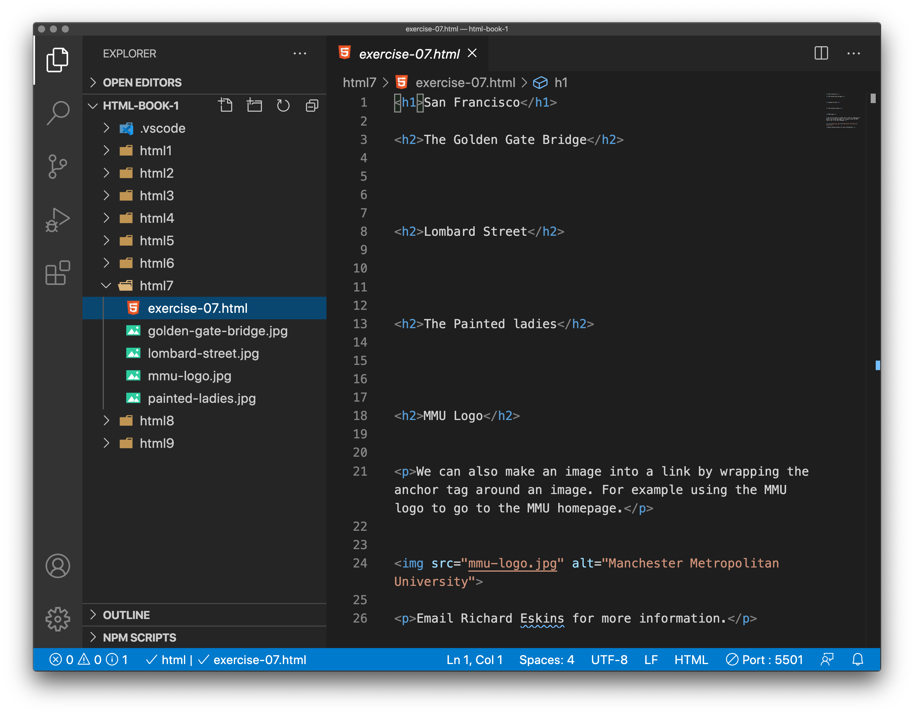
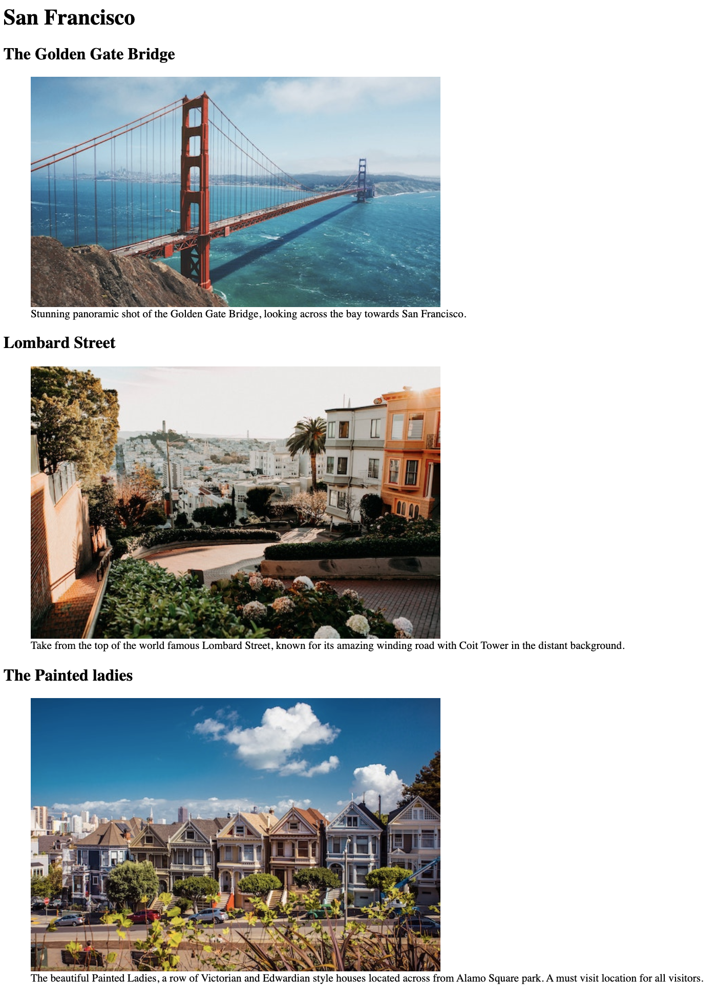

# Images

In the beginning, the Web was just text, and it was really quite boring. Fortunately, it wasn't too long before the ability to embed images (and other more interesting types of content) inside web pages was added. There are other types of multimedia to consider, but it is logical to start with the humble `` element, used to embed a simple image in a webpage. In this article we'll look at how to use it in depth, including the basics, annotating it with captions using `<figure>`, and detailing how it relates to CSS background images.

## How do we put an image on a webpage?

In order to put a simple image on a webpage, we use the `` element. This is an empty element (meaning that it has no text content or closing tag) that requires a minimum of one attribute to be useful — src (sometimes spoken as its full title, source). The src attribute contains a path pointing to the image you want to embed in the page, which can be a relative or absolute URL, in the same way as href attribute values in `<a>` elements.

So for example, if your image is called `dinosaur.jpg`, and it sits in the same directory as your HTML page, you could embed the image like so:

```

```

If the image was in an `images` subdirectory, which was inside the same directory as the HTML page (which Google recommends for SEO/indexing purposes), then you'd embed it like this:

```

```
And so on.

Our above code would give us the following result in a browser:


> Note: Search engines also read image filenames and count them towards SEO. Therefore, you should give your image a descriptive filename; `dinosaur.jpg` is better than `img835.png`.

### Using an absolute URL

You could embed the image using its absolute URL, for example:

```

```

But this is pointless, as it just makes the browser do more work, looking up the IP address from the DNS server all over again, etc. You'll almost always keep the images for your website on the same server as your HTML.


<h3 class="warning">Copyright</h3>

> Warning: Most images are copyrighted. Do not display an image on your webpage unless:

- You own the image.

- You have received explicit, written permission from the image owner.

- You have ample proof that the image is, in fact, in the public domain.

Copyright violations are illegal and unethical. In addition, never point your `src` attribute at an image hosted on someone else's website that you don't have permission to link to. This is called "hotlinking". Again, stealing someone's bandwidth is illegal. It also slows down your page, leaving you with no control over whether the image is removed or replaced with something embarrassing.

#### Coursework

Unless we state otherwise you should use either images provided or your own original images in coursework.

There are sources of copyright free images, our favourite is [Unsplash.com](https://unsplash.com/). Again, we will tell you if and when you can use a source like this.


<!-- div class="exercise" -->
## Exercise 7

Adding images to our page

### Task 1

> Open the `html7` folder.

- Open `exercise-07.html` in your editor.


<figure>

<figcaption>
The Visual Studio Code (VSC)editor window.
</figcaption>
</figure>

### Task 2

> Add the three images of San Francisco to the page

Use the `` element.

```

```
Insert the code for all three images under the relevant title.

<figure>

<figcaption>
<code>filename: golden-gate-bridge.jpg</code>
</figcaption>
</figure>

<figure>

<figcaption>
<code>filename: lombard-street.jpg</code>
</figcaption>
</figure>

<figure>

<figcaption>
<code>filename: painted-ladies.jpg</code>
</figcaption>
</figure>

- Save and view in your browser.

- The three images should be loading. If not, check your code.

> Things to note

1. You only need to reference the file name because the HTML and image files are all sat in the same folder on the root of the site.

1. You can speed up the process by copy & pasting once you've coded one image - just change the filename each time.

<!-- end div -->


## Alternative text

The next attribute we'll look at is `alt` - *alternative text*. Its value is supposed to be a textual description of the image, for use in situations where the image cannot be seen/displayed or takes a long time to render because of a slow internet connection. For example, our dinosaur image code could be modified like so:

```

```

The easiest way to test your alt text is to purposely misspell your filename. If for example our image name was spelled dinosooooor.jpg, the browser wouldn't display the image, and would display the alt text instead:


<!-- div class="exercise" -->
## Exercise 7 continued

> Adding alt text to the images

### Task 1

- Return to `exercise-07.html` in your editor.

- Edit each `` element, adding the `alt` attribute with relevant text

```

```

- `golden-gate-bridge.jpg` 
     - **alt text** - <span style="color: #333">Golden Gate Bridge by Maarten van den Heuvel</span>

- `lombard-street.jpg`
     - **alt text** - <span style="color: #333">Lombard Street by Braden Collum</span>

- `painted-ladies.jpg`
     - **alt text** - <span style="color: #333">Painted ladies by Aaron Kato</span>

### Task 2

- Refresh the page in your browser.

- The page will look no different.

- Adjust the spelling of one of the image files, for example `olden-ate-ridge.jpg`

- Save `exercise-07.html`, refresh the page in the browser.
 
- The image will fail to load - your alt text should be displayed (*as per the example image above for* `dinosaur.jpg`)

- If that has worked, return to your editor, fix the typo, save and check the image now loads in the browser.

<!-- end div -->


## Importance of `alt` text

So, why would you ever see or need alt text? It can come in handy for a number of reasons:

- The user is visually impaired, and is using a [screen reader](https://en.wikipedia.org/wiki/Screen_reader) to read the web out to them. In fact, having alt text available to describe images is useful to most users.

- As illustrated above, the spelling of the file or path name might be wrong and the image fails to load.

- The browser doesn't support the image type. Some people still use text-only browsers, such as [Lynx](https://en.wikipedia.org/wiki/Lynx_%28web_browser%29), which displays the alt text of images.

- You may want to provide text for search engines to utilize; for example, search engines can match alt text with search queries.

- Users have turned off images to reduce data transfer volume and distractions. This is especially common on mobile phones, and in countries where bandwidth is limited or expensive.

### Writing good `alt` text

What exactly should you write inside your `alt` attribute? It depends on why the image is there in the first place. In other words, what you lose if your image doesn't show up:

#### Images as Decoration

You should use CSS background images for decorative images, but if you must use HTML, add a blank or null `alt=""`. If the image isn't part of the content, a screen reader shouldn't waste time reading it.

**As an example**, something like this is pointless (and annoying for a screenreader user):

```


```

#### Images Providing Content

If your image provides significant information, provide the same information in a brief alt text – or even better, in the main text which everybody can see. Don't write redundant alt text. How annoying would it be for a sighted user if all paragraphs were written twice in the main content? If the image is described adequately by the main text body, you can just use `alt=""`.

**For example**, the MMU logo image contains the text Manchester Metropolitan University. We would use this as the `alt` text, otherwise that text is lost.

```


```


#### Images as a Link

If you put an image inside `<a>` tags, to turn an image into a link, you still must provide accessible link text. In such cases you may, either, write it inside the same `<a>` element, or inside the image's `alt` attribute – whichever works best in your case.

**As an example**, the logo here acts as a link to the company's homepage (as logos often do). The `alt` text indicates the *link destination*.

```
<a href="index.html">

</a>

```
<!-- div class="exercise" -->
## Exercise 7 continued

> Using the example above make the logo a clickable link to the MMU homepage. 

- Return to `exercise-07.html` in your editor.

**Tip** - *If it makes it easier, spread out the code as in the example - remember the browser ignores the white space*.

```
<a> 

</a>
```

### Task 1

- Find this code on the San Francisco page

```

```

- Wrap this `` element with an anchor `<a>` link

- The location will be `href="https://www.mmu.ac.uk"`

- Change the alt to reflect where the link is going to - `alt="MMU Homepage"` 

- Save `exercise-07.html` in your editor.

- Refresh the page in your browser.

- Test the link by clicking on the logo.

- Did it work? Yes - great! No - check your code, try again.

<!-- end div -->


> Note: For more information on writing good alt text, see [MDN's guide to Text Alternatives](https://developer.mozilla.org/en-US/docs/Learn/Accessibility/HTML#Text_alternatives). For all assignments you will be required to write relevant, succinct alt text.


<h3 class="warning">Text in images - Don't</h3>

You **should not** put your text into images. If your main heading needs a drop shadow, for example, use CSS for that rather than putting the text into an image. However, If you really can't avoid doing this, you should supply the text inside the ``alt`` attribute.

Essentially, the key is to deliver a usable experience, even when the images can't be seen. This ensures all users are not missing any of the content. Try turning off images in your browser and see how things look. You'll soon realize how helpful `alt` text is if the image cannot be seen.


## Width and height

You can use the `width` and `height` attributes to specify the width and height of your image. You can find your image's width and height in a number of ways. For example on the Mac you can use `Cmd + I` to get the info display up for the image file. Returning to our example, we could do this:

```

```

This doesn't result in much difference to the display, under normal circumstances. But if the image isn't being displayed, for example, the user has just navigated to the page, and the image hasn't yet loaded, you'll notice the browser is leaving a space for the image to appear in:


This is a good thing to do, resulting in the page loading quicker and more smoothly.

> Setting the `height` and `width` attributes did go out of fashion, but in 2020 'thanks to some recent changes in browsers, it’s now well worth setting `width` and `height` attributes on your images to prevent layout shifts and improve the experience of your site visitors'. Barry Pollard - [Setting Height And Width On Images Is Important Again](https://www.smashingmagazine.com/2020/03/setting-height-width-images-important-again/).


<!-- div class="exercise" -->
## Exercise 7 continued

> Adding the `height` and `width` attributes.

### Task 1

- Return to `exercise-07.html` in your editor.

- Find the code for each image on the San Francisco page.

- Apply both `height` and `width` attributes to each `` element.

For example:

```

```
If it makes it easier, spread out the code - remember the browser ignores the white space.

```

```

### Task 2 

> Add the remainder:

- `golden-gate-bridge.jpg` 
     - width="600"
     - height="338"

- `lombard-street.jpg`
     - width="600"
     - height="400"

- `painted-ladies.jpg`
     - width="600"
     - height="400"

- Save `exercise-07.html` in your editor.

- The page will look no different.

- You have however improved the performance of you page.

> **Note** - the image size values are the intrinsic width of the image in pixels. 

- **ALWAYS** - `width="600"`.

- **NEVER** -  `width="600px"`.

<!-- end div -->


<h3 class="warning">Don't use HTML to re-size images</h3>

**You shouldn't alter the size of your images using HTML `height` and `width` attributes**. 

- If you set the image size too big, you'll end up with images that look grainy, fuzzy, or too small.

- If you resize a large image with `height` and `width` attributes you are wasting bandwidth downloading an image that is not fitting the user's needs. 

- The image may also end up looking distorted, if you don't maintain the correct aspect ratio. 

- *For all assignments* you must use an image editor to put your image at the correct size before putting it on your webpage.


## Image titles

As with links, you can also add title attributes to images, to provide further supporting information if needed. In our example, we could do this:

```

```

This gives us a tooltip on mouse hover, just like link titles:


**However, this is not recommended** — title has a number of accessibility problems, mainly based around the fact that screen reader support is very unpredictable and most browsers won't show it unless you are hovering over it with a mouse, so no access to keyboard or mobile users. If you are interested in more information about this, read [The Trials and Tribulations of the Title Attribute](https://www.24a11y.com/2017/the-trials-and-tribulations-of-the-title-attribute/) by Scott O'Hara.

It is better to include such supporting information in the main article text or via a caption, rather than attached to the image.

<h3 class="warning">The title & alt attributes</h3>

**Never repeat the alt text in a title or caption**.

The `title` attribute can be used with links and images. As illustrated, it has limited use in both cases. However, note that **the 'alt' attribute is only used for images**. Students often confuse the two, adding 'alt' text to their links instead of the 'title' attribute. Don't do this!


## Annotating images with figures and figure captions

Speaking of captions, there are a number of ways that you could add a caption to go with your image. For example, there would be nothing to stop you from doing this:

```
<div class="figure">
  

  <p>A T-Rex on display in the Manchester University Museum.</p>
</div>
```

This is ok. It contains the content you need, and is nicely stylable using CSS. But there is a problem here: there is nothing that semantically links the image to its caption, which can cause problems for screen readers. For example, when you have 50 images and captions, which caption goes with which image?

A better solution, is to use the HTML5 `<figure>` and `<figcaption>` elements. These are created for exactly this purpose: to provide a semantic container for figures, and to clearly link the figure to the caption. Our above example could be rewritten like this:

```
<figure>
  

  <figcaption>A T-Rex on display in the Manchester University Museum.</figcaption>
</figure>
```

The `<figcaption>` element tells browsers, and assistive technology that the caption describes the other content of the `<figure>` element.

<!-- div class="exercise" -->
## Exercise 7 continued

> Adding the `<figure>` and `<figcaption>` elements to each of our three San Francisco images

**Note** - *this doesn't need to be done to every image you put on a page, only images where a caption would be useful. Think about newspapers, books and magazines. Image captions are more common than you might think*.

### Task 1

- Return to `exercise-07.html` in your editor.

- Apply `<figure>` and `<figcaption>` to each San Francisco image

- Use the example code above as your guide

- Wrap the `` element in the `<figure>` element as shown

- Insert the `<figcaption>` after the `` element, but before the closing  `</figure>` tag.

- Add the relevant caption text from below:

- `golden-gate-bridge.jpg` 
     - Stunning panoramic shot of the Golden Gate Bridge, looking across the bay towards San Francisco.

- `lombard-street.jpg`
     - Taken from the top of the world famous Lombard Street, known for its amazing winding road with Coit Tower in the distant background.

- `painted-ladies.jpg`
     - The beautiful Painted Ladies, a row of Victorian and Edwardian style houses located across from Alamo Square park. A must visit location for all tourists.

- Save `exercise-07.html` in your editor.

- Refresh the page in your browser.

- Your captions should sit neatly underneath the images.

> Note that the captions can be styled by CSS. They don't need to stay this ugly.

<figure>
  
  <figcaption>The inserted images plus captions</figcaption>
</figure>


<!-- end div -->

<p class="submit-work">Exercise 7 is completed in the next Chapter.</p>


> Note: From an accessibility viewpoint, captions and `alt` text have distinct roles. Captions benefit even people who can see the image, whereas `alt` text provides the same functionality as an absent image. Therefore, captions and alt text shouldn't just say the same thing, because they both appear when the image is gone. Try turning images off in your browser and see how it looks.


<h2 class="deep">Deeper Learning</h2>

To get a better understanding of this topic use the following resources.

- LinkedIn Learning Video: [Jen Simmons - Images](https://www.linkedin.com/learning/html-essential-training-4/images?u=36102708) (4m 12s)

- LinkedIn Learning Video: [Jen Simmons - Figure and figcaption](https://www.linkedin.com/learning/html-essential-training-4/figure-and-figcaption?u=36102708) (1m 15s)

- LinkedIn Learning Video: [Jen Simmons - Image formats](https://www.linkedin.com/learning/html-essential-training-4/image-formats?u=36102708) (4m 48s) - we will be looking at image formats in greater detail later, but this provides a good introduction.

- MDN: `` - [The Image Embed element](https://developer.mozilla.org/en-US/docs/Web/HTML/Element/img)

<h2 class="deep">Advanced Learning</h2>

For students wanting more, we recommend the following topics and resources. 

- LinkedIn Learning Video: [Jen Simmons - Audio](https://www.linkedin.com/learning/html-essential-training-4/audio?u=36102708) (4m 11s) - Adding audio to your web page.

- LinkedIn Learning Video: [Jen Simmons - Video](https://www.linkedin.com/learning/html-essential-training-4/video?u=36102708) (5m 38s) - Adding video to your web page.

- MDN: [Video and audio content](https://developer.mozilla.org/en-US/docs/Learn/HTML/Multimedia_and_embedding/Video_and_audio_content)

- LinkedIn Learning Video: [Jen Simmons - Captions and subtitles](https://www.linkedin.com/learning/html-essential-training-4/captions-and-subtitles?u=36102708) (3m 59s) - Accessibility of your media is an ethical and legal requirement.

- LinkedIn Learning Video: [Jen Simmons - Embedding other media through iframes](https://www.linkedin.com/learning/html-essential-training-4/embedding-other-media-through-iframes?u=36102708) (3m 10s) - You will often embed videos from services like YouTube rather than hosting the media yourself.

- MDN: [From object to iframe — other embedding technologies](https://developer.mozilla.org/en-US/docs/Learn/HTML/Multimedia_and_embedding/Other_embedding_technologies)

## CSS background images

You can also use Cascading StyleSheets (CSS) to embed images into webpages (and JavaScript, but that's another story entirely). 

Using CSS is arguably easier to position and control than HTML images. So why bother with HTML images? **CSS background images are for decoration only**. If you just want to add something pretty to your page to enhance the visuals, this is fine. Though, such images have no semantic meaning at all. **They can't have any text equivalents, are invisible to screen readers, and so on**. This is where HTML images shine!

**Summing up**: if an image has meaning, in terms of your content, you should use an HTML image. If an image is purely decoration, you should use CSS background images.


### &copy; Credit given

Materials used under the Creative Commons licence from [MDN Web Docs](https://developer.mozilla.org/en-US/docs/Web/HTML).
