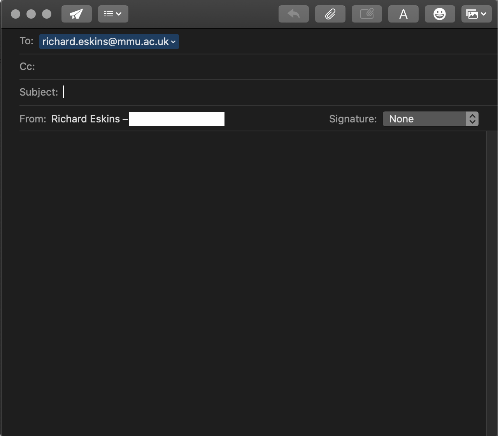

# Link best practices

There are some best practices to follow when writing links. Let's look at these now.

## Use clear link wording

It's easy to throw links up on your page. That's not enough. We need to make our links accessible to all readers, regardless of their current context and which tools they prefer. For example:

- Screenreader users like jumping around from link to link on the page, and reading links out of context.
- Search engines use link text to index target files, so it is a good idea to include keywords in your link text to effectively describe what is being linked to.
- Visual readers skim over the page rather than reading every word, and their eyes will be drawn to page features that stand out, like links. They will find descriptive link text useful.

Let's look at a specific example:

<p><b>Good</b> link text: <a href="https://firefox.com/">
  Download Firefox
</a></p>

```
<p><a href="https://firefox.com/">
  Download Firefox
</a></p>
```

<p><b>Bad</b> link text: <a href="https://firefox.com/">
  Click here
</a>
to download Firefox</p>

```
<p><a href="https://firefox.com/">
  Click here
</a>
to download Firefox</p>
```

## Other tips:

- Don't repeat the URL as part of the link text — URLs look ugly, and sound even uglier when a screen reader reads them out letter by letter.

- Don't say "link" or "links to" in the link text — it's just noise. Screen readers tell people there's a link. Visual users will also know there's a link, because links are generally styled in a different colour and underlined (this convention generally shouldn't be broken, as users are so used to it.)

- Keep your link label as short as possible — long links especially annoy screen reader users, who have to hear the whole thing read out.

- Minimize instances where multiple copies of the same text are linked to different places. This can cause problems for screenreader users, who will often bring up a list of the links out of context — several links all labelled "click here", "click here", "click here" would be confusing.

## Use relative links wherever possible

- relative URL = `images/logo.png`

- absolute URL = `http://www.mmu.ac.uk/images/logo.png`

You should use relative links wherever possible when linking to other locations **within the same website** (when linking to another website, you will need to use an absolute link):

- For a start, it is a lot easier to scan your code — relative URLs are generally a lot shorter than absolute URLs, which makes reading code much easier.
- Second, it is more efficient to use relative URLs wherever possible. When you use an absolute URL, the browser starts by looking up the real location of the server on the Domain Name System (DNS; see How the web works for more information), then it goes to that server and finds the file that is being requested. With a relative URL on the other hand, the browser just looks up the file that is being requested, on the same server. So if you use absolute URLs where relative URLs would do, you are constantly making your browser do extra work, meaning that it will perform less efficiently.

## Linking to non-HTML resources — leave clear signposts

When linking to a resource that will be downloaded (like a PDF or Word document) or streamed (like video or audio) or has another potentially unexpected effect (opens a popup window, or loads a Flash movie), you should add clear wording to reduce any confusion. It can be quite annoying for example:

- If you are on a low bandwidth connection, click a link and then a multiple megabyte download starts unexpectedly.
- If you haven't got the Flash player installed, click a link and then suddenly get taken to a page that requires Flash.

Let's look at some examples, to see what kind of text can be used here:

```
<p><a href="http://www.example.com/large-report.pdf">
  Download the sales report (PDF, 10MB)
</a></p>
```

```
<p><a href="http://www.example.com/video-stream/" target="_blank">
  Watch the video (stream opens in separate tab, HD quality)
</a></p>
```

```
<p><a href="http://www.example.com/car-game">
  Play the car game (requires Flash)
</a></p>
```

## Use the download attribute when linking to a download

When you are linking to a resource that is to be downloaded rather than opened in the browser, you can use the download attribute to provide a default save filename. Here's an example with a download link to the latest Windows version of Firefox:

```
<a href="https://download.mozilla.org/?product=firefox-latest-ssl&os=win64&lang=en-US"
   download="firefox-latest-64bit-installer.exe">
  Download Latest Firefox for Windows (64-bit) (English, US)
</a>
```

## E-mail links

It is possible to create links or buttons that, when clicked, open a new outgoing email message rather than linking to a resource or page. This is done using the `<a>` element and the `mailto:` URL scheme.

In its most basic and commonly used form, a `mailto:` link simply indicates the email address of the intended recipient. For example:

```
<a href="mailto:nowhere@mozilla.org">Send email to nowhere</a>
```

This results in a link that looks like this: <a href="mailto:nowhere@mozilla.org">Send email to nowhere</a>.

In fact, the email address is even optional. If you leave it out (that is, your href is simply "mailto:"), a new outgoing email window will be opened by the user's mail client that has no destination address specified yet. This is often useful as "Share" links that users can click to send an email to an address of their choosing.

<!-- div class="exercise" -->
## Exercise 7 continued

> Adding a `mailto` link.

### Task 1

- Return to `exercise-07.html` in your editor.

- Look for the following text at the bottom of the page: 

```
Email Richard Eskins for more information.
```

- Make the name `Richard Eskins` into a clickable, `mailto` link using the example to `nowhere@mozilla.org` above as your guide.

- use the email address `richard.eskins@mmu.ac.uk`

- Save `exercise-07.html` and refresh in the browser.

- <a>Richard Eskins</a> should be a link.

- Depending on the computer you are using, clicking on the link may open an email in your email client.

<figure>
  
  <figcaption>For example on a Mac, if the default application is Mail, a new email window will open in Mail.</figcaption>
</figure>

<!-- end div -->

<p class="submit-work">Exercise 7 is completed.</p> 


<h2 class="deep">Deeper Learning</h2>

To get a better understanding of this topic use the following resources.

- LinkedIn Learning Video: [Jen Simmons - Navigation](https://www.linkedin.com/learning/html-essential-training-4/navigation?u=36102708) (3m 19s)

- WebAIM: [Introduction to Links and Hypertext](https://webaim.org/techniques/hypertext/) - all about making hyperlinks accessible.

- Nielsen Norman Group: [Writing Hyperlinks: Salient, Descriptive, Start with Keyword](https://www.nngroup.com/articles/writing-links/)- To help users quickly find what they need, anchor text should stand out from the body content and accurately describe the page that it refers to.


### &copy; Credit given

Materials used under the Creative Commons licence from [MDN Web Docs](https://developer.mozilla.org/en-US/docs/Web/HTML).