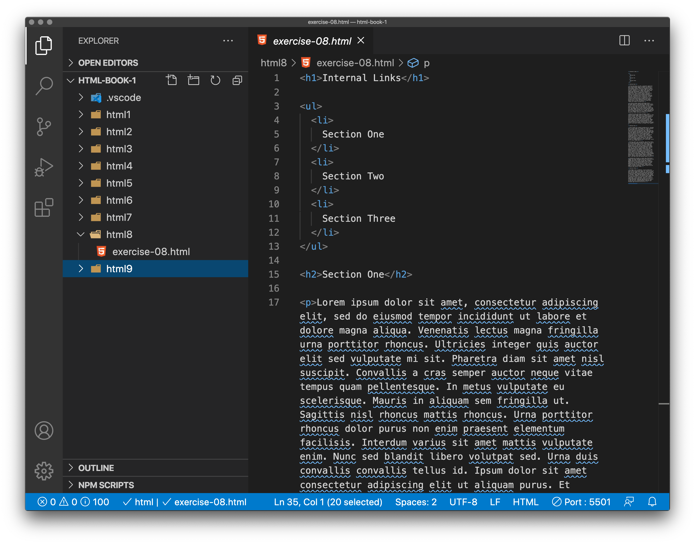
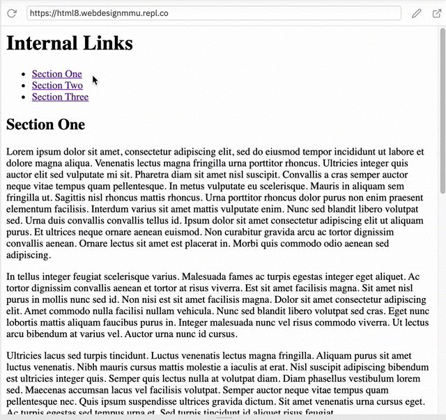

# More links

## Document fragments

It is possible to link to a specific part of an HTML document (known as a document fragment), rather than just to the top of the document. To do this you first have to assign an id attribute to the element you want to link to. It normally makes sense to link to a specific heading, so this would look something like the following:

```
<h2 id="Mailing_address">Mailing address</h2>
```

Then to link to that specific id, you'd include it at the end of the URL, preceded by a hash/pound symbol, for example:

```
<p>Want to write us a letter? Use our <a href="contacts.html#Mailing_address">mailing address</a>.</p>
```

You can even use the document fragment reference on its own to link to another part of the same document:

```
<p>The <a href="#Mailing_address">company mailing address</a> can be found at the bottom of this page.</p>
```

<!-- div class="exercise" -->
## Exercise 8

> Internal links - creating links within (to a specific part of) a document.

### Task 1

> Open the `html8` folder.

- Open `exercise-08.html` in your editor.


<figure>

<figcaption>
What you have is a document with a *table of contents* (menu) at the top, followed by three sections of text. In this exercise you are going to link each menu item to the relevant section. Allowing the reader to *jump* to the relevant section.
</figcaption>
</figure>

> [Lorem Ipsum](https://www.lipsum.com/) - the *dummy text* you see in the paragraphs is commonly used by web developers to fill the void in their designs whilst waiting for the *real* content. Not ideal, but useful.

### Task 2

- The menu is well spaced out so you can identify the section names, e.g. Section One. 

```
<ul>
  <li>
    Section One
  </li>
  <li>
    Section Two
  </li>
  <li>
    Section Three
  </li>
</ul>
```

- Wrap each section title with an `<a>` element as below:

```
  <li>
    <a>Section One</a>
  </li>
```
- Do this for all three sections listed.

### Task 3

- Add the `href=""` attribute to each of the three opening `<a>` tags.

```
  <li>
    <a href="">Section One</a>
  </li>
  
  ```
- Save `exercise-08.html`, and open it in a browser.

- In the browser you will now see the menu items look like links (blue/purple underlined text). 

- Clicking on them does nothing - as we haven't defined the link location in the `href=""` attribute.

### Task 4

- Return to `exercise-08.html` in your editor.

- Adding the link location - but this time it's not a URL or file path. We are going to link to a named element on the page using an `ID` or `#` attribute.

- As we are linking to each section we are going to use the name of the section, for example `#one` for Section One.

- Do this for each link starting with:

```
<a href="#one">Section One</a>
```

- Obviously `#two` and `#three` for the other two.

- Save `exercise-08.html`.

- Nothing changes on our page yet as the destinations have yet to be defined.

### Task 5

- For this to work we need to add `IDs` (names) to the link targets - where we want the menu to take us to.

- We do this by adding the ID attribute `id="one"`, to our Section One heading. As follows.

```
<h2 id="one">Section One</h2>
```

- Save `exercise-08.html`, and refresh the browser.

- If you've got it right, when you click the <a>Section One</a> link in the menu the page will *jump down* to Section One as illustrated below.

- If that has worked, do the same for sections two and three, obviously using `id="two"` and `id="three"`.

- Run your page and check all three links.

<figure>

  <figcaption>This illustrates the menu links working, creating links to the various sections of the document.</figcaption>
</figure>

> If you have trouble seeing the page *jump to the links*, make your browser window smaller.

<!-- end div -->

### Things to note

- The name doesn't matter - just needs to match.

- For example:

```
<a href="#fred">Link text</a>
```
and
```
<h2 id="fred">Target</a>
```

- They just need to match, including being case sensitive (and no spaces).

- The `ID` can be added to any element, not just a heading.

- You can only use an ID once on the page - it needs to be unique (for example, for this to work).

- We could link to one of these sections from another website by using the full URL. For example:

```
<a href="http://www.mywebsite.com#fred">Link text</a>
```


<!-- div class="exercise" -->
## Exercise 8 continued

> **Return to top**. You've probably used these a million times, a quick link that jumps you back to the top of the page.

### Task 1

- Return to `exercise-08.html` in your editor.

- Using what you have learnt, create a link **Back to the Top** on this page. 

- The text for the `<a>` link is already there at the bottom of the page.

```
<p>Return to Top</p>
```

- Hint - add the `ID` to the `<h1>` at the top of the page.

- What name to use for your `ID`? Up to you. Just follow the rules (above) and keep it simple.

- When complete, save `exercise-08.html` and refresh the page in the browser. 

- Scroll to the bottom, and click on your new `Return to the Top` link. If everything is correct you should jump back up to the top. If not, check your code.

> Back to the Top - is a standard practice, especially on long pages to make navigation simpler.

<!-- end div -->

<p class="submit-work">Exercise 8 is completed.</p> 

### &copy; Credit given

Materials used under the Creative Commons licence from [MDN Web Docs](https://developer.mozilla.org/en-US/docs/Web/HTML).