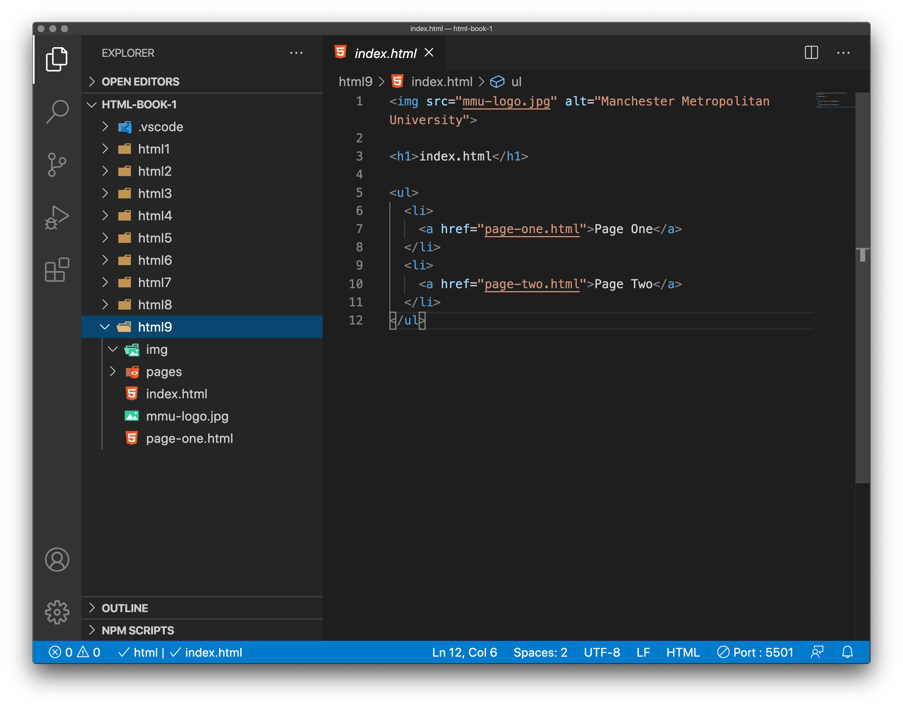
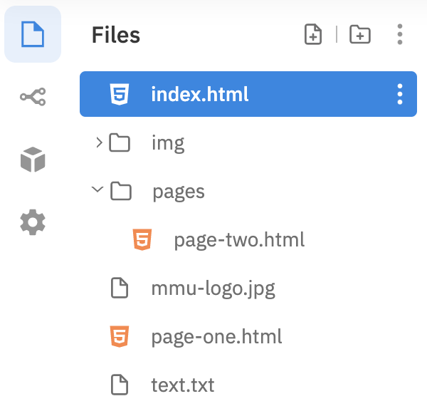
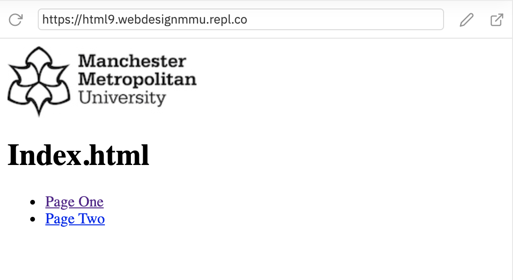
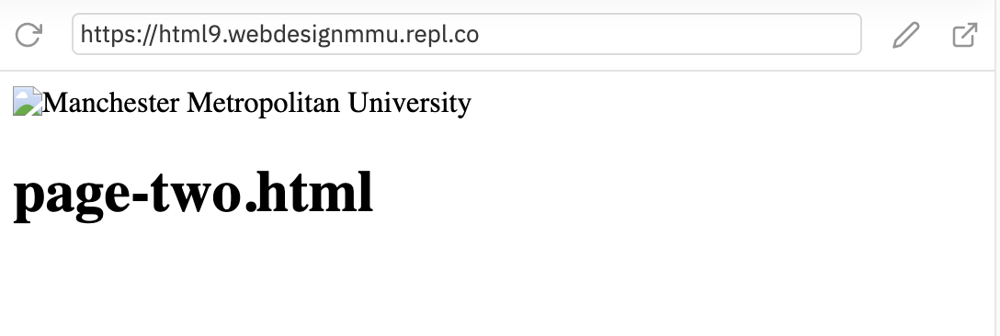
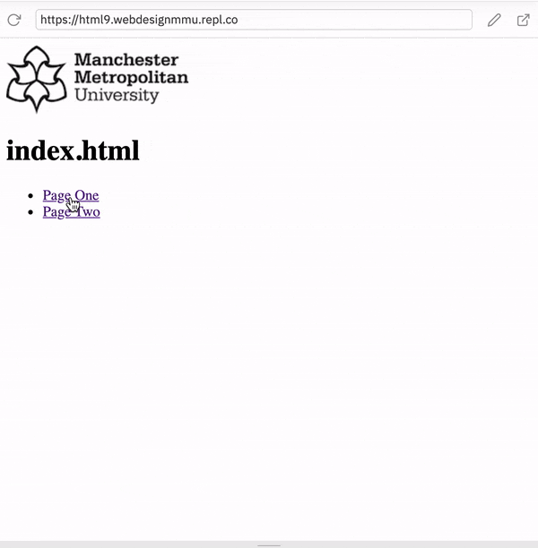
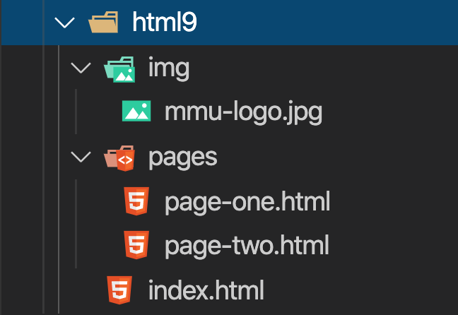

# A quick primer on URLs and paths

To fully understand link targets, you need to understand URLs and file paths. This chapter gives you the information you need to achieve this.

> Note: This can be one of the most confusing elements of web development for newbies and even some more experienced students. Read this chapter through, but don't worry if it doesn't sink in. That will happen with practice, starting with the task that follows. 

> It makes sense for anyone new to this, to watch Jen's video first: **LinkedIn Learning Video**: [Jen Simmons - URL paths](https://www.linkedin.com/learning/html-essential-training-4/url-paths?u=36102708) (4m 45s)


A URL, or Uniform Resource Locator is simply a string of text that defines where something is located on the Web. For example, MMU's homepage is located at https://www.mmu.ac.uk.

URLs use paths to find files. Paths specify where in the filesystem the file you are interested in is located. Let's look at a simple example of a directory structure (see the live version - <a href="https://github.com/mdn/learning-area/tree/master/html/introduction-to-html/creating-hyperlinks">creating-hyperlinks directory</a>.)


## A simple directory structure.

> Note - The term `directory` refers to the way a structured list of document `files` and `folders` is stored on the computer. [Wikipedia](https://en.wikipedia.org/wiki/Directory_(computing))

In the example above the parent directory is called `creating-hyperlinks` and contains two files called `index.html` and `contacts.html`, and two directories called `projects` and `pdfs`, which contain an `index.html` and a `project-brief.pdf` file, respectively

The root of this directory (folder) structure is called `creating-hyperlinks`. When working locally with a web site, you will have one directory that the whole site goes inside. Inside the root, we have an `index.html` file and a `contacts.html`. In a real website, `index.html` would be our home page or landing page (a web page that serves as the entry point for a website or a particular section of a website.)

There are also two directories (folders) inside our root — `pdfs` and `projects`. These each have a single file inside them — a PDF (`project-brief.pdf`) and an ```index.html``` file, respectively. Note that you can quite happily have two ``index.html`` files in one project, as long as they are in different locations in the filesystem. Many web sites do. The second `index.html` would perhaps be the main landing page for project-related information.

- **Same directory**: If you wanted to include a hyperlink inside `index.html` (the top level `index.html`) pointing to `contacts.html`, you would just need to specify the filename of the file you want to link to, as it is in the same directory as the current file. So the URL you would use is `contacts.html`:

```
<p>Want to contact a specific staff member?
Find details on our <a href="contacts.html">contacts page</a>.</p>
```

- **Moving down into subdirectories**: If you wanted to include a hyperlink inside `index.html` (the top level `index.html`) pointing to `projects/index.html`, you would need to go down into the projects directory before indicating the file you want to link to. This is done by specifying the directory's name, then a forward slash, then the name of the file. So the URL you would use is `projects/index.html`:

```
<p>Visit my <a href="projects/index.html">project homepage</a>.</p>
```

- Moving back up into parent directories: If you wanted to include a hyperlink inside `projects/index.html` pointing to `pdfs/project-brief.pdf`, you'd have to go up a directory level, then back down into the pdf directory. "Go up a directory" is indicated using two dots `..` so the URL you would use is `../pdfs/project-brief.pdf`:

```
<p>A link to my <a href="../pdfs/project-brief.pdf">project brief</a>.</p>
```

> Note: You can combine multiple instances of these features into complex URLs, if needed, e.g. `../../../complex/path/to/my/file.html`.


<!-- div class="exercise" -->
## Exercise 9

> Paths - File paths to link files, and to embed images.

### Task 1

> Open the `html9` folder.

- Open `index.html` in your editor.

<figure>

<figcaption>
Exercise 9 files and folders. 
</figcaption>
</figure>

> Note that our core page (the HomePage) is `index.html` in **Exercise 9**. This is the default name of most homepages. Because it is default, when you go to a website like `http://www.mmu.ac.uk` you don't need to add the homepage filename. This avoids - `http://www.mmu.ac.uk/index.html`
### Task 2

- Look at the file/ folder structure.



- We have our home page `index.html` on the root of our directory
- There is an `img` folder for our images - currently empty
- We have a `pages` folder for our sub-pages. At the moment it only contains `page-two.html`.
- Both `mmu-logo.jpg` and `page-one.html` are also sat on the root.

### Task 3

- Open `index.html` in the browser



- The logo loads because it is sat in the root folder with `index.html`. 

- This makes the path simple - just the filename.

```

```

- The link to Page One works for the same reason:

```
<a href="page-one.html">Page One</a>
```

### Task 4

- The link from `index.html` to page two fails because this file is sat in the sub-folder, `pages`.

- Fix link error by adjusting the path. 

- Currently in `index.html`

```
<a href="page-two.html">Page Two</a>
```

- You need to tell the browser that this file is in the `pages` folder. You do this by using the path:

```
pages/page-two.html
```

- Save `index.html`, refesh the page in the browser and test the link to `Page Two` - it should now work.

### Task 5

You will notice that the logo fails to load on `page-two.html`.



- The path to the image is incorrect. It currently assumes the `html` file and the `image` file are sat in the same folder. They are not- because we moved `page-two.html`.

- Get the image working by adjusting the path.

- First, make sure you have `page-two.html` open in the editor.

- You need to guide the path to `mmu-logo.jpg`. This would be `../` to drop out of the `pages` folder, followed by the image filename. `../mmu-logo.jpg`

- Save `page-two.html` and refresh it in the browser to see if the logo loads this time. If it doesn't, check your code.

### Task 6

> Having an image on the root of a site is not good, especially as the site gains more images.

- Move `mmu-logo.jpg` into the `img` folder with a simple drag and drop.

- If you now view your little site in the browser, you will see that the logo now fails to load on all of the pages. If it's still showing, refresh the page(s).

- Fix this on each page by working out the paths.

- `index.html` has to go down into the `img` folder - `img/mmu-logo.jpg`

- `page-one.html` does the same.

- `page-two.html` is more complex has it has to go up to the root, and down into the `img` folder. That would be `../img/mmu-logo.jpg`

- Run the page and test each one - the logo should load on every page if you have the paths correct.

### Task 7

And finally, let's get `page-one.html` off the root and into the `pages` folder to ensure we have a tidy site.

- Drag and drop `page-one.html` into the `pages`folder.

Now you have some fixing to do:

- The link from `index.html` needs adjusting by adding the folder name to the path - `pages/page-one.html`

- The logo path needs to now be the same as it is on `page-two.html`

- Save all pages (Save All), refresh `index.html` in the browser and check everything out.

    - Both links from the homepage work.

    - The logo (working) on all three pages.

<!-- end div -->

<!-- div class="exercise" -->
## Exercise 9 continued

> Create a home link on both `page-one.html` and `page-two.html` by making the logo clickable.

### Task 1

- In the editor - On both `page-one.html` and `page-two.html` wrap an anchor tag around the `` element as we did previously on the San Francisco page:

```
<a href="http://www.mmu.ac.uk">

</a>
```

- This time the path is just to `index.html`

- **Tip 1** - the path includes going down, out of the pages folder to the root.

- **Tip 2** - The code is the same on both pages - code one and copy and paste to the other.

- Save both pages and view in a browser

- Clicking the logo on `page-one.html` and `page-two.html` should take you back to the homepage. If it doesn't, check your code.

<figure>


  <figcaption>Working links to sub-pages in the <code>pages</code> folder, with clickable logo, returning to the homepage - <code>index.html</code></figcaption>
</figure>

### File/folder structure

<figure>

  <figcaption>Your finished file/folder structure should look like this.</figcaption>
</figure>

<!-- end div -->

<p class="submit-work">Exercise 9 is completed.</p> 


<h2 class="deep">Deeper Learning</h2>

To get a better understanding of this topic use the following resources.

- If you didn't watch it - watch LinkedIn Learning Video: [Jen Simmons - URL paths](https://www.linkedin.com/learning/html-essential-training-4/url-paths?u=36102708) (4m 45s)


### &copy; Credit given

Materials used under the Creative Commons licence from [MDN Web Docs](https://developer.mozilla.org/en-US/docs/Web/HTML).