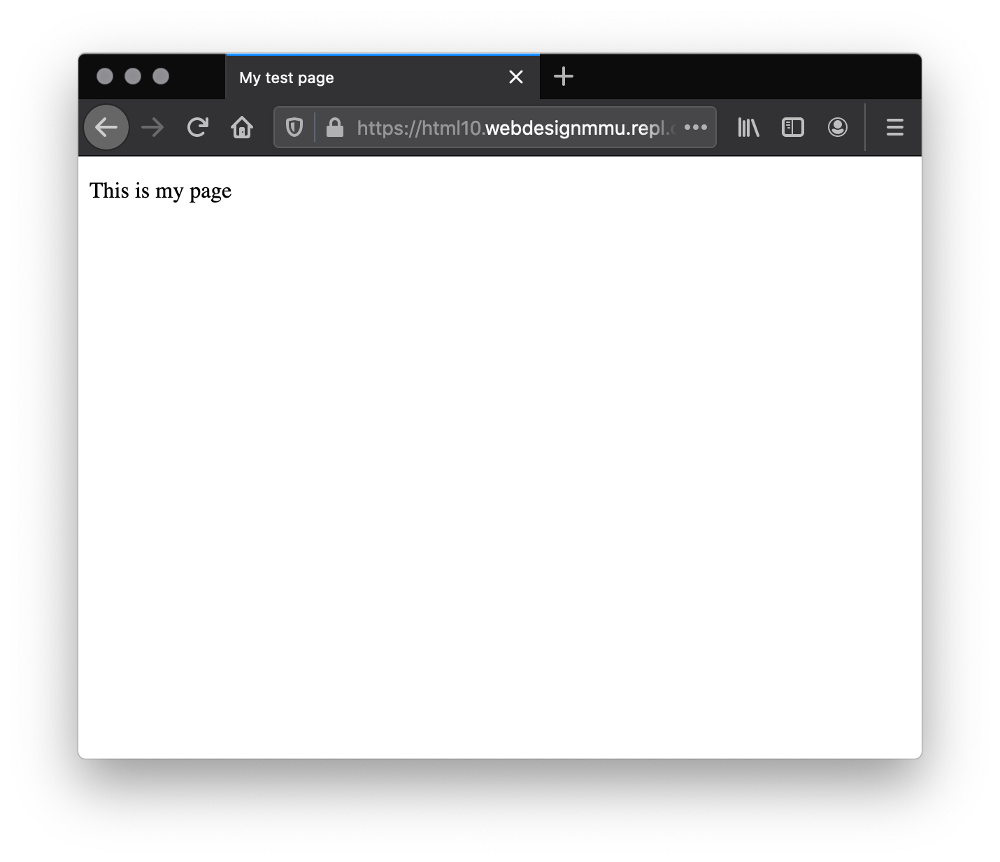
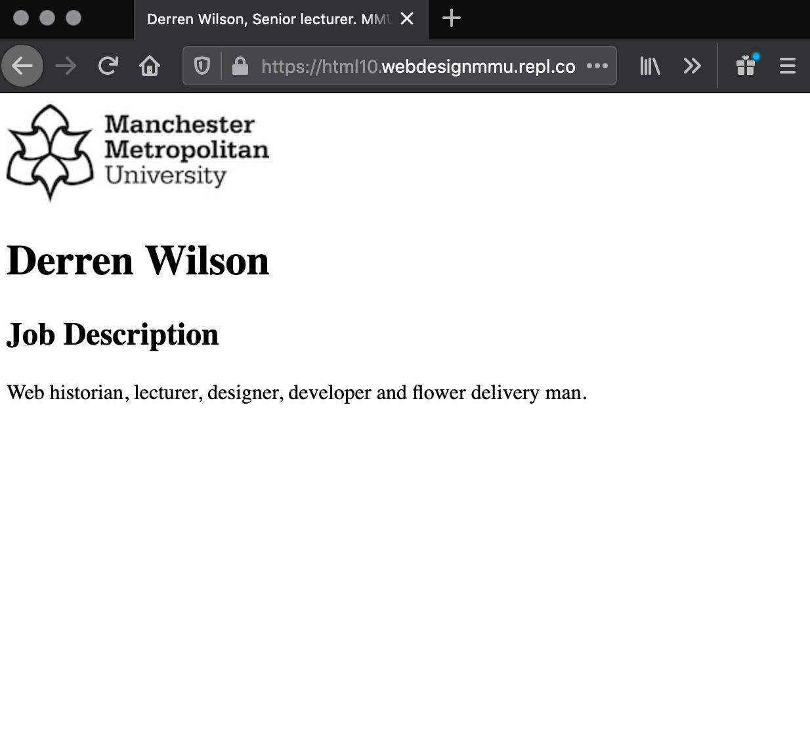

# Anatomy of an HTML document

> Exercise Files - [HTML Book Two](media/html-book-2.zip).

Up until now we have focussed on individual elements and attributes, but individual HTML elements aren't very useful on their own. Next, let's examine how individual elements combine to form an entire HTML page.

This is code/structure of every html document:

```
<!DOCTYPE html>
<html lang="en-gb">
  <head>
    <meta charset="utf-8">
    <title>My test page</title>
  </head>
  <body>

    <p>This is my page</p>

  </body>
</html>
```

Breaking this down we have:

1. `<!DOCTYPE html>`: The doctype. When HTML was young (1991-1992), doctypes were meant to act as links to a set of rules that the HTML page had to follow to be considered good HTML. Originally doctypes used to look something like this:

```
<!DOCTYPE html PUBLIC "-//W3C//DTD XHTML 1.0 Transitional//EN"
"http://www.w3.org/TR/xhtml1/DTD/xhtml1-transitional.dtd">
```
More recently, the doctype is a historical artifact that needs to be included for everything else to work right. `<!DOCTYPE html>` is the shortest string of characters that counts as a valid doctype. **That is all you need to know!**

2. `<html></html>`: The `<html>` element. This element wraps all the content on the page. It is sometimes known as the root element. We have included the `lang="en-gb"` attribute, with the value of '"en-gb"' to define the page as British English. More about this later.

1. `<head></head>`: The `<head>` element. This element acts as a container for everything you want to include on the HTML page, **that isn't the content the page will show to viewers**. This includes keywords and a page description that would appear in search results, CSS to style content, character set declarations, and more. 

1. `<meta charset="utf-8">`: This element specifies the character set for your document to UTF-8, which includes most characters from the vast majority of human written languages. With this setting, the page can now handle any textual content it might contain. There is no reason not to set this, and it can help avoid some problems later.

1. `<title></title>`: The `<title>` element. This sets the title of the page, which is the title that appears in the browser tab the page is loaded in. The page title is also used to describe the page when it is bookmarked.

1. `<body></body>`: The `<body>` element. This contains all the content that displays on the page, including text, images, videos, games, playable audio tracks, or whatever else.

> Note - all of the content of the previous exercsies would sit in the `body` of a complete HTML document.

<!-- div class="exercise" -->

## Exercise 10

- Create your first complete HTML document and add some page content.

### Task 1

> Open the `html10` folder.

- Open `exercise-10.html` in your editor.

<figure>

<figcaption>
Exercise 10 files and folders. 
</figcaption>
</figure>

- You have an empty HTML file - `exercise-10.html`

### Task 2

You can do this two ways:

1. Copy this code, line by line into `exercise-10.html`. If you are new to `html` this kind of practice will help your understanding of each element. 

2. Copy and paste this code into `exercise-10.html`. This is quick and easy. You will never need to write out this code as all editors will provide you with a template HTML document. Do this if you are confident that you understand each line of code.

```
<!DOCTYPE html>
<html lang="en-gb">
  <head>
    <meta charset="utf-8">
    <title>My test page</title>
  </head>
  <body>

    <p>This is my page</p>

  </body>
</html>
```
- Save `exercise-10.html` and view the page in your browser. You will of course only see the paragraph of text as this is all that is in the body of the document at the moment.

<figure>

  <figcaption>Note that you can now see the page title (<code>My test page</code>) in the browser tab.</figcaption>
</figure>

### Task 3

- Add more to the page - Let's make it more personal:

#### The `<head>`

- Add your name to the `<title>` - Something like:

```
<title>Derren Wilson, Senior lecturer. MMU</title>
```

#### The `<body>`

- Delete the existing paragraph - `<p>This is my page</p>`

- Insert the MMU logo at the top of the page using the `` element. You'll find the logo in the `img` folder. *Think about the path*.

- Next add a `<h1>` heading with your name.

- Add a `<h2>` as follows:

```
<h2>Job Description</h2>
```
- Finish up by adding a paragraph that describes your current role.

- Save `exercise-10.html`and view the page in your browser.

- Review your first, complete webpage. Is it working?

<figure>

  <figcaption>Your page should look something like Derren's.</figcaption>
</figure>

<!-- end div -->

<p class="submit-work">Exercise 10 is not quite completed.</p> 

- You need to validate `exercise-10.html` as directed in the next chapter.


<h3 class="warning">Put the content in the &lt;body&gt;</h3>

> All of that content needs to sit between the opening and closing `<body>` tags. A common student error is to place the content in the `<head>` or between the closing `</head>` and the start `<body>`. Some times the `<body>` just gets deleted or shoved to the bottom.

## Have you got it right?

In the next chapter we discuss de-bugging i.e. correcting errors. We are going to check the quality of your code through validation before continuing to look at the `<head>` in more detail.


<h2 class="deep">Deeper Learning</h2>

To get a better understanding of this topic use the following resources.

- LinkedIn Learning Video: [Jen Simmons -  The HTML page](https://www.linkedin.com/learning/html-essential-training-4/the-html-page?u=36102708) (5m 1s)

- MDN: `<!DOCTYPE html>` - [Doctype](https://developer.mozilla.org/en-US/docs/Glossary/Doctype)

- MDN: `<html>` - [The HTML Document / Root element](https://developer.mozilla.org/en-US/docs/Web/HTML/Element/html)

- MDN: `<body>` - [The Document Body element](https://developer.mozilla.org/en-US/docs/Web/HTML/Element/body)


### &copy; Credit given

Materials used under the Creative Commons licence from [MDN Web Docs](https://developer.mozilla.org/en-US/docs/Web/HTML).