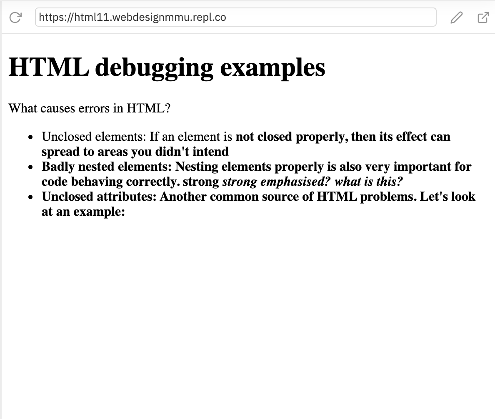
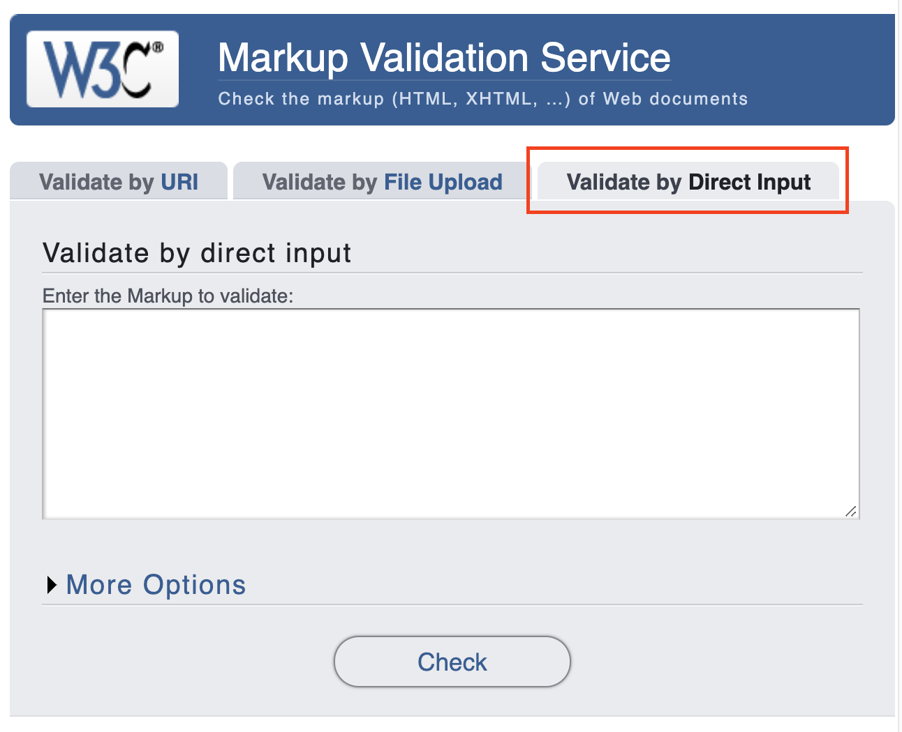
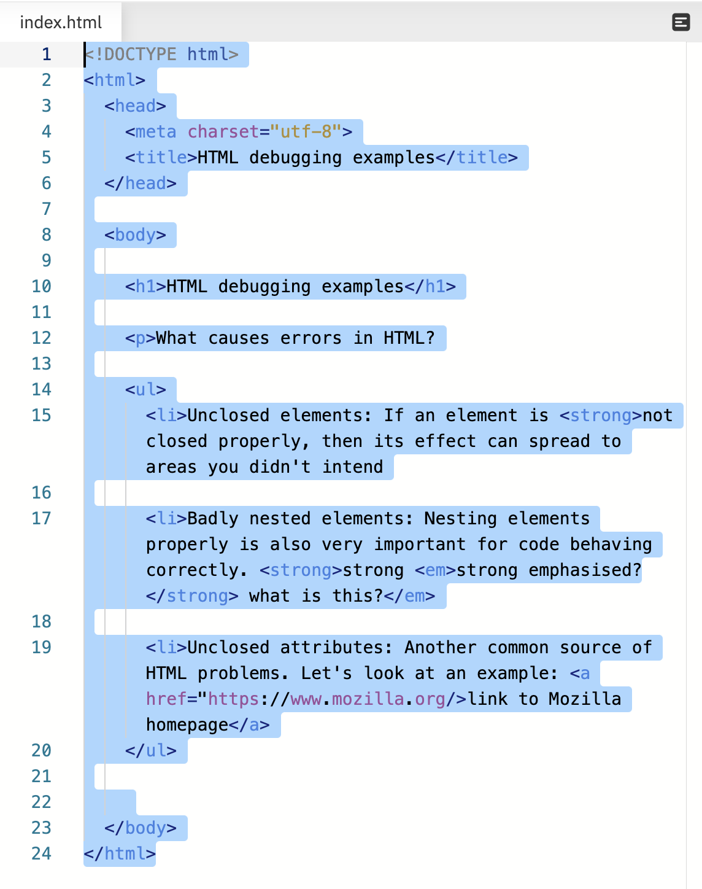
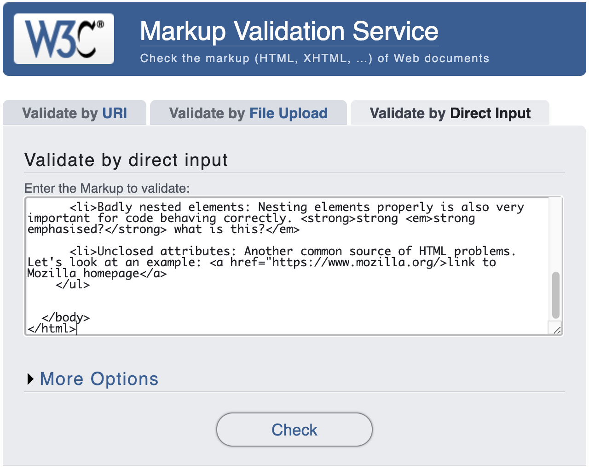
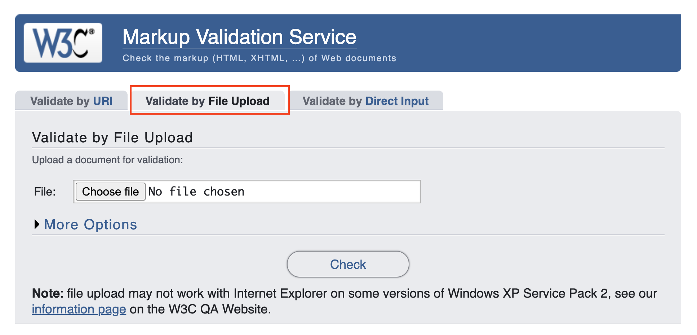

# Debugging HTML

Writing HTML is fine, but what if something goes wrong, and you can't work out where the error in the code is? This chapter will introduce you to some tools that can help you find and fix errors in HTML.

## Debugging isn't scary

When writing code of some kind, everything is usually fine, until that dreaded moment when an error occurs — you've done something wrong, so your code doesn't work — either not at all, or not quite how you wanted it to. For example, the following shows an error reported when trying to [compile](https://developer.mozilla.org/en-US/docs/Glossary/compile) a simple program written in the [Rust language](https://www.rust-lang.org/).


Here, the error message is relatively easy to understand — "unterminated double quote string". If you look at the listing, you can probably see how `println!(Hello, world!");` might logically be missing a double quote. However, error messages can quickly get more complicated and less easy to interpret as programs get bigger, and even simple cases can look a little intimidating to someone who doesn't know anything about Rust.

Debugging doesn't have to be scary though —  the key to being comfortable with writing and debugging any programming language or code is familiarity with both the language and the tools.

## HTML and debugging

HTML is not as complicated to understand as Rust. HTML is not compiled into a different form before the browser parses it and shows the result (it is interpreted, not compiled meaning it is read and run at the same time). And HTML's [element syntax](https://developer.mozilla.org/en-US/docs/Glossary/element) is arguably a lot easier to understand than a "real programming language" like Rust, JavaScript, or Java. 

Furthermore, the way that browsers parse HTML is a lot more permissive than how programming languages are run, which is both a good and a bad thing.

## Permissive code

So what do we mean by permissive? Well, generally when you do something wrong in code, there are two main types of error that you'll come across:

- **Syntax errors**: These are spelling errors in your code that actually cause the program not to run, like the Rust error shown above. These are usually easy to fix as long as you are familiar with the language's syntax and know what the error messages mean.

- **Logic errors**: These are errors where the syntax is actually correct, but the code is not what you intended it to be, meaning that program runs incorrectly. These are often harder to fix than syntax errors, as there isn't an error message to direct you to the source of the error.

HTML itself doesn't suffer from syntax errors because browsers parse it permissively, meaning that the page still displays even if there are syntax errors. Browsers have built-in rules to state how to interpret incorrectly written markup, so you'll get something running, even if it is not what you expected. This, of course, can still be a problem!

> Note: HTML is parsed permissively because when the web was first created, it was decided that allowing people to get their content published was more important than making sure the syntax was absolutely correct. The web would probably not be as popular as it is today, if it had been more strict from the very beginning.

<!-- div class="exercise" -->
## Exercise 11

- It's time to study the permissive nature of HTML code.

### Task 1

> Open the `html11` folder.

- Open `exercise-11.html` in your editor.

<figure>

<figcaption>
Exercise 11 files and folders. 
</figcaption>
</figure>

- This demo is deliberately written to have some errors in it for us to explore (the HTML markup is said to be badly-formed, as opposed to well-formed).

- Open `exercise-11.html` in your browser. You will see something like this:

<figure>

<figcaption>
This immediately doesn't look great. But the page does display despite the errors.
</figcaption>
</figure>

### Task 2

- Let's look at the source code to see if we can work out why.

- Note -  this only the `body` content.

```
<h1>HTML debugging examples</h1>

<p>What causes errors in HTML?

<ul>
  <li>Unclosed elements: If an element is <strong>not closed properly,
      then its effect can spread to areas you didn't intend

  <li>Badly nested elements: Nesting elements properly is also very important
      for code behaving correctly. <strong><em>strong emphasised?</strong></em> What is this?

  <li>Unclosed attributes: Another common source of HTML problems. Let's
      look at an example: <a href="https://www.mozilla.org/>link to Mozilla
      homepage</a>
</ul>
```

### Task 3

- Let's review the problems:

- The `paragraph` and `list item` elements have no closing tags. Looking at the image above, this doesn't seem to have affected the markup rendering too badly, as it is easy to infer where one element should end and another should begin.

- The first `<strong>` element has no closing tag. This is a bit more problematic, as it isn't easy to tell where the element is supposed to end. In fact, the whole of the rest of the text has been strongly emphasised.

- This section is badly nested: `<strong> <em> strong emphasised?</strong></em> What is this?`. It is not easy to tell how this has been interpreted because of the previous problem. *Remember the rule? First in, last out*.

- The `href` attribute value has a missing closing double quote. This seems to have caused the biggest problem — the link has not rendered at all.

### Task 4

Now let's look at the markup the browser has rendered, as opposed to the markup in the source code. To do this, we can use the browser developer tools. 

> Note - if this is all new to you just read through Task 4 - it explains how the browser tries to fix the bad code. Dev Tools are very useful but may be a step too far at this early stage for some. 

To open the Developer Tools:

- Viewing `exercise-11.html` in your browser (use Chrome for ease).

- Right click on the page, and select Inspect from the menu - this will open Dev Tools.

If you are not familiar with how to use your browser's developer tools, take a few minutes to review [Discover Firefox developer tools](https://developer.mozilla.org/en-US/docs/Learn/Discover_browser_developer_tools). Derren will talk about them this week.

- In the DOM inspector, you can see what the rendered markup looks like:


- Using the DOM inspector, let's explore our code in detail to see how the browser has tried to fix our HTML errors (we did the review in Firefox; other modern browsers should give the same result):

  + The paragraphs and list items have been given closing tags.

  + It isn't clear where the first `<strong>` element should be closed, so the browser has wrapped each separate block of text with its own strong tag, right down to the bottom of the document!

  + The  incorrect nesting has been fixed by the browser like this:

```
<strong>strong
  <em>strong emphasised?</em>
</strong>
<em> what is this?</em>
The link with the missing double quote has been deleted altogether. The last list item looks like this:
<li>
  <strong>Unclosed attributes: Another common source of HTML problems.
  Let's look at an example: </strong>
</li>
```

- **Close the Dev Tools**, but do try to get more familiar with them as you progress.

- This is all part of the permissive nature of HTML code. The browser will try to ignore what it doesn't understand, and will try to fix what is missing in order to display the page the best it can.

- Don't fix anything yet! You are going to learn how to validate your HTML - in search of errors such as these.


<!-- end div -->

## HTML validation

So you can see from the above example that you really want to make sure your HTML is well-formed! But how? In a small example like the one seen above, it is easy to search through the lines and find the errors, but what about a more complex HTML document?

The best strategy is to start by running your HTML page through the [Markup Validation Service](https://validator.w3.org/) — created and maintained by the W3C, the organization that looks after the specifications that define HTML, CSS, and other web technologies. This webpage takes an HTML document as an input, goes through it, and gives you a report to tell you what is wrong with your HTML.


To specify the HTML to validate, you can give it a web address, upload an HTML file, or directly input some HTML code.

<!-- div class="exercise" -->

## Exercise 11 continued

> HTML Validation

### Task 1

- Return to `exercise-11.html` in your editor.


### Task 2

1. Open the following page -  the [Markup Validation Service](https://validator.w3.org/) in a browser tab.

2. Switch to the Validate by Direct Input tab.



3. Copy all the code in `exercise-11.html` - not just the body. 

    + Ctrl+A to select all on a PC

    + Gmd+A to select all on a Mac

    + Ctrl+C (PC) or Cmd+C (Mac) to copy




4. Paste it into the large text area shown in the Markup Validation Service.

    + Ctrl+V (PC) or Cmd+V (Mac) to paste



5. Select the Check button.

<figure>

<figcaption>This should give you a list of errors and other information which tries to help you identify the problem code - including line number.</figcaption>
</figure>

### Interpreting the error messages

The error messages are usually helpful, but sometimes they are not so helpful; with a bit of practice you can work out how to interpret these to fix your code. Let's go through the error messages and what they mean. You'll see that each message comes with a line and column number to help you to locate the error easily.

**"Consider adding a `lang` attribute to the html start tag to declare the language of this document."**: 
- This is not an error but a warning. The recommendation is to always define a language and the warning explains how to do it.

**"End tag `li` implied, but there were open elements"** (2 instances): 

- These messages indicate that an element is open that should be closed. The ending tag is implied, but not actually there. The line/column information points to the first line after the line where the closing tag should really be, but this is a good enough clue to see what is wrong.

**"Unclosed element `strong`"**: 

- This is really easy to understand — a `<strong>` element is unclosed, and the line/column information points right to where it is.

**"End tag `strong` violates nesting rules"**: 

- This points out the incorrectly nested elements, and the line/column information points out where it is.

**"End of file reached when inside an attribute value. Ignoring tag"**: 

- This one is rather cryptic; it refers to the fact that there is an attribute value not properly formed somewhere, possibly near the end of the file because the end of the file appears inside the attribute value. The fact that the browser doesn't render the link should give us a good clue as to what element is at fault.

**"End of file seen and there were open elements"**: 

- This is a bit ambiguous, but basically refers to the fact there are open elements that need to be properly closed. The line numbers point to the last few lines of the file, and this error message comes with a line of code that points out an example of an open element:
example: `<a href="https://www.mozilla.org/>link to Mozilla homepage</a> ↩ </ul>↩ </body>↩</html>`

> Note: An attribute missing a closing quote can result in an open element because the rest of the document is interpreted as the attribute's content.

**"Unclosed element `ul`"**: 

- This is not very helpful, as the `<ul>` element is closed correctly. This error comes up because the `<a>` element is not closed, due to the missing closing quote mark.

<!-- end div -->

<!-- div class="exercise" -->

## Exercise 11 continued

> HTML Validation - Fix errors

### Task 1

- Return to `exercise-11.html` in your editor and attempt to fix the errors.

- If you can't work out what every error message means, don't worry about it — a good idea is to try fixing a few errors at a time. Then try revalidating your HTML to show what errors are left. Sometimes fixing an earlier error will also get rid of other error messages — several errors can often be caused by a single problem, in a domino effect.

- Keep going until all errors are fixed.

- You will know when all your errors are fixed when you see the following banner from the validator:


<!-- end div -->

<p class="submit-work">Exercise 11 is completed.</p> 

<!-- div class="exercise" -->

## Return to Exercise 10

> HTML Validation - Your first webpage `exercise-10.html`

### Task 1

- This time we are going to use File Upload to validate our document.

- Open the [File Upload page in another browser tab](https://validator.w3.org/#validate_by_upload).



- Select **Choose File**.

- Navigate to `exercise-10.html` and select **Check**.

- Does it validate?

- If not, identify and fix any errors before you continue. 

- If needed - re-validate to check your fixes.

<!-- end div -->

<p class="submit-work">Exercise 10 is still not quite completed.</p> 

- You need to add metadata in the next chapter.


<h3 class="warning">Validation - Coursework</h3>

- We use validation as one of our methods of assessing the quality of your work.

- All of your coding submissions will be expected to validate (full HTML documents and later, CSS files)

### Student favourite errors

A few favourite errors to keep in mind as you work on and validate more complex pages.

1. Failing to close a heading - half of the page now looks like a heading. Find and close the offending heading tag.

2. Failing to add a closing `</a>` tag - everything after the intial link becomes a clickable link. Remember that every link has an opening `<a>` followed by a closing `</a>`. If half of you page now looks like a link - that's what's gone wrong.

<h2 class="deep">Deeper Learning</h2>

To get a better understanding of this topic use the following resources.

- LinkedIn Learning Video: [Jen Simmons -  Debugging html](https://www.linkedin.com/learning/html-essential-training-4/debugging-html?u=36102708) (4m 37s)

- Article: W3C (World Wide Web Consortium) - [Why Validate?](https://validator.w3.org/docs/why.html)

- [W3C HTML Validation service](https://validator.w3.org/)

- [W3C CSS Validation service](https://jigsaw.w3.org/css-validator/)

<h2 class="deep">Advanced Learning</h2>

For students wanting more, we recommend the following topics and resources. 

- [Chrome Dev Tools](https://developers.google.com/web/tools/chrome-devtools)

- [Firefox Dev Tools](https://developer.mozilla.org/en-US/docs/Tools)

- [MS Edge Dev (Chromium) Tools](https://docs.microsoft.com/en-us/microsoft-edge/devtools-guide-chromium)


### &copy; Credit given

Materials used under the Creative Commons licence from [MDN Web Docs](https://developer.mozilla.org/en-US/docs/Web/HTML).