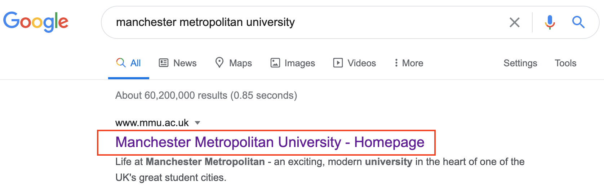
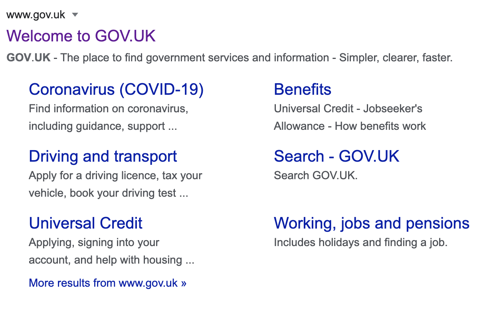
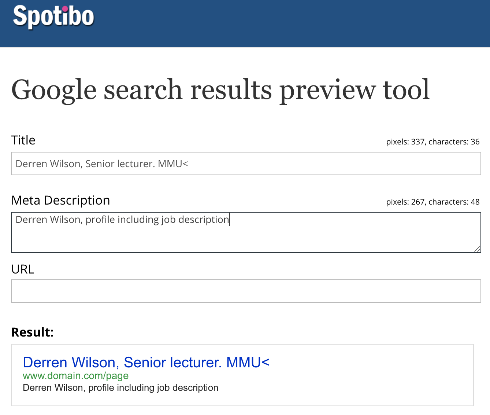

# What is the HTML head?

Let's revisit the simple HTML document we covered in the Anatomy of an HTML document:

```
<!DOCTYPE html>
<html lang="en-gb">
  <head>
    <meta charset="utf-8">
    <title>My test page</title>
  </head>
  <body>
    <p>This is my page</p>
  </body>
</html>
```

The HTML head is the contents of the `<head>` element — unlike the contents of the `<body>` element (which are displayed on the page when loaded in a browser), the head's content is not displayed on the page. Instead, the head's job is to contain metadata about the document. In the above example, the head is quite small:

```
<head>
  <meta charset="utf-8">
  <title>My test page</title>
</head>
```

In larger pages however, the head can get quite full. Try going to some of your favorite websites and use *View Source* or the *developer tools* to check out their head contents.

- [How to view the HTML source code of a web page](https://www.computerhope.com/issues/ch000746.htm).

Our aim here is not to show you how to use everything that can possibly be put in the head, but rather to teach you how to use the major elements that you'll want to include in the head, and give you some familiarity.

## Adding a title

We've already seen the `<title>` element in action — this can be used to add a title to the document. This however can get confused with the `<h1>` element, which is used to add a top level heading to your body content — this is also sometimes referred to as the page title. But they are different things!

The `<h1>` element appears on the page when loaded in the browser — generally this should be used once per page, to mark up the title of your page content (the story title, or news headline, or whatever is appropriate to your usage.)
The `<title>` element is metadata that represents the title of the overall HTML document (not the document's content.)


The `<title>` element contents are also used in other ways. For example, if you try bookmarking the page (Bookmarks > Bookmark This Page or the star icon in the URL bar in Firefox), you will see the `<title>` contents filled in as the suggested bookmark name.

 element"> 

The `<title>` contents are also used in search results, as you'll see below.

#### MMU's `<title>`

```
<title>Manchester Metropolitan University - Homepage</title>
```
#### MMU's search engine results pages (SERPs)




## SEO 

The contents of a page title can have significant implications for search engine optimization (SEO). In general, a longer, descriptive title performs better than short or generic titles. The content of the title is one of the components used by search engine algorithms to decide the order in which to list pages in search results. Also, the title is the initial "hook" by which you grab the attention of readers glancing at the search results page.

### Writing a good page title

A few guidelines and tips for composing good titles:

- Avoid one or two-word titles. Use a descriptive phrase, or a term-definition pairing for glossary or reference-style pages.
- **Search engines typically display about the first 55–60 characters of a page title**. Text beyond that may be lost, so try not to have titles longer than that. If you must use a longer title, make sure the important parts come earlier and that nothing critical is in the part of the title that is likely to be dropped.
- Don't use "keyword blobs." If your title is just a list of words, algorithms often reduce your page's position in the search results.
- Try to make sure your titles are as unique as possible within your own site. Duplicate—or near-duplicate—titles can contribute to inaccurate search results.

### Homepage - `<title>`

The title on your homepage will usually reflect the whole site, company or brand. For example, if you are well known, you can get away with:

```
<title>BBC - Home</title>
```

If you are a little smaller, you may require some context. For example:

```
<title>Harry's Fish & Chips, Altrincham UK</title>
```
Just `Harry's Fish & Chips` might be too vague. Where? Chicago? 

If it's not as clear as `fish and chips`, you may need more. `car parts` alone may not be enough.

```
<title>Gregg's Car Parts, VW, Ford and Renault. Altrincham UK</title>
```
Avoid the words `Welcome` or `Home Page` as they are often wasted words (unless again, you are the BBC or MMU). These are so `1995`! If it's your site, don't just use your name unless it's `Madonna` or `Banksy`.

### Sub-page(s) - `<title>`
The title on your sub-pages need to reflect the content of the particular page, plus some context.

An example, a sub-page of the Halifax bank.

```
<title>Halifax UK | Contact us</title>
```
Current SEO practices (they change all of the time) may dictate that `Halifax UK` comes before the actual function of the page - `Contact us`. 

For someone with a number of tabs open in their browser is it more important for them to see `Halifax` or `Contact us`?

#### Function first?

For accessibility we follow the practice of `function first`. This would mean putting the `Contact us` first in the title. Why? Consider MMU's titles. For example:

```
<title>About us | Manchester Metropolitan University</title>
```
Consider if this was reversed:

```
<title>Manchester Metropolitan University | About us</title>
```
A visually impaired person using a screen reader has the page title read out to them. If whilst navigating the MMU website, they had to hear Manchester Metropolitan University announced each time *before* discovering the function of the page it would be very annoying.

The correct way around means they can hear `About us`, press `SPACE bar` (if they already know they are on the MMU website) and the screen reader will skip to the top of the page.

## Metadata: the `<meta>` element

Metadata is data that describes data, and HTML has an "official" way of adding metadata to a document — the `<meta>` element. Of course, the other stuff we are talking about in this article could also be thought of as metadata too. There are a lot of different types of `<meta>` elements that can be included in your page's `<head>`, but we won't try to explain them all at this stage, as it would just get too confusing. Instead, we'll explain a few things that you might commonly see, just to give you an idea.


### Specifying your document's character encoding

In the HTML document example at the top of this chapter this line was included:

```
<meta charset="utf-8">
```

This element simply specifies the document's character encoding — the character set that the document is permitted to use. `utf-8` is a universal character set that includes pretty much any character from any human language. This means that your web page will be able to handle displaying any language; it's therefore a good idea to set this on every web page you create! For example, your page could handle English and Japanese just fine:


> **Note**: Some browsers (e.g. Chrome) automatically fix incorrect encodings, so depending on what browser you use, you may not see this problem anyway. You should still set an encoding of `utf-8` on your page anyway, to avoid any potential problems in other browsers.


### Adding an author and description

Many `<meta>` elements include name and content attributes:

- `name` specifies the type of meta element it is; what type of information it contains.

- `content` contains the actual meta content.

Two such meta elements that are useful to include on your page define the author of the page, and provide a concise description of the page. Let's look at an example:

```
<meta name="author" content="Chris Mills">

<meta name="description" content="The MDN Web Docs Learning Area aims to provide complete beginners to the Web with all they need to know to get started with developing web sites and applications.">
```

Specifying an author is beneficial in many ways: it is useful to be able to understand who wrote the page, if you have any questions about the content and you would like to contact them. Some content management systems have facilities to automatically extract page author information and make it available for such purposes.

Specifying a description that includes keywords relating to the content of your page is useful as it has the potential to make your page appear higher in relevant searches performed in search engines (such activities are termed Search Engine Optimization, or SEO.)

<h3 class="warning">Things to know</h3>

- Writing a good meta description and title can be an art in itself. It is part of the skill set for good SEO (Search Engine Optimisation).
- *Currently* Google's recommended `meta description` length is from 120 to 158 characters.
- *Currently* Google's recommended `title` length is around 50 characters.
- **Both of the above change regularly and Google don't like talking about it**.
- See below for deeper and advanced learning in this area.


<!-- div class="exercise" -->

## To Do - Meta Description

> The description is also used on search engine result pages. Let's go through an exercise to explore this:

- Go to the [home page of Gov UK https://www.gov.uk](https://www.gov.uk/).

- View the page's source (Right click on the page, choose View Page Source from the context menu.)

  + This article explains [How to View Source code on any browser](https://www.computerhope.com/issues/ch000746.htm).

- Find the description meta tag. It will look something like this (although it may change over time):

```
<meta name="description" content="GOV.UK - The place to find government services and information - Simpler, clearer, faster">
```
Now search for "Gov UK" in your favourite search engine (we used Google). You'll notice the description `<meta name="description">` and `<title>` element content used in the search result — definitely worth having!

<figure>

<figcaption>
In Google, you will see some relevant subpages of Gov UK listed below the main homepage link — these are called sitelinks, and are configurable in Google's webmaster tools — a way to make your site's search results better in the Google search engine.
</figcaption>
</figure>

<!-- end div -->

### `<meta name="keywords">` 

Some `<meta>` features just aren't used any more. For example, the `keyword` `<meta>` element:
```
<meta name="keywords" content="fill, in, your, keywords, here">
```
This meta element is supposed to provide keywords for search engines to determine relevance of that page for different search terms. However, it is ignored by search engines, because spammers were just filling the keyword list with hundreds of keywords, biasing results. *Keywords may still be useful on an intranet where you have better control of the keywords authors use*.

<!-- div class="exercise" -->

## To Do - Your company 

> How does your company do?

### Task 1

- Search for your company homepage on Google.

### Task 2

- **Check** - Does Google <a href="#">display the page title as the blue link</a> in the results? 

> Note: you will also need to open your employer's homepage in another tab and View Source to see the code. `Ctl or Cmd + F` to search the code.

- **Check** - Does Google display all of the text in the title or is it truncated... (because it is too long)?

### Task 3

- **Check** - Does Google use the meta description as part of the search results (like Gov UK)?

- **Check** - again is the description truncated?

> If it doesn't, it may be displaying where your search terms appear on the page.

### Summary

- Does your company do a good job?
- Are the title and description both well written?
- Are either of them over-long?
- Are either of them missing?
- When displayed in the search results, do you think they are helping the person searching?
- Are they helping the search ranking of the company? - *You can't answer this, but do think about it*.

<!-- end div -->

<!-- div class="exercise" -->

## Exercise 10 continued

> Adding a Meta Description to `exercise-10.html`.

### Task 1

- Open the `html10` folder.

- Open `exercise-10.html` in your editor.

- You added a page title, something like:

```
<title>Derren Wilson, Senior lecturer. MMU</title>
```

### Task 2

- Insert under the title the code for a `meta description`.

```
<meta name="description" content="Derren Wilson, profile including job description.">
```
- Note that your text goes in here - `content="Your text"`

- Students often make the mistake of putting their description over the word description - here - `name="description"` - leave this alone.

- At the moment your description is limited as the page doesn't actually have much content to describe. Imagine this page to be the homepage for a personal website for your work or hobbies. Now get more creative - write your self a good, descriptive *meta description* that will sell yor portfolio to the world (and Google).

### Task 3

- Once you have your `title` and `meta description` cut and paste them into this Google search results preview tool (just the text, not the HTML):

> [Google search results preview tool](https://blog.spotibo.com/serp-preview-tool/)

<figure>

<figcaption>
This  tool allows you to see your `title` and `meta description`, as they would look in Google.
</figcaption>
</figure>

- Too long? Too short? Adjust as required and paste back into your page.

> Remember this tool when doing the rest of your coursework - Good metadata will get you good marks.


<!-- end div -->

<p class="submit-work">Exercise 10 is definitely completed.</p> 

## Setting the primary language of the document

Finally, it's worth mentioning that you can (and really should) set the language of your page in the `<head>`. This can be done by adding the lang attribute to the opening HTML tag.

```
<html lang="en-GB">
```

This is useful in many ways. Your HTML document will be indexed more effectively by search engines if its language is set (allowing it to appear correctly in language-specific results, for example), and it is useful to people with visual impairments using screen readers (for example, the word "six" exists in both French and English, but is pronounced differently.)

- US English `<html lang="en">`

- French `<html lang="fr">`

- Spanish `<html lang="es">`

You can also set subsections of your document to be recognised as different languages. For example, we could set our Japanese language section to be recognised as Japanese, like so:

```
<p>Japanese example: <span lang="ja">ご飯が熱い。</span>.</p>
```

These codes are defined by the [ISO 639-1 standard](https://en.wikipedia.org/wiki/ISO_639-1). You can find more about them in [Language tags in HTML and XML](https://www.w3.org/International/articles/language-tags/) if this is important to your work.

<h2 class="deep">Deeper Learning</h2>

To get a better understanding of this topic use the following resources.

- LinkedIn Learning Video: [Jen Simmons -  Document head](https://www.linkedin.com/learning/html-essential-training-4/document-head?u=36102708) (3m 56s)

- MDN: `<head>` - [The Document Metadata (Header) element](https://developer.mozilla.org/en-US/docs/Web/HTML/Element/head)

- MDN: `<meta>` - [The Document-level Metadata element](https://developer.mozilla.org/en-US/docs/Web/HTML/Element/meta)

- MDN: `<title>` - [The Document Title element](https://developer.mozilla.org/en-US/docs/Web/HTML/Element/title)

<h2 class="deep">Advanced Learning</h2>

For students wanting more, we recommend the following topics and resources. 

- LinkedIn Learning Video: [Metadata in the head](https://www.linkedin.com/learning-login/share?forceAccount=false&redirect=https%3A%2F%2Fwww.linkedin.com%2Flearning%2Fhtml-metadata-in-the-head%3Ftrk%3Dshare_ent_url&account=36102708) (1h 25m) - This is a detailed course that covers all elements of metadata that can appear in the head of a html document. More advanced students may wish to learn more about these elements that as a coder they may have skipped.

Some of you may be interested to know more about the use of metadata and improved search results. Both of these courses go into the practice of Search Engine Optimisation (SEO).

- LinkedIn Learning Video: [Improve SEO for your website](https://www.linkedin.com/learning-login/share?forceAccount=false&redirect=https%3A%2F%2Fwww.linkedin.com%2Flearning%2Fimprove-seo-for-your-website%3Ftrk%3Dshare_ent_url&account=36102708) (1h 10m) - discover how to build an authority site that ranks highly in Google—or simply boosts traffic to your current website—by leveraging key SEO tools and techniques

- LinkedIn Learning Video: [SEO Foundations](https://www.linkedin.com/learning-login/share?forceAccount=false&redirect=https%3A%2F%2Fwww.linkedin.com%2Flearning%2Fseo-foundations-2%3Ftrk%3Dshare_ent_url&account=36102708) (3h 36m) Explore the basics of SEO, including how to read a results page and see how rankings affect businesses large and small. 


### &copy; Credit given

Materials used under the Creative Commons licence from [MDN Web Docs](https://developer.mozilla.org/en-US/docs/Web/HTML).