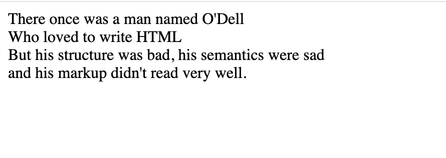

# Lang attribute, Div, Span, br and hr

## Lang attribute

The `lang` attribute is a global attribute. These are attributes common to all HTML elements; they can be used on all elements, though they may have no effect on some elements.

`Lang` is used to define the language used within a particular element. You will see that we can set the global language of a document, but using the `lang` attribute lets us target a specific sentence, block or phrase.

As an example:

```
<p>This paragraph is English, but the language is not specifically defined.</p>

<p lang="en-GB">This paragraph is defined as British English.</p>

<p lang="fr">Ce paragraphe est défini en français.</p>

```
The `en-GB` attribute defines the language used as British as opposed to the default `lang="en"` which is USA.

The `lang="fr"` ensures that a screen reader or AI voice will read that particular sentence in French, as opposed to continuing reading it as English.

These language codes are defined by the [ISO 639-1 standard](https://en.wikipedia.org/wiki/ISO_639-1). 

> **Summary** - Be aware of the `lang` attribute and use where appropriate.


## Line breaks

`<br>` creates a line break in a paragraph; it is the only way to force a rigid structure in a situation where you want a series of fixed short lines, such as in a postal address or a poem. For example:

```
There once was a man named O'Dell<br>
Who loved to write HTML<br>
But his structure was bad, his semantics were sad<br>
and his markup didn't read very well.
```

- Without the `<br>` elements, the paragraph would just be rendered in one long line (as we said earlier in the course, HTML ignores most whitespace); with `<br> `elements in the code the markup renders in the browser like this:




<h3 class="warning">Over use of the br element</h3>

DO NOT use the `<br>` element to either create the illusion of paragraph breaks or to create space on the page. For the former always the `<p>` element, for the latter, use CSS to add space with padding and margins.

**Doing either of the above is a great way to lose marks in your coursework!**


<h2 class="deep">Deeper Learning</h2>

To get a better understanding of this topic use the following resources.

- LinkedIn Learning Video: [Jen Simmons - Supporting languages](https://www.linkedin.com/learning/html-essential-training-4/supporting-languages?u=36102708) (4m 6s)

- MDN: `lang` - [The Lang attribute](https://developer.mozilla.org/en-US/docs/Web/HTML/Global_attributes/lang)

- MDN: `<br>` - [The Line Break element](https://developer.mozilla.org/en-US/docs/Web/HTML/Element/br)


### &copy; Credit given

Materials used under the Creative Commons licence from [MDN Web Docs](https://developer.mozilla.org/en-US/docs/Web/HTML).


