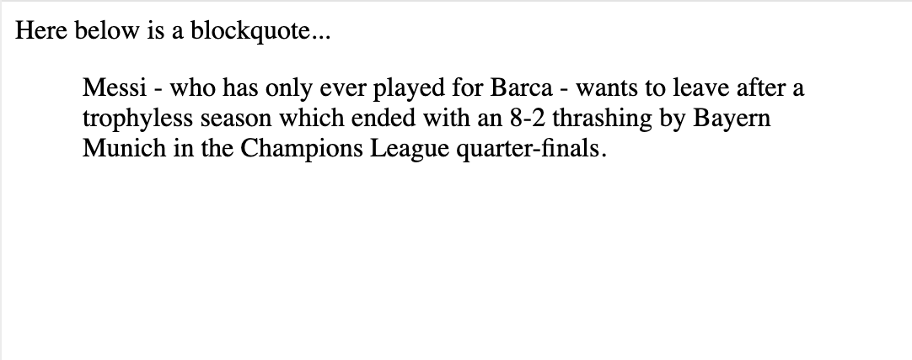
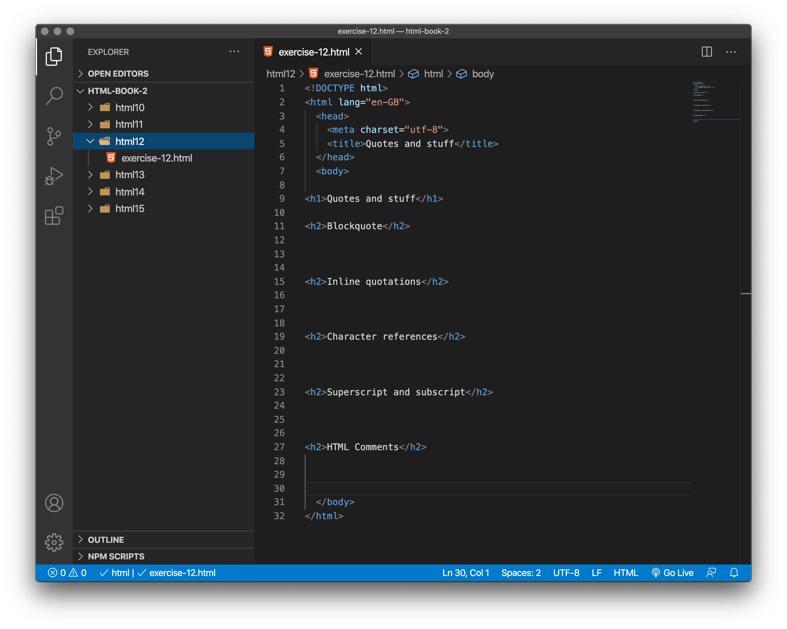

# Quotations

HTML also has features available for marking up quotations; which element you use depends on whether you are marking up a block or inline quotation.

## Blockquotes

If a section of block level content (be it a paragraph, multiple paragraphs, a list, etc.) is quoted from somewhere else, you should wrap it inside a `<blockquote>` element to signify this, and include a URL pointing to the source of the quote inside a `cite` attribute. For example, the following is taken from the BBC Sports pages:

```
<p>Messi - who has only ever played for Barca - wants to leave after a trophyless season which ended with an 8-2 thrashing by Bayern Munich in the Champions League quarter-finals.</p>
```

To turn this into a block quote, we would just do this:

```
<p>Here below is a blockquote...</p>

<blockquote cite="https://www.bbc.co.uk/sport/football/53918659">

  <p>Messi - who has only ever played for Barca - wants to leave after a trophyless season which ended with an 8-2 thrashing by Bayern Munich in the Champions League quarter-finals.</p>

</blockquote>
```

Browser default styling will render this as an indented paragraph, as an indicator that it is a quote; the paragraph above the quotation is there to demonstrate that.



### Format

```
<blockquote cite=""> 
Content
</blockquote>
```
- The `cite` attribute allows you to put the URL of the source

<!-- div class="exercise" -->
## Exercise 12

- Adding a blockquote

### Task 1

> Open the `html12` folder.

- Open `exercise-12.html` in your editor.

<figure>

<figcaption>
Exercise 12 files and folders. 
</figcaption>
</figure>


### Task 2

- Copy and paste this text from MMU Student regulations into the body of the webpage under the `Blockquote` heading (`<h2>`).

```
When you accept the University’s offer of a place, you form a contract with the University. This contract is based upon the University’s terms and conditions of contract. These set out the responsibilities of the University as an education provider, and the expectations of the University’s students. 
```
- Wrap it in the `blockquote` element.

- Add the `cite` attribute.

- Cite the following source - `https://www.mmu.ac.uk/academic/casqe/regulations/docs/policies_regulations.pdf`

- Save `exercise-12.html` and view the page in your browser.

- You will see an indented paragraph. The citied URL is in the code only and not visible on the page. 

- Additional CSS could be applied to make the blockquote standout.

<!-- end div -->


## Inline quotations

Inline quotations work in exactly the same way, except that they use the `<q>` element. For example, the below bit of markup contains a quotation from the MDN `<q>` page:

```
<p>The quote element — <code>&lt;q&gt;</code> — is <q cite="https://developer.mozilla.org/en-US/docs/Web/HTML/Element/q">intended
for short quotations that don't require paragraph breaks.</q></p>
```

Browser default styling will render this as normal text put in quotes to indicate a quotation, like so:

<p>The quote element — <code>&lt;q&gt;</code> — is <q cite="https://developer.mozilla.org/en-US/docs/Web/HTML/Element/q">intended
for short quotations that don't require paragraph breaks.</q></p>

<!-- div class="exercise" -->
## Exercise 12 continued

> Adding a quote

### Task 1

- Return to `exercise-12.html` in your editor.

- Copy and paste this text from the BBC into the body of the webpage under the `Inline quotations` heading (`<h2>`).

```
Richard Osman says being 6ft 7in, I've never walked into a room, got on the tube or walked down the street and not been noticed.
```
- Note that everything after - *Richard Osman says* - is a quote.

- Wrap the quoted text in the `q` element.

- Add the `cite` attribute to the opening `<q>` element (as shown above).

- Cite the following source - `https://www.bbc.co.uk/news/entertainment-arts-53648026`

- Save `exercise-12.html` and view the page in your browser.

- The quote should now be quoted. Again the `<q>` element could be styled to enhance the effect. See [bobulate.com](https://bobulate.com/) for nice examples.

<!-- end div -->


<h2 class="deep">Deeper Learning</h2>

To get a better understanding of this topic use the following resources.

- LinkedIn Learning Video: [Jen Simmons - Quotes](https://www.linkedin.com/learning/html-essential-training-4/quotes?u=36102708) (3m 53s)

- MDN: `<blockquote>` - [The Blockquote element](https://developer.mozilla.org/en-US/docs/Web/HTML/Element/blockquote)

- MDN: `<q>` - [The Inline Quotation element](https://developer.mozilla.org/en-US/docs/Web/HTML/Element/q)


<h2 class="deep">Advanced Learning</h2>

For students wanting more, we recommend the following topics and resources. 

Citations, Abbreviations, dates and time are all things that are not essential at this early stage. If you have time and want to know more, read the following:


## Citations

The content of the `cite` attribute sounds useful, but unfortunately browsers, screenreaders, etc. don't really do much with it. There is no way to get the browser to display the contents of cite, without writing your own solution using JavaScript or CSS. If you want to make the source of the quotation available on the page you need to make it available in the text via a link or some other appropriate way.

There is a `<cite>` element, but this is meant to contain the title of the resource being quoted, e.g. the name of the book. There is no reason however why you couldn't link the text inside `<cite>` to the quote source in some way:

```
<p>According to the <a href="https://developer.mozilla.org/en-US/docs/Web/HTML/Element/blockquote">
<cite>MDN blockquote page</cite></a>:
</p>

<blockquote cite="https://developer.mozilla.org/en-US/docs/Web/HTML/Element/blockquote">
  <p>The <strong>HTML <code>&lt;blockquote&gt;</code> Element</strong> (or <em>HTML Block
  Quotation Element</em>) indicates that the enclosed text is an extended quotation.</p>
</blockquote>

<p>The quote element — <code>&lt;q&gt;</code> — is <q cite="https://developer.mozilla.org/en-US/docs/Web/HTML/Element/q">intended
for short quotations that don't require paragraph breaks.</q> -- <a href="https://developer.mozilla.org/en-US/docs/Web/HTML/Element/q">
<cite>MDN q page</cite></a>.</p>
```

Citations are styled in italic font by default.

<p>According to the <a href="https://developer.mozilla.org/en-US/docs/Web/HTML/Element/blockquote">
<cite>MDN blockquote page</cite></a>:
</p>

<blockquote cite="https://developer.mozilla.org/en-US/docs/Web/HTML/Element/blockquote">
  <p>The <strong>HTML <code>&lt;blockquote&gt;</code> Element</strong> (or <em>HTML Block
  Quotation Element</em>) indicates that the enclosed text is an extended quotation.</p>
</blockquote>

<p>The quote element — <code>&lt;q&gt;</code> — is <q cite="https://developer.mozilla.org/en-US/docs/Web/HTML/Element/q">intended
for short quotations that don't require paragraph breaks.</q> -- <a href="https://developer.mozilla.org/en-US/docs/Web/HTML/Element/q">
<cite>MDN q page</cite></a>.</p>


## Abbreviations

Another fairly common element you'll meet when looking around the Web is `<abbr>` — this is used to wrap around an abbreviation or acronym, and provide a full expansion of the term (included inside a `title` attribute.) Let's look at a couple of examples:

```
<p>We use <abbr title="Hypertext Markup Language">HTML</abbr> to structure our web documents.</p>

<p>I think <abbr title="Reverend">Rev.</abbr> Green did it in the kitchen with the chainsaw.</p>

```

These will come out looking something like this (the expansion will appear in a tooltip when the term is hovered over):

<p>We use <abbr title="Hypertext Markup Language">HTML</abbr> to structure our web documents.</p>

<p>I think <abbr title="Reverend">Rev.</abbr> Green did it in the kitchen with the chainsaw.</p>


## Marking up times and dates

HTML also provides the `<time>` element for marking up times and dates in a machine-readable format. For example:

```
<time datetime="2016-01-20">20 January 2016</time>
```

Why is this useful? Well, there are many different ways that humans write down dates. The above date could be written as:

<pre>
20 January 2016
20th January 2016
Jan 20 2016
20/01/16
01/20/16
The 20th of next month
20e Janvier 2016
2016年1月20日
And so on
</pre>


But these different forms cannot be easily recognised by computers — what if you wanted to automatically grab the dates of all events in a page and insert them into a calendar? The `<time>` element allows you to attach an unambiguous, machine-readable time/date for this purpose.

The basic example above just provides a simple machine readable date, but there are many other options that are possible, for example:

```
<!-- Standard simple date -->
<time datetime="2016-01-20">20 January 2016</time>

<!-- Just year and month -->
<time datetime="2016-01">January 2016</time>

<!-- Just month and day -->
<time datetime="01-20">20 January</time>

<!-- Just time, hours and minutes -->
<time datetime="19:30">19:30</time>

<!-- You can do seconds and milliseconds too! -->
<time datetime="19:30:01.856">19:30:01.856</time>

<!-- Date and time -->
<time datetime="2016-01-20T19:30">7.30pm, 20 January 2016</time>

<!-- Date and time with timezone offset -->
<time datetime="2016-01-20T19:30+01:00">7.30pm, 20 January 2016 is 8.30pm in France</time>

<!-- Calling out a specific week number -->
<time datetime="2016-W04">The fourth week of 2016</time>
```


- MDN: `<cite>` - [The Citation element](https://developer.mozilla.org/en-US/docs/Web/HTML/Element/cite)

- LinkedIn Learning Video: [Jen Simmons - Dates and times](https://www.linkedin.com/learning/html-essential-training-4/dates-and-times?u=36102708) (4m 27s)

- MDN: `<time>` - [The Time element](https://developer.mozilla.org/en-US/docs/Web/HTML/Element/time)


### &copy; Credit given

Materials used under the Creative Commons licence from [MDN Web Docs](https://developer.mozilla.org/en-US/docs/Web/HTML).
