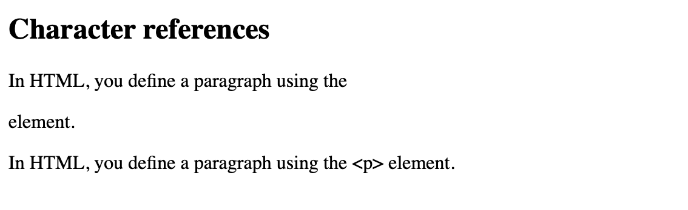
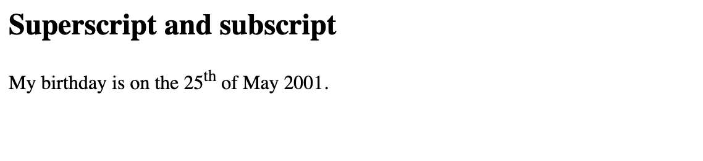
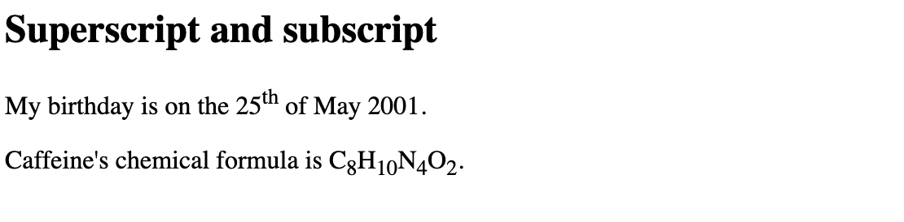
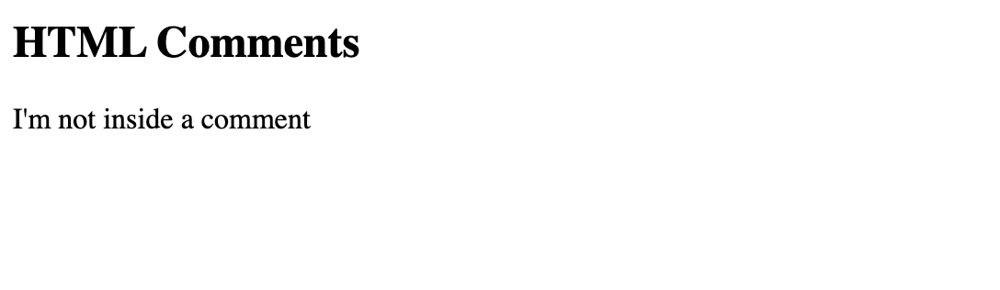

# Code, Entity Characters, Superscript/subscript and HTML comments

## Representing computer code

There are a number of elements available for marking up computer code using HTML:

- `<code>`: For marking up generic pieces of computer code.

- `<pre>`: For retaining whitespace (generally code blocks) 
— if you use indentation or excess whitespace inside your text, browsers will ignore it and you will not see it on your rendered page. If you wrap the text in `<pre></pre>` tags however, your whitespace will be rendered identically to how you see it in your text editor.

There are others including `<var>` [Variable element](https://developer.mozilla.org/en-US/docs/Web/HTML/Element/var) for specifically marking up variable names. `<kbd>` the [Keyboard Input element](https://developer.mozilla.org/en-US/docs/Web/HTML/Element/kbd) for marking up keyboard (and other types of) input entered into the computer and `<samp>` the [Sample Output element](https://developer.mozilla.org/en-US/docs/Web/HTML/Element/samp) for marking up the output of a computer program.

These all have limited use. Perhaps the most common is the use of `<code>`, for example: 

```
<code>var para = document.querySelector('p');</code>

```
The above code will look like so:


<code>var para = document.querySelector('p');</code>


It's handy to know that if you want to put code on a page you can also use special characters to create the angled brackets. See the next section.

And `<pre>` can be handy for showing text indented as intended:


<pre>
To       be

  
  or  not                to be

                                   is the question.
</pre>


## Entity references: Including special characters in HTML

In HTML, the characters `<`, `>`,`"`,`'` and & are special characters. They are part of the HTML syntax itself. So how do you include one of these special characters in your text? For example, if you want to use an ampersand or less-than sign, and not have it interpreted as code.

You do this with character references. These are special codes that represent characters, to be used in these exact circumstances. Each character reference starts with an ampersand (&), and ends with a semicolon (;).

<table class="standard-table">
 <thead>
  <tr>
   <th scope="col">Literal character</th>
   <th scope="col">Character reference equivalent</th>
  </tr>
 </thead>
 <tbody>
  <tr>
   <td>&lt;</td>
   <td>&amp;lt;</td>
  </tr>
  <tr>
   <td>&gt;</td>
   <td>&amp;gt;</td>
  </tr>
  <tr>
   <td>"</td>
   <td>&amp;quot;</td>
  </tr>
  <tr>
   <td>'</td>
   <td>&amp;apos;</td>
  </tr>
  <tr>
   <td>&amp;</td>
   <td>&amp;amp;</td>
  </tr>
 </tbody>
</table>

The character reference equivalent could be easily remembered because the text it uses can be seen as less than for '`&lt;`' , quotation for '`&quot;`' and similarly for others. To find more about entity reference, see [List of XML and HTML character entity references](http://en.wikipedia.org/wiki/List_of_XML_and_HTML_character_entity_references) (Wikipedia).


<!-- div class="exercise" -->
## Exercise 12 continued

> Adding character references

### Task 1

- Return to `exercise-12.html` in your editor.

- Copy and paste this text and code into the body of the webpage under the `Character references` heading (`<h2>`).

```
<p>In HTML, you define a paragraph using the <p> element.</p>

<p>In HTML, you define a paragraph using the &lt;p&gt; element.</p>

```

- Save `exercise-12.html` and refresh in your browser.

- In the live output below, you will see that the first paragraph has gone wrong. The browser interprets the second instance of `<p>` as starting a new paragraph. The second paragraph looks fine because it has angle brackets with character references.



- This code wouldn't validate either. But leave the example as it is.

<!-- end div -->

> Note: You don't need to use entity references for any other symbols, as modern browsers will handle the actual symbols just fine as long as your HTML's character encoding is set to UTF-8.

## Superscript and subscript

You will occasionally need to use superscript and subscript when marking up items like dates, chemical formulae, and mathematical equations so they have the correct meaning. The `<sup>` and `<sub>` elements handle this job. 

<!-- div class="exercise" -->
## Exercise 12 continued

> Adding superscript and subscript

### Task 1

- Return to `exercise-12.html` in your editor.

- Copy and paste this text and code into the body of the webpage under the `Superscript and subscript` heading (`<h2>`).

```
<p>My birthday is on the 25<sup>th</sup> of May 2001.</p>

```

- Save `exercise-12.html` and refresh in your browser.

- Your page should now include this sentence with the <sup>th</sup> superscript in place.




### Task 2

- Return to `exercise-12.html` in your editor.

- Copy and paste this code into the page (under the birthday paragraph).

```
<p>Caffeine's chemical formula is C<sub>8</sub>H 10 N 4 O 2 .</p>
```

- Make all the numbers subscript - we've done the first one (C<sub>8</sub>) for you. Code `10`, `4` and `2` the same.

- Save `exercise-12.html` and refresh in your browser.

<figure>

<figcaption>
Your formula should look like this.
</figcaption>
</figure>

<!-- end div -->

## HTML comments

HTML has a mechanism to write comments in the code. Browsers ignore comments,  effectively making comments invisible to the user. The purpose of comments is to allow you to include notes in the code to explain your logic or coding. This is very useful if you return to a code base after being away for long enough that you don't completely remember it. Likewise, comments are invaluable as different people are making changes and updates.

To write an HTML comment, wrap it in the special markers:

 `<!--` and `-->`

Here is a comment on [booking.com](http://booking.com) homepage - a job advert!

```
<!--
You know you could be getting paid to poke around in our code?
We're hiring designers and developers to work in Amsterdam:
https://careers.booking.com/
-->
```

<!-- div class="exercise" -->
## Exercise 12 continued

> Adding HTML Comments

### Task 1

- Return to `exercise-12.html` in your editor.

- Copy and paste this text and code into the body of the webpage under the `HTML Comments` heading (`<h2>`).

```
<p>I'm not inside a comment</p>

<p>I am!</p>

```

- Save `exercise-12.html` and continue.

### Task 2

- Now wrap a comment around the second paragraph.

- Save `exercise-12.html` and refresh in your browser.

- As you can see below, if you've got it right, only the first paragraph displays in the live output.




### Things to note about HTML Comments

- Whilst the content inside a `comment` is not displayed in the browser, it is not hidden. Anyone can `View Source` of a page and see what's hidden there.

- Comments can be used to temporarily hide a piece or section of code. This can be useful during development.

- Leaving good comments can help someone who inherits your code in the future. Good comments helps provide insight into your coding and design decisions.

<!-- end div -->

<p class="submit-work">Exercise 12 completed.</p> 


<h2 class="deep">Deeper Learning</h2>

To get a better understanding of this topic use the following resources.

- LinkedIn Learning Video: [Jen Simmons - Code, pre and br](https://www.linkedin.com/learning/html-essential-training-4/code-pre-and-br?u=36102708) (4m 42s)

- LinkedIn Learning Video: [Jen Simmons - Special Characters](https://www.linkedin.com/learning/html-essential-training-4/weird-characters?u=36102708) (3m 21s)

- LinkedIn Learning Video: [Jen Simmons - Superscript and subscript](https://www.linkedin.com/learning/html-essential-training-4/superscripts-subscripts-and-small-text?u=36102708) (4m 48s) - we will be looking at image formats in greater detail later, but this provides a good introduction.

- MDN: `<code>` - [The Inline Code element](https://developer.mozilla.org/en-US/docs/Web/HTML/Element/code)

- MDN: `<pre>` - [The Preformatted Text element](https://developer.mozilla.org/en-US/docs/Web/HTML/Element/pre)

- MDN: `<sub>` - [The Subscript element](https://developer.mozilla.org/en-US/docs/Web/HTML/Element/sub)

- MDN: `<sup>` - [The Superscript element](https://developer.mozilla.org/en-US/docs/Web/HTML/Element/sup)

- MDN: `<code>` - [The Inline Code element](https://developer.mozilla.org/en-US/docs/Web/HTML/Element/code)


### &copy; Credit given

Materials used under the Creative Commons licence from [MDN Web Docs](https://developer.mozilla.org/en-US/docs/Web/HTML).


