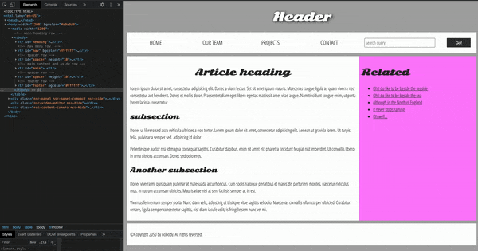
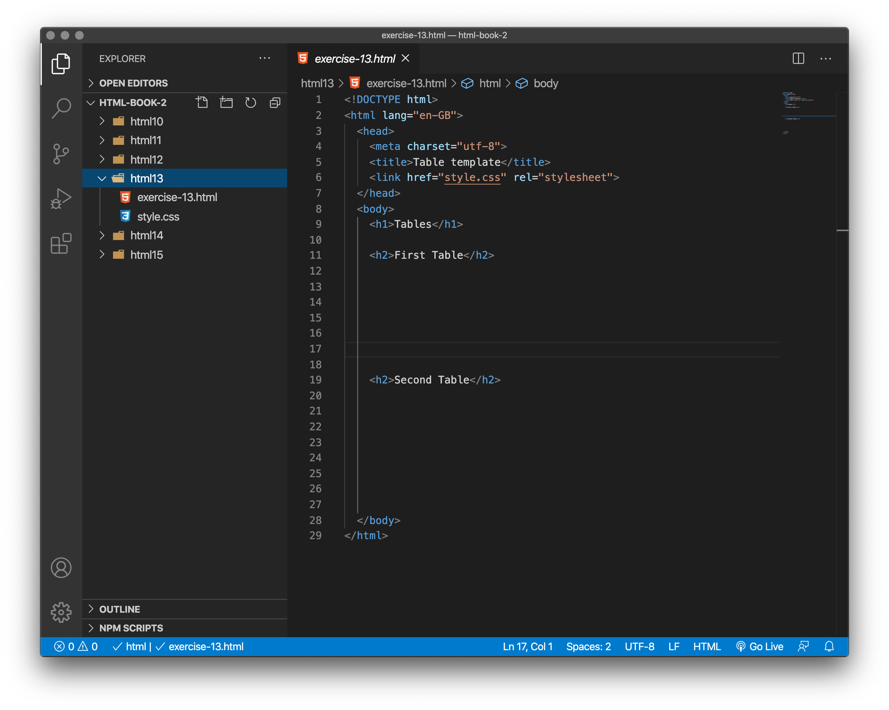
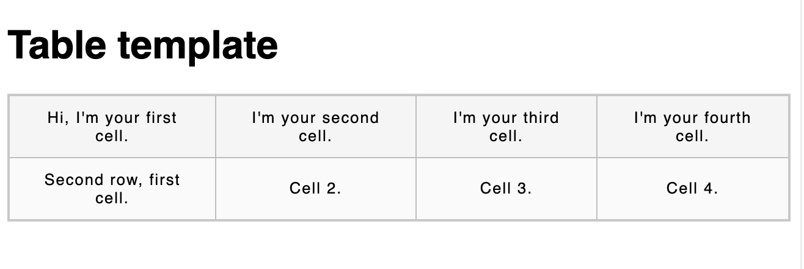
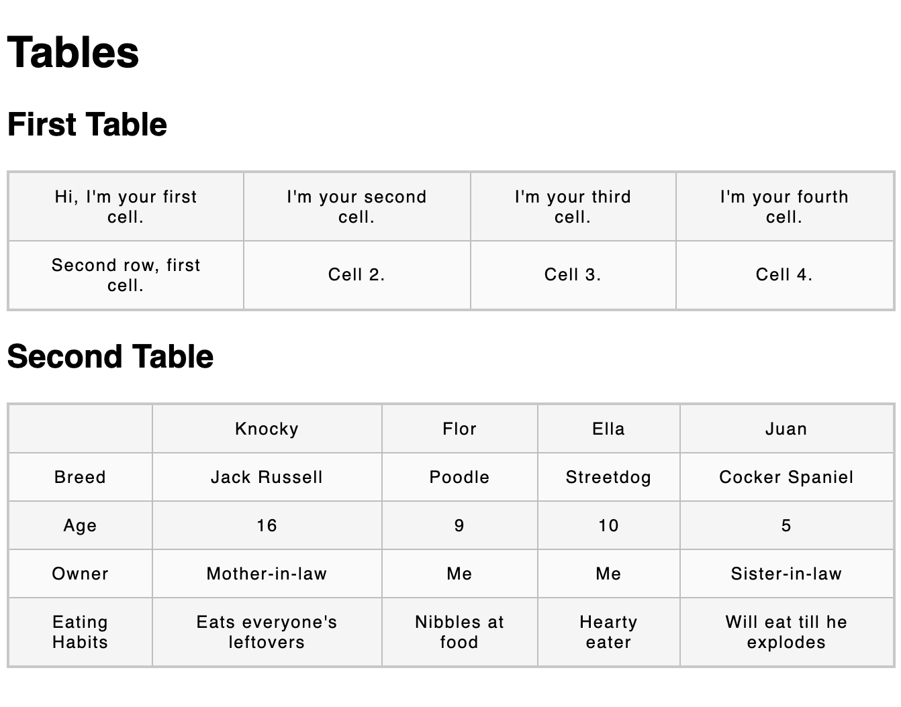
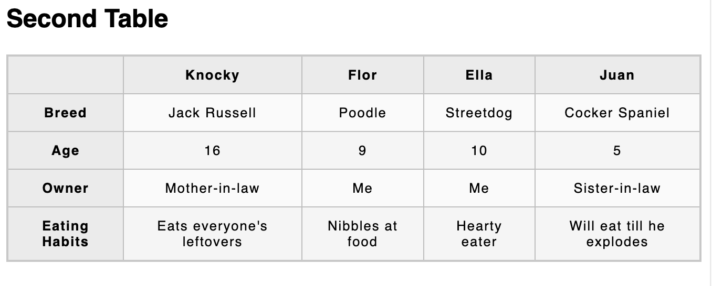
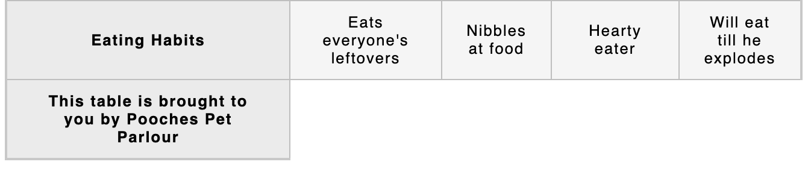
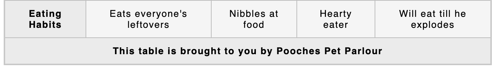
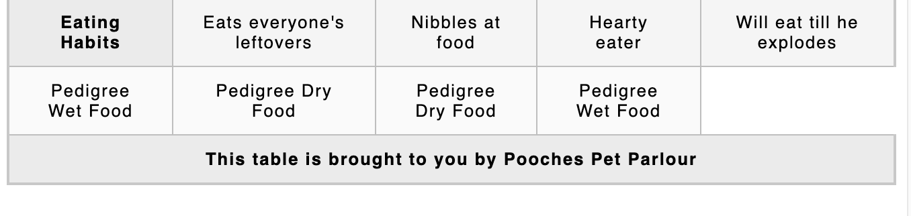

# HTML table basics

This gets you started with HTML tables, covering the very basics such as rows and cells, headings, making cells span multiple columns and rows, and how to group together all the cells in a column for styling purposes.

<h3 class="warning">New to HTML tables?</h3>

If new to HTML tables, it may help to watch Jen's videos **before** starting to follow the tutorial and exercises. 

- LinkedIn Learning Video: [Jen Simmons -  When to use tables](https://www.linkedin.com/learning/html-essential-training-4/when-to-use-tables?u=36102708) (4m 35s)

- LinkedIn Learning Video: [Jen Simmons -  Building table rows](https://www.linkedin.com/learning/html-essential-training-4/building-table-rows?u=36102708) (3m 11s)

## What is a table ?

A table is a structured set of data made up of rows and columns (**tabular data**). A table allows you to quickly and easily look up values that indicate some kind of connection between different types of data, for example a person and their age, or a day of the week, or the timetable for a local swimming pool.


Tables are very commonly used in human society, and have been for a long time.

It is therefore no wonder that the creators of HTML provided a means by which to structure and present tabular data on the web. 

> **Accessibility issues** -  The data in the tables above is inaccessible to a screenreader or computer as the data is locked in a image. That means a visually impaired person cannot access the data, and neither can Google as it indexes the page. Put the tables into html and the data becomes accessible. If coded correctly it can also be accessible on mobile `*`, where these images may become too small to read.

`*` Apologies but we didn't have the time to make our tables mobile friendly!

## How does a table work?

The point of a table is that it is rigid. Information is easily interpreted by making visual associations between row and column headers. Look at the table below for example and find a Jovian gas giant with 62 moons. You can find the answer by associating the relevant row and column headers.


Data about the planets of our solar system (Planetary facts taken from [Nasa's Planetary Fact Sheet - Metric](http://nssdc.gsfc.nasa.gov/planetary/factsheet/)). 	

<table border="1">
 <caption>Data about the planets of our solar system (Planetary facts taken from <a href="http://nssdc.gsfc.nasa.gov/planetary/factsheet/" rel="noopener">Nasa's Planetary Fact Sheet - Metric</a>.</caption>
 <thead>
  <tr>
   <td colspan="2"></td>
   <th scope="col">Name</th>
   <th scope="col">Mass (10<sup>24</sup>kg)</th>
   <th scope="col">Diameter (km)</th>
   <th scope="col">Density (kg/m<sup>3</sup>)</th>
   <th scope="col">Gravity (m/s<sup>2</sup>)</th>
   <th scope="col">Length of day (hours)</th>
   <th scope="col">Distance from Sun (10<sup>6</sup>km)</th>
   <th scope="col">Mean temperature (°C)</th>
   <th scope="col">Number of moons</th>
   <th scope="col">Notes</th>
  </tr>
 </thead>
 <tbody>
  <tr>
   <th colspan="2" rowspan="4" scope="rowgroup">Terrestial planets</th>
   <th scope="row">Mercury</th>
   <td>0.330</td>
   <td>4,879</td>
   <td>5427</td>
   <td>3.7</td>
   <td>4222.6</td>
   <td>57.9</td>
   <td>167</td>
   <td>0</td>
   <td>Closest to the Sun</td>
  </tr>
  <tr>
   <th scope="row">Venus</th>
   <td>4.87</td>
   <td>12,104</td>
   <td>5243</td>
   <td>8.9</td>
   <td>2802.0</td>
   <td>108.2</td>
   <td>464</td>
   <td>0</td>
   <td></td>
  </tr>
  <tr>
   <th scope="row">Earth</th>
   <td>5.97</td>
   <td>12,756</td>
   <td>5514</td>
   <td>9.8</td>
   <td>24.0</td>
   <td>149.6</td>
   <td>15</td>
   <td>1</td>
   <td>Our world</td>
  </tr>
  <tr>
   <th scope="row">Mars</th>
   <td>0.642</td>
   <td>6,792</td>
   <td>3933</td>
   <td>3.7</td>
   <td>24.7</td>
   <td>227.9</td>
   <td>-65</td>
   <td>2</td>
   <td>The red planet</td>
  </tr>
  <tr>
   <th rowspan="4" scope="rowgroup">Jovian planets</th>
   <th rowspan="2" scope="rowgroup">Gas giants</th>
   <th scope="row">Jupiter</th>
   <td>1898</td>
   <td>142,984</td>
   <td>1326</td>
   <td>23.1</td>
   <td>9.9</td>
   <td>778.6</td>
   <td>-110</td>
   <td>67</td>
   <td>The largest planet</td>
  </tr>
  <tr>
   <th scope="row">Saturn</th>
   <td>568</td>
   <td>120,536</td>
   <td>687</td>
   <td>9.0</td>
   <td>10.7</td>
   <td>1433.5</td>
   <td>-140</td>
   <td>62</td>
   <td></td>
  </tr>
  <tr>
   <th rowspan="2" scope="rowgroup">Ice giants</th>
   <th scope="row">Uranus</th>
   <td>86.8</td>
   <td>51,118</td>
   <td>1271</td>
   <td>8.7</td>
   <td>17.2</td>
   <td>2872.5</td>
   <td>-195</td>
   <td>27</td>
   <td></td>
  </tr>
  <tr>
   <th scope="row">Neptune</th>
   <td>102</td>
   <td>49,528</td>
   <td>1638</td>
   <td>11.0</td>
   <td>16.1</td>
   <td>4495.1</td>
   <td>-200</td>
   <td>14</td>
   <td></td>
  </tr>
  <tr>
   <th colspan="2" scope="rowgroup">Dwarf planets</th>
   <th scope="row">Pluto</th>
   <td>0.0146</td>
   <td>2,370</td>
   <td>2095</td>
   <td>0.7</td>
   <td>153.3</td>
   <td>5906.4</td>
   <td>-225</td>
   <td>5</td>
   <td>Declassified as a planet in 2006, but this <a href="http://www.usatoday.com/story/tech/2014/10/02/pluto-planet-solar-system/16578959/" rel="noopener">remains controversial</a>.</td>
  </tr>
 </tbody>
</table>


When done correctly, even blind people can interpret tabular data in an HTML table — a successful HTML table should enhance the experience of sighted and visually impaired users alike.

## Table styling

You can also have a look at the [live example on GitHub](https://mdn.github.io/learning-area/html/tables/assessment-finished/planets-data.html)! One thing you'll notice is that the table does look a bit more readable there — this is because the table you see above on this page has minimal styling (the browser default styles), whereas the GitHub version has more significant CSS applied.

Be under no illusion; for tables to be effective on the web, you need to provide some styling information with CSS, as well as good solid structure with HTML. In this chapter we are focusing on the HTML part.

<h3 class="warning">When should you NOT use HTML tables?</h3>

**HTML tables should be used for tabular data — this is what they are designed for**. 

Unfortunately, in the early days of the web people used to use HTML tables to lay out web pages, e.g. one row to contain the header, one row to contain the content columns, one row to contain the footer, etc. 

You can find an example of a [Page Layout using tables](hhttps://mdn.github.io/learning-area/accessibility/html/table-layout.html) on MDN GitHub. View Source or Inspect to see the code. You will see that the whole page structure is created by a single table.



This was commonly used because CSS support across browsers used to be terrible; table layouts are much less common nowadays, but you might still see them in some corners of the web.

> In short, using tables for layout rather than CSS layout techniques is a bad idea. 

<!-- div class="exercise" -->
## Exercise 13

> Creating your first table. 

- We've talked table theory enough, so, let's dive into a practical example and build up a simple table.

### Task 1

> Open the `html13` folder.

- Open `exercise-13.html` in your editor.

<figure>

<figcaption>
Exercise 13 files and folders. 
</figcaption>
</figure>

- `exercise-13.html` is ready for you to start. We have linked to a style sheet, `style.css` to make the table look better and easier for you to work with. We haven't covered `CSS` yet so don't worry about it - just let it do its stuff.

### Task 2

- The content of every table is enclosed by these two tags : `<table></table>`. Copy and paste this code inside the body of your HTML under the heading `<h2>First Table</h2>`.

```
<table>


</table>
```

- The smallest container inside a table is a table cell, which is created by a `<td>` element (`td` stands for `table data`). Add the following inside your table tags:

```
<td>Hi, I'm your first cell.</td>
```

- If we want a row of four cells, we need to copy these tags three times. Update the contents of your table to look like so:

```
<td>Hi, I'm your first cell.</td>
<td>I'm your second cell.</td>
<td>I'm your third cell.</td>
<td>I'm your fourth cell.</td>
```

- Save `exercise-13.html` and view the page in your browser.

- As you will see, the cells are not placed underneath each other, rather they are automatically aligned with each other on the same row. Each `<td>` element creates a single cell and together they make up the first row. Every cell we add makes the row grow longer.


### Task 3

To stop this row from growing and to start placing subsequent cells on a second row, we need to use the `<tr>` element (`tr` stands for `table row`). Let's investigate this now.

- Place the four cells you've already created inside `<tr>` tags, like so:

```
<tr>
    <td>Hi, I'm your first cell.</td>
    <td>I'm your second cell.</td>
    <td>I'm your third cell.</td>
    <td>I'm your fourth cell.</td>
</tr>
```
- Save `exercise-13.html` and view the page in your browser.

- The table looks no different in the browser, but we have clearly defined both the start and end of this particular row.


### Task 4

- Now you've made one row, have a go at making one more — each row needs to be wrapped in an additional `<tr>` element, with each cell contained in a `<td>`.

- This should result in a table that looks something like the following:



- If you want to see what the table looks like with just the default browser styles simply cut `<link href="style.css" rel="stylesheet">` from the head of the document, save and refresh your browser. Paste `<link href="style.css" rel="stylesheet">` back into the head and save before carrying on.

- Remember to indent your code - it makes it easier to read and spot errors. For example like:

```
<table>
  <tr>
    <td>First row, first cell.</td>
    <td>Cell 2.</td>
    <td>Cell 3.</td>
    <td>Cell 4.</td>
  </tr>
</table>
```

- In Visual Studio Code you can highlight a whole block and tab to indent.

- You can also Tab + Shift to remove an indent.

- Don't be afraid to space your code out at this stage. It makes it easier for you to read.

<!-- end div -->

## Adding headers with `<th>` elements

Now let's turn our attention to table headers — special cells that go at the start of a row or column and define the type of data that row or column contains (as an example, see the "Person" and "Age" cells in the first example shown in this chapter). To illustrate why they are useful, have a look at the following table example. First the source code:

<!-- div class="exercise" -->
## Exercise 13 continued

> Adding table headers.


### Task 1

- Return to `exercise-13.html` in your editor.

- Copy and paste this code inside the body of your HTML under the heading `<h2>Second Table</h2>`.

```
<table>
  <tr>
    <td>&nbsp;</td>
    <td>Knocky</td>
    <td>Flor</td>
    <td>Ella</td>
    <td>Juan</td>
  </tr>
  <tr>
    <td>Breed</td>
    <td>Jack Russell</td>
    <td>Poodle</td>
    <td>Streetdog</td>
    <td>Cocker Spaniel</td>
  </tr>
  <tr>
    <td>Age</td>
    <td>16</td>
    <td>9</td>
    <td>10</td>
    <td>5</td>
  </tr>
  <tr>
    <td>Owner</td>
    <td>Mother-in-law</td>
    <td>Me</td>
    <td>Me</td>
    <td>Sister-in-law</td>
  </tr>
  <tr>
    <td>Eating Habits</td>
    <td>Eats everyone's leftovers</td>
    <td>Nibbles at food</td>
    <td>Hearty eater</td>
    <td>Will eat till he explodes</td>
  </tr>
</table>
```

- Save `exercise-13.html` and view the page in your browser.



- The problem here in our second table is that, while you can kind of make out what's going on, it is not as easy to cross reference data as it could be. If the column and row headings stood out in some way, it would be much better.

### Task 2

- Let's have a go at improving the semantics of this table.

- To recognize the table headers as headers, both visually and semantically, you can use the `<th>` element (`th` stands for `table header`). This works in exactly the same way as a `<td>`, except that it denotes a header, not a normal cell. 

- Go into your `exercise-13.html` and change all the `<td>` elements surrounding the table headers into `<th>` elements.

- The headers for the columns are the dog names:

  + Knocky
  + Flor
  + Ella
  + Juan

For example: `<th>`Knocky`</th>` instead of `<td>`Knocky`</td>`.

- The headers for the rows are the dog features which include:

  + Breed
  + Age
  + Owner
  + Eating Habits

Again, define these as `table headings`.

- Save `exercise-13.html` and view the page in your browser.

- Before we review the results, just read **Task 4**.

### Task 3

- You will have noticed, the first cell of the header row and column looks like this:

`<td>&nbsp;</td>`

- Two things to note.

  + First what is `&nbsp;`? This is a non-breaking space. It simply adds space in our page. It's useful here as it ensures this cell has something in it,even if it is only a space. Use sparingly.

  + Secondly, this cell is empty so should it be changed to a heading? We would say yes, as semantically it is part of the heading.

### Task 4

- Looking at `exercise-13.html` in the browser you should see that the headers now look like headers.



- Semantically the headers are now described (in the code) as headers.

- Visually the headers (`<th>`) are now highlighted (by the CSS styling).

<!-- end div -->

### Why are headers useful?

We have already partially answered this question — it is easier to find the data you are looking for when the headers clearly stand out, and the design just generally looks better.

> Note: Table headings come with some default styling — they are bold and centered even if you don't add your own styling to the table, to help them stand out.

Tables headers also have an added benefit — along with the scope attribute (which we'll learn about in the next chapter), they allow you to make tables more accessible by associating each header with all the data in the same row or column. Screenreaders are then able to read out a whole row or column of data at once, which is pretty useful.

## Allowing cells to span multiple rows and columns

Sometimes we want cells to span multiple rows or columns. Fortunately, table headers and cells have the `colspan` and `rowspan` attributes, which allow us to do just those things. Both accept a unitless number value, which equals the number of rows or columns you want spanned. For example, `colspan="2"` makes a cell span two columns.

<!-- div class="exercise" -->
## Exercise 13 continued

> Let's use `colspan` and `rowspan`.


### Task 1

- Return to `exercise-13.html` in your editor.

- Insert this code (extra row) to the bottom of the Second Table, before the closing `</table>` tag.
```
  <tr>
    <th>This table is brought to you by Pooches Pet Parlour</th>
  </tr>
```

- Save `exercise-13.html` and view the page in your browser.



- We've added a row, but it contains a single cell.

### Task 2

- Add the `colspan` attribute to this single cell.

- Add a value of 5, so it spans 5 columns.

```
<th colspan="5">This table is brought to you...
```

- Save `exercise-13.html` and view the page in your browser.

- The added cell should now *span* all 5 columns.



### Task 3

Adding the `rowspan` attribute.

- Insert the following row under the Eating Habits row.

```   
<tr>
    <td>Pedigree Wet Food</td>
    <td>Pedigree Dry Food</td>
    <td>Pedigree Dry Food</td>
    <td>Pedigree Wet Food</td>
</tr>
```

- Save `exercise-13.html` and view the page in your browser.

- You should see this:



- There are only four `<td>` cells defined, so only four columns. The table is incomplete. There is no `<th>` defined, but the cells all sit to the left.

### Task 4

- We are going to use `rowspan` to make the `row` span two rows for the cell containing **Eating habits**. This will make this cell the *table heading* for both rows.

- Edit the `<td>` for this cell to include the `rowspan` attribute with a value of `2`.

```
<th rowspan="2">Eating Habits</th>
```

- Save `exercise-13.html` and view the page in your browser.

- If successful, you should be seeing the **Eating Habits** row heading now spanning both (2) rows.


<!-- end div -->

<h3 class="warning">Errors - Validation</h3>

- If things are not going quite right with your table, validating the code may help you identify the issues.

- [The W3C HTML Validator](https://validator.w3.org/#validate_by_upload)

- Validate `exercise-13.html` via File Upload.

- Use the feedback from any errors to help you spot your mistakes.


<h2 class="deep">Deeper Learning</h2>

To get a better understanding of this topic use the following resources.

- MDN: `<table>` - [The Table element](https://developer.mozilla.org/en-US/docs/Web/HTML/Element/table)

- MDN: `<tr>` - [The Table Row element](https://developer.mozilla.org/en-US/docs/Web/HTML/Element/tr)

- MDN: `<td>` - [The Table Data Cell element](https://developer.mozilla.org/en-US/docs/Web/HTML/Element/td)

- MDN: `<th>` - [The Table Header element](https://developer.mozilla.org/en-US/docs/Web/HTML/Element/th)


<h2 class="deep">Advanced Learning</h2>

For students wanting more, we recommend the following topics and resources. 

MDN: [Styling tables with CSS](https://developer.mozilla.org/en-US/docs/Learn/CSS/Styling_boxes/Styling_tables) - You will need to understand CSS.

### &copy; Credit given

Materials used under the Creative Commons licence from [MDN Web Docs](https://developer.mozilla.org/en-US/docs/Web/HTML).