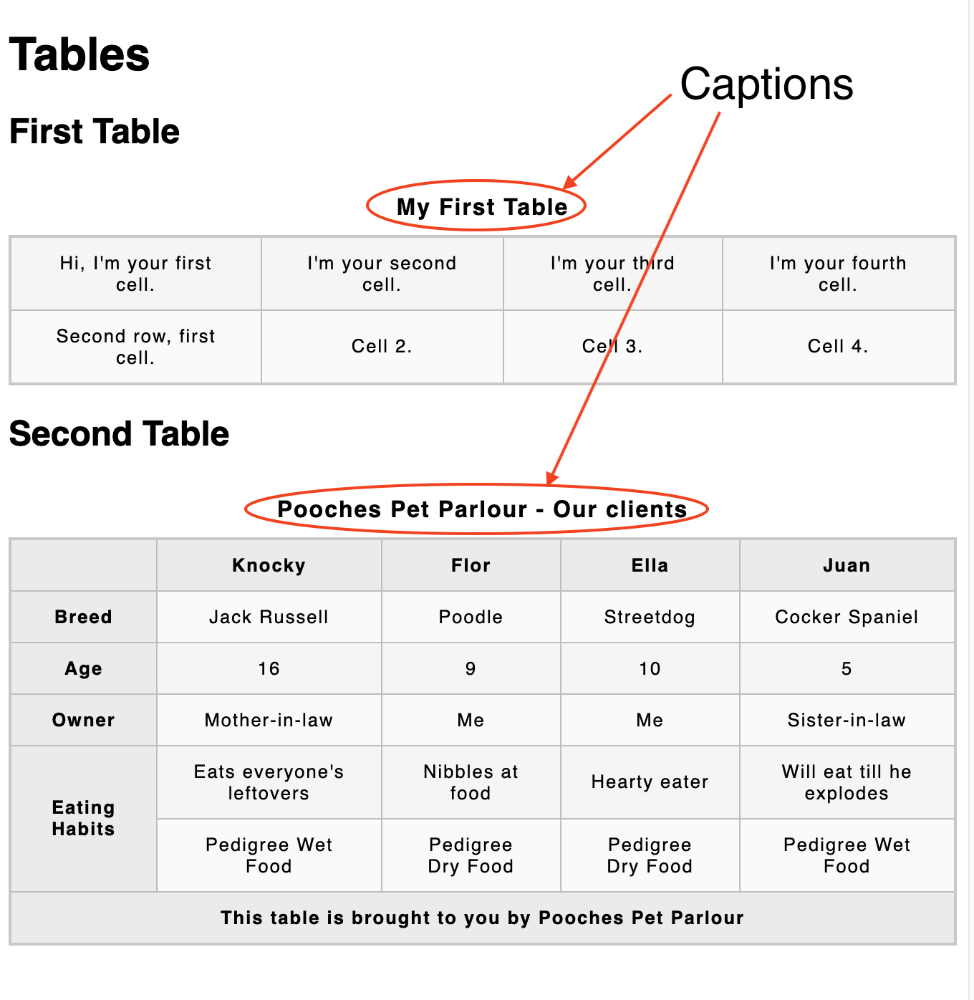
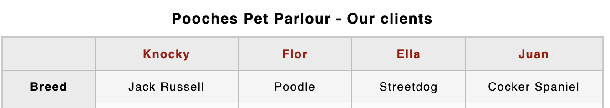
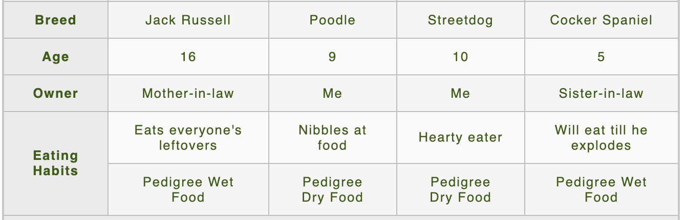
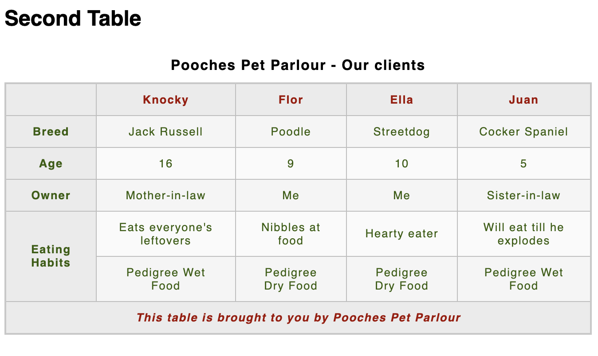
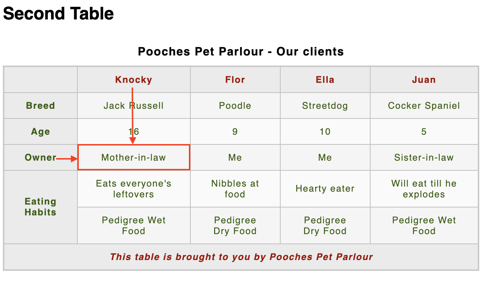

# Further tables

## Adding a caption to your table with `<caption>`

You can give your table a caption by putting it inside a `<caption>` element and nesting that inside the `<table>` element. You should put it just below the opening `<table>` tag.

```
<table>
  <caption>Dinosaurs in the Jurassic period</caption>

  ...
</table>
```

As you can infer from the brief example above, the caption is meant to contain a description of the table contents. This is useful for all readers wishing to get a quick idea of whether the table is useful to them as they scan the page, but particularly for blind users. Rather than have a screenreader read out the contents of many cells just to find out what the table is about, he or she can rely on a caption and then decide whether or not to read the table in greater detail.

A caption is placed directly beneath the `<table>` tag.


<!-- div class="exercise" -->
## Exercise 13 continued

> Adding a caption.


### Task 1

- Return to `exercise-13.html` in your editor.

- Using what you have learnt above, add a suitable caption to both of the tables using the `<caption> </caption>` element.

- Remember it goes just under the opening `<table>` tag.

- Save `exercise-13.html` and view the page in your browser.

<figure>

<figcaption>If successful, you should be seeing both tables with captions - with your text obviously.<figcaption>
</figure>

<!-- end div -->

> Default styles - By default the browser will centre the caption. We've increased the font size and weight (bold) in our CSS. 


## Adding structure with `<thead>`, `<tfoot>`, and `<tbody>`

As your tables get a bit more complex in structure, it is useful to give them more structural definition. One clear way to do this is by using `<thead>`, `<tfoot>`, and `<tbody>`, which allow you to mark up a header, footer, and body section for the table.

These elements don't make the table any more accessible to screenreader users, and don't result in any visual enhancement on their own. They are however very useful for styling and layout — acting as useful hooks for adding CSS to your table. To give you some interesting examples, in the case of a long table you could make the table header and footer repeat on every printed page, and you could make the table body display on a single page and have the contents available by scrolling up and down.

To use them:

- The `<thead>` element must wrap the part of the table that is the header — this is usually the first row containing the column headings, but this is not necessarily always the case. 

- The `<tfoot>` element needs to wrap the part of the table that is the footer — this might be a final row with items in the previous rows summed, for example. You can include the table footer right at the bottom of the table as you'd expect, or just below the table header (the browser will still render it at the bottom of the table).

- The `<tbody>` element needs to wrap the other parts of the table content that aren't in the table header or footer. It will appear below the table header or sometimes footer, depending on how you decided to structure it.


<!-- div class="exercise" -->
## Exercise 13 continued

> Adding table structure (and further semantics).

### Task 1

- Return to `exercise-13.html` in your editor.

- Using our **Second Table**, we are going to semantically mark-up the table sections, the head, the body and the footer using:

  + `<thead> </thead>`
  + `<tbody> </tbody>`
  + `<tfoot> </tfoot>`


- Wrap the `<thead>` tags around your first row like this:

```
  <thead>
    <tr>
      <th>&nbsp;</th>
      <th>Knocky</th>
      <th>Flor</th>
      <th>Ella</th>
      <th>Juan</th>
    </tr>
  </thead>
```

- Save `exercise-13.html` and view the page in your browser.

- We've included a bit of style (dark red font colour) for the `<thead>` so it should be obvious if it works.



### Task 2

- Return to `exercise-13.html` in your editor.

- Wrap the `<tbody> </tbody>` element around the next 5 rows.

```
<tbody>
    <tr>
    ...
    </tr>
    <tr>
    ...
    </tr>
    <tr>
    ...
    </tr>
    <tr>
    ...
    </tr>
    <tr>
    ...
    </tr>
</tbody>
```

- Save `exercise-13.html` and view the page in your browser.

- Again, we've included a bit of style (dark green font colour) for the `<tbody>`, so it should be obvious if it works.



### Task 3

- Return to `exercise-13.html` in your editor.

- Wrap the `<tfoot> </tfoot>` element around the final row.

- This one:

```
  <tr>
    <th colspan="5">This table is brought to you by Pooches Pet Parlour</th>
  </tr>
```

- Save `exercise-13.html` and view the page in your browser.

- We've included more style (dark red font colour, italic) for the `<tfoot>`. Here is the whole page.



<!-- end div -->


## Tables for visually impaired users

Let's recap briefly on how we use data tables. A table can be a handy tool, for giving us quick access to data and allowing us to look up different values. To understand its information we make visual associations between the data in this table and its column and/or row headers. See our **Pooches table** above.

But what if you cannot make those visual associations? How then can you read a table like the above? Visually impaired people often use a screenreader that reads out information on web pages to them. This is no problem when you're reading plain text but interpreting a table can be quite a challenge for a blind person. Nevertheless, with the proper markup we can replace visual associations by programmatic ones.

> Note: Globally, at least 2.2 billion people have a vision impairment or blindness according to WHO data in 2019.

The next section provides further techniques for making tables as accessible as possible.

## Using column and row headers

Screenreaders will identify all headers and use them to make programmatic associations between those headers and the cells they relate to. The combination of column and row headers will identify and interpret the data in each cell so that screenreader users can interpret the table similarly to how a sighted user does.

We already covered headers in our previous section *Adding headers with* `<th>` *elements*.

## The scope attribute

A new topic for this article is the `scope` attribute, which can be added to the `<th>` element to tell screenreaders exactly what cells the header is a header for — is it a header for the row it is in, or the column, for example? Looking back to our **Pooches** example from earlier on, you could unambiguously define the column headers as column headers using `scope="col"` like this:

```
<thead>
  <tr>
    <th scope="col">&nbsp;</th>
    <th scope="col">Knocky</th>
    <th scope="col">Flor</th>
    <th scope="col">Ella</th>
    <th scope="col">Juan</th>
  </tr>
</thead>
```

And each row could have a header defined using `scope="row"` like this:

```
<tr>
    <th scope="row">Breed</th>
    <td>Jack Russell</td>
    <td>Poodle</td>
    <td>Streetdog</td>
    <td>Cocker Spaniel</td>
</tr>
```

Visually the `scope` attribute won't make any difference, but for Screenreaders will recognize markup structured like this, and allow their users to read out the entire column or row at once, for example.

<!-- div class="exercise" -->
## Exercise 13 continued

> Adding `scope="col"` and `scope="row"` 

### Task 1

- Return to `exercise-13.html` in your editor.

- Add both `scope="col"` and `scope="row"` to the Second Table.

- Use the examples above to help you.

- Save `exercise-13.html` and view the page in your browser. 

- Visually there should be no change.

- Validate `exercise-13.html` to check for errors.

> This is the equivalent of a sighted person scanning over a table and spotting that Knocky's owner is the mother-in-law. It helps the screenreader associate that `<td> `containing **mother-in-law** with  the row and column headings.



<!-- end div -->

<p class="submit-work">Exercise 13 completed.</p> 


> `scope` has two more possible values — `colgroup` and `rowgroup`. These are used for headings that sit over the top of multiple columns or rows. You can learn more below if you want.


<h2 class="deep">Deeper Learning</h2>

To get a better understanding of this topic use the following resources.

- MDN: `<caption>` - [The Table Caption element](https://developer.mozilla.org/en-US/docs/Web/HTML/Element/caption)

- MDN: `<thead>` - [The Table Head element](https://developer.mozilla.org/en-US/docs/Web/HTML/Element/thead)

- MDN: `<tfoot>` - [The Table Foot element](https://developer.mozilla.org/en-US/docs/Web/HTML/Element/tfoot)

- MDN: `<tbody>` - [The Table Body element](https://developer.mozilla.org/en-US/docs/Web/HTML/Element/tbody)


> Note: `<tbody>` is always included in every table, implicitly if you don't specify it in your code. To check this, open up one of your previous examples that doesn't include `<tbody>` and look at the HTML code in your [browser developer tools](https://developer.mozilla.org/en-US/docs/Learn/Common_questions/What_are_browser_developer_tools) — you will see that the browser has added this tag for you. You might wonder why you ought to bother including it at all — you should, because it gives you more control over your table structure and styling.

<h2 class="advanced">Advanced Learning</h2>

For students wanting more, we recommend the following topics and resources. 

- MDN: `<col>` - [The Column element](https://developer.mozilla.org/en-US/docs/Web/HTML/Element/col)

- MDN: `<colgroup>` - [The Column Group element](https://developer.mozilla.org/en-US/docs/Web/HTML/Element/colgroup)

- LinkedIn Learning Video: [Jen Kramer -  HTML Tables](https://www.linkedin.com/learning-login/share?forceAccount=false&redirect=https%3A%2F%2Fwww.linkedin.com%2Flearning%2Fhtml-tables%3Ftrk%3Dshare_ent_url&account=36102708) (1h 25m) - This complete course covers the essential skills you need to learn to display and format tabular data on the web. Watch and learn how to build tables with HTML, style tables with CSS, and make your tables accessible to users with disabilities on all types of devices.

### &copy; Credit given

Materials used under the Creative Commons licence from [MDN Web Docs](https://developer.mozilla.org/en-US/docs/Web/HTML).