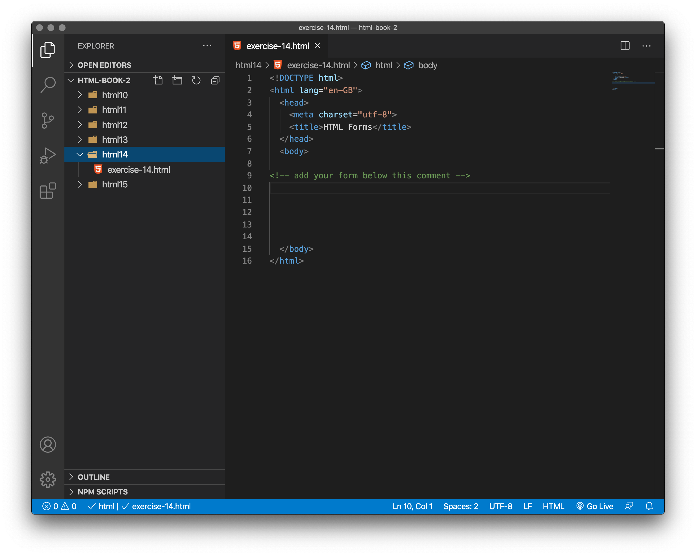
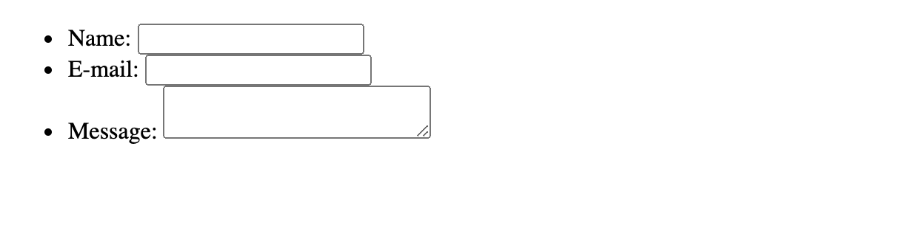
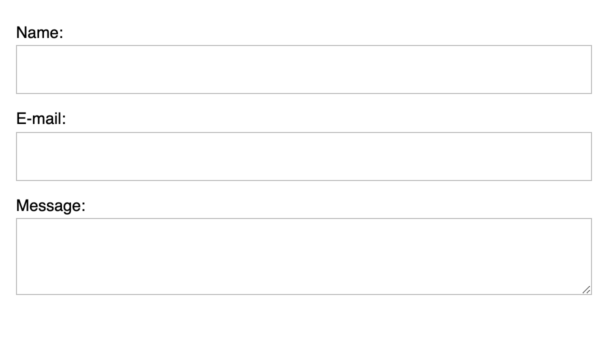
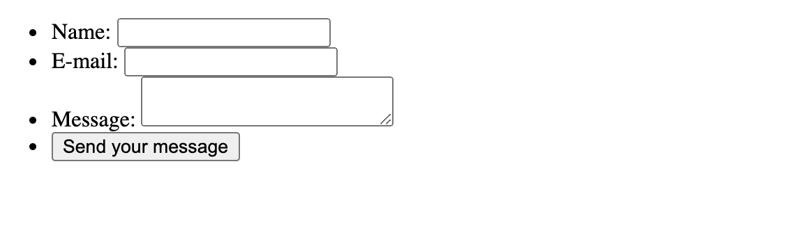

# `<html>` Forms

## What are web forms?

Web forms are one of the main points of interaction between a user and a web site or application. Forms allow users to enter data, which is generally sent to a web server for processing and storage, or used on the client-side to immediately update the interface in some way (for example, add another item to a list, or show or hide a UI feature).

> Note - in this unit we are not concerned with methods (programming/scripting) of processing a form. We focus on the html coding, the design and the accessibility of each form element. MDN's article on  *Sending form data* article is linked in the Advanced Learning section below.

A web form's HTML is made up of one or more form controls (sometimes called widgets), plus some additional elements to help structure the overall form — they are often referred to as HTML forms. The controls can be single or multi-line text fields, dropdown boxes, buttons, checkboxes, or radio buttons, and are mostly created using the `<input>` element, although there are some other elements to learn about too.

Form controls can also be programmed to enforce specific formats or values to be entered (**form validation**), and paired with text labels that describe their purpose to both sighted and blind users.

<!-- div class="exercise" -->

## Exercise 14

- We've talked table theory enough, so, let's dive into a practical example and build up a simple table.

### Task 1

> Open the `html14` folder.

- Open `exercise-14.html` in your editor.

<figure>

<figcaption>
Exercise 14 files and folders. 
</figcaption>
</figure>


> We will use the following HTML elements: `<form>`, `<label>`, `<input>`, `<textarea>`, and `<button>`.

- All forms start with a `<form>` element, like this:

```
<form action="/my-handling-form-page" method="post">

</form>
```

- As we have said, we are not interested at this stage in processing the form, so all you need to add to the `body` of the page is opening and closing `<form>` tags.

```
<form>


</form>
```

- Save `exercise-14.html`.

- This element formally defines a form. It's a container element like a `<div>` element, but specifically for containing forms.

### Task 2

> The `<label>`, `<input>`, and `<textarea>` elements

- Our contact form is not complex: the data entry portion contains three text fields, each with a corresponding `<label>`:

1. The `input` field for the name is a single-line `text` field.

1. The `input` field for the e-mail is an input of `type email`: a single-line text field that accepts only e-mail addresses.

1. The `input` field for the message is a `<textarea>`: a multiline text field.

- Add the following code (type or copy & paste) to `exercise-14.html` between the `<form>` tags

```
 <ul>
  <li>
    <label for="name">Name:</label>
    <input type="text" id="name" name="user_name">
  </li>
  <li>
    <label for="mail">E-mail:</label>
    <input type="email" id="mail" name="user_email">
  </li>
  <li>
    <label for="msg">Message:</label>
    <textarea id="msg" name="user_message"></textarea>
  </li>
 </ul>

```
> *Note that the form elements are placed inside an un-ordered list. More about this below.*

- Save `exercise-14.html` and view the page in your browser. 

- It should something like this - not pretty!

<figure>

<figcaption>
The form is rendered with the browser defaults including the list bullet points.
</figcaption>
</figure>

<!-- end div -->

## So what's going on here?

Firstly, forget the styling. These are the browser defaults - which by default are terrible. You will be styling a form in the second assignment.

<figure>

<figcaption>
A little bit of added styling brings immediate improvements.
</figcaption>
</figure>

The `<li>` elements are there to conveniently structure our code and make styling easier. For usability and accessibility, we include an explicit label for each form control. Note the use of the `for` attribute on all `<label>` elements, which takes as its value the `id` of the form control with which it is associated — this is how you associate a form control with its label.

There is great benefit to doing this — it associates the `label` with the form control, enabling mouse, trackpad, and touch device users to click on the `label` to activate the corresponding control, and it also provides an accessible name for screen readers to read out to their users. You'll find further details of *form labels* in the next chapter.

On the `<input>` element, the most important attribute is the type attribute. This attribute is extremely important because it defines the way the `<input>` element appears and behaves. 

- In our simple example, we use the value `<input/text>` for the first input — the default value for this attribute. It represents a basic single-line text field that accepts any kind of text input.

- For the second input, we use the value `<input/email>`, which defines a single-line text field that only accepts a well-formed e-mail address. This turns a basic text field into a kind of "**intelligent**" field that will perform some validation checks on the data typed by the user. It also causes a more appropriate keyboard layout for entering email addresses (e.g. with an @ symbol by default) to appear on devices with dynamic keyboards, like smartphones. 

Last but not least, note the syntax of `<input>` vs. `<textarea></textarea>`. This is one of the oddities of HTML. The `<input>` tag is an empty element, meaning that it doesn't need a closing tag. `<textarea>` is not an empty element, meaning it should be closed with the proper ending tag. This has an impact on a specific feature of forms: the way you define the default value. To define the default value of an `<input>` element you have to use the value attribute like this:

```
<input type="text" value="by default this element is filled with this text">
```

On the other hand,  if you want to define a default value for a `<textarea>`, you put it between the opening and closing tags of the `<textarea>` element, like this:

```
<textarea>
by default this element is filled with this text
</textarea>
```

<!-- div class="exercise" -->
## Exercise 14 continued

> The `<button>` element

- The markup for our form is almost complete; we just need to add a `button` to allow the user to send, or "submit", their data once they have filled out the form.

### Task 1

- Return to `exercise-14.html` in your editor.

- Add the `<button>` element by inserting it just above the closing `</ul>` tag:

```
<li>
  <button type="submit">Send your message</button>
</li>
```

- Save `exercise-14.html` and view the page in your browser. 

- You should now have a submit button added to your form.



- Our button won't actually do anything as we have no script or programming attached to the form. Again we are focussing on the HTML.

<!-- end div -->

<p class="submit-work">Exercise 14 completed.</p> 

## It is also worth knowing...

- The `<button>` element also accepts a `type` attribute — this accepts one of three values: `submit`, `reset`, or `button`.

- A click on a submit button (the default value) sends the form's data to the web page defined by the action attribute of the `<form>` element.

- A click on a reset button resets all the form widgets to their default value immediately. From a UX point of view, this is considered bad practice, so you should avoid using this type of button unless you really have a good reason to include one.

- A click on a button button does... nothing! That sounds silly, but it's amazingly useful for building custom buttons — you can define their chosen functionality with JavaScript.

> Note: You can also use the `<input>` element with the corresponding type to produce a button, for example `<input type="submit">`. The main advantage of the `<button>` element is that the `<input>` element only allows plain text in its label whereas the `<button>` element allows full HTML content, allowing more complex, creative button content.


<h2 class="deep">Deeper Learning</h2>

To get a better understanding of this topic use the following resources.

- LinkedIn Learning Video: [Jen Simmons - html form basics](https://www.linkedin.com/learning/html-essential-training-4/html-form-basics?u=36102708) (5m 41s) 

- LinkedIn Learning Video: [Jen Simmons - More on forms](https://www.linkedin.com/learning/html-essential-training-4/more-on-forms?u=36102708) (3m 37s) 

- MDN: `<form>` - [The Form element](https://developer.mozilla.org/en-US/docs/Web/HTML/Element/form)

- MDN: `<label>` - [The Label element](https://developer.mozilla.org/en-US/docs/Web/HTML/Element/label)

- MDN: `<input>` - [The Input (Form Input) element](https://developer.mozilla.org/en-US/docs/Web/HTML/Element/input)

- MDN: `<textarea>` - [The Textarea element](https://developer.mozilla.org/en-US/docs/Web/HTML/Element/textarea)

- MDN: `<form>` - [The Button element](https://developer.mozilla.org/en-US/docs/Web/HTML/Element/button)

<h2 class="advanced">Advanced Learning</h2>

For students wanting more, we recommend the following topics and resources. 

- Article: MDN - [Sending form data](https://developer.mozilla.org/en-US/docs/Learn/Forms/Sending_and_retrieving_form_data)

### Designing your form

Before starting to code, it's always better to step back and take the time to think about your form. Designing a quick mockup on paper will help you to define the right set of data you want to ask your user to enter. From a user experience (UX) point of view, it's important to remember that the bigger your form, the more you risk frustrating people and losing users. Keep it simple and stay focused: ask only for the data you absolutely need.

Designing forms is an important step when you are building a site or application. It's beyond the scope of this tutorial to cover the user experience of forms, but if you want to dig into that topic you should read the following articles:

Smashing Magazine has some [good articles about forms UX](https://www.smashingmagazine.com/2018/08/ux-html5-mobile-form-part-1/), including an older but still relevant [Extensive Guide To Web Form Usability](https://www.smashingmagazine.com/2011/11/extensive-guide-web-form-usability/) article.
UXMatters is also a very thoughtful resource with good advice from [basic best practices](http://www.uxmatters.com/mt/archives/2012/05/7-basic-best-practices-for-buttons.php) to complex concerns such as [multi-page forms](http://www.uxmatters.com/mt/archives/2010/03/pagination-in-web-forms-evaluating-the-effectiveness-of-web-forms.php).

### &copy; Credit given

Materials used under the Creative Commons licence from [MDN Web Docs](https://developer.mozilla.org/en-US/docs/Web/HTML).