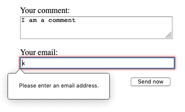
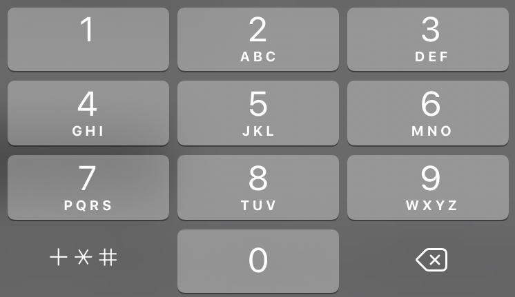
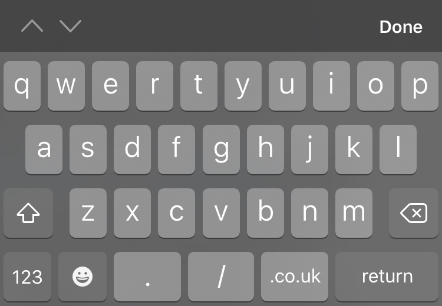

# More `<html>` forms

> This chapter provides more information including the important accessibility features of the `label` attribute `<fieldset>` and `<legend>` elements. You don't need to code any of this, just read though to get some understanding.

## The `<fieldset>` and `<legend>` elements

The `<fieldset>` element is a convenient way to create groups of widgets that share the same purpose, for styling and semantic purposes. You can label a `<fieldset>` by including a `<legend>` element just below the opening `<fieldset>` tag. The text content of the `<legend>` formally describes the purpose of the `<fieldset>` it is included inside.

Many assistive technologies will use the `<legend>` element as if it is a part of the label of each control inside the corresponding `<fieldset>` element. For example, some screen readers such as Jaws and NVDA will speak the legend's content before speaking the label of each control.

Here is a little example:

```
<form>
  <fieldset>
    <legend>Fruit juice size</legend>
    <p>
      <input type="radio" name="size" id="size_1" value="small">
      <label for="size_1">Small</label>
    </p>
    <p>
      <input type="radio" name="size" id="size_2" value="medium">
      <label for="size_2">Medium</label>
    </p>
    <p>
      <input type="radio" name="size" id="size_3" value="large">
      <label for="size_3">Large</label>
    </p>
  </fieldset>
</form>

```
Which will display like this:

<form style="padding-bottom: 15px">
  <fieldset>
    <legend>Fruit juice size</legend>
    <p>
      <input type="radio" name="size" id="size_1" value="small">
      <label for="size_1">Small</label>
    </p>
    <p>
      <input type="radio" name="size" id="size_2" value="medium">
      <label for="size_2">Medium</label>
    </p>
    <p>
      <input type="radio" name="size" id="size_3" value="large">
      <label for="size_3">Large</label>
    </p>
  </fieldset>
</form>

When reading the above form, a screen reader will speak "**Fruit juice size small**" for the first widget, "**Fruit juice size medium**" for the second, and "**Fruit juice size large**" for the third.

Each time you have a set of radio buttons, you should nest them inside a `<fieldset>` element. There are other use cases, and in general the `<fieldset>` element can also be used to section a form. Ideally, long forms should be spread across multiple pages, but if a form is getting long and must be on a single page, putting the different related sections inside different `fieldsets` improves usability.

Because of its influence over assistive technology, the `<fieldset>` element is one of the key elements for building accessible forms; however it is your responsibility not to abuse it. If possible, each time you build a form, try to listen to how a screen reader interprets it. If it sounds odd, try to improve the form structure.

## The `<label>` element

As we saw in the previous chapter, the ```<label>``` element is the formal way to define a label for an HTML form widget. This is the most important element if you want to build accessible forms — when implemented properly, screenreaders will speak a form element's label along with any related instructions, as well as it being useful for sighted users. Take this example, which we saw in the previous article:

```
<label for="name">Name:</label> <input type="text" id="name" name="user_name">
```

With the `<label>` associated correctly with the `<input>` via its for attribute (which contains the `<input>` element's id attribute), a screenreader will read out something like "Name, edit text".

There is another way to associate a form control with a label — nest the form control within the `<label>`, implicitly associating it.

```
<label for="name">
  Name: <input type="text" id="name" name="user_name">
</label>
```

Even in such cases however, it is considered best practice to set the for attribute to ensure all assistive technologies understand the relationship between label and widget.

> If there is no label, or if the form control is neither implicitly or explicitly associated with a label, a screen reader will read out something like "Edit text blank", which isn't very helpful at all.

### Labels are clickable, too!

Another advantage of properly set up labels is that you can click or tap the label to activate the corresponding widget. This is useful for controls like text inputs, where you can click the label as well as the input to focus it, but it is especially useful for radio buttons and checkboxes — the hit area of such a control can be very small, so it is useful to make it as easy to activate as possible.

For example, clicking on the "**I like cherry**" label text in the example below will toggle the selected state of the taste_cherry checkbox:

<form>
  <p>
    <input type="checkbox" id="taste_1" name="taste_cherry" value="cherry">
    <label for="taste_1">I like cherry</label>
  </p>
  <p>
    <input type="checkbox" id="taste_2" name="taste_banana" value="banana">
    <label for="taste_2">I like banana</label>
  </p>
</form>

The code - look for the matching `id="taste_1"` and `<label for="taste_1">` which link the button and label together.

```
<form>
  <p>
    <input type="checkbox" id="taste_1" name="taste_cherry" value="cherry">
    <label for="taste_1">I like cherry</label>
  </p>
  <p>
    <input type="checkbox" id="taste_2" name="taste_banana" value="banana">
    <label for="taste_2">I like banana</label>
  </p>
</form>
```

## Native form controls

### Text input fields

Text `<input>` fields are the most basic form widgets. They are a very convenient way to let the user enter any kind of data.

They can have a `placeholder`; this is text that appears inside the text input box that should be used to briefly describe the purpose of the box.

### Checkboxes and radio buttons

Checkable items are controls whose state you can change by clicking on them or their associated labels. There are two kinds of checkable item: the `check box` and the `radio button`. Both use the checked attribute to indicate whether the widget is checked by default or not.

### E-mail address field

This type of field is set using the value email for the type attribute:
```
<input type="email" id="email" name="email">
```
When this type is used, the user is required to type a valid email address into the field. Any other content causes the browser to display an error when the form is submitted. You can see this in action in the below screenshot.



On some devices — notably, touch devices with dynamic keyboards like smart phones — a different virtual keypad might be presented that is more suitable for entering email addresses, including the @ key. See the IOS keyboard screenshot below for an example:
<figure>

<figcaption>
IOS email keyboard, with @ displayed by default.
</figcaption>
</figure>


### Client-side validation

As you can see above, `email`, along with other newer `input` types, provides built-in client-side error validation — performed by the browser before the data gets sent to the server. It is a helpful aid to guide users to fill out a form accurately, and it can save time — it is useful to know that your data is not correct immediately, rather than having to wait for a round trip to the server.

But it should not be considered an exhaustive security measure! Your apps should always perform security checks on any form-submitted data on the server-side as well as the client-side, because client-side validation is too easy to turn off, so malicious users can still easily send bad data through to your server. 

### Phone number field

A special field for filling in phone numbers can be created using tel as the value of the type attribute:

```
<input type="tel" id="tel" name="tel">
```

When accessed via a touch device with a dynamic keyboard, most devices will display a numeric keypad when `type="tel"` is encountered, meaning this type is useful whenever a numeric keypad is useful, and doesn't just have to be used for telephone numbers.

The following IOS keyboard screenshot provides an example:

<figure>

<figcaption>
IOS phone number keyboard displayed by default.
</figcaption>
</figure>

Due to the wide variety of phone number formats around the world, this type of field does not enforce any constraints on the value entered by a user (this means it may include letters, etc.).

### URL field

A special type of field for entering URLs can be created using the value url for the `type` attribute:

```
<input type="url" id="url" name="url">
```

It adds special validation constraints to the field. The browser will report an error if no protocol (such as `http`:) is entered, or if the URL is otherwise malformed. On devices with dynamic keyboards, the default keyboard will often display some or all of the colon, period, and forward slash as default keys.

See below for an example from IOS:

<figure>

<figcaption>
IOS URL keyboard, with <code>.co.uk</code> and other top level domains such as <code>.com</code> displayed by default.
</figcaption>
</figure>

> Note: Just because the URL is well-formed doesn't necessarily mean that it refers to a location that actually exists!


<h2 class="deep">Deeper Learning</h2>

To get a better understanding of this topic use the following resources.


- LinkedIn Learning Video: [Jen Simmons - Additional form elements](https://www.linkedin.com/learning/html-essential-training-4/additional-form-element-types?u=36102708) (4m 47s) 


### &copy; Credit given

Materials used under the Creative Commons licence from [MDN Web Docs](https://developer.mozilla.org/en-US/docs/Web/HTML).
