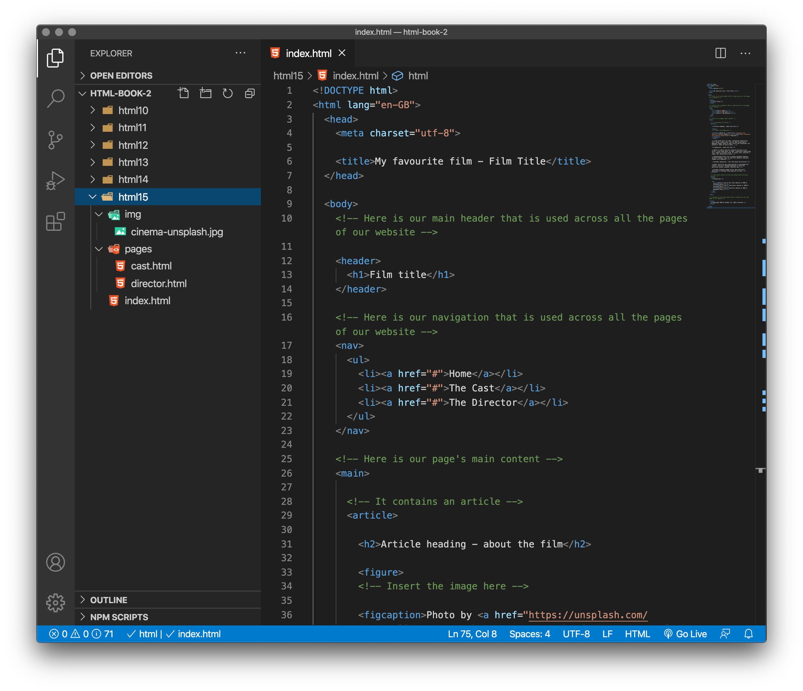
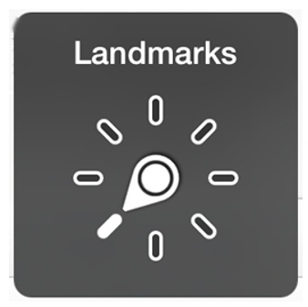

# Semantic elements

In addition to defining individual parts of your page (such as "a paragraph" or "an image"), `HTML` also boasts a number of block level elements used to define areas of your website (such as "the header", "the navigation menu", "the main content column"). This chapter looks into how to plan a basic website structure, and write the HTML to represent this structure.

## Basic sections of a document

Webpages can and will look pretty different from one another, but they all tend to share similar standard components:

- **header**: Usually a big strip across the top with a big heading, logo, and perhaps a tagline. This usually stays the same from one webpage to another.

- **navigation bar**: Links to the site's main sections; usually represented by menu buttons, links, or tabs. Like the header, this content usually remains consistent from one webpage to another — having inconsistent navigation on your website will just lead to confused, frustrated users. Many web designers consider the navigation bar to be part of the header rather than an individual component, but that's not a requirement; in fact, some also argue that having the two separate is better for accessibility, as screen readers can read the two features better if they are separate.

- **main content**: A big area in the center that contains most of the unique content of a given webpage, for example, the video you want to watch, or the main story you're reading, or the map you want to view, or the news headlines, etc. This is the one part of the website that definitely will vary from page to page!

- **sidebar**: Some peripheral info, links, quotes, ads, etc. Usually, this is contextual to what is contained in the main content (for example on a news article page, the sidebar might contain the author's bio, or links to related articles) but there are also cases where you'll find some recurring elements like a secondary navigation system.

- **footer**: A strip across the bottom of the page that generally contains fine print, copyright notices, or contact info. It's a place to put common information (like the header) but usually, that information is not critical or secondary to the website itself. The footer is also sometimes used for SEO purposes, by providing links for quick access to popular content.

A "typical website" could be structured something like this:
<figure>

<figcaption>
A simple website structure example featuring a main heading, navigation menu, main content, side bar, and footer
</figcaption>
</figure>

You'll soon learn how the same, semantic code can be delivered in a variety of designs just by tweaking the CSS. Remember [CSS Zen Garden](http://www.csszengarden.com/)?

## HTML for structuring content

The simple example shown above isn't pretty, but it is perfectly fine for illustrating a typical website layout example. Some websites have more columns, some are a lot more complex, but you get the idea. With the right CSS, you could use pretty much any elements to wrap around the different sections and get it looking how you wanted, but as discussed before, we need to respect semantics and use the right element for the right job.

This is because visuals don't tell the whole story. We use color and font size to draw sighted users' attention to the most useful parts of the content, like the navigation menu and related links, but what about visually impaired people for example, who might not find concepts like "pink" and "large font" very useful?

### Don't rely on just colour


Most people with colour vision deficiency have difficulty distinguishing between shades of red, yellow and green.

This is known as "red-green" colour vision deficiency. It's a common problem that affects around 1 in 12 men and 1 in 200 women.

Someone with this type of colour vision deficiency may:

- Find it hard to tell the difference between reds, oranges, yellows, browns and greens.

- See these colours as much duller than they would appear to someone with normal vision.

- Have trouble distinguishing between shades of purple.

- Confuse reds with black.

In rare cases, some people have trouble with blues, greens and yellows instead. This is known as "blue-yellow" colour vision deficiency.

Source - [Colour Vision Deficiency NHS](https://www.nhs.uk/conditions/colour-vision-deficiency/).


## Semantic elements for adding structure

In your HTML code, you can mark up sections of content based on their functionality — you can use elements that represent the sections of content described above unambiguously, and assistive technologies like screen readers can recognise those elements and help with tasks like "find the main navigation", or "find the main content." 

To implement such semantic mark up, HTML provides dedicated tags that you can use to represent such sections, for example:

- **header**: 
`<header>`

- **navigation bar**: 
`<nav>`

- **main content**: 
`<main>`, with various content subsections represented by `<article>`, `<section>`, and `<div>` elements.

- **sidebar**: 
`<aside>`; often placed inside `<main>`

- **footer**: 
`<footer>`

> **Old school coding**: It's worth noting that if you have previously coded `html` you may have used the `<div>` element to provide this kind of structure using classes to name each part of the page including `<div class="nav">`. This, as it does not provide semantic meaning to the page, is *old school*, and should be avoided.


<!-- div class="exercise" -->

## Exercise 15

> Semantic page structure

### Task 1

> Open the `html15` folder.

- Open `index.html` in your editor.

<figure>

<figcaption>
Exercise 15 files and folders. 
</figcaption>
</figure>

- Take some time to look over the code  — the comments inside the code should help you to understand it. 

> Remember this page only has the browser default styles, it is going to look plain - don't worry about this. We will work on `CSS` for page layout later.

### Task 2

- Look at the sub-pages, `cast.html` and `director.html` which are sat in the `pages` folder in your editor.

- Take some time to look over the code for these pages, noting the sematic structure of `header`, `nav`, `main`, `article` and `footer`.

### Task 3

- Look at all three pages, `index.html`, `cast.html` and `director.html` in your browser. 

- There are some problems that we are going to fix later. 

- Concentrate on how the semantic elements like `nav` and `main` are used to describe parts of the document.

<!-- end div -->

## Semantics aid accessibility

Giving these elements a semantic meaning enables the browser and assistive technologies to understand the structure of the page. 



As an example, a blind iPhone (iOS) user has the ability to skip around the structure of a page using the Rotor facility. When selecting `Landmarks` with the Rotor the user can navigate the page via the `header`, `main` and `footer` elements, much as a sighted person might skim around the page visually.

Learn more about the [Voice Over rotor on iPhone, iPad, and iPod touch](https://support.apple.com/en-gb/HT204783) from Apple.


## HTML layout elements in more detail

It's good to understand the overall meaning of all the `HTML` sectioning elements in detail — this is something you'll work on gradually as you start to get more experience with web development. You can find a lot of detail by reading MDN's `HTML` element reference (links below). For now, these are the main definitions that you should try to understand:

- `<main>` is for content unique to this page. Use `<main>` only once per page, and put it directly inside `<body>`. Ideally this shouldn't be nested within other elements.

- `<article>` encloses a block of related content that makes sense on its own without the rest of the page (e.g., a single blog post). 

- `<section>` is similar to `<article>`, but it is more for grouping together a single part of the page that constitutes one single piece of functionality (e.g., a mini map, or a set of article headlines and summaries). It's considered best practice to begin each section with a heading; also note that you can break `<article>`s up into different `<section>`s, or `<section>`s up into different `<article>`s, depending on the context.

- `<aside>` contains content that is not directly related to the main content but can provide additional information indirectly related to it (glossary entries, author biography, related links, etc.).

- `<header>` represents a group of introductory content. If it is a child of `<body>` it defines the global header of a webpage, but if it's a child of an `<article>` or `<section>` it defines a specific header for that section (try not to confuse this with titles and headings).

- `<nav>` contains the main navigation functionality for the page. Secondary links, etc., would not go in the navigation.

- `<footer>` represents a group of end content for a page.
Non-semantic wrappers

<!-- div class="exercise" -->

## Exercise 15 continued

> Completing the **Film** website.

### Task 1

- Return to `index.html` in your editor.

- Decide on a favourite film as the subject of the page.

- Adjust the `<title>` to reflect your chosen film.

- Add a meta description to the head with content relevant to your page.

```
<meta name="description" content="">
```

- Save `index.html` and refresh the page in your browser. 

- The revised title should be in the browser tab.

### Task 2

- Adjust the text of both the `<h1>` and the `<h2>` to reflect your film.

- You don't need to adjust the `<h3>` text or the text in the `paragraphs` - unless you really want to write about a film!

- Save `index.html` and refresh the page in your browser. 

- Check the titles have changed.

### Task 3

- Insert the image `cinema-unsplash.jpg` which can be found in the `img` folder, at the top of the `article`, under the `<h2>`. 

- You should note we have already provided the `figure` and `figcaption` elements. 

- You need to insert the `` element, get the path to the image correct, and add `alt` text.

> Note we are using a *free to use* image from [Unsplash.com](Unsplash.com). Any images associated with the film, such as a poster or stills from the film will be copyright and rights of use restricted.

- Save `index.html` and refresh the page in your browser. 

- Check that the image now loads.

### Task 3

>Resources section

- Finally in the resources section of `index.html` you will find an un-ordered list, containing three incomplete links 

- Use this existing code to create three links:

  + Link to the films website or IMDB or Wikipedia entry
  + Link to lead actors website or IMDB or Wikipedia entry
  + Link to Directors website or IMDB or Wikipedia entry

- Simply replace the `#` in the `<a>` element with the URL of the page to which you are linking.

For example:

```
<a href="#">Link to the films website or IMDB or Wikipedia entry</a>
```
Becomes:

```
<a href="https://www.sonypictures.com/movies/jumanjiwelcometothejungle">Jumanji: Welcome to the Future</a>
```

- Save `index.html` and refresh the page in your browser. 

- Check that the links work, taking you to the relevant sites.


### Task 4

> Navigation

- Using the un-ordered list within the `<nav>` element, adjust the links of `index.html` so that the page links to `cast.html` and `director.html`, both sat in the `pages` folder. Think about and adjust the file paths.

- Save `index.html` and refresh the page in your browser to test the links.


### Task 5

- Once that works, do the same for the `nav` links on both `cast.html` and `director.html` that take them home to `index.html` or to the other page.

> Note: In the navigation list - leave the link to the actual page you are on as a `#`.

- For example on `index.html` the link stays as:

```
<a href="#">Home</a>
```

- on `cast.html`:

```
<a href="#">The Cast</a>
```

- and on `director.html`

```
<a href="#">The Director</a><
```

- Save `index.html` and refresh the page in your browser. 

- Test your navigation, you should be able to jump from page to page and back to the homepage (`index.html`)

### Task 6

- Adjust the `<title>` and `<h1>` on both sub-pages (`cast.html` and `director.html`) to reflect your chosen film.

- Save `index.html` and refresh the page in your browser. 

- Check everything - the content, the image and the navigation.

### Task 7

- Validate `index.html`, `cast.html` and `director.html` via File Upload.

- [The W3C HTML Validator](https://validator.w3.org/#validate_by_upload)

- Fix any errors.

- Re-validate each page to ensure it now passes.

<!-- end div -->

<p class="submit-work">Exercise 15 completed.</p> 

<h2 class="deep">Deeper Learning</h2>

To get a better understanding of this topic use the following resources.

- LinkedIn Learning Video: [Jen Simmons - Structuring content](https://www.linkedin.com/learning/html-essential-training-4/structuring-content?u=36102708) (4m 14s)

- LinkedIn Learning Video: [Jen Simmons - Structuring content examplse of putting it all together](https://www.linkedin.com/learning/html-essential-training-4/examples-of-putting-it-all-together?u=36102708) (1m 6s)

- MDN: `<header>` - [The Header element](https://developer.mozilla.org/en-US/docs/Web/HTML/Element/header)

- MDN: `<nav>` - [The Navigation Section element](https://developer.mozilla.org/en-US/docs/Web/HTML/Element/nav)

- MDN: `<main>` - [The Main element](https://developer.mozilla.org/en-US/docs/Web/HTML/Element/main)

- MDN: `<article>` - [The Article Contents element](https://developer.mozilla.org/en-US/docs/Web/HTML/Element/article)

- MDN: `<aside>` - [The Aside element](https://developer.mozilla.org/en-US/docs/Web/HTML/Element/aside)

- MDN: `<section>` - [The Generic Section element](https://developer.mozilla.org/en-US/docs/Web/HTML/Element/section)

- MDN: `<footer>` - [The Footer element](https://developer.mozilla.org/en-US/docs/Web/HTML/Element/footer)


### &copy; Credit given

Materials used under the Creative Commons licence from [MDN Web Docs](https://developer.mozilla.org/en-US/docs/Web/HTML).


