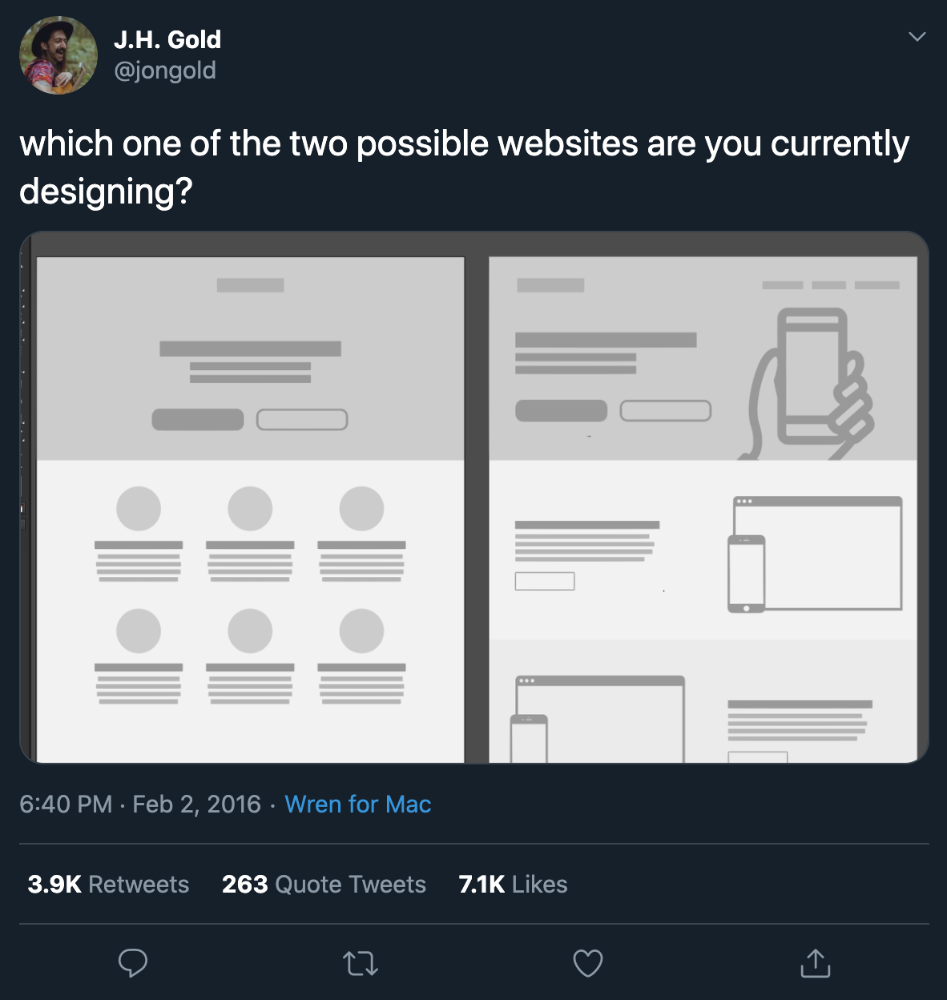

# Semantic elements

In addition to defining individual parts of your page (such as "a paragraph" or "an image"), `HTML` also boasts a number of block level elements used to define areas of your website (such as "the header", "the navigation menu", "the main content column"). This chapter looks into how to plan a basic website structure, and write the HTML to represent this structure.

## Basic sections of a document

Webpages can and will look pretty different from one another, but they all tend to share similar standard components:

- **header**: Usually a big strip across the top with a big heading, logo, and perhaps a tagline. This usually stays the same from one webpage to another.

- **navigation bar**: Links to the site's main sections; usually represented by menu buttons, links, or tabs. Like the header, this content usually remains consistent from one webpage to another — having inconsistent navigation on your website will just lead to confused, frustrated users. Many web designers consider the navigation bar to be part of the header rather than an individual component, but that's not a requirement; in fact, some also argue that having the two separate is better for accessibility, as screen readers can read the two features better if they are separate.

- **main content**: A big area in the center that contains most of the unique content of a given webpage, for example, the video you want to watch, or the main story you're reading, or the map you want to view, or the news headlines, etc. This is the one part of the website that definitely will vary from page to page!

- **sidebar**: Some peripheral info, links, quotes, ads, etc. Usually, this is contextual to what is contained in the main content (for example on a news article page, the sidebar might contain the author's bio, or links to related articles) but there are also cases where you'll find some recurring elements like a secondary navigation system.

- **footer**: A strip across the bottom of the page that generally contains fine print, copyright notices, or contact info. It's a place to put common information (like the header) but usually, that information is not critical or secondary to the website itself. The footer is also sometimes used for SEO purposes, by providing links for quick access to popular content.

A "typical website" could be structured something like this:
<figure>

<figcaption>
A simple website structure example featuring a main heading, navigation menu, main content, side bar, and footer
</figcaption>
</figure>

You'll soon learn how the same, semantic code can be delivered in a variety of designs just by tweaking the CSS. Some times sites all start to look the same. 

<figure>

<figcaption>Which one of the two possible websites are you currently designing? A <a href="https://t.co/ZD0uRGTqqm">famous tweet</a> by J.H. Gold (@jongold) <a href="https://twitter.com/jongold/status/694591217523363840?ref_src=twsrc%5Etfw">February 2, 2016</a>
</figcaption>
</figure>

## HTML for structuring content

The simple example shown above isn't pretty, but it is perfectly fine for illustrating a typical website layout example. Some websites have more columns, some are a lot more complex, but you get the idea. With the right CSS, you could use pretty much any elements to wrap around the different sections and get it looking how you wanted, but as discussed before, we need to respect semantics and use the right element for the right job.

This is because visuals don't tell the whole story. We use color and font size to draw sighted users' attention to the most useful parts of the content, like the navigation menu and related links, but what about visually impaired people for example, who might not find concepts like "pink" and "large font" very useful?

### Don't rely on just colour

Most people with colour vision deficiency have difficulty distinguishing between shades of red, yellow and green.

This is known as "red-green" colour vision deficiency. It's a common problem that affects around 1 in 12 men and 1 in 200 women.

Someone with this type of colour vision deficiency may:

 - find it hard to tell the difference between reds, oranges, yellows, browns and greens
 - see these colours as much duller than they would appear to someone with normal vision
- have trouble distinguishing between shades of purple
confuse reds with black

Source - <a href="https://www.nhs.uk/conditions/colour-vision-deficiency">nhs.uk/colour-vision-deficiency</a>
</blockquote>

## Semantic elements for adding structure

In your HTML code, you can mark up sections of content based on their functionality — you can use elements that represent the sections of content described above unambiguously, and assistive technologies like screenreaders can recognise those elements and help with tasks like "find the main navigation", or "find the main content." 

To implement such semantic mark up, HTML provides dedicated tags that you can use to represent such sections, for example:

- **header**: `<header>`.
- **navigation bar**: `<nav>`.
- **main content**: `<main>`, with various content subsections represented by `<article>`, `<section>`, and `<div>` elements.
- **sidebar**: `<aside>`; often placed inside `<main>`.
- **footer**: `<footer>`.

> **Old school coding**: It's worth noting that if you have previously coded `html` you may have used the `<div>` element to provide this kind of structure using classes to name each part of the page including `<div class="nav">`. This of course does not provide semantic meaning to the page, is *old school*, and should be avoided.


<!-- div class="exercise" -->

## Exercise One

> Semantic page structure

### Task 1

- Open [Repl.it - Semantic structure](https://repl.it/@webdesignmmu/html15)

### Task 2

- Copy & Paste this code into the empty `index.html` file.

```
<!DOCTYPE html>
<html lang="en-GB">
  <head>
    <meta charset="utf-8">

    <title>My favourite film - Film Title</title>
  </head>

  <body>
    <!-- Here is our main header that is used across all the pages of our website -->

    <header>
      <h1>Film title</h1>
    </header>

    <!-- Here is our navigation that is used across all the pages of our website -->
    <nav>
      <ul>
        <li><a href="#">Home</a></li>
        <li><a href="#">The Cast</a></li>
        <li><a href="#">The Director</a></li>
      </ul>
    </nav>

    <!-- Here is our page's main content -->
    <main>

      <!-- It contains an article -->
      <article>

        <h2>Article heading - about the film</h2>

        <figure>
        <!-- Insert the image here -->

        <figcaption>Photo by <a href="https://unsplash.com/@kristsll">Krists Luhaers</a> on <a href="https://unsplash.com/s/photos/cinema-theatre">Unsplash</a>
        </figcaption>
        </figure>

        <p>Lorem ipsum dolor sit amet, consectetur adipisicing elit. Donec a diam lectus. Set sit amet ipsum mauris. Maecenas congue ligula as quam viverra nec consectetur ant hendrerit. Donec et mollis dolor. .</p>

        <h3>Subsection - about the cast</h3>

        <p>Donec ut librero sed accu vehicula ultricies a non tortor. Lorem ipsum dolor sit amet, consectetur adipisicing elit. Aenean ut gravida lorem. Ut turpis felis, pulvinar a semper sed, adipiscing id dolor.</p>

        <p>Pelientesque auctor nisi id magna consequat sagittis. Curabitur dapibus, enim sit amet elit pharetra tincidunt feugiat nist imperdiet..</p>

        <h3>Another subsection - this time about the director</h3>

        <p>Donec viverra mi quis quam pulvinar at malesuada arcu rhoncus. Cum soclis natoque penatibus et manis dis parturient montes, nascetur ridiculus mus..</p>

        <p>Vivamus fermentum semper porta. Nunc diam velit, adipscing ut tristique vitae sagittis vel odio..</p>
      </article>

      <!-- the aside content can also be nested within the main content -->
      <aside>
        <h2>Resources</h2>

        <ul>
          <li><a href="#">Link to the films website or IMDB or Wikipedia entry</a></li>
          <li><a href="#">Link to lead actors website or IMDB or Wikipedia entry</a></li>
          <li><a href="#">Link to Directors website or IMDB or Wikipedia entry</a></li>
        </ul>
      </aside>

    </main>

    <!-- And here is our main footer that is used across all the pages of our website -->

    <footer>
      <p>©Copyright 2050 by nobody. All rights reversed.</p>
    </footer>

  </body>
</html>
```

### Task 3

- Run the page in the browser to view the output.

- Take some time to look over the code and the page to understand it — the comments inside the code should also help you to understand it. 

> Remember this page only has the browser default styles, it is going to look plain - don't worry about this. We will work on `CSS` for page layout later.

### Task 4

- Look at the sub-pages, `cast.html` and `director.html` which are sat in the `pages` folder.

- Take some time to look over the code for these pages, noting the sematic structure of `header`, `nav`, `main`, `article` and `footer`.

<!-- end div -->

## Semantics aid accessibility

Giving these elements a semantic meaning enables the browser and assistive technologies to understand the structure of the page. 


As an example, a blind iPhone (iOS) user has the ability to skip around the structure of a page using the Rotor facility. When selecting `Landmarks` with the Rotor the user can navigate the page via the `header`, `main` and `footer` elements, much as a sighted person might skim around the page visually.

Learn more about the [Voice Over rotor on iPhone, iPad, and iPod touch](https://support.apple.com/en-gb/HT204783) from Apple.


## HTML layout elements in more detail

It's good to understand the overall meaning of all the `HTML` sectioning elements in detail — this is something you'll work on gradually as you start to get more experience with web development. You can find a lot of detail by reading MDN's `HTML` element reference (links below). For now, these are the main definitions that you should try to understand:

- `<main>` is for content unique to this page. Use `<main>` only once per page, and put it directly inside `<body>`. Ideally this shouldn't be nested within other elements.

- `<article>` encloses a block of related content that makes sense on its own without the rest of the page (e.g., a single blog post). 

- `<section>` is similar to `<article>`, but it is more for grouping together a single part of the page that constitutes one single piece of functionality (e.g., a mini map, or a set of article headlines and summaries). It's considered best practice to begin each section with a heading; also note that you can break `<article>`s up into different `<section>`s, or `<section>`s up into different `<article>`s, depending on the context.

- `<aside>` contains content that is not directly related to the main content but can provide additional information indirectly related to it (glossary entries, author biography, related links, etc.).

- `<header>` represents a group of introductory content. If it is a child of `<body>` it defines the global header of a webpage, but if it's a child of an `<article>` or `<section>` it defines a specific header for that section (try not to confuse this with titles and headings).

- `<nav>` contains the main navigation functionality for the page. Secondary links, etc., would not go in the navigation.

- `<footer>` represents a group of end content for a page.
Non-semantic wrappers

<!-- div class="exercise" -->

## Exercise Two

> Completing the **Film** website.

### Task 1

- Return to the Semantic structure Repl.it (html15)

### Task 2

- `index.html`

- Decide on a favourite film as the subject of the page.

- Adjust the `<title>` to reflect your chosen film.

- Add a meta description to the head with content relevant to your page.

```
<meta name="description" content="">
```
- Adjust the text of both the `<h1>` and the `<h2>` to reflect your film.

- You don't need to adjust the `<h3>` text or the text in the `paragraphs` - unless you really want to write about a film!

- Insert the image `cinema-unsplash.jpg` which can be found in the `img` folder, at the top of the `article`, under the `<h2>`. You should note we have already provided the `figure` and `figcaption` elements. You need to insert the `` element, get the path to the image correct, and add `alt` text.

> Note we are using a *free to use* image from [Unsplash.com](Unsplash.com). Any images associated with the film, such as a poster or stills from the film will be copyright and rights of use restricted.

- **Resources** - Finally on `index.html` create three links:

  + Link to the films website or IMDB or Wikipedia entry
  + Link to lead actors website or IMDB or Wikipedia entry
  + Link to Directors website or IMDB or Wikipedia entry

- Simply replace the `#` in the `<a>` element with the URL of the page to which you are linking.

For example:

```
<a href="#">Link to the films website or IMDB or Wikipedia entry</a>
```
Becomes:

```
<a href="https://www.sonypictures.com/movies/jumanjiwelcometothejungle">Jumanji: Welcome to the Future</a>
```

### Task 3

> Navigation

- Using the un-ordered list within the `<nav>` element, adjust the links of `index.html` so that the page links to `cast.html` and `director.html`, both sat in the `pages` folder. Think about the file paths.

- Once that works, do the same for the `nav` links on both `cast.html` and `director.html` that take them home to `index.html` or to the other page.

> Note: In the navigation list - leave the link to the actual page you are on as a `#`.

- For example on `index.html` the link stays as:

```
<a href="#">Home</a>
```

- on `cast.html`:

```
<a href="#">The Cast</a>
```

- and on `director.html`

```
<a href="#">The Director</a><
```

Test you navigation, you should be able to jump from page to page and back to the homepage (`index.html`)

- Last thing - just adjust the `<title>` and `<h1>` on both sub-pages to reflect your chosen film.

### Task 4

- Validate the code of each page to check for errors.

- Fix any errors.

<!-- end div -->

<h2 class="deep">Deeper Learning</h2>

To get a better understanding of this topic use the following resources.

- LinkedIn Learning Video: [Jen Simmons - Structuring content](https://www.linkedin.com/learning/html-essential-training-4/structuring-content?u=36102708) (4m 14s)

- LinkedIn Learning Video: [Jen Simmons - Structuring content examplse of putting it all together](https://www.linkedin.com/learning/html-essential-training-4/examples-of-putting-it-all-together?u=36102708) (1m 6s)

- MDN: `<header>` - [The Header element](https://developer.mozilla.org/en-US/docs/Web/HTML/Element/header)

- MDN: `<nav>` - [The Navigation Section element](https://developer.mozilla.org/en-US/docs/Web/HTML/Element/nav)

- MDN: `<main>` - [The Main element](https://developer.mozilla.org/en-US/docs/Web/HTML/Element/main)

- MDN: `<article>` - [The Article Contents element](https://developer.mozilla.org/en-US/docs/Web/HTML/Element/article)

- MDN: `<aside>` - [The Aside element](https://developer.mozilla.org/en-US/docs/Web/HTML/Element/aside)

- MDN: `<section>` - [The Generic Section element](https://developer.mozilla.org/en-US/docs/Web/HTML/Element/section)

- MDN: `<footer>` - [The Footer element](https://developer.mozilla.org/en-US/docs/Web/HTML/Element/footer)


### &copy; Credit given

Materials used under the Creative Commons licence from [MDN Web Docs](https://developer.mozilla.org/en-US/docs/Web/HTML).


