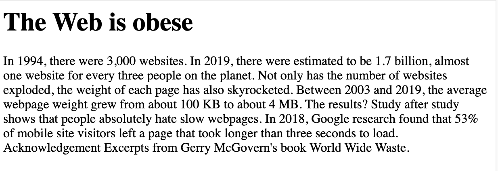
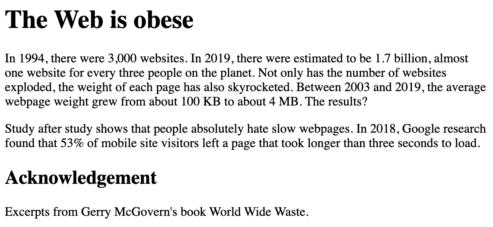

# HTML Introduction

Before starting watch the following videos:

> LinkedIn Learning Video: [Jen Simmons -  [What is HTML](https://www.linkedin.com/learning/html-essential-training-4/what-is-html?u=36102708) 1m 34s

> LinkedIn Learning Video: [Jen Simmons - [The role of HTML](https://www.linkedin.com/learning/html-essential-training-4/the-role-of-html?u=36102708) 4m 29s

## Structure

Whether you are reading a book or a web page or creating your own documents in MSWord, the document is going to have structure. The structure and the space it creates enhances readability, helps us navigate the document and to identify elements of the documents. 

This may include headings and sub-headings which help break up the documents, helping us to identify themes and relevant sections. Simple paragraph breaks breathe space into the documents, helping us to read the text.

We may create sections, lists and tables to divide and illustrate elements. Without noticing it, the care and attention paid to creating a good structure makes any document much easier to deal with as the reader.

If we have a visual impairment, we may use a computer to read out the documents to us. Again, having the correct structure will help us use and navigate the relevant parts of the document or book.

If we have a cognitive impairment, a clear and obvious structure will again help us deal with what might otherwise look like a complex document to us.

At this stage we are not talking about design, the use of space, typography and colour. We are simply talking about describing the documents. This is a heading, this is a paragraph, this is the heading, this is the main body of the documents and this is the footer of the document or page.

This is what HTML does. It is a mark-up language that gives us a method to describe to the browser (the computer) the structure of the page. And if the browser doesn’t understand that markup, it ignores it. This has been essential to the development of the World Wide Web.

## Exercise 
> Read the first Chapter of Jeremy Keith’s book, [Reslient web design. Chapter One: Foundations](https://resilientwebdesign.com/chapter1/). As you read this chapter look at the structure of the page. It has a main (Level 1) heading - *Chapter 1: Foundations* followed by five sub (Level 2) headings including *Let’s share what we know*; *Net value; Hyperspace*; *Mark me up, mark me down*; *References*. 
The text itself is set in paragraphs of various sizes, interspersed with a number of illustrations with captions.

### Quiz
- Q. Who wrote ‘As We May Think’?
- A. Vannevar Bush
- Q. Who created the Line Mode Browser?
- A. Nicola Pellow
- Q. Tim Berners-Lee was running which type of operating system?
- A. NeXTSTEP operating system
- Q. What does http stand for?
- A. HyperText Transfer Protocol


## Formatting Text
*Let’s add some structure*.

Before we start coding we need to understand the syntax of HTML.

### What is HTML?

HTML (Hypertext Markup Language) is not a programming language. It is a markup language that tells web browsers how to structure the web pages you visit. It can be as complicated or as simple as the web developer wants it to be. HTML consists of a series of elements, which you use to enclose, wrap, or mark up different parts of content to make it appear or act in a certain way. The enclosing tags can make content into a hyperlink to connect to another page, italicize words, and so on.  For example, consider the following line of text:

```
My cat is very grumpy.
```

If we wanted the text to stand by itself, we could specify that it is a paragraph by enclosing it in a paragraph  (`<p>`) element:

```
<p>My cat is very grumpy.</p>
``` 

>**Note:** Tags in HTML are case-insensitive. This means they can be written in uppercase or lowercase. For example, a `<title>` tag could be written as `<title>`, `<TITLE>`, `<Title>`, `<TiTlE>`, etc., and it will work. However, it is best practice to write all tags in lowercase for consistency, readability, and other reasons.


## Anatomy of an HTML element

Let's further explore our paragraph element from the previous section:


### The anatomy of our element is:

- **The opening tag**: This consists of the name of the element (in this example, p for paragraph), wrapped in opening and closing angle brackets. This opening tag marks where the element begins or starts to take effect. In this example, it precedes the start of the paragraph text.

- **The content**: This is the content of the element. In this example, it is the paragraph text.

- **The closing tag**: This is the same as the opening tag, except that it includes a forward slash before the element name. This marks where the element ends. Failing to include a closing tag is a common beginner error that can produce peculiar results.

- The **element** is the opening tag, followed by content, followed by the closing tag.

> LinkedIn Learning Video: [Jen Simmons - The syntax of the HTML elements](https://www.linkedin.com/learning/html-essential-training-4/the-syntax-of-html-elements?u=36102708) -  4m 56s

## Task One

> To mark-up a simple document with html heading and paragraph elements to create some structure to the page in the browser.


### FILES - [Open in Browser - Task One Files](https://repl.it/@eskins/html-01) 

Task one contains excerpts from [Gerry McGovern’s book World Wide Waste](https://gerrymcgovern.com/worldwidewaste/). It consists of a main heading, two paragraphs, a sub-heading and another paragraph.

```
The Web is obese

In 1994, there were 3,000 websites. In 2019, there were estimated to be 1.7 billion, almost one website for every three people on the planet. Not only has the number of websites exploded, the weight of each page has also skyrocketed. Between 2003 and 2019, the average webpage weight grew from about 100 KB to about 4 MB. The results?

Study after study shows that people absolutely hate slow webpages. In 2018, Google research found that 53% of mobile site visitors left a page that took longer than three seconds to load. 

Acknowledgement

Excerpts from Gerry McGovern's book World Wide Waste.
```

Select the Run button in repl.it so the text is displayed in the browser window on the right. The page displays but there is no structure to the page.


As you can see, the browser ignores the space between the headings and paragraphs that we see in the editor. There is simply a single space between each page element.

This is because there are no elements to give the content structure, so the browser does not know what is a heading and what is a paragraph. 

### Why do we need structure?

- Users looking at a web page tend to scan quickly to find relevant content, often just reading the headings to begin with (we usually spend a very short time on a web page). If they can't see anything useful within a few seconds, they'll likely get frustrated and go somewhere else.

- Search engines indexing your page consider the contents of headings as important keywords for influencing the page's search rankings. Without headings, your page will perform poorly in terms of SEO (Search Engine Optimization).

- Severely visually impaired people often don't read web pages; they listen to them instead. This is done with software called a screen reader. This software provides ways to get fast access to given text content. Among the various techniques used, they provide an outline of the document by reading out the headings, allowing their users to find the information they need quickly. If headings are not available, they will be forced to listen to the whole document read out loud.

- To style content with CSS, or make it do interesting things with JavaScript, you need to have elements wrapping the relevant content, so CSS/JavaScript can effectively target it.

We therefore need to give our content structural markup.

> **Note:** We are using a html file called index.html. There is much more to the format of a html document, but that will come later.

> **File format:** We are used to file formats such a `.ppt` and `.pdf` as two examples. Our file `index.html` is a plain text file with the file extension `.html`. It can be opened in any text editor such as Notepad on a PC or TextEdit on a Mac. It can be viewed in any web browser, on any internet enabled device. This means that the first html pages created by *Sir Tim* back in 1991 can still be viewed in any modern browser on any modern device, with any screen size. Take a look at the page [What is HyperText?](http://info.cern.ch/hypertext/WWW/WhatIs.html) archived on the CERN servers. The design is plain but the information is accessible and useable to everyone.

## Task Two

Add the `<h1>` tag to the main heading. Putting the closing tag at the end.

```
<h1>The Web is obese</h1>

````
Select Play to reload the page in the browser window. You should now have a distinct heading. If not, check your code and reload the page.



# Task 3

Surround the next two paragraphs with the opening and closing `<p>` tag.

Wrap a `<h2>` tag around the sub-heading *Acknowledgement*.

And code up the final paragraph with the <p> element.

Select run to refresh the browser. Your page should now look like this.



> Double check your code - does it look like this?

```
<h1>The Web is obese</h1>

<p>In 1994, there were 3,000 websites. In 2019, there were estimated to be 1.7 billion, almost one website for every three people on the planet. Not only has the number of websites exploded, the weight of each page has also skyrocketed. Between 2003 and 2019, the average webpage weight grew from about 100 KB to about 4 MB. The results?</p>

<p>Study after study shows that people absolutely hate slow webpages. In 2018, Google research found that 53% of mobile site visitors left a page that took longer than three seconds to load.</p> 

<h2>Acknowledgement</h2>

<p>Excerpts from Gerry McGovern's book World Wide Waste.</p>
```

**If it does, carry on**. If not check that the correct tag is in the correct place. The editor includes *syntax highlighting* which you can see adds colour to the html elements, allowing you to spot them , and errors easier.


As things gets more complex you will see that further `highlighting` is added and will help you navigate your code.

## Exercise - Plain text files

> We are going to take a quick look at the file format used for html files - plain text.
- Copy and paste the text (with or without the coding) from `index.html` into a blank MSWord document. Save it as a `.docx` file. 
- Take a look - how big is the file size? How many `kilobytes` (kb)?
- Open Notepad or TextEdit, paste the text into a new document and save it as a `.txt` file. 
- Look at the file size.

Yes, the `plain text` file is much smaller. It doesn't carry all the extra information that an MSWord document contains. It doesn't hold information about fonts or styling like bold. The test is *plain*. This ensures the file size is always small.

Plain text file can also be opened, viewed and edited in a variety applications, on a variety of operating systems. 

Your html file is simply a plain text file (usually a `.txt` file), with a `.html` file extension.

*Small and portable - plain text files are the perfect format for the WWW*.

## Deeper Learning

> LinkedIn Learning Video: [Jen Simmons -  [Paragraphs](https://www.linkedin.com/learning/html-essential-training-4/paragraphs?u=36102708) 1m 39s

> MDN: `<p>` - [The Paragraph element](https://developer.mozilla.org/en-US/docs/Web/HTML/Element/p)

### &copy; Credit given
Materials used under the Creative Commons licence from [MDN Web Docs](https://developer.mozilla.org/en-US/docs/Web/HTML).